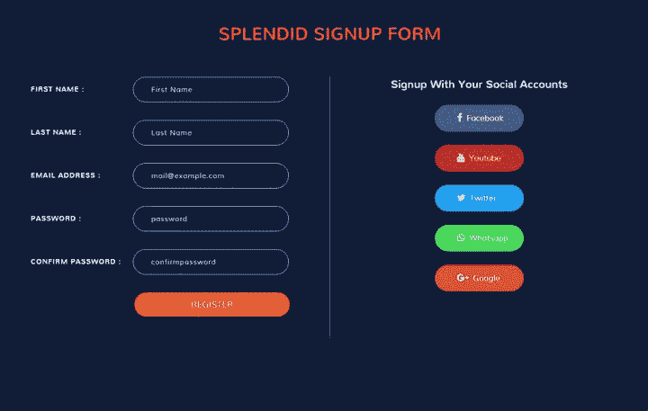
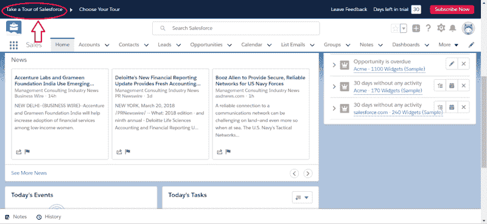
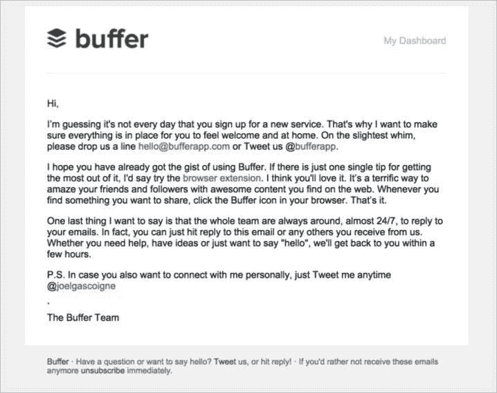
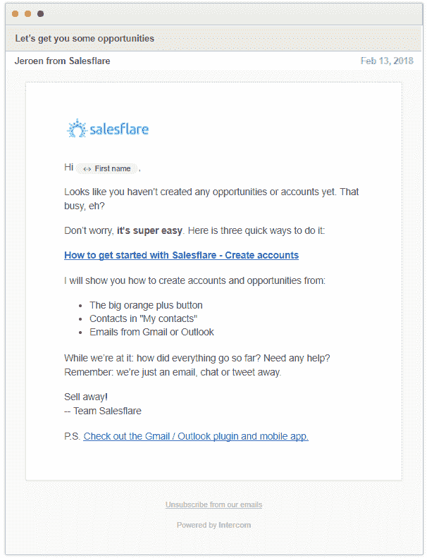
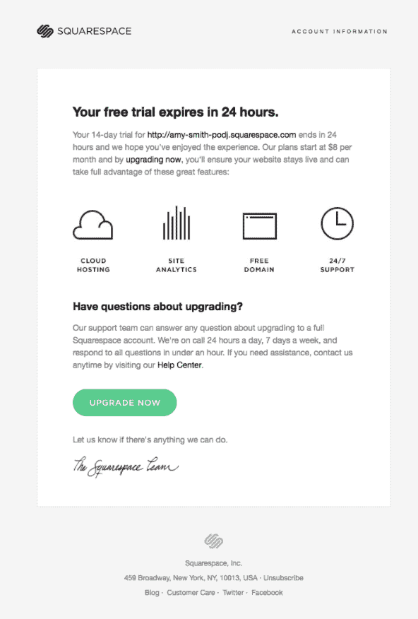
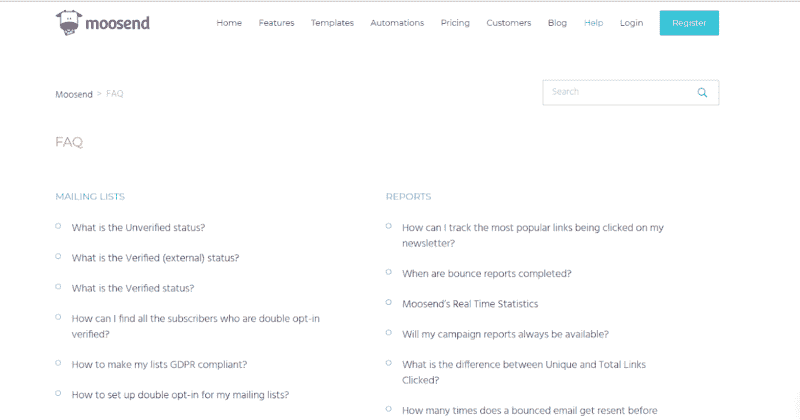

# 如何创建一个杀手级的入职培训，以及为什么这是一项正在进行的工作——第一部分

> 原文：<https://medium.com/swlh/https-medium-com-despina-exad-how-to-create-a-killer-onboarding-and-why-it-is-a-work-in-progress-part-one-80818ffc1146>

> **编者按**:在“ [**产品主导的体验状态——迄今为止最全面的产品主导成长研究**](https://www.reinventgrowth.co/product-led-growth/)**”中找到更多**关于入职的有用数据和基准**。认领你的免费副本 [**这里**](https://www.reinventgrowth.co/productled-experience/) **。****
> 
> **作者:[**德斯皮娜**](https://www.linkedin.com/in/despinaexadaktylou/) 创始人 [**重塑成长**——产品体验机构。](https://www.reinventgrowth.co/)**
> 
> *****示范性研究参与者有:*****
> 
> **[👉监控任何*谷歌*-度量可能](https://medium.com/u/8732e73183e5#不

 
> **[👉考虑推出一两个功能，或者甚至重新设计整个产品](https://medium.com/u/8732e73183e5#不

 
> > **[**然而，你真正需要的唯一事情是退一步考虑如何打造一个杀手级的入职培训。**](https://medium.com/u/8732e73183e5#不

 
> # **[登上这个陌生人…](https://medium.com/u/8732e73183e5#不

 
> **[作为 SaaS 的主人，忙碌、混乱而且要求很高。每当你认为一个问题已经成功解决，就会有十个问题冒出来。](https://medium.com/u/8732e73183e5#不

 
> **[每天，你都有数以千计的细节要处理，以便为你的行业创造最好的产品。另一方面，开发它是不够的。你也需要找到用户来采用它。更重要的是，你能够留住的用户是未来的客户。](https://medium.com/u/8732e73183e5#不

 
> **[实现这一点的唯一可行的解决方案是提出一个有效且敏捷地满足用户需求的策略。一个策略，将引导你的潜在客户一步一步地展示你的产品的价值。简而言之，是时候设计你的入职策略了。](https://medium.com/u/8732e73183e5#不

 
> **[如果你不熟悉这个术语， ***入职*** 被定义为 ***你用来引导、培养和转换你的人物角色的漏斗顶端活动，从访客到试用用户，最后到客户。***](https://medium.com/u/8732e73183e5#不

 
> **[你的战略中应该包含许多行动，这里不适用*“一刀切”*。它们实际上变化很大，因为你不可能对两个相似的产品应用相同的入职策略。即使他们有共同的接触点，差异也会更多。](https://medium.com/u/8732e73183e5#不

 
> **[例如，一些产品可能需要比其他完全依赖自动化技术的产品更个性化的方法。](https://medium.com/u/8732e73183e5#不

 
> > **[***这里的金块就是要始终把自己当成客户*** *。*](https://medium.com/u/8732e73183e5#不

 
> **[总的来说，入职非常重要，因为它决定了你的用户与你的产品之间的关系——也就是说，他们是否会喜欢你的产品，或者只是将它添加到一堆无用的工具中，就像他们对许多其他 SaaS 所做的那样。](https://medium.com/u/8732e73183e5#不

 
> # **[背后的策略…](https://medium.com/u/8732e73183e5#不

 
> **[如上所述，这里没有*【一刀切】*的规则。所以，**在你开始思考你的战略的起点之前，让我们先确定一下**](https://medium.com/u/8732e73183e5#不

 
> **回到你的起点。俗话说，第一步总是很棒，你需要收集所有必要的用户反馈。**
> 
> **是的，我们生活在一个充满信息的世界。没有足够的信息谷歌不会给你。然而，在特定情况下，你的用户仍然是你拥有的最合格的信息源。毕竟，你需要完全了解他们，才能让他们参与进来。只有一种可能的方法可以做到这一点。**
> 
> > *****您需要使用您自己或您的团队手动加载每个线索。【T2****😱😱😱😱***
> 
> **[**你必须愿意和每个用户做一对一**](http://paulgraham.com/ds.html) 。通过你的功能引导他们中的每一个人，看看他们实际上有什么体验，你的瓶颈在哪里。**
> 
> **所以，首先你可以使用一个基本策略。你不需要复杂的漏斗，也不需要考虑一百万种不同的用户行为。你只需要弄清楚他们如何与你的产品互动，以及它是否给他们带来了应有的刺激。**
> 
> ****高级别的初始入职流程可能包括以下步骤:****
> 
> 1.  ****外展**(冷邮件，冷电话) :你可以在这里使用 [Prospect.io](https://prospect.io/) 这样的工具找到潜在客户的电子邮件，然后直接从你的电子邮件 [MixMax](https://mixmax.com/) 中给他们发送个性化的营销活动——如果你也利用了它的模板，还可以加分。**
> 2.  ****集客营销**活动:利用 [Quora](https://www.quora.com/) 、 [Reddit](https://www.reddit.com/) 和[Linkedin](https://www.linkedin.com/)——如果使用得当，这简直是一座金矿。**
> 3.  ****联系方式**:供用户请求现场演示**
> 4.  **第一次拜访:展示你的产品**
> 5.  ****跟进材料:**再次强调你产品的好处- [你产品的销售演示](https://blog.hubspot.com/sales/how-to-deliver-the-perfect-sales-demo)就可以了。**
> 6.  ****第二次电话**:如果用户被说服试用你的服务，这将是提供免费试用的机会，并指导他如何利用它。**
> 7.  ****第三次——也是最后一次——几天后打电话或发邮件**:看看目前为止产品的体验如何，用户是否准备好提交**
> 8.  ****引导用户完成支付程序。****
> 
> **听起来很兴奋？势不可挡？令人沮丧？嗯，是的，你是绝对正确的。你还应该添加**一个不可扩展的长期策略**，作为你列表中的一个点。**
> 
> > **是上行效应？大量有价值的反馈，当然也是建立全自动入职战略的基础，之后会有许多不同的接触点。**
> > 
> > **这是负面效应吗？失去了大量的人力来达到预期的反馈。**
> 
> **为了避免重复，我应该在这里再次强调 ***为了最大限度地利用这个阶段，你需要让所有与客户打交道的团队成员***——从销售人员到客户成功高管。只有这样，你才能找到用户流失的根本原因。**
> 
> **在流程的下一步，当你做了足够多的实验来收集所有必要的客户反馈时，**你将需要开始部分或全部自动化步骤**。这样做的目的是什么？我的意思是，除了鼓励你的用户更好、更快、更便宜地学习你的产品。你将能够为更多的用户提供服务，并获得更多的加班时间。**
> 
> **首先，为了不被你必须做的工作淹没，你需要很好地定义你的过程。首先绘制出所有你手工执行的步骤，看看它们是否能够自动化。**
> 
> **请记住， [**你可能有不止一个人物角色要针对**](https://xtensio.com/building-multiple-user-personas-to-segment-your-audience/)**——这也可能需要作为用户的完全不同的参与方式**。例如，如果你的潜在客户像 Zendesk 一样分为企业客户和中小企业客户，你可以为后者创建一个出色的入职培训，同时拥有专门的客户经理来满足企业客户的需求。**
> 
> **此外，你应该考虑细分你的受众。很简单，因为有些用户可能比其他人更高级，当采用你的产品时，他们会有完成许多任务的冲动。当这些用户已经完成了特定的里程碑时，向他们发送“如何做”是没有意义的，不是吗？**
> 
> # **3.如何打造杀手级入职！**
> 
> **谈到用户入职，互联网上有一些实践、技巧和操作方法。其中一些用于你的网站和/或平台内部，而另一些则使用其他媒介，如推送通知和电子邮件活动。你挖掘得越多，就会发现越先进的技术。**
> 
> **所以一定要谨慎！不要让你的策略太复杂。它必须保持简单明了。否则，你将面临失去用户的风险，因为这个过程会给他们带来麻烦。请记住，没有必要应用所有这些方法，但是对那些将构成你入职支柱的实践给予必要的关注是至关重要的。**
> 
> # **入职清单:**
> 
> ****(一)报名表****
> 
> **剧本中最古老的把戏。一个 [**注册表单是几乎所有在线服务使用的头号线索生成技术**](https://neilpatel.com/blog/the-definitive-guide-to-lead-generation-form-optimization/) 。无论你只是要求一个电子邮件地址，还是深入了解更多的细节，你的表格都应该简单、简短、清晰。**
> 
> ****
> 
> ***👉* ***加分提示*** *:虽然这可能是最简单的练习技巧，但注册表单的设计还是应该认真考虑的。您将要求用户填写的字段构成了您将拥有的标准，以便对他们进行细分并个性化您的入职培训。此外，您应该格外小心向您的销售线索询问信息。一定不要要求你不会用到的信息，否则可能会让人们望而却步，因为这可能会降低你的表格的完成率。***
> 
> ****(b)首次登录****
> 
> **终于是你发光的时候了。用户就在你想要的地方。他自愿要求成为你产品魔力的一部分。**
> 
> **工作完成了一半。对吗？不完全是。在这里，你应该重新介绍你的产品，并证明为什么它优于竞争对手。**
> 
> **第一次登录被认为是与你的用户接触的最 [**关键点。**](https://blog.loginradius.com/2014/02/7-considerations-using-social-login-on-website-app/) 这是你穿越的开始。奇迹发生的地方。有用的工具是 [**将**](https://www.tutorialize.me/)[**Appcues**](https://www.appcues.com/)和 [**Tourmyapp**](http://www.tourmyapp.com/)**
> 
> ****
> 
> **最好是，你要介绍你的主要功能，你的用户在使用你的产品时，至少有 70-80%的时间会用到这些功能。**
> 
> **在你向他们展示游戏之前，明智的做法是用一种非常简单的方式再次向他们推销你的产品。使用弹出消息，以一种非常简单有趣的方式提及你的服务的价值和竞争优势。**
> 
> **是的，用户在订阅发生之前就知道这些。但是请记住，如果你在转换之前、期间和之后温和地强调你的产品的魅力，任何免费试用用户都会顺利地转换为付费用户。但是要注意，最重要的是你必须强调这样一个事实，那就是在一天结束的时候，你的产品是为了给用户增加价值而存在的。**
> 
> **你也可以用一些循序渐进的技巧来拥抱你的用户体验。这里需要注意的是，无论你用什么方式在你的产品中展示你的提示，它们都需要和它的用户界面保持一致。永远不要忘记，对用户来说，onboarding 应该只是另一种无缝体验。所以，不要仅仅因为颜色看起来好看，就使用不属于你品牌调色板的颜色。**
> 
> **最后但同样重要的是。你应该鼓励你的用户在第一次登录时完成基本的任务和里程碑。这里通常的麻烦是，用户可能会被不太具体的入职培训误导，浏览一两秒钟，然后退出平台，忘记了它的目的是什么。所以，利用你目前的经验，试着找到一个平衡的方法来激发用户的兴趣，这样他就会一直利用这个试用版，直到它结束。**
> 
> > **👉**额外提示:** *考虑添加一个功能，使您的用户能够像下面的 Salesforce 一样重复入职序列。这将大大减少客户服务请求，并使您的客户能够从您提供给他们的体验中获得最大收益。***
> 
> ****
> 
> ****( c)入职电子邮件序列****
> 
> **要考虑的下一步最好是你的入职电子邮件序列。它的目标是将你产品的所有价值逐步传递给每一个用户。**
> 
> **一封好的邮件序列可以遵循这样的结构:**
> 
> **👉一封欢迎邮件**
> 
> **👉两到三个“如何”包括如何更好地使用产品**
> 
> **👉两封跟进邮件——以防用户尚未转为付费用户或试用即将结束**
> 
> ****欢迎邮件解剖****
> 
> **你应该把这当成你第一次向别人介绍自己。你是典型的，你对他微笑，并尽可能多地传递积极的信息。然而，你不想让你所有的性格特征——无论是好的还是坏的——暴露无遗，害怕压倒你的新朋友。**
> 
> **每一个尝试你的产品的新用户，你将会面对的确切情况。尽管你很想教育你的用户，但你不可能从第一封邮件就做到。它的范围是欢迎他们，突出你的产品的价值，引导他们到它，并指出任何有用的资源。**
> 
> **在下面的例子中，Buffer 就是这样做的。此外，它通过向用户传递无论发生什么它都会提供帮助的保证来拥抱它的客户服务。**
> 
> ****
> 
> ****电子邮件操作指南剖析****
> 
> **第二次接触会指出你的用户应该如何使用你的主要功能——如果他们还没有这样做的话。**
> 
> **正如您在下面 Salesflare 的电子邮件中所看到的，为了不使用户感到困惑，并稍微建议他使用移动应用程序更进一步，邮件中包含的 CTA 不超过两个。简单，直截了当，切中要害。**
> 
> ****
> 
> ****跟进邮件剖析:****
> 
> **我们终于到了你的电子邮件活动中最精彩的部分。球滚动的地方。你的用户已经完全用尽了他们的免费试用，你终于可以问他们你们之间的关系是一时冲动还是认真的。**
> 
> **不要犹豫。如果他们走到了那一步，他们很可能已经预见到了这一点。所以大胆一点，把所有选项都摆在桌面上。**
> 
> **在这一点上，你的稿子要格外周到。你的措辞必须激励你的用户。告诉他们，如果没有你的产品，他们会失去一些东西。**
> 
> **考虑解释如果他们转向付费用户会发生什么——就像下面的例子——如果他们不这样做，他们会错过什么。是的，你答对了！**软推销你的惊奇因素，直到地球停止转动。****
> 
> ****
> 
> > ***👉* **额外提示** *:如果适用的话，向用户解释如果他们决定不再继续这样做，他们的数据会发生什么变化，这将是非常明智的。这是一个由用户提出的常见问题，当你对它透明时，它只会增加你服务的可信度***
> 
> ****(d)自动导入****
> 
> **对于任何想要采用新解决方案的用户来说，通常的麻烦是他必须将数据导入其中。**
> 
> **数据导入，听起来是一个很小的功能，但对你提供的入职体验来说是至关重要的，因为用户只有在插入了任何必要的数据后才能发现你的产品的价值。**
> 
> **现在，无论这些数据是简单的联系还是更复杂的东西，都不是这里的重点。关键是用户应该在几分钟内就能摆脱这种痛苦。**
> 
> > ***👉* **额外提示** *:这里适用的黄金法则之一——毫无例外——是任何提供的解决方案都不应该比问题本身消耗用户更多的时间。***
> 
> ****(e)关于它的内容****
> 
> **内容为王。一个永远不会失去王位的人。它有如此多的表达方式，以至于我们可以用一天甚至更长的时间来讨论它的影响。**
> 
> **它只会增加它所涉及的任何事物的价值。你的有机结果变得更好，你的观众开始了解你的品牌，你有更多的机会在互联网上传播你的品牌。唯一有意义的是，你的入职不会是这条规则的例外。**
> 
> **然而，如果到目前为止你已经创建了你的内容策略，你将需要做一些调整。例如，如果你有一个非常重要的创新功能要发布，或者你刚刚创建了一些非常酷的集成，你不会希望你的观众错过这些新闻。**
> 
> ****您的博客是销售线索产生的头号来源**。因此，即使一篇技术文章不是张贴在那里的理想内容，一篇解释你为什么想出这个解决方案以及它应该解决什么的解释性文章将是一个完美的选择。**
> 
> > **👉**额外提示**:在你的博客上创建一个“资源”部分，用简单易懂的产品教程填充它。理想情况下，你应该将它们作为你博客文章中的销售线索磁铁，在社交媒体上或通过你的电子邮件营销活动推广它们。**
> 
> **此外，如果你还没有建立知识库，现在是时候了。[如果你的网站上没有关于产品功能的参考点，你就不能认为你的用户受过教育。](https://blog.aheadworks.com/knowledge-base-useful-functionality-for-any-online-store/)**
> 
> **知识库最有可能是你通过上面提到的入职邮件序列或任何其他媒介重定向用户的地方。**
> 
> ****理想情况下，其结构应该分为:****
> 
> *   **支持文章**
> *   **视频图书馆**
> *   **常青树网络研讨会**
> 
> **请记住，搜索功能将使每个访问者能够轻松地浏览它，这是非常必要的。**
> 
> **总的来说，你的知识库应该看起来简单，没有隐藏的按钮和具体的每个部分对用户的广告价值。您可以使用类似 [**Zendesk**](https://www.zendesk.com/) 的工具来创建一个像下面的 Moosend 一样易于使用的知识页面，或者考虑使用 [**对讲机**](https://www.intercom.com/) 作为您的入门工具**
> 
> ****
> 
> **A/B 测试它，直到你最好为止。**
> 
> **最后但同样重要的是，你应该一遍又一遍地测试任何方法。最简单的做法是创建不同的登录页面或电子邮件流，发送给不同的用户群。然后测量它的结果，提炼它，再测试一次。**
> 
> **是的，这将是一个有点令人沮丧的任务——至少可以这么说。不，这不会是浪费时间，因为在某个时候你会意识到什么需要改进，而不必测试所有的东西。**
> 
> **俗话说“罗马不是一天建成的”，这同样适用于任何成功的战略，无论其存在的范围有多大。**
> 
> # **包装它**
> 
> **总而言之，当谈到你的入职策略时，没有一条金科玉律。这篇文章的第一部分就分析了这一点。**
> 
> **你必须创建一个覆盖用户与你的产品交互的每一个可能的方面。要做到这一点，你需要时间、耐心、亲自与用户互动、大量的反馈和实验。**
> 
> > **这听起来很难接受。但是明智的做法是不要因为时间或人力的限制而遗漏一些东西。就像一条链，如果有一部分断了，它也会断，同样的，如果你故意漏掉关键的一步，你的策略也会断。**
> 
> **👉敬请关注 [**本系列的第二部分**](/@despina.exad/why-onboarding-is-a-work-in-progress-aeddf098aadc) **将向你展示为什么入职是一项正在进行的工作**。它不会因为你的用户决定购买一个计划而停止。你的最终目标应该是创造一个有价值的客户群，并通过之后的保留带来更多的收入。**

**在 [**重塑增长**](http://www.reinventgrowth.co/) 我们相信以产品为导向的 GTM 实践是 SaaS 的未来。热衷于向 [**产品导向的入职模式**](https://www.reinventgrowth.co/productled-experience/product-led-onboarding/) **转型？** [**今天就联系我们**](http://bit.ly/30EdINn) ，让我们知道如何帮助您的组织实现这一目标。**

## **如果你喜欢这篇文章请**推荐**👏👏👏👏、**请在下面的**留下您的想法或问题，或者在以下的**上分享**:**

********

**💡您可以随时在[***Twitter***](https://twitter.com/Xrysomalloysa)*[***Medium***](/@Xrysomalloysa)*或[***Linkedin***](https://www.linkedin.com/in/despinaexadaktylou/)*上与我联系💡*****

**********

## *****这个故事发表在 [The Startup](https://medium.com/swlh) 上，这是 Medium 最大的创业刊物，有 312，596+人关注。*****

## *****在这里订阅接收[我们的头条新闻](http://growthsupply.com/the-startup-newsletter/)。*****

**********