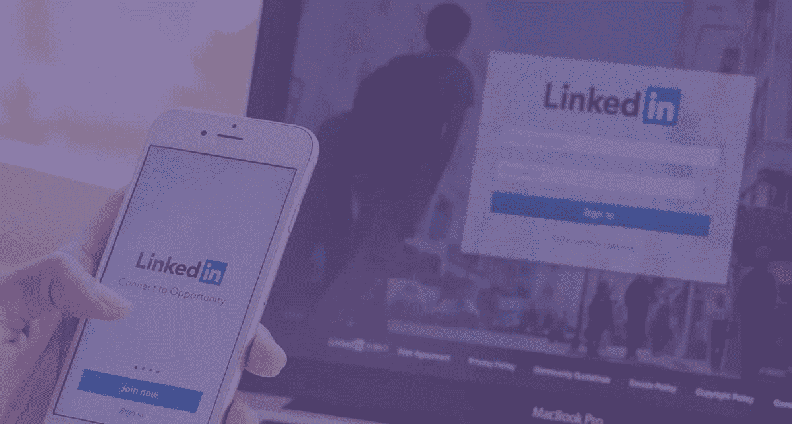
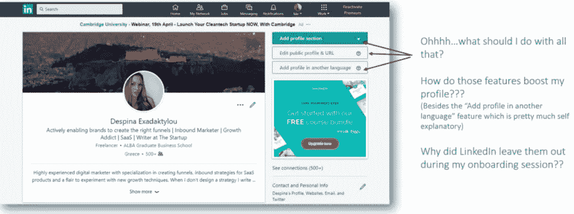
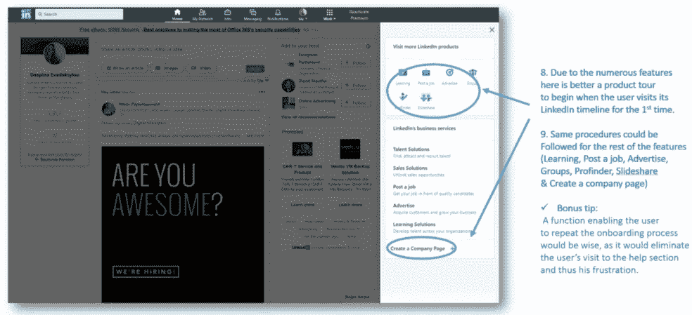
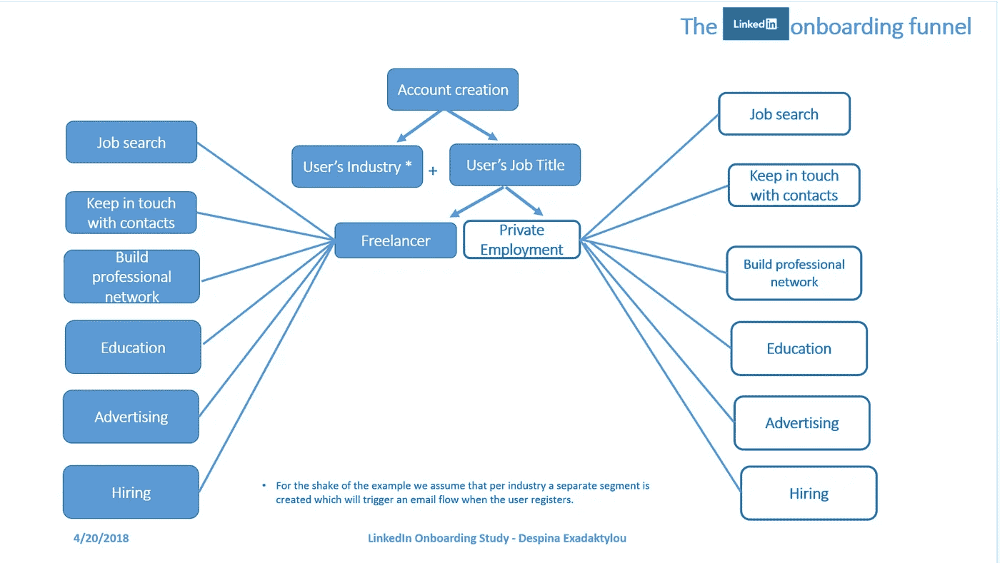

# 我最亲爱的 Linkedin:这是你应该有的入职！

> 原文：<https://medium.com/swlh/https-medium-com-despina-exad-linkedin-onboarding-22ebcb64852a>

> **编者按**:寻找更多**有用的数据和基准**关于 [**产品主导体验的状态——迄今为止最全面的关于产品主导成长的研究**](https://www.reinventgrowth.co/product-led-growth/)**。认领你的免费副本 [**这里**](https://www.reinventgrowth.co/productled-experience/) **。****
> 
> **作者:[**德斯皮娜**](https://www.linkedin.com/in/despinaexadaktylou/) 创始人 [**重塑成长**——产品体验机构。](https://www.reinventgrowth.co/)**
> 
> *****示范性研究参与者有:*****
> 
> **[*HubSpot*](https://medium.com/u/8732e73183e5?source=post_page-----7f7dd82579af----------------------) *，*[*Typeform*](https://medium.com/u/f9ec0e0e5d0?source=post_page-----7f7dd82579af----------------------)*，*[*Segment*](https://medium.com/u/6e946b6a2866?source=post_page-----7f7dd82579af----------------------)*，*[*Pendo*](https://medium.com/u/2da68c51a07e?source=post_page-----7f7dd82579af----------------------)*，* [*对讲机*](https://medium.com/u/7ca8972daf76?source=post_page-----7f7dd82579af----------------------) *，***，[*Vidyard*](https://medium.com/u/297e0da58691?source=post_page-----7f7dd82579af----------------------)*、Lemlist、Supporthero、*[*sales flare*](https://medium.com/u/4ab167b433ec?source=post_page-----7f7dd82579af----------------------)*、Close、*[*GoSquared*](https://medium.com/u/7286036014ee?source=post_page-----7f7dd82579af----------------------)*、* [*自动驾驶*](https://medium.com/u/1fc6749e340d?source=post_page-----7f7dd82579af----------------------) *、*****

# ***对 Linkedin 及其不存在的 onboarding 的研究！***

***作为一名 B2B 数字营销人员，我热爱我的社交媒体。我的意思是，如果你想在这个领域工作，但不想出现在任何社交媒体上，那么最好是改变职业。***

***对于那些了解我的人来说，我也对 SaaS 情有独钟，这是众所周知的事实。对于好的 UX 和用户界面，我有一个更大的目标，不管平台提供什么样的服务。这实际上是我对任何与入职及其实践相关的事物感兴趣的原因。***

> ***正如我以前的一篇文章中提到的， [**入职是一项正在进行的工作**](/swlh/https-medium-com-despina-exad-how-to-create-a-killer-onboarding-and-why-it-is-a-work-in-progress-part-one-80818ffc1146) 。这是一个永无止境的过程，因为客户在不断发展——大多数时候比你的产品发展得更快。***

***过去几周，我一直想在一个高牵引力的社交媒体平台上做一项研究，尽管其成员拥有 5 亿用户，但它的加入几乎是不存在的。是的，你说对了，我说的是 Linkedin。***

***如果你是一个营销人员，你已经意识到我的痛苦。最强大的 B2B 社交媒体平台**拥有丰富的任何形式的数据**，无论是哪个行业，但是**在展示其能力的技术方面，它本质上是贫乏的**。一些重要的东西，尤其是如果你是一个新用户。***

*****一瞥 Linkedin:*****

***✔️有 5 亿多会员。***

***✔️has 6100 万 LinkedIn 用户是高层影响者***

***✔️Has 有 4000 万用户处于决策层***

***✔️Is 是财富 500 强企业中使用最多的社交媒体平台。***

***✔️LinkedIn SlideShare 现在每月有 7000 万活跃用户，上传了 1800 万条内容。***

***✔️There 每周在 LinkedIn feed 中有 90 亿次内容展示。***

***✔️LinkedIn 占 B2B 网站和博客全部社交流量的 50%以上。***

***B2B 营销人员的✔️92%将 LinkedIn 纳入他们的数字营销组合。***

***B2B 营销人员的✔️59%表示，LinkedIn 为他们的业务带来了商机。***

# *****…但却没有入职*****

# ***入职培训！***

***考虑到这些数据，我决定做一些激烈的事情来展示 Linkedin 缺乏入职策略。在我下面的研究中，你会发现一些例子，突出了媒体漏斗中缺失的东西，以及一个例子，说明它是如何缺失的。***

*****具体来说，我深入分析:*****

***➡️ **新会员创建 LinkedIn 账户时缺少哪些步骤？*****

******

*****➡️LinkedIn 错过了入职培训的哪些机会？*****

******

*****➡️Suggested 入职实践:既涉及应用内信息，也涉及漏斗&电子邮件营销策略。*****

******

***Sample Linkedin Onboarding Funnel***

*****您可以在**下面找到整个研究👇***

****** * *奖励:在研究结束时，您的 SaaS +工具组合的建议入职***** 🚀🚀🚀🚀***

# *****拿起你的☕，尽情享受吧(请随时留下你的评论**😊😊😊)***

***在 [**重塑增长**](http://www.reinventgrowth.co/) 我们相信以产品为导向的 GTM 实践是 SaaS 的未来。热衷于向 [**产品导向的入职模式**](https://www.reinventgrowth.co/productled-experience/product-led-onboarding/) **转型？** [**今天就联系我们**](http://bit.ly/30EdINn) ，让我们知道如何帮助您的组织实现这一目标。***

## ***如果你喜欢这个帖子，请推荐👏👏👏👏，请在下面留下您的想法或问题，或者分享到:***

************

***💡您可以随时在[***Twitter***](https://twitter.com/Xrysomalloysa)*[***Medium****或*](/@Xrysomalloysa)*[***Linkedin***](https://www.linkedin.com/in/despinaexadaktylou/)*上与我联系💡******

************

## ******这篇文章发表在《创业公司》杂志上，这是 Medium 最大的创业刊物，拥有 318，120 多名读者。******

## ******在这里订阅接收[我们的头条新闻](http://growthsupply.com/the-startup-newsletter/)。******

************