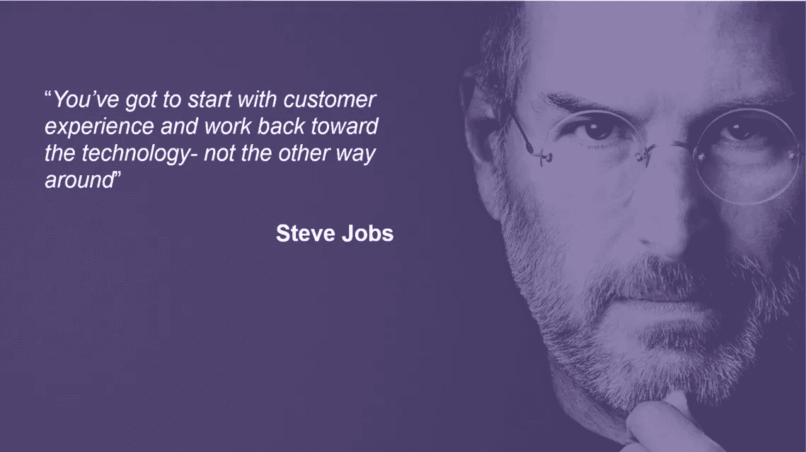
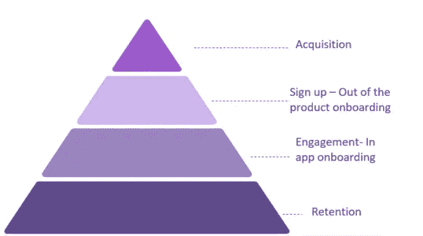

# 用户入职漏斗

> 原文：<https://medium.com/swlh/https-medium-com-despina-exad-the-user-onboarding-funnel-7f7dd82579af>

> **编者按** : *本指南是《* [***产品主导体验的状态——最全面的产品主导成长研究***](https://www.reinventgrowth.co/product-led-growth/) ***至今*** 》的先导。认领你的免费副本 [**这里**](https://www.reinventgrowth.co/productled-experience/) **。**
> 
> *作者:**[***Despina Exadaktylou***](https://www.linkedin.com/in/despinaexadaktylou/)*[***创始人重塑成长****——产品体验机构。*](https://www.reinventgrowth.co/)**

****示范性研究参与者有:****

**[HubSpot](https://medium.com/u/8732e73183e5?source=post_page-----7f7dd82579af--------------------------------) ， [Typeform](https://medium.com/u/f9ec0e0e5d0?source=post_page-----7f7dd82579af--------------------------------) ， [Segment](https://medium.com/u/6e946b6a2866?source=post_page-----7f7dd82579af--------------------------------) ， [Pendo](https://medium.com/u/2da68c51a07e?source=post_page-----7f7dd82579af--------------------------------) ，Gainsight， [Intercom](https://medium.com/u/7ca8972daf76?source=post_page-----7f7dd82579af--------------------------------) ， [Drift](https://medium.com/u/e7a3db4bbcc3?source=post_page-----7f7dd82579af--------------------------------) ， [Filestage](https://medium.com/u/f6ff85d3db41?source=post_page-----7f7dd82579af--------------------------------) ， [Appcues](https://medium.com/u/1f9af655884b?source=post_page-----7f7dd82579af--------------------------------) ， [Viral Loops](https://medium.com/u/31e4290cd23f?source=post_page-----7f7dd82579af--------------------------------) ， [Chargebee](https://medium.com/u/f62218884b1c?source=post_page-----7f7dd82579af--------------------------------) ， [Vidyard](https://medium.com/u/297e0da58691?source=post_page-----7f7dd82579af--------------------------------) ，Lemlist，Supporthero， [Salesflare](https://medium.com/u/4ab167b433ec?source=post_page-----7f7dd82579af--------------------------------)**

# **介绍**

**在快节奏、不断发展的 SaaS 环境中， *Growth* 倾向于每隔一段时间就更换一次所有权。从销售，到营销，再到(最终)产品本身。说实话，事情本来就是这样的。产品超能力应该是那些推动客户保持和扩大的能力。**

**如果你花一分钟思考一下，你就会意识到，成功扩大用户群的品牌有一个共同的趋势。品牌在他们周围创造了一个社区，一次又一次地消费他们的产品。**

**他们交付产品，客户在对他们不忠之前会三思。以可口可乐或百事可乐为例。如果他们是 SaaS 的解决方案，他们的一个独特的元素是什么？**

**答案就在一个词里。体验。不，它实际上有两个。客户体验。你看，SaaS 产业有一个特殊性。顾客只有在尝过产品后才会把钱放在桌子上。而不是相反。**

> **所以，不管你的功能有多酷，或者你的价格有多有竞争力，如果你不免费提供你产品的魔力，你永远也不会扩大规模。更有可能你会成为另一个堆在尘埃里的产品。**

# **之前…之后！**

**那你下一步做什么？10 个 SaaS 车主中有 9 个最有可能回答:“让我们创建一个产品之旅来开始吧”。事实是产品之旅会给你带来一些好处。毫无疑问。如果用户真的到达那里。但是之前和之后呢？**

**产品之旅——如果成功的话——它们只是关注应用内的入职体验。在那之前你遵循的流程是什么？“我将提供免费试用”将是下一个答案。厉害！**

**我想每个偶然发现你网站的用户都会立即注册，对吗？更重要的是，你的用户在订阅后不会立即反弹，而是会停留在那里，以达到你的特别时刻。**

**没有吗？或许相反的情况会发生吗？你是否有相当数量的访问者，即使他们有机会成为合格的销售线索，他们也不会参与和转化？我甚至不敢提及那些购买了你的计划并需要退款或在最初 5 天内经历流失的用户。**

> ***《用户入职漏斗》实际上是一个成功的用户旅程的故事——翻译成指南的格式。它也是对* [***产品主导的体验进行全面研究的先驱，该研究具有来自 40 个产品主导的组织*** *的可操作的见解。*](https://www.reinventgrowth.co/productled-experience/)**

**在几张幻灯片中，你将能够从高层次上了解到入职战略是如何被分为五个独特的部分，这五个部分概述了访客成为客户或——正如我们在 SaaS 世界中所说的——付费用户之前、期间和之后的用户体验。**

# **你可以在这里得到完整的指南👇👇👇**

# **✔️Stage 一:创建用户入职策略时**

# **无知阶段。**

**第一阶段被描述为无知阶段。最好的情况是你已经推出了你的产品。你有一个适合市场的产品，在你的脑海中，你认为它将走向某个地方——但实际上却不能确定它在哪里。所以你一开始会胡乱猜测用户到底想要什么。过了一段时间，你意识到这些猜测阻止了你真正让用户使用你的产品。扩展——至少现在——只是一个你不知道如何达到的目标。
消除无知的第一步是开始创建一个欢迎用户的流程——当然是手工流程，因为现在，你的产品毕竟还是个新生儿。
祝贺你！您刚刚迈出了创建用户入职漏斗的第一步。**

****

**The user onboarding funnel pyramid**

# **用户入门是一个概念！**

**那么什么是用户入职？有多少人知道它的定义？
最初，用户入职被定义为将新员工融入组织或让新客户熟悉自己的产品或服务的行为或过程。**

**当然，在 SaaS 世界，我们保留第二部分。现在仔细看看它的定义。让顾客熟悉自己的产品！
那么，我们所讨论的这种熟悉真正从哪里开始，又在哪里结束？**

**第一个问题的答案是用户第一次看到你的产品——也就是在购买阶段。第二个答案有点复杂，如果你想留住你的用户，*入职永远不会真正结束*。让我再重复一遍。它永远不会结束。除非你不打算扩大你的客户规模，而且你一点也不担心客户流失对你的业务造成的影响。**

# **除了什么。**

**很难说出口。但是当你在开始的时候，你唯一应该期待的就是无限的痛苦，直到你得到你需要的数据。**

**你的产品甚至还没有在地图上。因此，即使你有一个收购策略，胜算对你不利，因为你可能不会从中获得太多。**

**不幸的是，同样的情况也适用于您的用户入职策略。因为在这一点上没有什么是或者不应该是自动化的。摆脱这种局面的唯一方法是尽可能深入挖掘，更好地了解你的潜在客户。**

# **✔️Stage 二:用户知道你的产品，但没有注册**

# **线索到达你的网站，你的服务是相当新生的**

**所以，你已经设法创造了一些意识，流量的第一个迹象刚刚出现在你的分析中。到目前为止，一切顺利。你可以喘口气，放松一下。只是一点点，因为你还有很长的路要走。你还不能判断这种流量是偶然的，还是你的访问者确实是你的目标人物。**

# **没有足够的引入线索转化为试验**

**所以问题还是一样。你没有你想要的访问者数量，也没有足够的试验，最终你的投资回报率没有增加。
再次无知。你不知道下一步。有时候，迷宫似乎没有你头脑中的想法复杂。然而恐慌不是解决你问题的方法。评估你到目前为止所做的努力，并寻找进一步的方法来展示你的产品。**

# **展示你的解决方案，它解决的问题和你的品牌形象**

**如果你对这个不陌生，那么到目前为止你一定已经明白了我的意思。另一方面，如果这是你第一次推出解决方案，用记号笔在某处突出这一时刻。现在，终于是时候开始通过展示您解决的痛苦的解决方案来创建您的品牌形象了。**

**怎么会？重新审视你的内容。通过尽可能多的方式揭露它。网上研讨会、AMA 和产品相关的讲解者文章或视频只是其中的一部分。**

**是的，你做得很对，不管你是否仍处于手动入职阶段，你都需要开始自动化工作，并创建最好的基本漏斗，这将构成你以后整体用户入职策略的基础。**

# **✔️Stage 三:用户已经注册了免费试用，但尚未付款**

# **改善您的漏斗和用户体验**

**到目前为止你做的一切都很棒。你已经定义了你的身份。你已经用各种可能的方式解释了你解决的问题，最后，你获得了第一轮付费用户。下一步是什么？好吧，把这个过程想象成一场足球比赛。球员在比赛中看到球，他们专注于球，他们甚至会想到他们会赢得比赛，但他们只有在充分热身后才会得分，并且确定下一步该做什么。仅仅是因为他们需要保存体力，以便以后游戏变得更高级！
你的 SaaS 产品也是如此。当你准备好升级你的游戏时，你必须保存最好的移动。**

**话虽如此，我的意思是你现在已经在一定程度上了解了用户的需求以及他们想要的体验。此外，请在此处打个星号，这是您进行广泛竞争研究的地方。而不是你的竞争对手有什么特点。但是就他们提供的经验而言。**

# **通过创造能带来快速成功的用户体验来提升您的入职水平**

**有一百万种方法可以做到这一点。但是在你决定之前，让我们先弄清楚一件事。如果你想从任何用户入职计划中获得最大收益，你的产品需要有一个坚实的用户界面和 UX。相关的解决方案并不具有某种魔力。他们也不能将一个没有意义的产品流程转换成有意义的流程。**

**在实际开始设计和执行任何实践之前，要考虑的另一件事是确保您的解决方案本身坚持基本原则。**

**没有必要把你的顿悟时刻藏在一个会使你的解决方案变得复杂的漏斗后面。让你的用户尽快到达那里，并以正确的方式 A/B 做到这一点，直到地球停止转动。**

# **✔️Stage 四:免费用户转化为付费用户**

# **当开始获得专用用户时**

**官方来说，这是你应该为自己作为 SaaS 老板和你的团队感到骄傲的时刻。你正在慢慢到达你应该到达的地方。你可能已经经历过一些短期的动荡，知道这种感觉或如何处理。
长话短说，你在某个时候有投资回报。你们中的大多数人必须每天关注你们的分析。写下并指出什么效果最好，什么效果不好。
是的！最后，是时候更进一步，真正接近你的付费用户了。让他更加理解你的价值，首先和你的团队建立个人关系，然后是你的产品。
建立使用模式，习惯信息
这是你入职策略中唯一不能完全自动化的部分。你的客户成功计划，不管有什么花招，都应该包含人的因素。**

**跟进电话应该是与任何客户联系的第一点，也是最后一点。你实际上不需要一个理由来检查一切进展顺利，不是吗？此外，没有客户会抱怨异常主动的客户服务。**

**现在，当谈到自动化这一部分，名单可以是无限的。在你的网站上和/或通过你的电子邮件营销策略创建一个个性化的机器人流程只是其中的两个。**

**您在这里的成功不仅仅在于您将选择执行的实践。这取决于你将与用户建立的接触点以及你进行的细分。常见的例子可以替代根据用户的职业、行为和角色来划分和吸引用户。**

# **✔️Stage 五:付费用户成为忠实客户**

# **当你有了自己的第一次专用(！)客户。**

**好的。这是真正的交易。您已经采用了您需要的流程。你有真正爱你的客户，也有一些可能介于两者之间。这就是你正式开始向长期保留打招呼的地方！**

**如果你有长期使用你产品的客户，你就有机会让他们无论如何都忠于你。最简单的方法就是简单地提醒你的顾客他为什么选择你。毕竟，众所周知，用户在某个时候会厌倦使用同一个产品。为了克服前面提到的障碍，客户成功应该真正地牵着用户的手，向他展示如何通过任何可能的集成来使用你的产品。**

**到目前为止，它的实践主要是关于如何让用户理解你的产品。现在，是时候将客户成功经理的反馈转化为高级入职实践了。**

**这些做法对每个品牌意味着什么，每次都有不同的解释。用户入门毕竟不是即插即用的常见实践。它是独一无二的，因为它是市场上的每一种产品——不管它们有什么共同点。**

**如果你想更进一步，你绝对应该考虑围绕你的品牌创造一个环境。在这里考虑语法。他们创建了一个扩展，让成千上万的用户免费熟悉他们的产品。另一个成功的例子当然是 Hubspot。他们的内容使品牌成为集客营销的领导者。他们只是通过最大程度地教育用户来创造相关性。**

# **结束了！**

**作为一个概念，用户加入并不是为了跟上最近的数字趋势而采取的又一个花哨的宣传。你的入职策略是必要的。如果你想保持一个可持续的忠实付费用户群。
作为一个概念，它与你的用户体验有关的任何事情都有关系。实际上，事情要复杂得多。即使你认为你已经创造了漏斗，实际上给你带来了相当数量的转换，这只是今天的现实。**

**但是明天，它将不能满足你的用户的需求。至少没有达到今天的程度。为什么？因为随着你的产品功能变得越来越复杂和先进，你的用户也需要更好、更优化、更棒的产品体验。**

**所以，下一次你没有真正达到目标投资回报率的时候，后退一步。再想想，决定你是否真的需要执行另一个付费活动，或者只是重新设计你的漏斗的元素。**

> ***渴望了解更多产品体验？认领免费副本* [***此处***](http://bit.ly/product_experience) ***。*****

**在 [**重塑增长**](http://www.reinventgrowth.co) 阶段，我们确信以产品为导向的 GTM 实践是 SaaS 的未来。热衷于向以产品为导向的 GTM 模式转型？ [**今天就联系我们**](http://bit.ly/30EdINn) ，让我们知道如何帮助您的组织实现这一目标。**

## **请随意推荐，在下面留下您的想法或问题，或者分享到:**

********

**💡您可以随时在[***Twitter***](https://twitter.com/Xrysomalloysa)***，***[***Medium***](/@Xrysomalloysa)*或[***Linkedin***](https://www.linkedin.com/in/despinaexadaktylou/)*上与我联系💡****

********

## ****这个故事发表在 [The Startup](https://medium.com/swlh) 上，这是 Medium 最大的创业刊物，拥有 339，876+人关注。****

## ****在这里订阅接收[我们的头条新闻](http://growthsupply.com/the-startup-newsletter/)。****

********