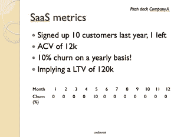

# 为什么早期 B2B 公司不应该使用客户流失作为主要指标

> 原文：<https://medium.com/swlh/https-medium-com-florianzzz-why-early-stage-b2b-companies-should-not-use-churn-as-a-leading-metric-7f6b5a0fb419>

在一家风险基金工作，我工作的一个重要部分就是评估初创企业。在 RIF 中，我们每年评估 500 多家早期 B2B 公司。虽然结构和故事线通常很好，但大多数公司可以改进如何呈现指标。对于一个刚起步的公司来说，从一开始就让产品适应市场是很重要的。除了定性反馈之外，指标还可以显示迄今为止的进展，以及公司准备扩大规模的程度。然而，保持批判性是很重要的。因为一个重要的统计效应被忽略了，所以呈现的数字往往没有什么价值。尤其是在 B2B 环境中，有限的客户端数量会导致计算单位指标时出现问题。在这篇文章中，我将解释为什么以及如何解决这个问题。

## 问题是

最简单的方法是用一个假设的——但却是现实的——例子来展示缺陷。比方说，一家早期 B2B 公司的创始人会展示如下内容，以显示产品市场契合度:

这个人显然使用 SaaS 单位经济学来估计产品与市场的契合度。在本例中，他正确地将客户流失率作为一个重要的指标，并且正确地计算出了年度客户流失率(而不是每年平均的月客户流失率)。客户流失率表示客户(或美元)取消他们最初签署的定期/续订计费合同的百分比。因此，如果 Spotify 有 100 名客户，每月有 1 人离开，每月的流失率将为 1%(假设有 1 人同时注册)。**客户流失率通常被视为客户对所提供的服务+相关价格点的满意度以及产品是否符合市场需求的良好指标。**然而，使用这一指标来展示或指导一家初创公司可能会产生误导。

在统计学中，效果或相关性从来都不是确定的。如果具有期望结果的观察(样本)的数量增加，我们对相关性更有信心，这多少是直觉的。对于小样本，重要的是要认识到一种叫做*抽样方差*的现象。**抽样方差是指如果研究将重复多次，在样本中计算的特定统计量(如平均值)与其对应数据相比的变化。**抛硬币时可以想象一个简单的抽样变异的例子。我们知道掷硬币的概率是 50%。所以如果我们扔 6 次硬币，预计会有 3 次击中头部，对吗？是的，但是只有 31%的情况下会这样。在其他实验中，人们会更频繁地投掷正面或反面。在这些情况下，如果忽略抽样方差，就会错误地计算正面/反面概率。为了防止这种情况，使用了置信区间(CI)。这些 **CI 表示在给定一定置信度**(通常使用 95%)的情况下，所需统计数据的统计最小值和最大值。因此，扩展抛硬币的例子，让我们说，我们将正好抛两次头(在 23%的实验中是这种情况)，抛头的概率可以精确到 0.33。然而，CI *表示投掷头部的概率可能在 0.08 和 0.71 之间(使用 95%的置信水平)。可以得出结论，一个 6 的样本解释力有限。

**计算客户流失率**时也会出现这种抽样差异。尽管实验不太理想(每个客户和他们的概率是不同的，产品和流失概率随着时间的推移而发展)，但看看它的效果仍然是有意义的。回到我们的推介平台，实际流失率不太可能达到 10%。使用示例中的数字，样本大小为 10(在第 5 个月，我们签约了一个新客户)，客户流失率的平均值为 10%。基于这些数字，实际流失率(使用 95% ci)可能在 1%到 38%*之间。有限的样本量导致了很多不确定性。此外，如果方差更高，不确定性会随着样本量的增加而增加。假设该公司在第 5 个月有 2 个客户流失，那么实际的流失率可能在 4%到 50%之间。

## 怎么处理呢

尤其是在 SaaS B2B 公司，重点往往是蓝筹公司，这意味着客户数量有限。因此，一开始很难对客户流失做出有意义的评价。投资者可能没算过，但觉得这个数据不可靠。分析客户流失的原因可以获得有价值的数据，提高产品的市场适应性。然而，基于它们进行计算是一座太远的桥梁。意识到有限的意义，甚至包括 CI，这是成熟的表现。

你是一名早期创始人，并相信自己的产品符合市场需求:你如何证明这一点？**一个好的选择是关注样本量更大的数据，比如产品的运营数据。**流失是预测产品粘性的一种方式，但它通常遵循 SaaS 产品的健康利用和满意度。通常平台上的活动(例如登录次数、每周平均时间、使用的模块数量)可以预测人们是否对该产品满意，以及他们是否在使用该产品。然而，每个公司的确切领先指标是不同的。当然，经济因素(定价、合同类型)被忽略了，但这在未来很可能会有所改变。同样，考虑样本中的差异是明智的，但考虑到座位/用户的数量超过了 B2B 客户的数量，这可能不是什么问题。自然，随着样本量的增加，不确定性会显著降低。

这个博客标题很有煽动性——我仍然相信从一开始就关注和展示客户流失是健康的。然而，意识到它的局限性和包括其他数据点是必要的，以增加经营你的公司时的经验方法。希望这将使公司能够在一开始就更好地评估他们的产品市场适合度。我也能掌握新知识！

*   *考虑到客户流失的二进制特征，使用二项式分布来计算 CI。假设这 10 个客户今年可能已经交易过一次(12 个月合约)，并且客户是独立的。鉴于 Jeffrey 的置信区间在小样本量和小不平衡概率下的良好表现，使用了它们。*

## 这篇文章发表在 [The Startup](https://medium.com/swlh) 上，这是 Medium 最大的创业刊物，有 290，182+人关注。

## 订阅接收[我们的头条新闻](http://growthsupply.com/the-startup-newsletter/)。

