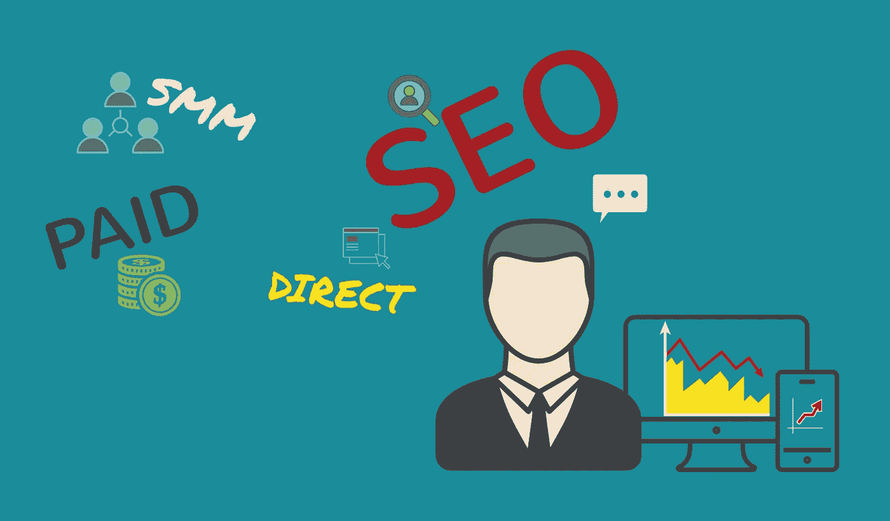
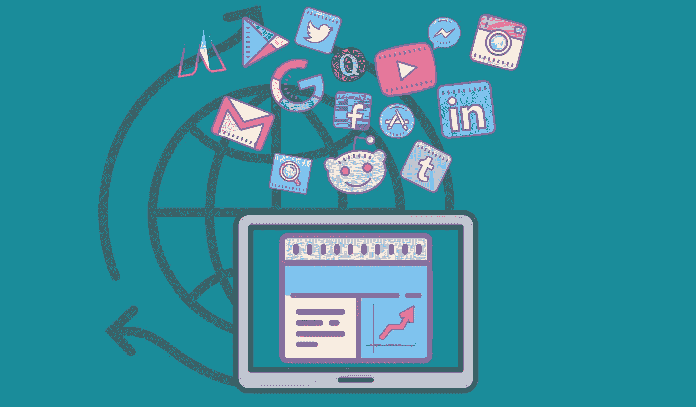

# 如何增加你网站的流量？主要渠道。

> 原文：<https://medium.com/swlh/https-medium-com-freshcodeit-how-to-increase-traffic-to-your-site-main-channels-ef9f1b63fac>

*Originally published at* [*freshcodeit.com*](https://freshcodeit.com/freshcode-post/how-to-increase-traffic-to-your-site)*.*

创建网站只是成功的一半，获得网络流量是大多数新网站所有者遇到的难题。今天，我们将探讨增加网站流量的最有效的在线营销渠道。如果你正在寻找方法，在不倾家荡产的情况下让客户访问你的网站，请继续读下去。

# 增加网站流量的方法。概观

有几十个在线营销渠道可以利用，但很少能提供快速和显著的效果。以下是我们列出的增加网络流量的高效方法:

*   如果你四处传播，并且你的网站网址容易记忆，那么直接的线索会绕过谷歌和第三方资源到达你的网站。
*   搜索引擎优化(SEO)让谷歌和其他搜索引擎爱上你的网站，并显示在搜索结果的第一页，更容易找到。
*   社交媒体营销(SMM)是在引导客户到你的网站购买你的产品或服务之前，创建一个社区并与他们建立信任。
*   搜索引擎(SEA)或每次点击(PPC)广告通过将客户引向你的网站来提供快速的搜索结果。
*   如果你有足够多的邮件列表，电子邮件营销为你的客户提供了一个单向或双向的沟通渠道。
*   如果你选择一个受目标受众欢迎的平台，第三方平台既可以托管你的客座博文、链接，也可以收费为你的网站做广告。
*   联盟营销通过雇用其他网站管理员，通过各种渠道吸引目标受众，从而让付费客户访问您的网站。
*   在像 Reddit、Quora 或 Medium 这样的内容聚合网站上创建一个存在，可以让你的公司出名，增加品牌知名度。
*   在免费的在线分类广告平台上发布广告，比如 Craigslist，Indeed，Oodle，以及其他网站链接，是吸引潜在客户的另一种免费方式。
*   如果你愿意降低一点价格，通过 Groupon 和其他促销代码聚合器分享你的产品和服务的折扣和优惠券可以成为你网站促销策略的一部分。
*   病毒式营销需要一个有价值的信息，在目标受众中传播，增加品牌认知度，让潜在客户谈论你的产品或服务。

# 关键在线营销渠道:利弊，成本

## 直接流量

如果你在会议、行业展会、会议和其他活动中遇到客户并分享网站 URL，你就可以获得直接流量。

优点:

*   你与目标受众建立关系网并建立个人联系；
*   你得到的线索是温暖的，而不是冰冷的。

你得到的线索是温暖的，而不是冰冷的。

缺点:

*   你必须亲自会见潜在客户；
*   这种方法需要很多时间。

成本:

*   会议/演出/活动出席费；
*   制作带有网址的营销材料。

## SEO 流量

高质量的搜索引擎优化是一项持续的工作，需要时间和精力来:

*   建立和维护一个优化的网站，定期更新内容；
*   建立并更新博客；
*   在第三方平台上发布内容，以提高网站统计；
*   获取其他网站的反向链接；
*   创建和发布各种帖子:文章、问答、演示等。

优点:

*   搜索流量实际上是免费的；
*   这种方法全天候工作。

缺点:

*   你必须为你的目标受众生成和发布相关内容；
*   你必须找到新的第三方平台来分发你的内容。

成本:

*   搜索引擎优化专家和文案的工资；
*   反向链接获取和第三方网站发布费用。

## SMM 交通

通过社交媒体平台锁定潜在客户，并将他们引向你的网站是一种有效的在线营销技巧。要让它发挥作用:

*   创建和更新公司渠道、组或帐户。
*   在您的帖子中发布激动人心的内容；
*   通过教学视频、网络研讨会、辅导课程吸引观众；
*   通过赞、分享、客座博文、广告来增加关注者的数量。

优点:

*   你可以直接接触成千上万的潜在客户；
*   可以通过个人交流了解目标受众的压力点，并提供解决方案；
*   社交媒体平台提供对目标受众账户的访问，从而对潜在客户的需求和兴趣进行深入分析。

缺点:

*   你必须花很多时间通过社交媒体平台与目标受众互动；
*   用于账户推广的社交媒体策略需要时间来产生大量的追随者；
*   你必须坚持不懈地开发病毒式社交媒体内容，与你的目标受众分享。

成本:

*   SMM 专家的工资；
*   内容开发费用(视频、帖子、调查、竞赛等。)

## 广告流量

如果你通过广告购买流量，你可以看到潜在客户几乎瞬间增加，但这将花费你一大笔钱。在线广告包括:

*   搜索引擎广告(谷歌广告、必应广告等等)；
*   社交媒体广告(脸书广告经理、LinkedIn、Twitter 和 YouTube 广告)；
*   在受目标受众欢迎的第三方平台上购买广告位。

优点:

*   可以获得网站流量的快速提升；
*   有办法通过取消活动或改变预算来扩大流量。

缺点:

*   广告活动的计划、设置和目标很难保持在预算之内。
*   促销预算很可观。

成本:

*   广告活动费用(点击付费或观看付费)；
*   创建宣传材料的成本:横幅、视频、登录页面等。

我们在昂贵和免费网络流量世界的短暂尝试有用吗？如果是这样，请在社交媒体上分享这篇文章，并查看我们以前的文章。您也可以订阅 [FreshCode 博客](https://freshcodeit.com/blog)，成为第一个获得更新的人。如果你想了解更多关于社交媒体广告的不同方面，获得免费流量，购买或其他方式来推广你的网站，请在评论区分享你的想法，想法和问题。

*原创文章* [*如何给你的网站带来流量。主要渠道。*](https://freshcodeit.com/freshcode-post/how-to-increase-traffic-to-your-site) *发表于*[*freshcodeit.com*](https://freshcodeit.com/)

## 这篇文章发表在 [The Startup](https://medium.com/swlh) 上，这是 Medium 最大的创业刊物，拥有+397，714 名读者。

## 在这里订阅接收[我们的头条新闻](http://growthsupply.com/the-startup-newsletter/)。

