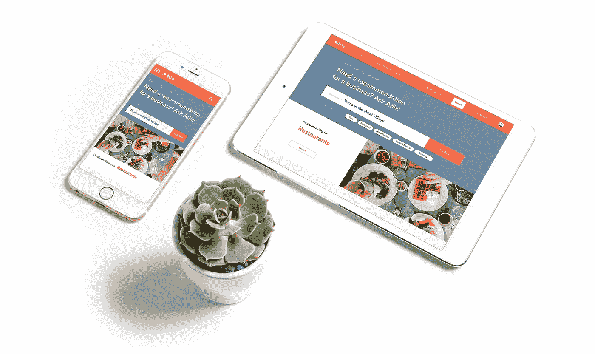
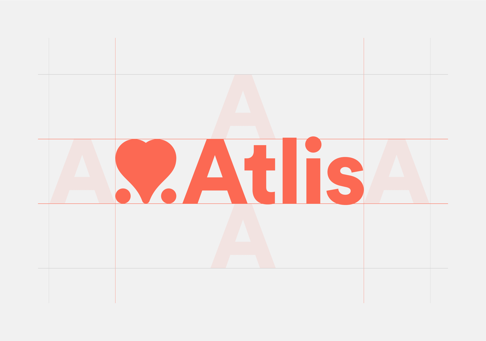
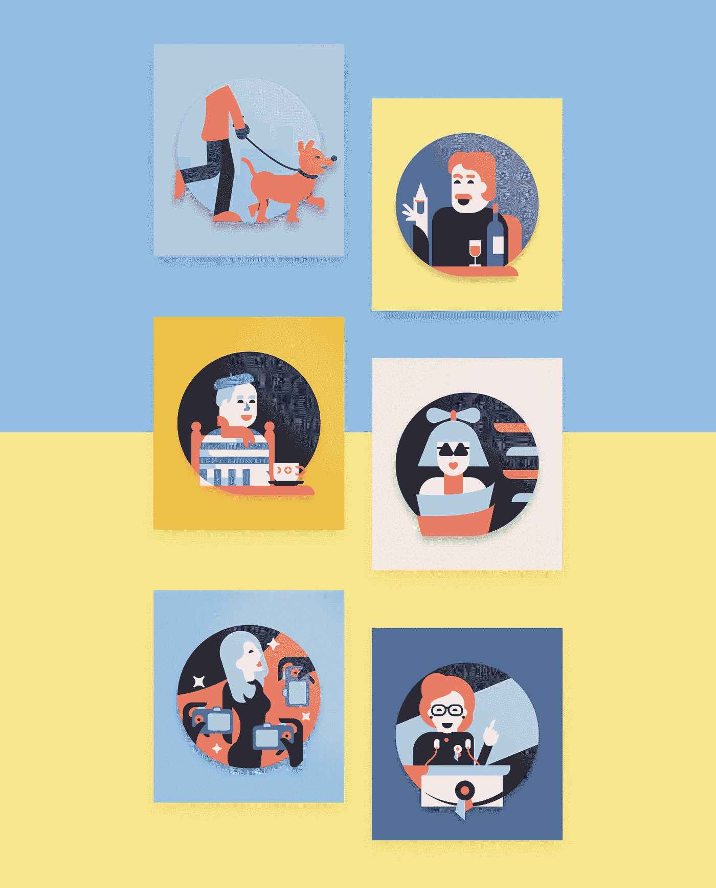
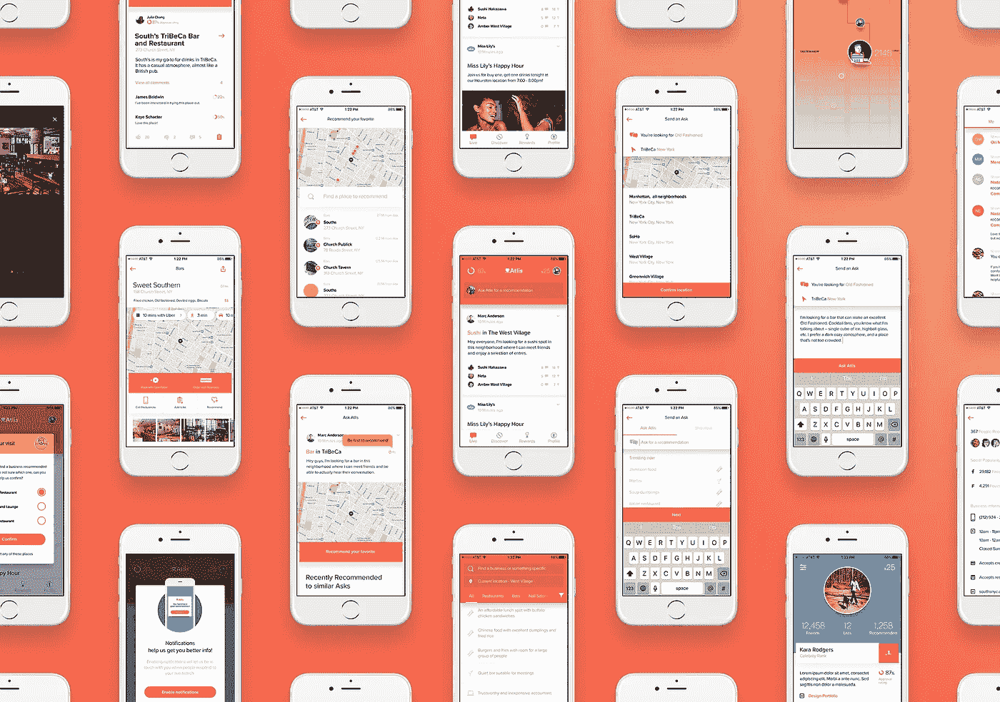
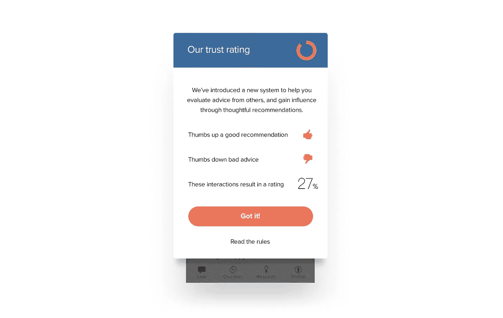
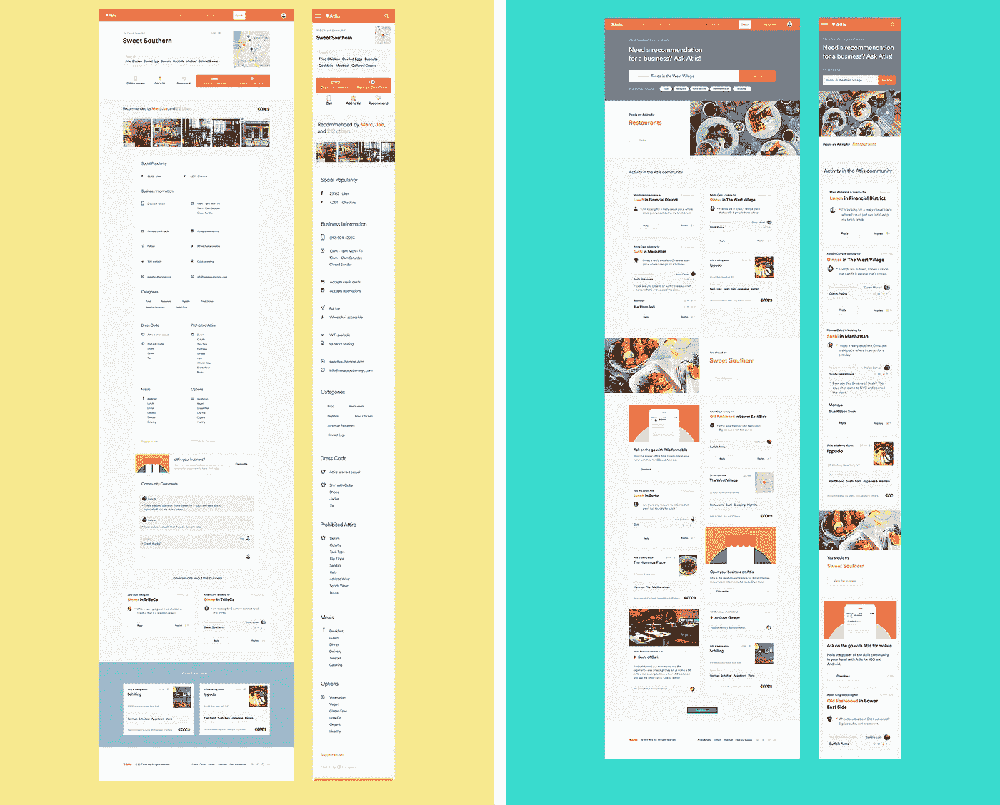

# 设计 Atlis，本地搜索的未来

> 原文：<https://medium.com/swlh/https-medium-com-marcbanderson-designing-atlis-5efa10ce92fa>

作为团队的延伸，rain 如何接近所有客户。

Atlis 是下一代本地搜索平台，在这个平台上，用户只需提问，就可以获得几乎任何类型的真实的个性化推荐。实质上，Atlis 通过用现金、地位和最重要的可信度分数来奖励用户的优质互动，将口碑推荐带到了数字空间。

当 Atlis 在 2015 年春天第一次接触降雨时，这种产品愿景尚未形成，或者用更好的话说，尚未发现。我们合作的故事是一个旅程，包括通过不断的迭代、测试和部署，从零开始创建产品、品牌和新行为。

**我们打造下一代品牌的方法**

在 rain，我们将 Atlis 这样的项目称为“完整的品牌表达”，因为我们有能力影响每一个视觉元素和接触点，不仅定义品牌如何呈现的规则，还实际设计公司套件中的每一个组件，无论是印刷、网络还是产品本身。

当开发任何大型系统时，我们同时设计多个部分，以便在大范围内测试想法。有时，一种特定的方法在一种情况下会很有效，但不足以描述品牌的整体语言。整体工作让我们能够发现这些情况，并在创作过程的早期找到有效的解决方案。

创建一个完整的表达包括理解视觉语言如何作为叙事结构的一部分工作，而不打断观众的参与能力。在数字领域尤其如此，因为每个平台都服务于一个更高的目标，而不仅仅是传达品牌的视觉形象。Atlis 的交互模型和信息层次的方法本身就是身份的组成部分，所以在网络和产品中，这些元素是最重要的。

下面来看看我们和 Atlis 一起创造的东西。

# Atlis 视觉识别

## **Atlis 帮助用户做决定**

在我们合作之初，Atlis 是作为一个大创意和产品 MVP 而存在的。他们的工作理念是，他们可以成为用户的终极平台，通过他们的同行网络获得可信的商业推荐。当时，实现这一想法的机制尚未完成，但有一个足够强大的叙事结构，我们可以战略性地建立一个品牌，一个两个选项之间的“最爱”。

Atlis 标志是两个点之间的一颗心，象征着该平台的目标是帮助用户在有多种选择时做出明智的决定。很简单，这是一个人对一个企业比对另一个企业表现出的爱。这个标志符合该公司的目标，即与消费者和企业建立友好关系，以创建一个互利的平台。

## **徽章**

在这一点上，阿特里斯有一个视觉存在，但缺乏激发观众并鼓励他们参与的个性。作为游戏化战略的一部分，我们开发了一系列徽章来奖励用户的参与，并成为品牌的代言人。

我们考虑了构成城市社区结构的所有个体，从概念上将每个徽章与一个人对附近商业的认识阶段联系起来。每一枚徽章都记录了探索之旅，同时也在阿特里斯身上留下了一张面孔。

# **at lis 产品**

Atlis 的核心是其移动产品，这是一个主要平台，社区成员可以在这个平台上寻求建议、寻找企业或向他人提供自己的建议。作为一个概念，体验设计是简单的。有一个请求建议的流程，一个查看和回复其他用户的请求的流程，以及必要的用户和业务配置文件。

设计每个流程的简单任务发展成为一种不断迭代的方法，以优化交互并有效地显示大量支持信息。

**该问流程**

#AskAtlis 是该项目早期创造的一个术语，体现了用户查找信息的便捷性。我们的工作是通过尽可能轻松地完成提问流程来实现轻松的承诺。

在早期版本中，询问只是一个步骤。用户将定义他们正在寻找的企业类型，写一个简短的支持性问题，并立即确认首选位置。虽然这看起来很简单，但我们发现将这个过程分成三个重点步骤会导致更多的问题，并更好地了解用户具体在寻找什么。

**响应流程**

拥有超过 20，000 名用户，推荐几乎立即开始滚滚而来。提问只是阿特里斯等式的一半，我们在测试这个概念时主要担心的是，当这些提问进来时，没有人会回应。我们的方法是让回答和提问一样简单，但是增加了上下文信息的支持。当用户选择提供推荐时，Atlis 会推荐他们之前推荐或访问过的企业，并提供额外的上下文线索，如一天中的时间、当前位置以及他们上次访问是多久以前。

**诱惑**

我们知道，仅仅让用户轻松响应是不够的，所以我们将游戏化融入了产品体验的核心。与 Atlis 的每次互动都是一次赢取积分的机会，增加了个人在社区中的地位，并以作为身份一部分的徽章来表示。为了增加吸引力，当有人按照他们的建议行事并访问一家企业时，用户会得到现金奖励。

## 信任

有了一个涉及地位和现金的推荐平台，我们很快发现有必要开发一种方法，让用户可以评估来自其他人的建议。用户是在深思熟虑地推荐商家，还是在推荐一个他们认为提问者会因为其他原因而去的地方？我们希望创建一个民主化的系统，在这个系统中，用户互相为好的建议负责，通过与社区的积极互动赢得信任。

一个简单的上下拇指系统鼓励用户给出他们的意见，关于建议是否与提问者的意图相关。给予深思熟虑的建议的用户会增加他们的信任分数，那些试图玩弄系统的人会看到它下降，就这么简单。

**随处可用**

我们需要迎合每一个人，从 Atlis 社区的老成员，到新成员，到声称拥有个人资料的企业主。这意味着 Atlis 采用多种格式，在一天或一个用户的旅程中存在于各种环境中。

一个完整的应用程序套件服务于这一目的，包括一个响应迅速的 web 产品、移动应用程序、营销登录页面等等。对于 web 来说，每个元素都完全响应于适应包括位置和时间在内的上下文信息的内容和交互模型。

**结果——对企业来说是一次积极的体验**

Atlis 对它的用户非常有利，因为他们最终可以从当地人和了解他们社区的朋友那里获得真正的推荐。随着更多无处不在的接触点和目前正在开发的机器学习的加入，信息的质量将继续提高。

Atlis 所创造的价值只是确保企业拥有更积极的生态系统的第一步。企业可以在没有平均评级和负面评价的情况下让新客户发现自己，同时利用满意的客户来推广自己的业务。

rain 与 Atlis 的密切合作产生了一个消费者品牌和产品套件，并取得了巨大的初步成功。这是一个证明，我们的诚实和与客户相互尊重的方法导致工作，吸引用户和封装品牌的理想。

下载适用于 [iOS](https://itunes.apple.com/us/app/atlis-find-local-businesses/id963574772?mt=8) 或 [Android](https://play.google.com/store/apps/details?id=com.atlis.me) 的 Atlis 手机应用，并在 [Atlis.me](https://atlis.me/) 访问它们。

Marc 在西雅图和纽约创立了一家品牌体验设计工作室[rain](https://rainfall.co/)，专注于图形、应用程序和网站设计。我们总是渴望新客户。还可以[在 Instagram](https://www.instagram.com/rainfalldotco/) 上关注 can 的作品。或者[直接接触](https://twitter.com/marcbanderson)讨论产品设计和品牌。

## 这个故事发表在 [The Startup](https://medium.com/swlh) 上，这是 Medium 最大的企业家出版物，拥有 289，682+人。

## 在此订阅接收[我们的头条新闻](http://growthsupply.com/the-startup-newsletter/)。

