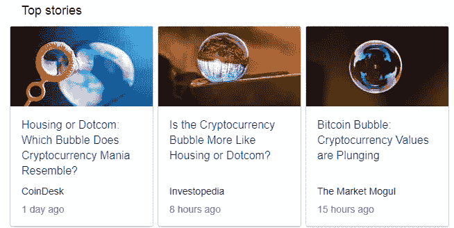
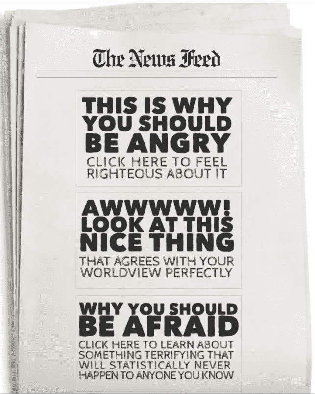
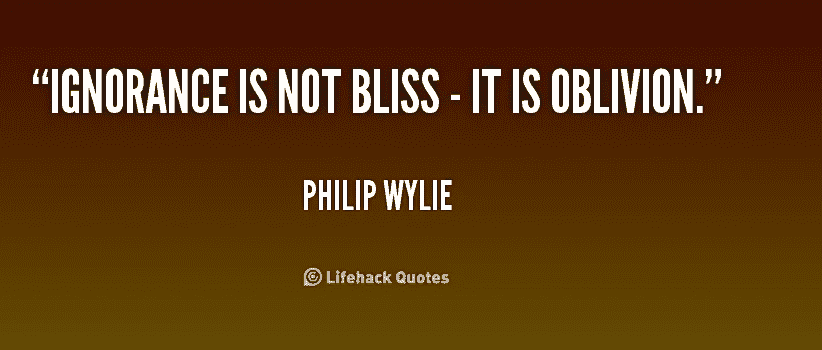
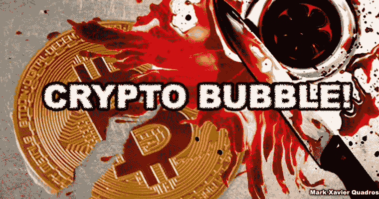
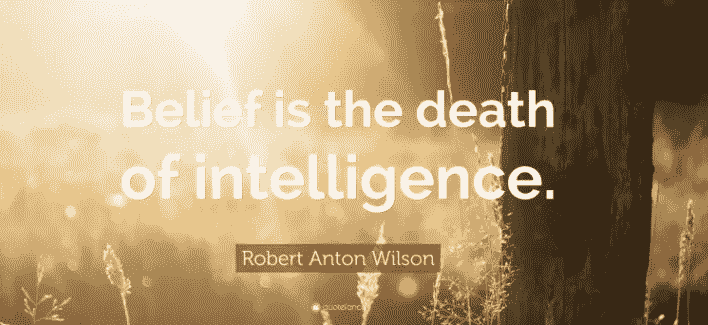
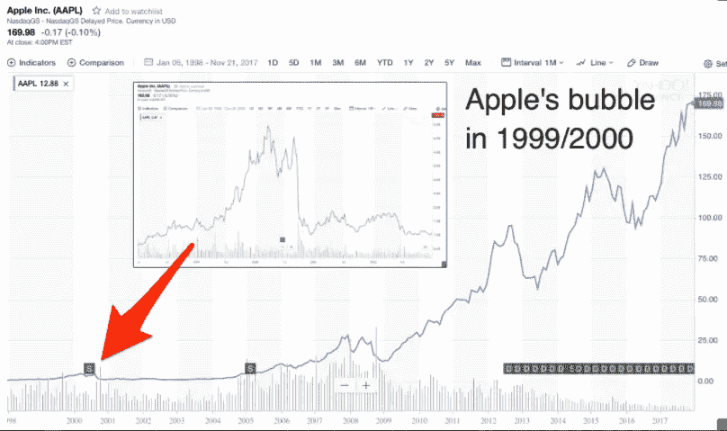
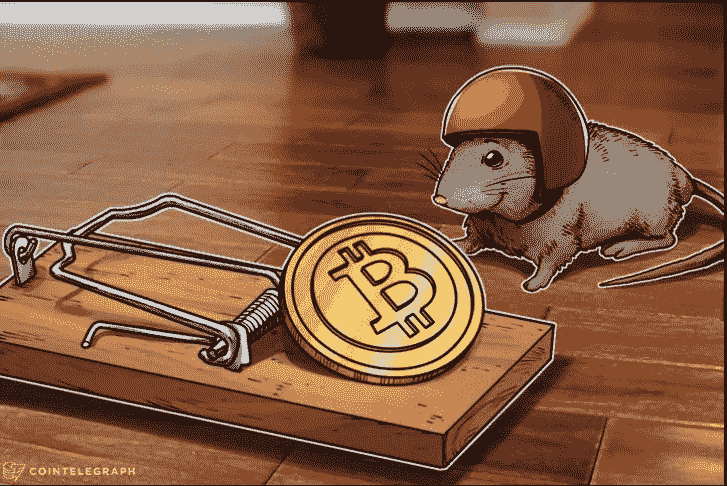

# 秘密大屠杀？我觉得不是！

> 原文：<https://medium.com/swlh/https-medium-com-markxquadros-cyptocurrency-bloodbath-or-bubble-i-think-not-a92ffc9f42ab>

加密市场以其极端的波动性而闻名，但最近它有点太令人紧张了，或者应该说是一场大屠杀。但是大多数人似乎不明白的是**这是完全正常的！**

**Yet another Crypto GIF thanks to @JimBTC**

以下是这场大屠杀中的一些财经新闻。还不到 24 小时，我们就已经有帖子将正常的市场崩溃归类为网络和房地产泡沫

**这就是媒体的工作方式**:它发布销售内容，并利用情感作为催化剂。世界上只有 1%的人持有密码，这意味着世界上大部分人仍然不知道这到底是什么。这种知识的缺乏正是媒体所利用的。

[Tobias Rose-Stockwell](https://medium.com/u/1917c4781186?source=post_page-----a92ffc9f42ab--------------------------------) 就此发表了一篇精彩的文章。[看这里。](/the-mission/the-enemy-in-our-feeds-e86511488de)

媒体一次又一次地利用恐惧和不确定性等情绪操纵市场。但是这种不确定性是由于无知而产生的，让我告诉你一件关于无知的事情。

# 无知不是福！

无知只不过是懒惰，不想看得更远。

> **加密货币是泡沫！这是假的。庞氏骗局！**

人们在没有任何事实支持或不了解其工作原理的情况下做出这样极端的声明。

不相信我？好了，让我们来看看这些专家们对互联网的预测。

> 远程购物虽然完全可行，但会失败——***时代杂志***
> 
> 手机绝对不会取代本地有线系统——**马蒂·库珀，发明家。**
> 
> “iPhone 不可能获得任何显著的市场份额。”微软首席执行官史蒂夫·鲍尔默。

爆笑！不是吗？对我们今天的**是的**！

但是当时像这样的声明形成了数百万人信仰的基础。许多人完全忽视了互联网的创新，这显然是无知的。

# 现在让我们看看当今的“密码专家”！

> "我几乎可以肯定地说，他们不会有好结果。"
> 
> ——**沃伦·巴菲特**
> 
> 虽然加密货币的概念很吸引人，因为它的价值不会受到任何政府的影响，但家族理财室不会考虑投资它，”
> 
> **—文卡特·苏布拉曼尼安，科塔克·首席运营官**

你看到链接了吗？这种矛盾的感觉是因为我们今天的信仰体系正在通过加密货币的创新而被彻底对立。

我们在成长过程中被灌输了这样一种观念，即认为做某事有一种特定的方式，这种方式被认为是“T2”正确的方式。

现在，当一些事情试图以正确的方式与**冲突时，我们基于此的信仰体系被触发，我们只是简单地反对它，而没有丝毫的线索。**

就像几十年前人们反对互联网的想法一样，现在也有很多人反对区块链的加密货币的想法。尽管两者不同，但它们都是各自意义上的创新。

# 加密货币是明天的未来。

加密货币是一项基于全新信仰体系的创新技术。它不是将权力集中在一个人或团体手中，而是分散的。这种分散支付系统将彻底改变商业运作方式。

许多中央集权者并不理解这一点，因为他们对中央集权的信任有坚定的信念，我们看到了到目前为止这是如何运作的。

> 当银行掌握着钥匙时，只有对它们有利的规则才会被实施。这不是阴谋。这只是基本事实。当一个实体取得对其他实体的支配地位时，它就会以任何可能的方式利用和滥用这种优势。— [丹尼尔·杰弗里斯](https://medium.com/u/618a7c78c957?source=post_page-----a92ffc9f42ab--------------------------------)点击这里阅读他的帖子

好吧，它很有未来感，很有创意，但是为什么你和我不使用它呢？

这是因为世界仍在掌握它的窍门。[**比特币**](/the-mission/everything-you-need-to-know-about-bitcoin-f2a3be247a5b) 有史以来最古老的加密货币只有 8 岁！

我们忘记的是，加密货币仍然非常新。尽管如此，还有巨大的潜力！因为创新者和热心者正在投入大量的金钱和智力去理解它。我学到的一件事是，如果你用心去做，那是可以做到的。

每一代都有像 [中本聪](/@abarisser/who-is-satoshi-nakamoto-b18b2847ddb6) **(** 区块链的创造者)这样的创新者通过他们的创新改变了数百万人的信仰。

关于创新者的一件事是**,他们将一代又一代人推向前人毫无头绪的地方！**

我们已经用**苹果经历过这种情况。史蒂夫·乔布斯将我们这一代人推向了一个无人能想象的高度！**

我怀疑我们的祖父母会想到我们会用 iPhone 和他们说话。

**还是网络摄像头！**

# 好的。但是什么时候会繁荣呢？

我一点也不知道这种创新何时到来，但我确实知道一件事，在未来的某个时候，也许两个，也许十个，这种创新将解决我们今天面临的所有问题，以及更多我们从未想象过的问题。

我找不到比丹尼尔·杰弗里斯更好的方式了。[看这里](https://www.google.co.in/search?q=mastering+shit+coins&rlz=1C1CHBD_enIN743IN743&oq=mastering+shit+coins&aqs=chrome..69i57.2446j0j1&sourceid=chrome&ie=UTF-8)

> 事实上，我不要求你相信任何事情，因为信念是智慧的死亡。你所需要做的就是看，虚心倾听，学习，然后为自己做出决定。

所以开始了解它永远不会太晚(或太早)。

**——马克·泽维尔·夸德罗斯**

这是我在 medium 上的第一篇帖子，感谢您的回复！

这个故事发表在 [The Startup](https://medium.com/swlh) 上，这是 Medium 最大的企业家出版物，拥有 287，184+人。

## 在这里订阅接收[我们的头条新闻](http://growthsupply.com/the-startup-newsletter/)。

