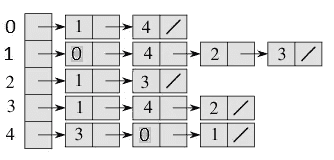

# 什么是图？

> 原文：<https://medium.com/swlh/https-medium-com-sandymak-what-are-graphs-696076188116>

[https://upload.wikimedia.org/wikipedia/commons/8/8b/Social_Network_Visualization.png](https://upload.wikimedia.org/wikipedia/commons/8/8b/Social_Network_Visualization.png)

# 定义

> 图形数据结构由一组有限的(也可能是可变的)顶点或**节点**或**点**以及一组无向图的这些顶点的无序对或一组有向图的有序对组成。对于无向图，这些对被称为**边**、**弧**或**线**，对于有向图，这些对被称为箭头、有向边、有向弧或有向线。顶点可以是图结构的一部分，或者可以是由整数索引或引用表示的外部实体。 ***出自*** [***百科***](https://en.wikipedia.org/wiki/Graph_(abstract_data_type))

一个图的数据结构是树的概括。像树一样，图也有通过边(弧)相互连接的节点(顶点)。然而，与树不同，图有可以指向任意数量节点的节点。

有两种图，**有向**和**无向:**

**有向图**包含从一个节点指向另一个节点的边，而**无向图**包含没有方向的边。有向图中的所有节点只能通过沿着每条边上指定的方向来遍历，但是对于无向图，节点可以在两个方向上遍历。

[http://images.slideplayer.com/26/8569085/slides/slide_2.jpg](http://images.slideplayer.com/26/8569085/slides/slide_2.jpg)

# 词汇

在上图中，有向图(左侧，a)可以描述如下:

1.  ***A*** 和 ***B*** 是图中 6 个顶点中的两个
2.  ***A*** 和 ***B*** 是相邻的 ***(邻居)*** ，因为它们通过一条边连接在一起(对于无向图(右，B)也是如此)
3.  ***A*** 是 a ***的前身******B***因为 ***A*** 是边指向的顶点。
4.  ***B*** 是******A***的*** (目标)因为 B 是边所指向的顶点
5.  有一条 ***路径*** 从顶点 ***A*** 到 ***F*** : A → B → E→ F .这条路径是 ***非循环*** ，因为路径本身并不遍历回同一个顶点。
6.  在无向图(右图，B)中，B → C → E →B 是一个以*****路径*** 为顶点，一直重复的 B。**

# **使用案例**

**一般来说，图表有助于保存每个节点内的信息，并通过使用边来展示信息之间的关系。想要获取和确定信息流的能力通常是通知开发人员使用图形数据结构的主要原因。图表的一些常见用例有:**

*   **社交网络演示(facebook、Twitter、insta gram……)**
*   **根据先修课程、核心课程和主要课程，规划和制定学校学期课程表。**
*   **生成和检查计算机网络**
*   **生成和地图**
*   **航空公司航班计划，在图表中增加权重(如距离、飞行时间或成本)，可以使用图表来计算基于上述任何或所有因素的最佳航班。**
*   **游戏——决定游戏状态之间的转换。通过预测可能的移动来帮助确定游戏策略。**

# **该表示**

**表示图形的两种主要方式是:**

****

**[https://www.geeksforgeeks.org/wp-content/uploads/adjacency_list_representation.png](https://www.geeksforgeeks.org/wp-content/uploads/adjacency_list_representation.png)**

****邻接表:**图中的每个顶点都作为键列在一个对象中，这些键与一个顶点数组相关联，这些数组表示每个顶点所具有的连接(边)。这个方法可以看作是存储边的列表。这样，可以在顶点和边上存储额外的数据。**

****

**[http://mathworld.wolfram.com/images/eps-gif/AdjacencyMatrix_1002.gif](http://mathworld.wolfram.com/images/eps-gif/AdjacencyMatrix_1002.gif)**

****邻接矩阵:**数据存储在二维矩阵中。行代表前任，列代表继任者。如果前一个和后一个之间有联系，二维矩阵中的值将从 0 变为 1。关于边或顶点的任何附加数据必须存储在外部。**

# **大 O**

****邻接表****

*   **存储(空间复杂度)— O(|V|+|E|)我们将需要生成一个对象，它以键为顶点，以包含边的数组的形式显示值。`**
*   **添加顶点-O(1)-在对象中查找的恒定时间**
*   **add Edge-O(1)-在对象中查找并插入到数组末尾的恒定时间**
*   **query-O(| V |)—我们将必须遍历整个对象(所有键)来查找是否存在边。**

****邻接矩阵****

*   **storage-O(| V |)-生成两个数组来存储所有顶点**
*   **添加顶点— O(|V| ) —需要遍历整个矩阵(二维数组)进行添加**
*   **add Edge-O(1)-查找边之间的两个顶点的恒定时间，因为它们在矩阵中的特定索引处表示。**
*   **query-O(1)-常数查找时间也可用于确定可达性，并可用于在未加权图中查找最短路径**

**与《算法设计手册》的比较，Skiena，第二版，第 152 页**

# **样本图表**

****

**Directed graph source — self**

# **代码**

**下面的代码将使用邻接表重新创建上面的图形示例。**

**The longest shortestPath Algorithm written…**

# **TL:DR**

*   **图是一组节点和一组边。`**
*   **有两种图:有向图和无向图。**
*   **高级操作包括:**
*   ****广度优先搜索**，也可用于判断路径是否存在，并可用于在未加权图中寻找最短路径**

# **更多阅读**

** [## AVL 树&在哪里可以找到(旋转)它们

### 大家好！欢迎来到 AVL 树(简化版，以发明家阿德尔森-维尔斯基和兰迪斯命名)。今天，我们将…

medium.com](/@sarahzhao25/avl-trees-where-to-find-rotate-them-7b062e0a30f8)  [## 旅行推销员的艰难困苦

### 随着我们越来越深入计算机科学的世界，有一件事开始变得非常清楚，非常迅速…

medium.com](/basecs/the-trials-and-tribulations-of-the-traveling-salesman-56048d6709d)  [## 搜索算法-维基百科

### 在计算机科学中，A*(读作“A star”)是一种计算机算法，广泛用于寻路和图形…

en.wikipedia.org](https://en.wikipedia.org/wiki/A*_search_algorithm)  [## 迪克斯特拉的算法-维基百科

### 对于图中给定的源节点，该算法查找该节点与其他节点之间的最短路径。它可以…

en.wikipedia.org](https://en.wikipedia.org/wiki/Dijkstra%27s_algorithm) 

## 这篇文章发表在[《创业](https://medium.com/swlh)》上，这是 Medium 最大的创业刊物，有 291，182+人关注。

## 订阅接收[我们的头条新闻](http://growthsupply.com/the-startup-newsletter/)。

**