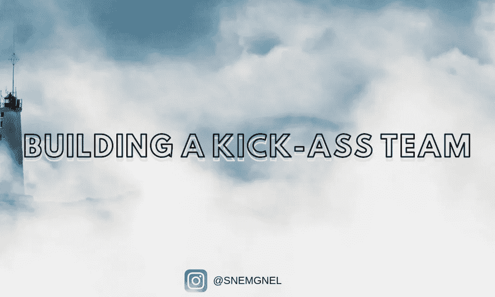

# 如何用一个强大的实践建立一个一流的团队

> 原文：<https://medium.com/swlh/https-medium-com-sinemgnel-how-to-build-a-kick-ass-team-609824cc65c6>



## 一个不可阻挡的团队是预测成功的关键品质

无论你是雇员还是雇主，你肯定都面对过这个事实:

```
The motivation of workers is highly diverse.
```

史蒂夫·乔布斯把他的员工分成三组。