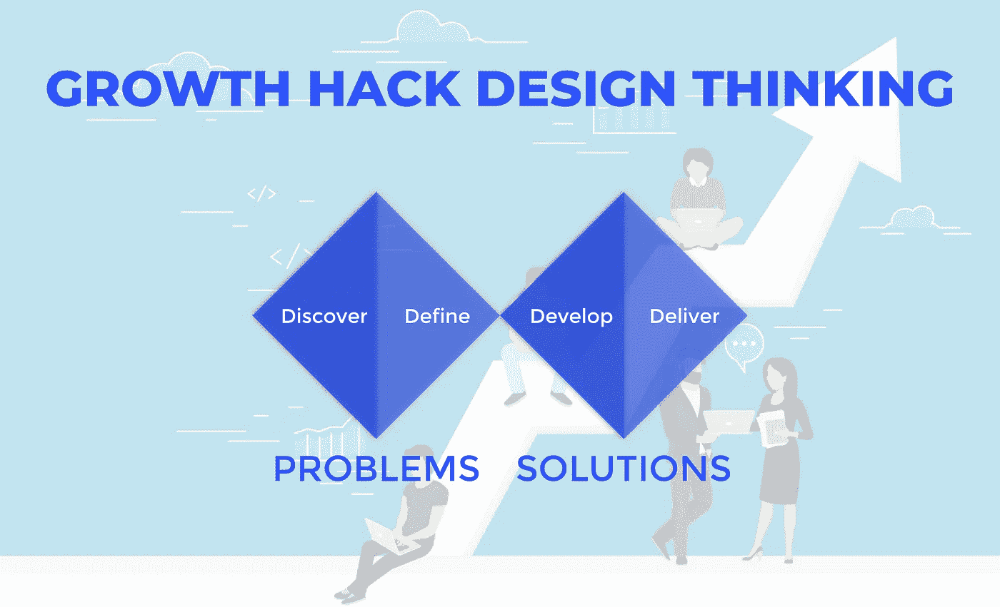
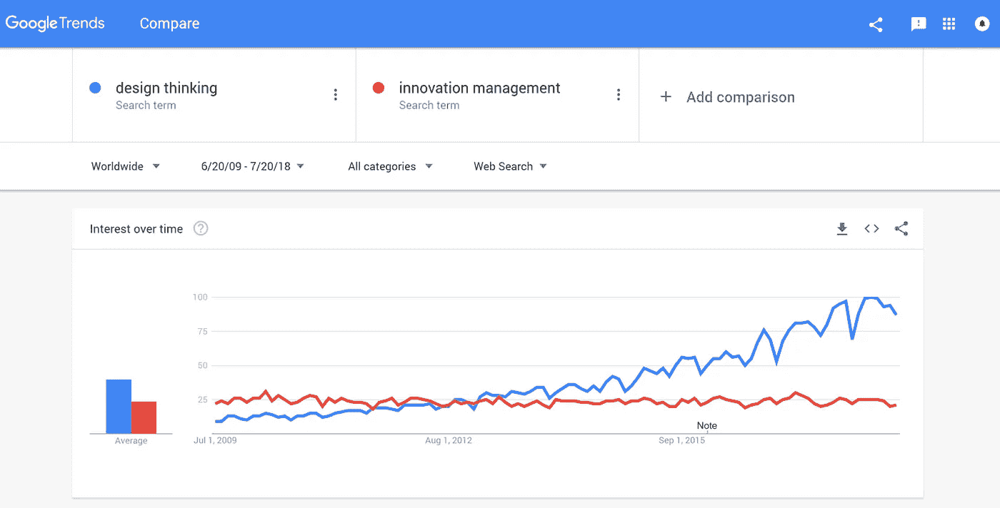
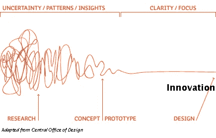

# 如何成长破解设计思维

> 原文：<https://medium.com/swlh/https-medium-com-swlh-how-to-growth-hack-design-thinking-edb4536c0bf3>

Growth Hack Design Thinking — by the Founders of Pyoneer.io

# 创造成功的产品需要什么？如何建立和发展可持续发展的企业？他们的技术能增加我商业成功的机会吗？

我们的旅程始于 2011 年我们第一次发现 Eric Ries 的精益创业公司。这本书是一个里程碑，因为它完全改变了如何建立一个企业的观点。公司和企业家习惯于写一份没完没了的商业计划，浪费时间和金钱去制造一种没人会买的产品。使用像[商业模型画布](https://strategyzer.com/canvas/business-model-canvas)这样的工具进行以客户为中心的产品验证是你的想法成功的新指南。

在我们发现精益创业书籍后不久，我们经历了行业中的另一个基本趋势——设计思维。今天，这个时髦词就像人工智能、区块链或大数据一样存在。

Google Trend of Design Thinking Searches

设计思维正以越来越快的速度传播到产品开发中，并能够将其自身附加到许多东西上。*我最近写了一篇文章，为什么* [*设计思维是下一代项目管理。*](https://pyoneer.io/project-management-30/) 设计思维是什么有很多不同的定义，它的本质是:把客户问题放在第一位。

将客户需求放在我们为他们所做的一切的中心——无论是创造产品还是服务——改变了一切。这是一个创造性的解决问题的过程，使用设计师工具箱中的元素，如移情和实验，以获得新的解决方案。

这种做法有助于通过一系列原型让客户或用户参与学习、测试和完善概念，从而最大限度地降低创新的不确定性和风险。设计思想家依赖于从现实世界的实验中获得的客户洞察力，而不仅仅是历史数据或市场研究。

[https://www.creativityatwork.com/design-thinking-strategy-for-innovation/amp/](https://www.creativityatwork.com/design-thinking-strategy-for-innovation/amp/)

# 我们热爱设计思维

为什么？ [**仅仅因为它为人类创造价值**。](https://pyoneer.io/blog-applying-design-thinking-a-manual-to-innovation-how-pyoneer-started-as-a-lean-startup/)我们相信任何产品、服务、活动，如果对某个人来说没有目的，都是一种浪费！我们希望回馈其他人，创新爱好者，对创业感兴趣的人，处于数字化转型中的公司，以及所有希望学习如何在产品或服务创新方面更具创造力和更成功的人。

# 我们的电子书——成长黑客设计思维

我们不只是写一些基本的话题，比如“如何做……”或者“为什么设计思维有意义”。我们希望研究该方法的高级主题和商业应用，因为毫无疑问它是可行的。刚刚阅读了来自[设计管理研究所](https://www.dmi.org/page/DesignValue)的最新报告，该报告发现在运营中融入设计实践的公司的投资回报率比**高出 219%。**

# 我们想更进一步

**“成长黑客设计思维”**将讲述我们近年来在咨询和创业中发现的先进技巧和诀窍。

下个月，我们将频繁发布以下主题:

*   为什么是现在——机遇和历史
*   如何快速找到合适的面试伙伴并让他们参与进来
*   对于设计挑战，什么是好的 KPI？
*   设计思维步骤的高级提示和技巧
*   结果驱动与方法驱动的设计思维
*   专家访谈
*   应用 DT 的公司的最佳实践
*   最佳书籍和资源

# 书中的人物

*   **创新经理或顾问**的目标是从他的设计挑战中创造颠覆性创新
*   蔻驰 **或 UX 设计师**谁在寻找最好的方法和技巧
*   **企业家**需要将自己的想法推向市场，并快速、精简地扩大规模

所以，即使你正在学习或者你有经验，你也可以按照我们的步骤，把学到的东西应用到你自己的项目中

*   分享见解、文章和评论！
*   …或者也许你可以想出自己的文章？
*   提问！我们聊得很开心。
*   你也可能不同意一些想法:这就是为什么我们希望你不同意，并与我们讨论！

# 成为书的一部分

我们写这本书的主要目标是为社区提供价值。这就是为什么最好的方法是和你一起创造内容！

*   你有有趣的故事分享吗？
*   你在设计思维或 UX 方面最大的成功/失败是什么？

帮助我们收集最好的信息和经验！在我们要出版这本书之后，每一个支持者都会被称为合著者。

[在 Linkedin 上评论我们](https://www.linkedin.com/in/stefan-link-pyoneer/)或者给我们发电子邮件[告诉我们你的想法或想法](mailto:stefan@pyoneer.io)

# 什么时候发生？

该系列将在接下来的七周内发布。关注我们在[我们的先锋博客](http://www.pyoneer.io/blog)、媒体上的[、LinkedIn](/@stefan.h.link) 上的[上的帖子，或者加入 LinkedIn 上我们的](https://www.linkedin.com/pulse/lean-innovation-how-develop-successful-products-today-stefan-link/?trackingId=sTfPBWA%2BzXq23T9kFtRahQ%3D%3D)[设计思维和精益创新社区的讨论！](https://www.linkedin.com/groups/8676238)

[注册接收来自 Pyoneer](https://upscri.be/dbdac6/) 的“精益创新”故事和更新。

干杯

斯特凡&约翰内斯

## 这篇文章发表在 [The Startup](https://medium.com/swlh) 上，这是 Medium 最大的创业刊物，有 351，974+人关注。

## 在此订阅接收[我们的头条新闻](http://growthsupply.com/the-startup-newsletter/)。

