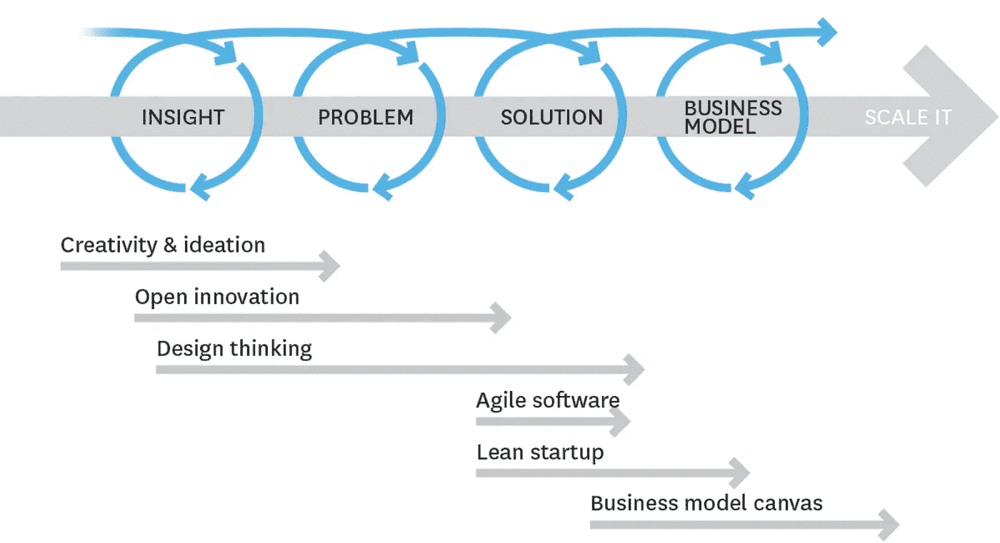
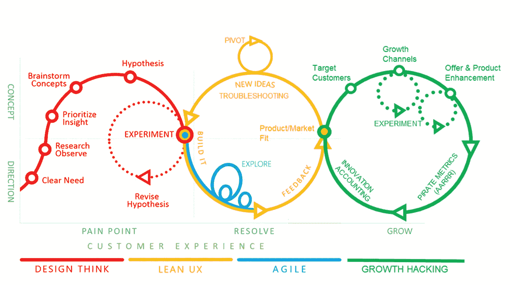

# 精益创新——当今如何开发成功的产品[系列——启动]

> 原文：<https://medium.com/swlh/https-medium-com-swlh-lean-innovation-how-to-develop-successful-products-today-b6237345a5f0>

Lean Innovation

## 为什么您的客户比以往任何时候都更是成功的关键

The Lean Innovation Process

这是我的“精益创新——今天如何开发成功的产品”系列的第一个故事。这是关于产品开发的转变，以及在过去的 50 年中改变的方法。就像“精益”制造改变了当今公司制造实物产品的方式一样，精益和持续创新正在成为当今发明和开发成功产品的相同标准。在接下来的几周里，我将发表多篇关于以下主题的文章:

*   为什么精益创新是打造成功产品的新途径
*   比较精益创新方法——设计思维、精益创业和精益 UX
*   如何创造创新文化赢得未来
*   追逐洞察力和客户问题，而不是解决方案
*   如何提供更好的客户体验和真正的客户价值
*   创造成功产品和服务的简单步骤
*   如何并行结合敏捷、设计和精益

# 为什么我要写这个？

我们知道我们通过尝试、分享、基准测试和提问来学习！我在 [Pyoneer](https://pyoneer.io/) 的创业团队是设计思维和“精益”运动(自我解释，因为我们正在为设计思想家开发软件)的忠实粉丝和支持者。我们坚信，产品和服务可以让人们的生活变得更加轻松。我们仍然停留在一个旧的世界里，那里有太多的产品失败了。公司浪费不必要的时间、金钱，尤其是员工的精力来制造没人想要的产品。我们的最终目标是帮助公司制造人们喜爱的产品。

# 我正在与你分享我们的经验和我的想法——我希望你也能参与进来，因为我们可以互相学习！

# “但我对设计思维和精益创新完全陌生……我会学到东西吗？”

绝对的！我将分享我的个人经历，讲述我们如何:

*   运用设计思维找到解决客户问题的产品
*   在没有现有产品的情况下，应用精益启动来实现产品的市场适应性
*   以有效的方式将设计思维和敏捷软件开发结合起来

这个故事的目标是激励人们成为真正的创新者，并帮助每个人理解良好和有效的产品创新的原则。此外，我想就如何正确应用精益创新为人们提供指导并分享好的例子。

# 我在一家公司工作，不想创业。我能从中得到什么？"

无论你是为大公司工作还是正在计划发展自己的事业。文章指出了每个人为什么以及如何成为创新者的原因。好的创新大多来自正确的思维方式。精益仅仅意味着减少浪费，没有人需要。“精益”生产在客户下订单时只生产产品，而不是过度生产，等待有人购买。“精益”创新只有在注意到客户的问题或需求时才会创造产品，而这些问题或需求可以通过解决方案来解决。这适用于从事工程或产品开发的人员以及人力资源部门的人员。“倾斜”意味着总是拉，而不是推。

还有一点:创新的一个原则是总是迈出第一步，这一步可能就是你的。我们开始吧！

所以，即使你正在学习或者你有经验，你也可以:

*   遵循我们的步骤，将学到的知识应用到您自己的项目中
*   在 LinkedIn 上分享见解、文章和评论！
*   …或者你可以写自己的文章？
*   提问！我很乐意聊天:)
*   你可能也不同意一些想法:这就是为什么我希望你不同意，并与我们讨论！

# 什么时候发生？

该系列将在未来 3 周内发布。关注我们在 [the Pyoneer blog](https://pyoneer.io/blog/) 、Medium 上的[、LinkedIn](/@stefan.h.link) 上的[的帖子，或者在 Slack](https://www.linkedin.com/in/stefan-link-pyoneer/) 加入我们的[设计思维和*精益*创新社区的讨论！](https://join.slack.com/t/pyoneer-corner/shared_invite/enQtMzA5ODAxOTkyMDgyLThkZTdhNmUzMjMwNGIzNjc3NmVjNzI5ZjVjZjc5YmQzYzliYzAxMGQ4ZTI1ZDgwODQ2NTJhOWEzMTJiZTViNTk)

# 感谢阅读！你怎么想呢?留下评论，分享我们的故事吧！

## 这篇文章发表在 [The Startup](https://medium.com/swlh) 上，这是 Medium 最大的创业刊物，拥有 298，432+人关注。

## 在此订阅接收[我们的头条新闻](http://growthsupply.com/the-startup-newsletter/)。

