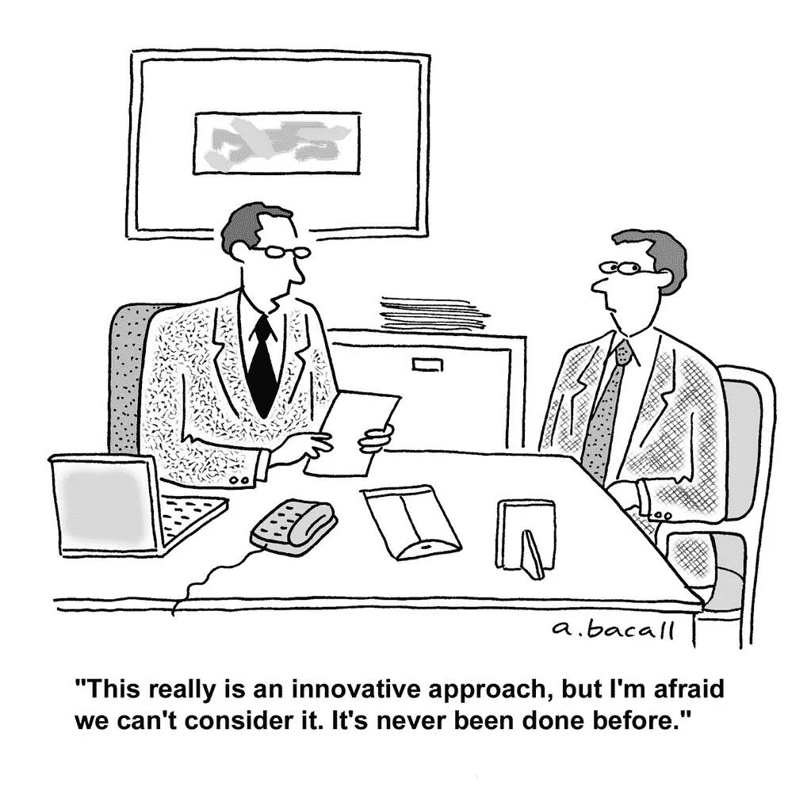

# 成为一名先锋企业家

> 原文：<https://medium.com/swlh/https-medium-com-tuviae-being-a-pioneer-entrepreneur-learning-from-mobileye-ab3429a7add8>

## 或者，我从 Mobileye 的创始人和早期投资者那里学到的。

作为一名来自耶路撒冷的初创公司创始人，我见过许多 Mobileye 的早期天使投资人，并在不同场合与齐夫·阿维拉姆(创始人首席执行官)交谈过几次。

为了保持真实、全面的披露——不，他们不是我的“朋友”或同事，因此我不会发一条祝贺的推特或写一篇帖子，好像我很了解他们一样。

然而，在这些对话中，有两个重要的注意事项引起了我的共鸣，我认为在取得这一惊人的成就后值得思考。

***我们已经不得不枢 7 次***

大约一年前，在一次社交活动中，我问阿维拉姆，在结束与有这种经历的人的谈话之前，我总是会问些什么。我问他——“给我讲一个你永远不会忘记的旅行故事，我会试着从中吸取教训”。(BTW 人家不一定总会拿出“教训”来教你，但总会有故事讲……)。

阿维拉姆先生告诉我一个故事，关于他们如何从面向消费者的系统转向面向车主的 B2B 模式，并开始研发自动驾驶汽车。然后他补充道，“我们在 Mobileye 上工作了这么多年，已经转了 7 次。这是很多年的工作，很多支点。这从来都不容易，但永远不要放弃”。

我们总是读到公司的成功，即使现在有了 Mobileye，但我们很少读到他们的挣扎。当我们这样做时，通常“为时已晚”,我们阅读了某种“事后分析”,但我们无论如何都不予理会，因为“嘿，显然他们失败了——看看他们犯的错误”…

> “我们在 Mobileye 上工作了这么多年，已经经历了 7 次转变。这是很多年的工作，很多支点。这从来都不容易，但永远不要放弃”

但这是创业公司的事情 Mobileye 的人离失败还有多远？[几周前做空该公司的分析师是否脱离了现实](https://twitter.com/CitronResearch/status/841282847310725121) …?这么多年来，Mobileye 有多少次在关闭公司和能够再推一把之间徘徊？

***“现在怎么办？”瞬间***

对于不熟悉支点的人，让我试着这样解释:

你不会有一天起来说“好了，别说了，我们换个话题吧”，然后继续工作，就像什么都没发生一样。俗话说，创业是短跑，全程是马拉松。你不能原地停止冲刺，然后转身。这需要几秒钟的时间来放慢速度，喘口气，重新集中注意力，然后重新开始跑步并提高速度。想象一艘巨轮不得不改变航向。这可能只是一个按钮的点击，但这艘巨轮上有多少小部件必须开始移动，掉头需要多花多少钱的燃料，这值得吗？我以前的方向呢——我承认我在这方面失败了吗？—那么为什么这次会成功呢……别忘了，通常这都是在士气低落的时候发生的，因为事情没有进展，所以当你沮丧的时候，你如何找到重新开始的力量……

此时，很容易放弃。很容易陷入“快速失败”的叙事，并向自己保证，“你已经做了你能做的一切”。

但是，如果你真的痴迷于解决一个问题，就像许多风投和创始人喜欢谈论的那样，你*不能*放弃，你不会停下来，直到你找到解决问题的正确解决方案。

这才是*真正的*类型的 pivot 创始人应该经历的。不是产品的支点(如问题+解决方案)，而是心态的支点。从“它不起作用”的低落情绪中走出来，回到开始时“我们能做到”的那种感觉想出一个更好\新的方法来解决同样的问题，因为你着迷了，就像 Mobileye 一样。

> 但是，如果你真的痴迷于解决一个问题，就像许多风投和创始人喜欢谈论的那样，你就不能放弃，直到你找到解决问题的正确方案，你才会停下来。

***当先锋***

第二点是关于成为一个领域的先锋。相信我，这真的很难。在过去的几年里建造 ZUtA，而[消费机器人正处于早期](http://www.roboglobal.com/why-you-should-invest-in-consumer-robotics-companies-now)，我可以确切地告诉你这一切是什么感觉。

作为一个创业者，你会面临很多困难时期，因为一般来说创业并不容易。

作为一个空间的先驱，这意味着实际上没有空间。因此，你试图推销的未来梦想更大，更难看到，也可能需要更长的时间。让人们相信你的解决方案更好是一回事，让他们相信这个问题是可解决的、值得解决的，而且你知道如何解决是另一回事…

正如几个早期的 Mobileye 天使投资人所说的那样——“阿姆农&齐夫告诉我们这需要 15 年时间。好家伙，他们是对的”。

要理解先驱企业家获得成功有多罕见，你必须记住，初创企业拥有的时间，主要是它们的“空气”的函数，通常是由投资者提供的，尤其是在早期，尤其是当你不得不转向的时候。

建立一个新的空间需要时间，但也需要能够理解和真正预见未来的合适的人，和你一起。

当向投资者推销时，他们不断地将你与其他模式进行比较，并从他们的个人经历或市场中寻找例子，以便更好地评估你的成功机会。我们的行业就是这样运作的。

但是，如果没有什么可以与你相比，那么你所在的领域可能没有人成功过——因此，进入这个领域的资金是“新”资金——这位先锋企业家必须解释，不仅这是一片“蓝海”，而且他为什么知道这甚至是一片海洋……即使这是一片海洋，也许那里没有鱼是有原因的——也许水被污染了，或者不值得游泳……

> 作为一个空间中的先锋企业家，这意味着实际上没有空间。因此，你试图推销的未来梦想更大，更难看到，也可能需要更长的时间。

看到 Mobileye 的标题，对我来说，这是关于一群先驱，他们坚持了 *18 年*，并能够重新启动和旋转 7 次。

这是成功的故事，而不是交易的数字。

让我们庆祝韧性和不放弃的旅程。把注意力集中在他们令人难以置信的勇气上，如果你对此有一点嫉妒或消极的想法，它就会消失。如果不行，那就去尝试创办自己的公司。