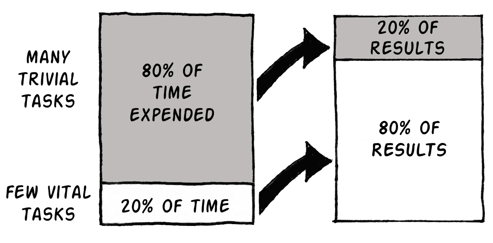
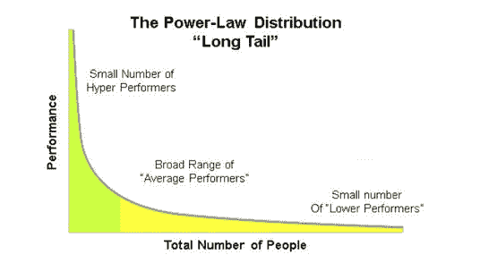

# 世界上最珍贵的东西

> 原文：<https://medium.com/swlh/https-medium-com-wilowallstreet-the-most-precious-thing-in-the-world-83ac638de5c1>

我们生命中最珍贵的东西是时间。

我们永远都不够用，而且总是用光。

我个人在二三十岁的时候浪费了很多时间做各种乱七八糟的事情。我只是很忙。

直到我 40 岁，我才意识到关于时间的几件大事。

# 这里有一个简单的想法，它让我的生活变得更简单，并创造了时间:

在我做的任何事情中找到关键的 20%。

专注并执行好关键的 20%。

其他的完全无视。

Source: Lifehack.org

负责大部分结果的关键的 20%也被称为帕累托定律，以一位在 19 世纪晚期发现它的古代意大利经济学家的名字命名。这也被称为幂律分布。

**这个想法对你如何生活和如何安排你的一天至关重要，因为我们大多数人只关注给我们带来 20%结果的 80%。比如:**

1.  参加毫无意义的会议
2.  检查和回复不必要的电子邮件
3.  非常高效地做无效的事情

**在你的生活中应用帕累托 80/20 定律的三个最重要的领域是:**

1.  学问
2.  时间
3.  投资

# 学习:

在你学习的任何事物中，确定核心思想、核心主题和构建模块。然后围绕这个建立你的心智模型。

看看埃隆·马斯克，在这里谈论第一原则的力量:

每天要做的三件简单的事情。

1.  当了解一项新的投资或业务时——询问这项业务或投资成功的核心假设是什么。关注那些。
2.  当学习一门新的学科时——问我想学的学科的核心书籍是什么。**看那些。**
3.  我可以就这项投资、业务或机会与哪些关键人物交谈。**跟他们说话。**

# 时间:

很容易找到很多事情做。总有更多的事情你可以去做，去阅读，去看，去工作，去和人聊天。通常没有足够的时间让你处理好你计划要做的每一件事。

**这里有三种方法将 80 / 20 方法运用到你的时间中:**

1.  对你想要实现的一年和五年的大目标有一个想法，然后将这些目标变成一个系统，你可以在这里阅读更多关于拥有系统超过目标的信息。
2.  对你每个月、每个星期想要完成的关键事情有一个想法。在你开始工作之前，把这些都冲掉，并安排在你的日程表上。**这是必须的**。我是这样安排时间的。
3.  精力最充沛的时候做最难的工作，累的时候做最容易的工作。我试着每天只关注 3-4 件大事。

来源:泰勒·皮尔森

这是《大西洋月刊》的一篇关于如何构建理想工作日的文章。

# 投资:

说到投资，大多数投资组合中不到 20%的股票却能带来 80%的回报。事实上，根据我最近看到的一项研究，十年的股票回报看起来非常像幂律分布。

来源:哲学经济学

**如果投资真的是基于幂律，你需要:**

1.  尽早减少你的错误——80%的股票表现不佳(记住华尔街的格言:尽早减少损失，让赢家跑)
2.  充分了解你的领域——不要试图成为每件事的专家。了解你的优势并专注于此。就连巴菲特也在下面谈到了他的能力圈。
3.  忽略你听到的 80%的事情，忽略 80%的新闻，对人们向你提出的 80%的想法说“不”。

**一旦你发现 20%的想法、行动和人给了你 80%的结果，加倍努力。然后每天坚持这样做。**

# 你准备好更进一步了吗？

我们是一群致力于帮助下一代的金融老手。我在华尔街学到的是让你更聪明、更富有、更快乐。[注册](http://www.wilowallstreet.com)获取我们关于任何工作的网络电子书，并获得我们每周的 VIP 电子邮件。

## 这篇文章发表在 [The Startup](https://medium.com/swlh) 上，这是 Medium 最大的创业刊物，拥有 288，884+人关注。

## 在此订阅接收[我们的头条新闻](http://growthsupply.com/the-startup-newsletter/)。

