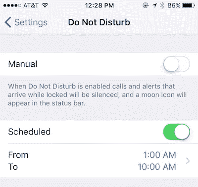

# UX 人道组织

> 原文：<https://medium.com/swlh/humanity-ux-6b336c94c26d>

用户体验研究者(UX)和设计师用一个有趣的词来描述他们希望我们使用的产品的优点:**启示**。

这里有一个更正式的[定义](http://www.usabilityfirst.com/glossary/affordance/):

> *启示是用户界面的一个理想属性——软件自然地引导人们采取正确的步骤来实现他们的目标。*

几乎在我们与产品的每一次互动中，我们都会遇到启示:当我们❤一条推文时的动画，我们在 Facebook 上用来做出反应的可爱图标，智能手机使用的解锁机制，等等。

大多数这些启示通过给我们短暂的、愉快的刺激来鼓励我们更多地使用产品。我们习惯于拉、敲、刷来感觉良好——通过新闻订阅，我们对朋友的生活有了更多的了解，我们看到有人喜欢我们的照片，或者我们在约会应用程序上与某人匹配。

随着时间的推移，我们对这些启示的持续和习惯性使用开始模仿实验室老鼠的经历:拉动操纵杆以获得奖励。

任何一个不得不与伴侣一起坐在餐桌前查看手机的人都可以承认，这些启示并不总是对我们的体验有积极的贡献。

**那么，鼓励我们少用*技术的启示呢？我们能不能用启示来制造我们的产品，这些启示的目标是让我们更现实？***

这个想法看起来很矛盾，但是我认为有充分的证据表明产品已经进化出了人性化的 UX。

苹果在 iOS 上的**勿扰**模式就是一个例子。它甚至允许我们安排时间——我把我的时间设定在凌晨 1 点到 10 点。

这不是我必须睡觉的时间，这是我不想被通知打扰的时间。几个月前，我把卧室里所有的充电器和屏幕(除了 Kindle)都拿走了，这很有启发性。我的卧室现在感觉很平静。

Slack 的 DND 模式也值得称赞，这种模式在默认情况下执行得非常好，并且跨团队运行。

受 f.lux 的启发，苹果公司推出了夜班服务，这是人性化 ux 的又一次进化:它在晚上调低了液晶屏幕上可能导致眼睛疲劳和失眠的蓝色调。

DND 模式是一个如此明显的功能，以至于人们很容易忽略它作为产品启示的颠覆性:苹果和 Slack 承认我们可能不想一直使用他们的产品。如果我们全天候使用他们的产品，像脸书这样的其他科技公司会很兴奋，广告商正在追随这一趋势:[现在有证据表明，他们的目标是](http://www.wsj.com/articles/marketers-find-you-at-2-00-a-m-1460570019?mod=e2tw)在半夜使用手机的人。

当然，这是有原因的——脸书的商业模式依赖于我们的持续参与。你在他们的应用上花的时间越多，你点击广告的可能性就越大。苹果和 Slack 并不担心同样的参与度:当你购买手机或注册时，他们就赚钱了。

# 我们刚刚开始考虑人性化的 UX

未来，应用程序或游戏可能会预装合理的默认设置或休息提醒——一些主机游戏已经在这么做了。应该很容易配置每个应用程序的使用量，以及何时可用。

这种设置类似于 iOS 的家长控制，是为你管理自己的习惯而设计的。

也许你的预算是每天花 2 个小时玩一个[三人组](https://itunes.apple.com/us/app/threes!/id779157948?mt=8)的游戏。或者你可以每小时加载一定数量的社交媒体帖子。

Freedom 是一个很好的例子，它就是为网络连接而建立的服务——它很容易阻止与 Twitter、脸书和其他你喜欢的网站的连接。

我一直在尝试自由，建议试一试。我目前将它配置为在工作日上午 9 点到下午 1 点以及下午 3 点到 6 点屏蔽社交应用。这些时间与我感觉最有效率的时候相关。当我不是每天都出现在办公室的时候，当我试图找到自己的心流时，就会有很大的不同。

但是，尽管自由如此伟大，但不可否认的是，它是一个蹩脚货。作为第三方应用程序，它缺乏对应用程序和权限的底层操作系统控制，因此很难监管你可能离线玩的游戏等事情。

此外，阻止应用程序访问感觉像一个钝器:设计师应该想办法让应用程序更少入侵，更人性化，这样我们就不会认为阻止它们是我们唯一的解决方案。

因此，人性化 UX 的真正未来是当操作系统和应用程序开发人员在 API 上合作时，应用程序可以直观地了解我们需要的适当数量的连接和技术。

想象一下，如果您的应用程序可以解释您的日历，并根据您的日程安排调整它们的通知设置。或者，如果你可以根据身体活动来预测应用程序的访问:多走 1 英里，玩 30 分钟你最喜欢的令人头脑麻木的游戏。

像苹果、谷歌和微软这样的操作系统供应商应该明白他们在这里的杠杆作用——如果他们在自己的软件中建立了正确的挂钩，他们就可以鼓励应用程序开发者建立更人性化的启示。或者更好的是，他们可以强制执行。

# 我们不应该依赖平台来帮助我们找到平衡

虽然不是每个人都难以找到技术媒介连接的正确平衡，但很难想象这对后代来说会变得更容易。

引人注目的 VR(还有谁补贴的？脸书！)将进一步加剧挑战:如果我们的虚拟存在变得比现实世界更好、更身临其境会怎样？

像脸书和 Twitter 这样的企业从本质上反对帮助我们找到正确的平衡:他们的目标是以对他们最有利的方式保持必要的地位，而不管我们日常生活的代价如何。

这并不是说他们不能偶尔为我们的人性做出贡献——只是当他们说“够了”时，他们的利益与我们的利益不一致

所以现在似乎是开始思考如何利用科技保护我们人类不受科技伤害的时候了*。*

*感谢* [*格伦·奥蒂斯·布朗*](https://medium.com/u/922198d9f9ad?source=post_page-----6b336c94c26d--------------------------------) *与我一起讨论和阅读这篇文章的早期版本。*