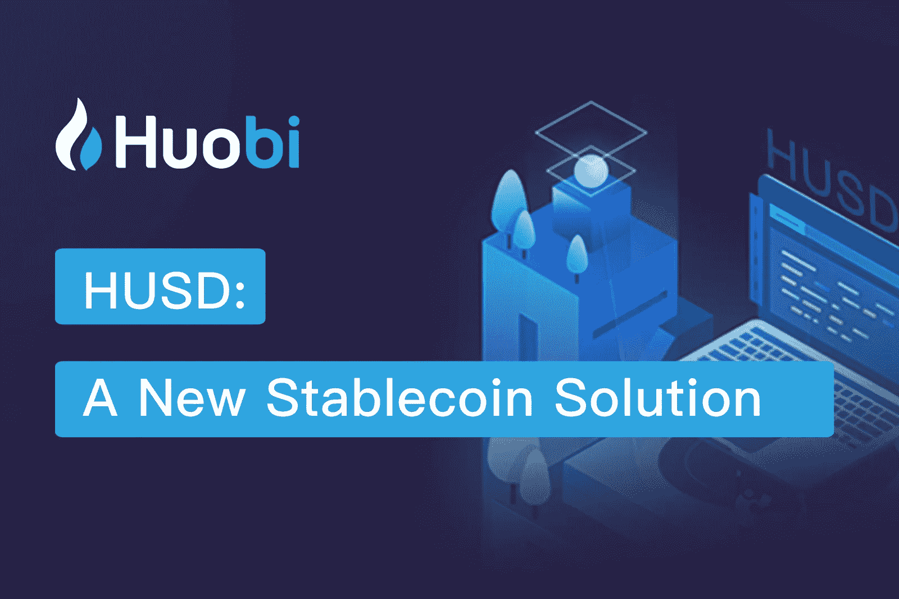
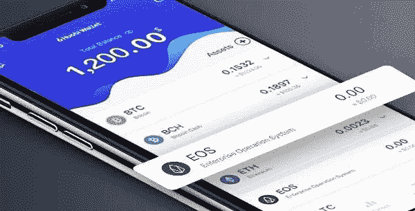
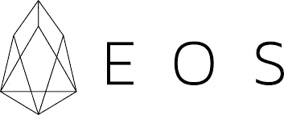

# 火币|成长中的区块链生态系统

> 原文：<https://medium.com/swlh/huobi-a-growing-blockchain-ecosystem-4185882bc4a2>

火币集团最近在今年 10 月 21 日通过他们的 twitter handle 更新宣布了他们的新副总裁 Livio Weng。

# **里维奥翁是谁？**

Livio 毕业于清华大学，获得软件工程硕士学位，清华大学是中国最受尊敬的高等学府之一，成立于 1911 年。尽管他很年轻，但他已经有了令人印象深刻的工作经验，并在以前的公司中担任过几个高级职位。在加入火币集团担任副总裁之前，他在借贷宝担任过类似的职务，借贷宝是一家区块链初创公司，提供中国 P2P 金融借贷平台。

在借贷宝，他能够吸引价值 6 亿美元的投资，这清楚地表明他是一个真正的表演者。在加入借贷宝之前，他在搜狐担任产品总监，并在快站移动网站产品的设计和开发中发挥了重要作用。学生社交网络 SXBBM.com 网站的开发是他在互联网公司多年成功工作的主要成就之一。

Livio Weng 在之前与 Blockt.com 的 [**采访**](https://blokt.com/news/huobi-group-interview-vp-livio-weng-talks-of-the-companys-ambitions-and-upcoming-news-exclusive) 中，介绍自己是火币集团的副总裁，指出他的背景是金融科技、P2P 贷款和社交网络。他补充说，他目前的职责是监管 Huobi 的所有业务发展、品牌、营销和公共关系。

# **火币不仅仅是一种交换；这是一个生态系统。**

Livio Weng 表示，Huobi Global 是世界领先的区块链公司，截至发稿时，其交易量达到约 4.16 亿美元，是全球三大加密货币交易所之一。火币网还运营着区块链产品和服务的完整生态系统，对他来说，这正是火币网与其他数字资产交易所不同的地方。

火币利用其生态系统提供一系列服务，包括但不限于:Huobi 采矿池，Huobi 钱包-一种多链加密钱包，以及 Huobi Global 上的旗舰交易所。火币全球有两个风险资本和投资部门，即火币资本和火币全球生态系统基金。他们在旧金山还有一个名为霍比实验室的区块链孵化器，以及其他几个全球机构的项目。

# 介绍 HUSD:它有什么好处？

10 月 22 日，火币正式发布了名为 HUSD 的稳定币。我知道你可能想知道什么是稳定硬币？嗯，它是一种由有形价值支持的加密货币，如法定货币、黄金或任何其他可以集中或分散的价值项目，就像大多数加密货币一样。

火币集团的 Robin Zhu 将这一发展归功于日益增长的社区关注，这推动了整个加密领域对稳定硬币的强劲需求。他补充道，

> “我们坚信消费者的选择。HUSD 以集成解决方案的形式提供这一功能，允许个人用户在稳定的硬币之间切换时节省成本和时间。同时，在交易和投资稳定的硬币时，它将为我们的整个社会提供更大的流动性。”

HUSD 将在 Huobi 交易所平台上市，并可与美元支持的稳定硬币解决方案支持的任何稳定硬币互换，包括:双子星美元(GUSD)、美元硬币(USDC)、真美元(TUSD)和 Paxos 标准(PAX)。因此，商人可以存入任何稳定的硬币，然后这些硬币将被转换并储存到 HUSD。当交易者希望提取他们的硬币时，他们可以选择从四个稳定硬币中的任何一个中提取，这为他们提供了选择的机会。

HUSD 将与其他加密货币进行交易，如 Stablecoin Tether (USDT)、比特币(BTC)和以太坊(ETH)。霍比重申，他们期待更多稳定的硬币被纳入 HUSD 系统。同时，他们将实时评估 HUSD 系统中现有的稳定币，如果稳定币不符合相应的风险控制标准，他们将删除它。

## 好处。

*   引入 HUSD 的主要目的是不再需要在市场上已经存在的各种稳定的硬币中进行选择。交易者现在可以自由选择稳定的硬币。
*   最小化交换稳定硬币的相关成本。与稳定的硬币交换相关的风险水平也显著降低。
*   将美元支持的稳定硬币聚合到 HUSD，一个单一的稳定硬币将提高 Huobi 加密交易所的稳定硬币的流动性。

竞争对手 USDT(Tether)的困境导致其失去了与美元的平价，这促进了 Huobi 的发展，此后 Huobi 将 GUSD、USDC、TUSD 和 PAX 上市，以便交易商可以选择 stablecoins。然而，该集团副总裁 Livio Weng 坚持认为，火币坚信为用户提供选择，并表示他们也无意放弃 USDT。“我们认为它的市值和需求使它不可或缺，我们没有计划退市或限制进入它，”他补充说。

# **火币钱包现在支持 EOS**

火币钱包是一个轻量级的多链钱包，允许用户方便安全地存储他们的资金。用户通过他们的私钥保持对他们的资金的控制。这个设计对初学者和专家来说都很容易使用。

*   火币钱包支持 BTC、BCH、ETH、ETC、LTC 和所有 ERC20 代币。该钱包还支持七种 stablecoins，包括 Tether (USDT)、Paxos Standard Token (PAX)、USD Coin (USDC)、TrueUSD (TUSD)、Gemini Dollar (GUSD)、Stasis EURS(欧元)和 Dai(戴)。
*   钱包中包含 exchange 服务为用户增加了更多便利。

EOS 的加入对用户来说意义相当重大。迄今为止，EOS 背后的公司 [**Block one**](https://block.one/) 保持着约 41 亿美元的 ICO 众筹记录，这表达了公众对其价值提供的潜在信心。EOS 软件旨在解决区块链的可扩展性问题，该问题阻碍了该技术的广泛应用。

EOS 部署了一个授权的利益相关者共识证明机制，该机制已经被早期的附属项目如 Steemit 和 Bitshares 证明是高度可扩展和功能性的。EOS 区块链基础设施将允许在其区块链上开发和运行企业级应用程序。为了形象化，脸书或整个加密货币交易所可以在 EOS 区块链上运行，它支持每秒数百万次交易。EOS 有两个主要特点:

*   **无感觉；** EOS 使用所有权模型，在该模型中，网络将资源按比例分配给个人或实体所拥有的股份，从而消除了支付交易费用的需要。
*   **可扩展；** EOS 通过异步通信和并行处理，支持每秒百万次的事务处理。

# 火币的下一步是什么？

最引人注目的因素是火币建立全球业务的计划。为此，霍比采取了以下步骤:

*   **扩展到非洲、中东和南亚(MENA)地区；**这些市场个别来说很小，但总体来说，它们是金融科技服务的巨大市场。这些地区可以从加密货币中受益最多，因为与拥有美元的美国和拥有欧元的欧洲不同，中东和北非地区有如此多的国家货币，这使得跨境支付很困难。此外，该地区也有密码友好的司法管辖区，特别是迪拜，土耳其和以色列。
*   火币网正在世界各地围绕其产品积极创建当地社区。火币网已经在韩国和澳大利亚建立了活跃的本地社区并提供本地交换服务。地区列表将会增加。
*   **进军西方市场:**美国的监管环境对区块链数字资产正在慢慢升温。10 月，火币网派出代表团参加了旧金山区块链周，这使得来自东方的区块链利益相关者能够与西方同行交流。火币在美国设有办事处，为美国客户服务。此外，Huobi UK 计划在未来几个月推出。
*   九月，**火币全球精英计划**重新启动。该计划邀请世界各地的区块链影响者、基金、经纪公司、自营交易所和财富管理基金进行合作，以帮助新用户加入 Huobi 平台，并帮助主流采用区块链和加密资产。

在我看来，我欢迎为世界上没有银行账户的公民提供银行服务的举措，他们大多生活在第三世界国家。这将有助于实现更加分散和包容的金融，这是区块链技术的核心价值。

我还期待火币钱包中增加对更多加密货币的支持。Coinmarket cap 网站列出了大量的硬币/代币，每种硬币/代币在其生态系统中都具有独特的价值。鉴于今年的稳定关注，火币网对社区关注的快速反应和对市场需求的灵活性值得称赞。

你可以在火币交易所交易 EOS、比特币和其他数字资产。通过以下链接注册:

 [## 火币-来自你亲爱的朋友的注册邀请-火币环球

### 您收到了注册邀请。

www.huobi.br.com](https://www.huobi.br.com/en-us/topic/invited/?invite_code=f5mz3) 

***免责声明:本文无意作为投资建议。这是为了提供信息。你应该总是做自己的研究。***

## 这篇文章发表在 [The Startup](https://medium.com/swlh) 上，这是 Medium 最大的创业刊物，拥有+386，297 名读者。

## 在这里订阅接收[我们的头条新闻](http://growthsupply.com/the-startup-newsletter/)。

