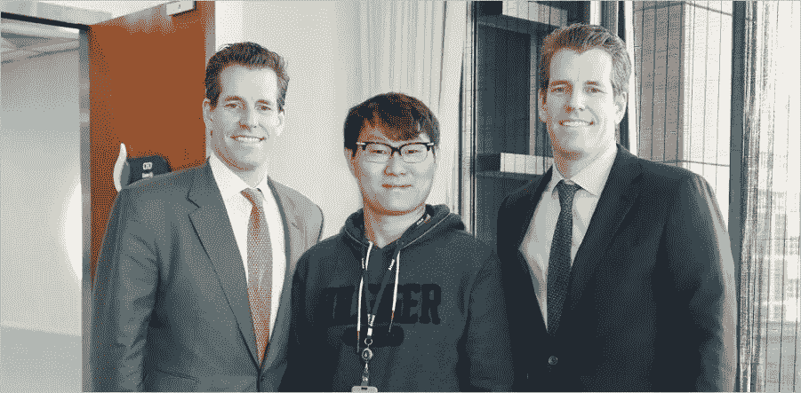

# 火币集团和双子星旨在创造全球加密协同效应？他们能弥合东西方之间的差距吗？

> 原文：<https://medium.com/swlh/huobi-group-and-gemini-aiming-to-create-global-crypto-synergy-d2d46559c81c>

11 月 7 日星期三，火币集团首席执行官李昂和罗宾·周会见了双子星创始人泰勒和卡梅隆·文克莱沃斯。讨论的主题是 stablecoins 的影响、全球战略和管辖权以及弥合东西方密码群体之间差距的潜在选择。Huobi Group 的业务组合中有各种数字资产交易所，如 [Huobi Global](https://bit.ly/2pSN3LO) 和 Huobi Next，而泰勒和卡梅隆·文克莱沃斯经营着位于美国的数字资产交易所 [Gemini](https://gemini.com/) 。

# **泰勒和卡梅隆·文克莱沃斯**

作为比特币的早期采用者，泰勒和卡梅隆·文克莱沃斯因起诉脸书创始人马克·扎克伯格而在美国家喻户晓。文克莱沃斯兄弟声称，他们提出了社交网络的想法，他们的大学室友马克·扎克伯格据称“窃取”了这个想法，并创办了脸书。这场官司激发了 2010 年好莱坞电影《社交网络》的故事情节。泰勒和卡梅隆解决了脸书的诉讼，带走了 6500 万美元。有趣的是，他们将 1100 万美元的结算资金投资到比特币中，当时比特币价值 120 美元，-一枚(2013 年)。

看到比特币和其他加密货币的潜力，兄弟俩成立了 Gemini，这是一家为美国用户服务的数字资产交易所。就在上个月，兄弟俩宣布他们将推出一种基于 ERC20 的稳定币，名为 Gemini Dollar (GUSD)。

Gemini founders Tyler and Cameron Winklevoss and Huobi CEO Leon Li

# **Meetup**

这对文克莱沃斯双胞胎前往北京与火币公司的高管会面，讨论战略和潜在的合作项目。对于 Huobi 来说，这是一个与美国数字资产交易管理团队联系并了解他们如何运营业务的好方法。行业专业人士之间的合作可能会产生新的见解和想法来发展业务。

在采访中，Leon Li 表示,“火币希望在我们和中国之间建立一座密码领域的桥梁。”。Leon Li 还提到:“世界上有很多好的数字资产和产品，尤其是在美国，我们希望将它们带到中国。我们还计划让世界更多地了解火币网在中国的数字和金融服务。火币打算追求火币和双子座之间的进一步合作。

火币今年加快了扩张计划，并试图实现其在数字资产行业建立全球影响力的最终目标。

# **个人观点**

在我看来，火币集团有各种各样的项目和产品，可以在沟通东西方方面有所作为。除了 Huobi Global 和 Huobi NEXT 之外，Huobi 自己的 stablecoin 解决方案 HUSD 也可以在其他交易所推出。HUSD 期权将降低用户从比特币或任何其他加密货币对冲到临时稳定的比特币解决方案的风险。

对于美国的加密货币交易商来说，Huobi OTC 也将是一笔巨大的资产。常规的线下场外交易，对于试图购买或出售大量加密货币的交易者来说，这可能有点可疑。火币提供了一个免费的场外交易平台，买家和卖家可以安全地交易加密场外交易。火币充当双方的中介。买方和卖方达成协议后，资金将被发送。

火币网提供的所有产品和服务都有助于其成为世界上最大的加密货币交易平台。我为火币感到兴奋，并期待看到他们成长得更快。

如果你还没有 Huobi Global 的交易账户，你可以使用[这个链接](https://www.hbg.com/en-us/topic/invited/?invite_code=tfg23)注册。

***免责声明*** *:本文不作为投资建议。这只是我个人对火币的看法。你应该总是做自己的研究#DYOR。火币环球奖励我写这篇文章，鼓励我发表自己的观点*。

如果您喜欢我的文章并希望了解区块链、加密货币项目和新闻，请订阅我的频道: [Medium](/@cultcrypto) 、 [Twitter](https://twitter.com/CryptoShowdown) 和 [Steemit](https://steemit.com/@cryptoshowdown) 。也可以看我在 [LinkedIn](https://www.linkedin.com/in/donjohanson/) 上的文章。

如果你对这篇文章有任何问题，请在下面的评论区评论。如果你觉得这篇文章有帮助，请不要忘记鼓掌。谢谢大家！

**密码摊牌**

#Huobi 和# Gemini #讨论#通向#东方和#西方#桥梁的#协同作用

## 这篇文章发表在 [The Startup](https://medium.com/swlh) 上，这是 Medium 最大的创业刊物，拥有+388，856 名读者。

## 在这里订阅接收[我们的头条新闻](http://growthsupply.com/the-startup-newsletter/)。

