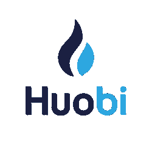
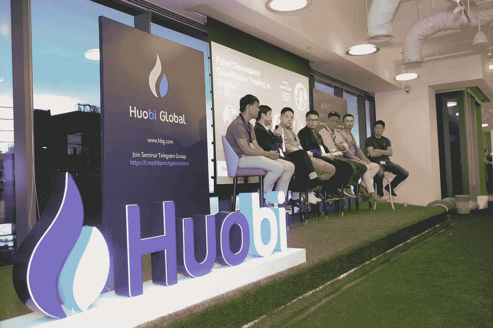
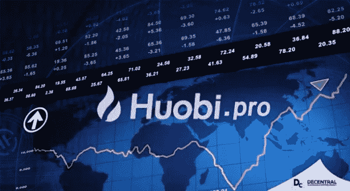

# 火币网举办首届 APAC 峰会，将机构投资者引入加密市场。

> 原文：<https://medium.com/swlh/huobi-holds-the-first-apac-summit-to-usher-in-institutional-investors-into-crypto-markets-bbd13e127df0>

## 密码市场正在快速成熟，因此有必要为机构级交易建立支持基础设施。Huobi 正率先努力，通过让所有利益相关者参与建立一个企业级交易生态系统，涵盖算法交易、风险缓解和监管等方面，来实现这一目标。

Huobi 集团为全球超过 100 万用户提供金融服务，最近累计收益超过 1.2 万亿美元。当之无愧地被描述为数字资源的金融中心，火币集团为其用户提供最终安全可靠的数字资产交易和管理服务。 [Huobi Pro](https://www.huobi.com/en-us/?utm_source=GlobalWriters) 和 Huobi NEXT 是 Huobi 用来提供服务的两家交易所。

此外，作为全球数字资产交易的领导者，Huobi 已经建立了几个不同的针对地区的交易所和平台，为加密交易提供服务，如 Huobi 韩国、Huobi 澳大利亚和美国数字资产交易所 HBUS。就在几天前，Huobi 集团在迪拜推出了 Huobi MENA，这一举措直接符合 Huobi Global 成为加密货币领域全球领导者的意图。Huobi MENA 旨在为 20 多个国家提供服务，旨在通过为银行服务不足和没有银行服务的人群提供银行服务来帮助中东和北非的居民。

最近，火币环球加快了一些重大的全球扩张步伐。一些显著的成就包括构建他们自己的定制区块链，命名为 Huobi 链，为其交换引入 Huobi 令牌，以及提出他们自己的去中心化自治组织(DAO)。

# **首届 APAC 高端投资者峰会**

2018 年 11 月 12 日星期一，Huobi Global 举办了名为 APAC 高端投资者峰会的介绍性研讨会，该活动是 Huobi Global 位于亚洲广场的全新办公室的揭幕仪式。该办事处位于新加坡滨海湾区的中心位置，方便其进入该市的金融和商业热点，并将作为 Huobi Global 的量化、API 和机构加密货币交易总部服务于亚太地区。第一次峰会的成员们参观了新公司的总部。

The Panel at the first ever APAC Prestige Investor Summit

几位行业专家出席了此次活动，发表了他们的观点并分享了独特的市场启示，吸引了一百多位顶级量化交易者。包括的专家中；

*   坎伯兰的业务发展主管贾斯汀·周说
*   约翰·林，Tilde 的创始人兼首席执行官
*   合奏资本首席投资官 Damien Loh

讨论围绕定量交易、API 和机构用户展开。

> “加密货币市场是一个快速成熟的市场，随着这种情况的发生，越来越多的机构投资者将寻求参与其中，”火币网 APAC 董事总经理 Edward Chen 表示。

“向该地区更多的精英投资者开放霍比，与我们的全球战略密切相关，”他补充道。人工智能的作用和加密货币交易中量化交易的使用，以及加密货币市场中的尾部风险是整个活动中讨论的主要话题。此外，还有一个关于 2019 年加密货币市场整体预测前景的小组参与。其他讨论涉及市场监管、ICO 和 TGE 炒作以及加密货币的替代投资策略。

## **火币精英投资者俱乐部介绍**

Huobi Global 利用该活动建立了其威望投资者俱乐部，这是一个专门为量化、机构和其他精英级别的领导人提供邀请的特殊组织。专注的客户经理、API 交易方面的工程支持，以及每月召集小组讨论，讨论与众不同的加密问题。有关这方面的更多信息可以通过发送查询邮件到[这个地址找到。](mailto:institutionalaccount@huobi.com%20%3cinstitutionalaccount@huobi.com%3e;)

峰会在庆祝的气氛中结束，举行了一个颁奖仪式，以表彰和欣赏加密货币交易中一些最聪明的头脑。

# **拿走**

加密货币交易市场最近面临着许多挑战，如诈骗 ICO、不受监管的投资风险和扭曲的波动性。这并没有阻止像 Huobi Global 这样的有远见的组织坚持不懈地致力于新产品和平台的开发并推向市场，他们坚信区块链技术和加密货币的潜力将对我们的生活和工作方式产生积极的影响。Huobi Global 的增长和扩张是加密货币市场表现良好的有力指标，因此，我们看到各机构在实施区块链项目和采用区块链技术方面呈现出良好的势头。

由于信息获取和行业的开放性，加密市场离完全成熟不远了。在用户教育方面已经付出了很多努力，目前政府正在设立加密货币监管机构，立法者起诉不合规的区块链项目，并粉碎诈骗 ICO。火币 APAC 的董事总经理 Edward Chen 称赞这些里程碑式的步骤证明了加密市场正在走向成熟。自 2013 年成立以来，Huobi Global 的强劲增长支柱之一就是他们对客户的关注，就我个人而言，我相信 Huobi 将通过为机构投资者提供基础设施来推动区块链科技和加密货币领域的生态增长。

尽管区块链革命有一个坎坷的开始，但很明显，区块链将通过无信任交易在未来的世界经济中发挥重要作用；在未来，任何现实世界的资产都可以被令牌化，价值可以通过互联网进行交换，就像我们目前共享信息一样容易。

你可以在火币全球 [**这里**](https://www.huobi.br.com/en-us/topic/invited/?invite_code=f5mz3) 注册成为这场革命的一部分，在这里你可以开始交易数字资产，参与一个值得期待的有远见的未来经济模式。

***免责声明:本文不作为投资建议。这是为了提供信息。你应该总是做自己的研究。***

#Huobi # Global #首次举办# Prestige # Investor #峰会
# huo bi # Prestige # Investors # Club
# Edward # Chen、# huo bi 的#董事总经理
# huo bi # Global #针对#机构#投资者的重大#战略

## 这篇文章发表在 [The Startup](https://medium.com/swlh) 上，这是 Medium 最大的创业刊物，拥有+405，714 名读者。

## 在这里订阅接收[我们的头条新闻](http://growthsupply.com/the-startup-newsletter/)。

