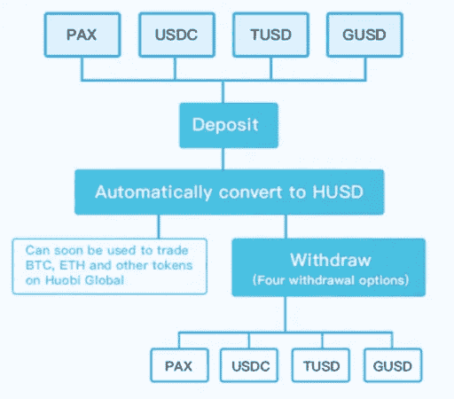
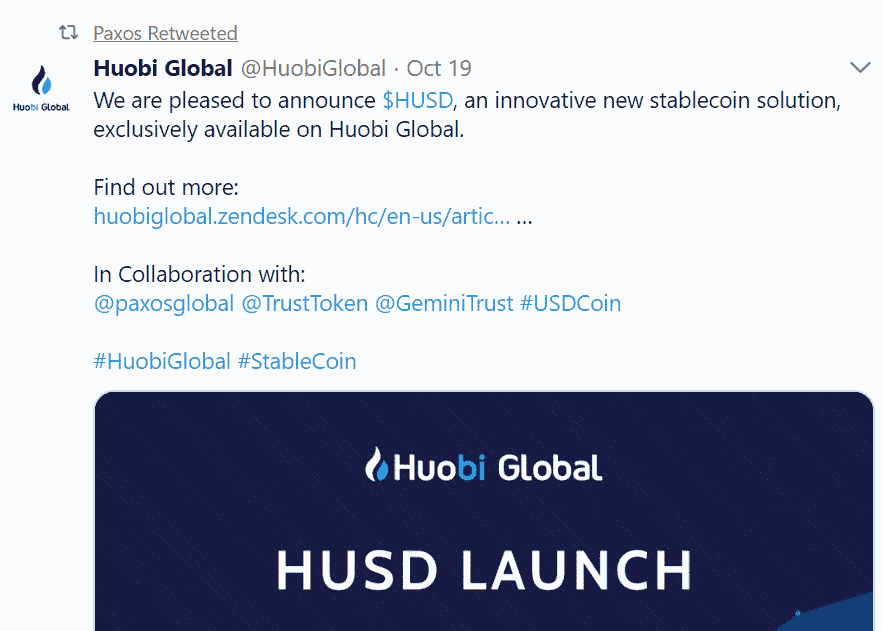
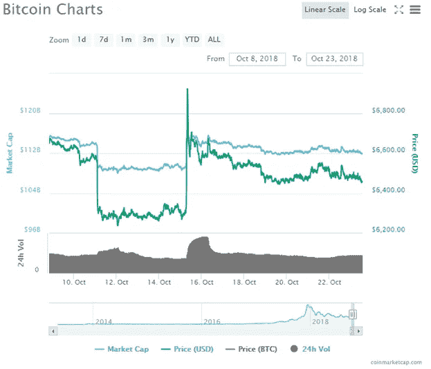

# 霍比推出 Huobi 提供最大稳定性的通用稳定币

> 原文：<https://medium.com/swlh/huobi-introduces-husd-the-universal-stablecoin-providing-maximum-stability-272c9bf24831>

## [火币环球最近宣布推出他们自己的稳定币——HUSD](https://www.huobi.com/?utm_source=GlobalWriters)。这一受欢迎的举措旨在打击充斥市场的几种稳定硬币的复杂性，以及为用户提供一个方便的统一交易平台。


[Source](/@salmanmiah)

W **随着最近席卷市场并导致 BTC 和其他替代硬币水平大幅飙升的系绳(USDT) FUD** ，替代稳定硬币的问题变得前所未有的重要。与此同时，许多新的 stablecoins 正越来越多地进入市场，为用户提供越来越多的对冲风险的选择，安全地知道他们的资金被保留、核实和持续审计，以确保完全的透明度和安全因素，这些因素一直是 Tether 最近不稳定的主要祸害。

# 什么是稳定币？

稳定的货币是一种资产或货币媒介，它具有价格稳定的特性，因此对于特定的交易功能、交易媒介、记账单位、价值储存以及对冲下跌波动风险非常方便。

这些特征对于有目的地使用货币至关重要。目前，包括比特币、以太币和其他加密货币在长期内作为记账单位或价值储存单位并不理想，主要是因为它们经历了通常深刻的价格波动。这阻碍了加密货币的更广泛采用，因为企业等利益相关者不希望在执行加密货币交易时暴露于相关的高风险水平。由于担心购买力的波动，消费者采用也可能很困难。

在一个非常不稳定的环境中，Stablecoins 被视为价格稳定的解决方案。

# HUSD 支持哪些明星？

火币推出 HUSD 使其能够支持四个现有的 stablecoins，**派克斯，GUSD，USDC，**和**TUSD**；这些将在下面进一步探讨:

## **Paxos 标准(PAX)**

今年 9 月发布的 Paxos 标准是由总部位于纽约的区块链公司 Paxos 推出的稳定货币。stablecoin 是完全由美元担保的 stablecoin，由纽约州金融服务部全面监管和批准。这是一个 ERC-20 代币，用户可以直接从他们的网站上购买和兑换 PAX 代币[,与 1:1 美元挂钩。](https://www.paxos.com/) Paxos 在最短的时间内最广泛地采用了最新的 stablecoins，币安、OKEx、Kucoin 和 Gate.io 等交易所已经将其上市。

## **TrueUSD (TUSD)**

TrustToken 是一个有点新的平台，旨在使令牌化的资产可用。TrueUSD (TUSD)，与美元 1:1 挂钩，是项目第一个稳定币，也是平台的旗舰令牌。 [TrustToken 网站声明](https://www.trusttoken.com/trueusd/)*“true USD 是一种由美元支持的 ERC 20 稳定币，完全抵押，受法律保护，并由第三方透明验证。”* TrueUSD 使用第三方托管账户来支持 TrustTokens 令牌化资产的运作。一旦客户完成 KYC 和反洗钱要求，他们就可以购买 TUSD。首先，美元必须被电汇到一个托管账户，之后同样数量的 TUSD 被铸造。当其他代币变得可用时，购买者可以决定他们想要购买哪些代币。

## **双子座美元(GUSD)**

[由文克莱沃斯双胞胎运营的双子座加密货币交易所](https://gemini.com/dollar/)宣布，双子座美元(GUSD)是一种 ERC-20 稳定币，允许用户通过以太坊网络进行交易。对于不同的交易对，GUSD 可以在其他交易所兑换成其他加密货币。GUSD 与美元严格挂钩，可以通过 Gemini 赎回。值得注意的是，纽约金融服务局(NYDFS)已经审核并批准了双子美元。为确保安全，Gemini 将在道富银行持有美元资产支持 stablecoin，并将通过联邦存款保险公司(FDIC)投保。独立审计师 BPM accounting 还将负责对公司的持股进行定期月度审计。

## **美元硬币(USDC)**

[由 Circle group 和 CENTRE open source consortium](https://www.circle.com/en-gb/usdc) 运营的 USD Coin 是一种 1:1 美元支持的稳定币，目前在 Poloniex、OKEx 等各种交易所运营。硬币作为一种方式来表征美元，以允许无缝转移区块链的价值。

# **那么 HUSD 是什么？**

为了确保为用户提供最大的效率和便利，[火币环球推出火币 HUSD](https://www.huobi.com/?utm_source=GlobalWriters) -他们的统一平台 stablecoin 解决方案。HUSD 允许用户在上面解释的任何一家银行存款和取款。

Huobi announcing their new stablecoin | [Source](https://twitter.com/HuobiGlobal/status/1053281041195032578)

*“众所周知，社区的关注推动了整个加密领域对稳定密码的强烈需求，”*火币集团创始人兼首席执行官 Leon Li 表示。

[据火币网](https://huobiglobal.zendesk.com/hc/en-us/articles/360000170601-Announcement-on-the-Launch-of-HUSD-solution-on-Huobi-Global)报道，HUSD 是一个针对多个稳定点的集成解决方案；它有助于:

1.  *无需在各种稳定的图标中进行选择*
2.  *在稳定的图标之间切换时节省成本。*

该网站进一步指出，“*当你存入任何种类的稳定币时，它们将在你的账户中显示为 HUSD。你可以提取任何一种稳定的硬币；当某一特定稳定币的金额不足以支付您的账户余额时，您可以提取您在中有多余余额的其他稳定币。”*

***“比如*** *当你存入 1 个 PAX 时，在你的账户上显示为 1 个 HUSD，你可以提取 1 个 TUSD(不含区块链上的交易手续费)。”*



The structure of HUSD | [Source](https://huobiblog.com/husd-a-new-stablecoin-solution/)

# **阳性反应**

可以理解的是，这个消息在加密社区获得了非常积极的反应，所有四个 stablecoins 都通过他们的 twitter 账户转发了官方声明。

其他著名的加密组织也迅速分享了这一消息，包括:

## 帕克斯



Paxos showing their excitement | [Source](https://twitter.com/PaxosGlobal)

## **硬币电报**

## **ICO 掉落**

## **封锁区**

# **系绳假新闻引发市场动荡**

在加密货币这样一个波动性极大的市场中，任何积极的消息或 FUD 都可能导致价格大幅波动，因此，严重的亏损或盈利取决于个人交易的方式。最近假的系绳(USDT)新闻引起了投资者的恐慌，导致许多人抛售他们的系绳，转而购买其他加密货币和稳定货币。由此导致的抛售导致比特币和替代比特币价格飙升，由于 [Tether 的价格一度跌至 0.87 美元，比特币在 Bitfinex 上的交易溢价为 7k 美元。](https://mashable.com/article/stablecoin-cryptocurrency-tether-price-drop/?europe=true)



The Tether dump caused a huge surge in Bitcoin price | [Source](https://coinmarketcap.com/currencies/bitcoin/)

一篇在秘密社交和媒体圈子里发表的关于币安将 Tether 除名的虚假文章进一步加剧了 Tether 的倾销。来自币安的官方博客贴出标签，称系绳是一个*【骗局】*，所有与 USDT 相关的配对将于 10 月 16 日被除名。

This type of ‘fake; news further exacerbated the ‘popular perception’ of Tether | [Source](https://twitter.com/boxmining/status/1051752620803538944)

币安首席执行官赵昌鹏在推特上简单评论了 FUD:

The authenticity of the FUD was shit down by CZ | [Source](https://twitter.com/cz_binance/status/1051749419312275456)

Bitfinex fiat 存款问题进一步火上浇油。该交易所在那周的周一宣布，某些客户的法定存款将被停止。[在一篇博文](/bitfinex/fiat-deposit-update-october-15th-2018-18ddd276c3fd)中，他们写道，10 月 11 日，个人客户在 JYP、欧元、英镑和美元的菲亚特存款已经停止。他们去澄清这个问题只影响了一部分人。

Bitfinex deposit notice | [Source](https://twitter.com/bitfinex/status/1051750465782906880)

再加上早先宣布泰瑟的主要银行母公司[诺布尔银行正面临破产问题](https://cryptovest.com/news/tether-usdt-grappling-with-allegations-of-noble-bank-insolvency/)，这些新闻事件的结合足以导致泰瑟对不稳定稳定货币的普遍接受，在这种货币中，投资者肯定会失去他们的资金，因为他们预计他们将继续持有储备。抛售还导致 PAX 和 TUSD 等稳定币在币安等交易所的交易溢价为 1.2 美元，这表明投资者摆脱束缚，进入新的稳定币是多么重要。

作为一名交易员，系绳抛售让我大吃一惊，并导致了一些损失。当时，我在以太坊对冲风险，并在以太坊空头头寸进行交易。然而，由于 FUD 的系绳和恐慌性抛售，市场暴涨，亏本挤压了我的空头头寸。如果我决定参加任何其他的赛马币，我将被要求为赛马币支付一笔可观的额外费用，而我不愿意这样做。

FUD 的限制以及随之而来的市场暴涨和资金流入新的稳定债券，显示了投资者对稳定债券的明显需求，除了限制之外，他们还可以在稳定债券中对冲风险。这就是为什么 HUSD 的推出对投资者如此有利，而不是有一个稳定的硬币的选择；他们现在有四个人的安全感。

# **HUSD 发布的完整时间表**

[火币厂](https://huobiglobal.zendesk.com/hc/en-us/articles/360000170601-Announcement-on-the-Launch-of-HUSD-solution-on-Huobi-Global)目前的进度为:

1.  *PAX、TUSD、USDC 和 GUSD 的存款服务将于 10 月 19 日 16:00(GMT+8)开始。*
2.  *USDT/HUSD 交易对将于 10 月 22 日上午 10:00(GMT+8)在 Huobi Global 上市。*
3.  *HUSD 在火币 OTC 和火币环球之间的转账服务将于 10 月 22 日上午 10:00(GMT+8)开始，HUSD 在火币 OTC 的交易服务将于 10 月 23 日上午 10:00(GMT+8)开始。*
4.  *Huobi Global 将于 10 月 22 日 18:00(GMT+8)列出 BTC/HUSD 交易对，并将根据情况需要列出 ETH/HUSD 交易对。*
5.  *火币 App 将支持 USDT/HUSD 的交易服务，HUSD 的存取款服务将在下一个 App 版本中推出。*
6.  *火币环球将于 10 月 29 日 18:00(GMT+8)开始 stablecoins 的提款服务，您可以在 PAX、TUSD、USDC 和 GUSD 之间提取任意硬币。具体时间和日期将另行通知。*

# **个人点评**

我个人认为，HUSD 的推出对投资者来说是一个有益的举措。正如系绳事件所示，stablecoins 将在加密货币领域变得越来越重要，在一个平台下拥有多种选择完全是积极的。即使人们要忽略最近的泰瑟 FUD 公司，也有一段时间对泰瑟公司进行了严格的审查，涉及他们是否有能力拥有实际的 1:1 美元储备，以及他们未能得到独立公司的全面审计。

当然会有顾虑。正如 [@LindaCrypto](/@LindaCrypto/huobi-global-presents-its-new-universal-stablecoin-solution-husd-430a6047c372) 所说，套利交易将是一个隐忧。在系绳抛售期间，HUSD 支持的四只稳定债券都以大幅溢价交易。如果用户在提取不同的 HUSD 稳定币时存入的稳定币远低于它们的价值，这对火币来说可能是非常昂贵的。

一些投资者的另一个担忧是，他们认为 stablecoins 是托管银行的另一种形式，也是现有中央银行系统的其他特征。通过与另一项资产(美元)挂钩，这些稳定资产最终面临基础资产本身的风险——这主要是通过对资产进行令牌化，为资产增加了第二层。

然而，总的来说，美元波动扰乱稳定的联系汇率的可能性很小，大多数投资者不会太担心。引入 HUSD 是一个很好的举措，stablecoins 的流行将对 [Huobi 社区产生积极影响。](https://www.huobi.com/?utm_source=GlobalWriters)

***#Huobi，# TheUniversalStablecoin，#HuobiLaunches: HUSD，# Huobi USD—我的评论在***

```
***Disclaimer:*** *Please only take this information as my* ***OWN*** *opinion and should not be regarded as financial advice in any situation. Please remember to* ***DYOR*** *before making any decisions.*
```

♂️你好，我叫萨尔。*如果你觉得这篇文章有用，并想查看我的其他作品，请务必鼓掌并关注我的* [*中型*](/@salmanmiah) *和* [*LinkedIn！*](https://linkedin.com/in/salman-miah-57aa90a0/) *😎*

[](https://medium.com/swlh)

## 这篇文章发表在 [The Startup](https://medium.com/swlh) 上，这是 Medium 最大的创业刊物，有+ 381，088 人关注。

## 在这里订阅接收[我们的头条新闻](http://growthsupply.com/the-startup-newsletter/)。

[](https://medium.com/swlh)