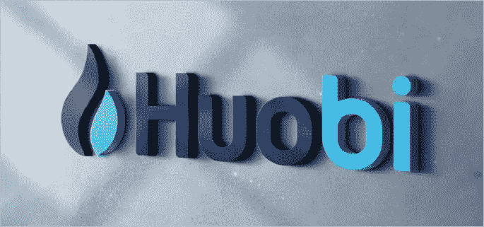
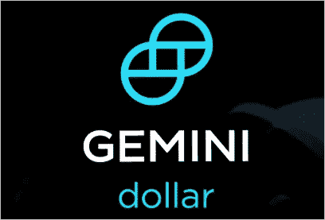
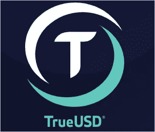
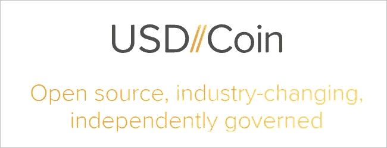

# 在系绳 FUD 达到一个新的顶峰后的一天，火币在其交易所列出了 4 种新的稳定硬币

> 原文：<https://medium.com/swlh/huobi-lists-4-new-stablecoins-on-its-exchange-one-day-after-tether-fud-reached-a-new-pinnacle-888f784ae3c6>

T **他的**周市值最大的稳定货币 Tether (USDT)再次受到加密货币行业的严格审查。谣言开始浮出水面，数字资产交易所币安将退市稳定币。除了这些谣言，系绳撤回停止，导致更多的戏剧。在过去的几个月里，由于缺乏透明度和无法提供对其财务状况的见解，Tether 已经赢得了更多的反对者。各种加密货币交易商正在寻找新的稳定货币，这些货币将为对冲比特币和替代币或交易比特币提供安全避难所。

# **稳定币到底是什么？**

稳定币是一种与稳定资产挂钩的加密货币，如黄金或法定货币。或者是一个集中的权威机构或者是一个分散的自治组织(DAO)正在发布令牌。

# **上市公告**

数字资产交易所 [Huobi Global](https://bit.ly/2pSN3LO) 今天宣布将通过[向交易所增加 4 个稳定币](https://huobiglobal.zendesk.com/hc/en-us/articles/360000168681-PAX-TUSD-USDC-and-GUSD-Will-Be-Listed-on-Huobi-Global)来增加其稳定币收藏。他们这样做是为了给用户提供更多选择，让他们在交易时选择一种稳定的硬币，作为对比特币或替代硬币的临时对冲。Huobi Global 的最新产品将于 10 月 19 日发布。

以下是即将在 Huobi Global 上市的 4 个 stablecoin 项目的概要。

# 双子座的美元(GUSD)

Gemini Dollar 由美国数字资产交易所 Gemini 的创始人创建。泰勒和卡梅隆·文克莱沃斯是知名的比特币亿万富翁，他们的目标是颠覆加密货币行业。基于 ERC20 的令牌 GUSD 由纽约州金融服务局监管。等量的流通 GUSD 代币将被存入道富银行信托公司的正式双子美元银行账户。每月将进行审计，以保证其 1:1 挂钩。

要了解更多关于双子座美元的信息，请访问他们的官方网站:[https://gemini.com/dollar/](https://gemini.com/dollar/)

# [Paxos 标准令牌](https://www.paxos.com/standard/) (PAX)

另一个由纽约州金融服务部批准和监管的令牌是 Paxos。新的数字美元 PAX 也与美元 1:1 抵押。就像它的稳定硬币的流通数量一样，PAX 也有一个相应的银行账户，在其余额中持有相当于流通 PAX 代币的美元。Paxos 已经聘请了领先的审计公司 [Withum](https://www.withum.com/) 执行月度审计，为 Paxos 项目提供透明度。

要了解更多关于 Paxos 标准令牌的信息，请访问他们的官方网站:【https://www.paxos.com/ 

# [TrueUSD](https://www.trusttoken.com/) (TUSD)

Trust Token 的 TrueUSD 是一种由美元支持的稳定货币。这是第一种由美国政府正式监管的稳定币。一些知名的专业投资者，如 A16Zcrypto、ZhenFund 和斯坦福 Startx Fund 支持该项目。Cohen & Co 是负责提供 TrueUSD 透明度报告的指定审计公司。

要了解更多关于 TrueUSD 的信息，请访问他们的官方网站:[https://www.trusttoken.com/](https://www.trusttoken.com/)

# [美元//硬币](https://www.centre.io/) (USDC)

USDCoin 项目背后是一家名为 Circle 的大型科技初创公司。几个月前，当 Circle 以 4 亿美元收购数字资产交易所 Poloniex 时，他们成为了头条新闻。除了 Poloniex，他们还是 Circle Pay(汇款市场的支付提供商)和 Circle Trade (OTC 加密交易平台)的所有者。就在最近，他们的投资组合中增加了稳定的美元硬币。USDCoin 由 [centre.io](https://www.centre.io/) 的开源框架提供支持。

想了解更多关于 USD//Coin 的信息，请访问他们的官方网站:[https://www.centre.io/](https://www.centre.io/)

# **结束语**

我相信在交换中加入 4 个 stablecoins 是一个非常明智的决定。如果 Tether 真的发生故障并被摧毁，至少 exchange 用户将有其他选择，除了回到比特币或替代币。我对他们添加的特定令牌也很有信心，积极的一面是，其中三个令牌已被美国政府正式监管。

不利的一面是，稳定债券的基本面假设它们是稳定的。本周早些时候，Tether 的价格交易为每件 0.85 美元，TUSD 达到 1.06 美元，GUSD 交易为 1.16 美元，此时有人可能会说，与 1 TUSD 等于 1 美元或 1 GUSD 等于 1 美元的比率相比，这并不完全稳定。过去的经验告诉我们，一些稳定的货币(如美元和钢币)无法提供持续稳定的价格。

我们(Huobi Global)通过向[institution@huobi.com](mailto:instituation@huobi.com)发送主题为“Stablecoin Cooperation”的电子邮件，邀请机构交易商、承兑交易商和 OTC 市场直接联系 Huobi 进行合作。

如果你还没有火币环球的交易账户，你可以通过[这个链接](https://www.hbg.com/en-us/topic/invited/?invite_code=tfg23)注册。

**#火币增加 4 #稳定币，#火币增加 sPaxos，#美元币，#双子星币，火币—#增加#稳定币#选择**

***免责声明*** *:本文无意作为投资建议。这只是我个人对火币和提到的四个稳定的硬币的看法。你应该总是做自己的研究#DYOR。火币环球激励我写这篇文章，并鼓励我发表自己的观点*。

如果您喜欢我的文章并希望了解区块链、加密货币项目和新闻，请订阅我的频道: [Medium](/@cultcrypto) 、 [Twitter](https://twitter.com/CryptoShowdown) 和 [Steemit](https://steemit.com/@cryptoshowdown) 。也可以看我在 [LinkedIn](https://www.linkedin.com/in/donjohanson/) 上的文章。

如果你对这篇文章有任何问题，请在下面的评论区评论。如果你觉得这篇文章有帮助，请不要忘记鼓掌。谢谢大家！

**秘密摊牌**

## 这篇文章发表在 [The Startup](https://medium.com/swlh) 上，这是 Medium 最大的创业刊物，拥有+ 379，528 名读者。

## 在这里订阅接收[我们的头条新闻](http://growthsupply.com/the-startup-newsletter/)。

