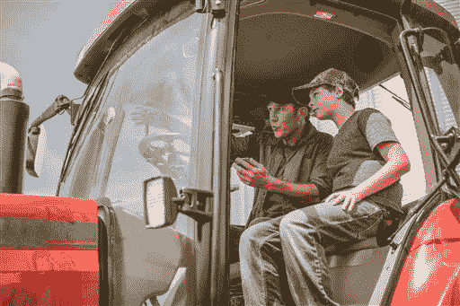

# 混合智能:采用人工智能的最快途径

> 原文：<https://medium.com/swlh/hybrid-intelligence-path-to-ai-adoption-453379f9d9a5>

我抓起电话，告诉我的助手，“我正在这个地区寻找一个有乐高商店、丝芙兰、正义和科颜氏的商场。而且，理想的情况是，它应该靠近一张床、一个浴室等等，因为我在路上也必须经过那里。请不要花超过 30 分钟来搜索它。”这是圣诞节前的几天，我的大部分时间都和家人在一起，我不想花无数的时间在我的电脑上研究。我想脱离现实，活在当下。所以我等了几分钟，当我的助手带着人性化的热情回应回来时，我松了一口气:“杰西卡，Aventura 购物中心有所有这些商店。床、浴室和其他设施就在街对面。巴达兵！”

我的助手既不是人也不是机器人。这是两者的结合。

我们生活在人工智能崛起的时代，它可以操作我们的冰箱、电话、电子邮件，甚至可以为我们打扫公寓。它出现在报纸、杂志、社交媒体上，甚至最不情愿的人也知道它会一直存在。

2013 年，它在斯派克·琼斯的电影《她》中实现了现实主义的好莱坞突破。其中一名男子爱上了它的新智能操作系统，据报道，该系统学会了如何感受并发展了一种互惠的浪漫关系。主角与操作系统的互动如此顺畅，以至于他不会因为来自她的操作系统萨曼莎不是人类而感到不安。

人工智能正在慢慢潜入我们的生活。我们看到媒体宣传人工智能并展示他们如何使用它，企业对人工智能的投资比以往任何时候都多，电影展示了角色在日常生活中如何与人工智能互动，然而人类对人工智能的采用却滞后了。最近的一项研究发现，虽然消费者对人工智能有了更多的了解，但只有 12%的受访消费者认为像亚马逊 Alexa 这样的人工智能助手有用。家庭自动化和工作场所机器人的接受程度也较低，分别只有 5.5%和 1.0%的受访者表示在日常生活中经常使用这些先进技术。”

有几个方面需要考虑:

# 对一些人来说是快速技术，对另一些人来说是教育

人工智能发展的速度快于采用率，这并不奇怪，因为科技行业继续创新和开发产品和服务，然后他们寻求客户和用户使用它们。鉴于这一过程的性质，最终用户的采用会有一个自然的滞后期。对于高科技企业来说，创新需求已经成为重中之重。其他一些企业在拥抱和采用新技术时要谨慎和保守得多，因为这需要运营和教育方面的变化。

Source: McKinsey Global Institute, Artificial Intelligence, The Next Digital Frontier

对于像你我这样的人来说，我们已经了解到它*可能看起来像这样:*

Roger’s bell curve

我们有掌握人工智能新技术脉搏的创新者，然后我们有不同程度的教育差距。大众市场仍然对他们目前的生活方式和他们使用的产品感到满意。一些产品，如 Siri，在生命周期中得到了更广泛的采用，成为我们日常生活的一部分。其他人工智能产品难以通过早期采用者，没有机会成为我们可信赖的日常伴侣。在某种程度上，企业和政府有责任让大多数人进入拥抱新技术的舒适区。

企业面临的战斗与其说是一个技术问题，不如说是一个人工智能感知问题。将人工智能产品或服务带入一个人的生活可能会感觉像被扔进游泳池的深水区，不知道如何游泳。利害攸关的考虑不仅仅是用一种产品替代另一种产品。它影响一个人与周围环境互动的方式，将他们现有的习惯转变为新的习惯，以及他们如何看待自己在社交圈中的地位变化。换句话说，它引导他们接受一种新的生活方式。

# 人工智能的普及。

自 80 年代初以来，科幻电影作为一种类型一直以大票房电影主导着出版和娱乐业。既然千禧一代已经带回了[怀旧经济](https://qz.com/1108122/how-hollywood-manipulates-you-using-your-childhood-memories/)，我们正看到《银翼杀手》和《星球大战》的重新开机显示了我们最喜欢的角色如何与人工智能互动。相应地，他们如何发展深厚的情感依恋，或在日常生活中通过使用人工智能找到功能性的安慰。

Source: Warner Bros.

对于粉丝观众和读者来说，更接近科幻世界的感觉似乎更接近现实。当我们走出剧院或从书本中抬起头时，就会感觉到这种脱节，并提醒我们当前的状态不是科幻世界的一部分，而是更接近于一个混合的世界。

# 保存传统价值观

我们的现代世界处于不断变化的状态，对一些人来说，不愿改变和他们对固定身份的坚定信念，与他们接触新技术的潜力相冲突。就是“我想在新 iPhone 上测试 face ID 功能，但我不想在无人驾驶汽车里”的心态。我们可以控制自己做出的每一个决定，这是有争议的。我们拥有自由意志和技能，这些都是上一代人传给我们的，或者是从我们崇拜的人那里学到的。这些经历对于塑造我们今天的身份非常有价值。

Source: AP Images

事实上，直到现在，我们大部分时间都在学习提高工作效率的技能。我们的一些姓氏象征着我们祖先拥有的技能。现在，随着按需经济的出现，我们不得不重新审视根植于我们行为中的努力启发法，并试图改变我们与外部世界互动的方式。

通过拥抱人工智能，我们正在将我们的部分自主意识交给一台机器，这可能会让我们感到无助和不熟练。在伯明翰大学最近的一项研究中，以及在 T2 更早的研究中，自由和自主是幸福、总体幸福感和工作满意度的头号预测指标。似乎除了营销人工智能产品，企业还可以从密切关注它对其广大用户的潜在影响中受益。

# 改变习惯并不容易

你上一次因为别人告诉你而主动改变习惯是什么时候？它要么被当作建议，要么被当作批评，这取决于你的心态。另外，采取行动改变习惯需要很强的意志力和动力。

品牌和广告经常描绘完美世界中理想用户的形象，这在两个关键方面未能与观众联系起来:为什么和难度有多大。这就像在打开一份礼物后经历认知偏差，期望它正是你想要的，但随后你注意到它不是你想要的版本，也没有明确的说明。

从一个强有力的“为什么”开始，对于任何活动或新业务来说都是必不可少的，以加强其对潜在客户的价值。抛开理性不谈，如果适应的风险太高，需要太多的步骤和新的术语来学习，那么，为什么要这么麻烦呢。为了提高采用率，手头的任务需要被认为是可实现的，如果它被你的观众的社交圈接受，那会有所帮助。

# 内部团队也在这方面失败了

Source: APImages/Fotolia

即使是自上而下决策结构繁重的企业，有时也看不到营销人员和操作人员也是人，如果他们不理解人工智能技术，也不适应人工智能技术，那么出错的可能性就会迅速飙升。

营销人员和其他人未能看到他们部门泡沫之外的东西，也没有找到理由来验证他们的想法，以部署可能最终令最终用户震惊的怪异的目标信息。

# 好吧，那么混合智能呢

人工智能将继续存在，但停下来考虑大众市场还没有为自主产品做好准备可能是明智的。也许在采用人工智能的道路上需要后退一步来考虑混合智能的模型。我们站在没有辅助人工智能技术和在日常生活中拥有完全人工智能技术的中间地带。

以下是我的理由:

1.  它是新的，舒适的，不太不舒服
2.  它有明显的人的因素，人们可以联系起来
3.  风险低，收益高
4.  用户感觉一切尽在掌握
5.  混合环境允许更有同理心的互动
6.  它处理增强的记忆——你与它互动得越多，它就越能识别你的偏好
7.  公司可以根据个人对技术的舒适使用提供增量选项或升级——完全人工智能的采用可能并不适合所有人

硅谷的人工智能企业正在用混合智能导航人工智能和人类智能之间的道路。他们的商业模式在过程的每一步都融入了人类，但使用深度学习和自然语言处理技术来使他们的人工智能系统更加智能。虽然人工智能领域继续发展，超级机器和企业创新的竞赛激增，但仍有机会探索具有人类意识、感觉更像伴侣并在操作中集成真实人类的系统。

喜欢这个故事吗？通过电子邮件获取更多类似的内容——关于应用科学、市场营销、设计和技术的文章和想法。

## 这篇文章发表在[《创业](https://medium.com/swlh)》上，这是 Medium 最大的创业刊物，有 283，454+人关注。

## 订阅接收[我们的头条新闻](http://growthsupply.com/the-startup-newsletter/)。

