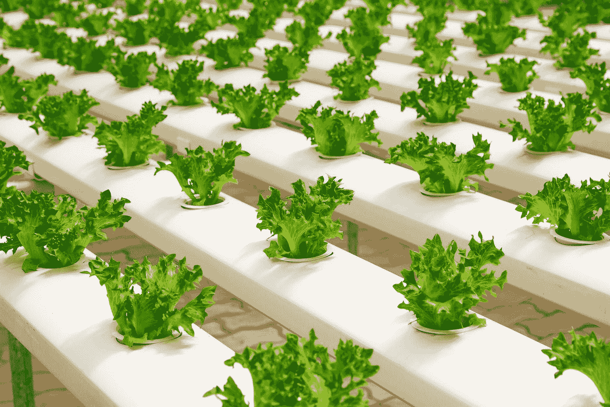
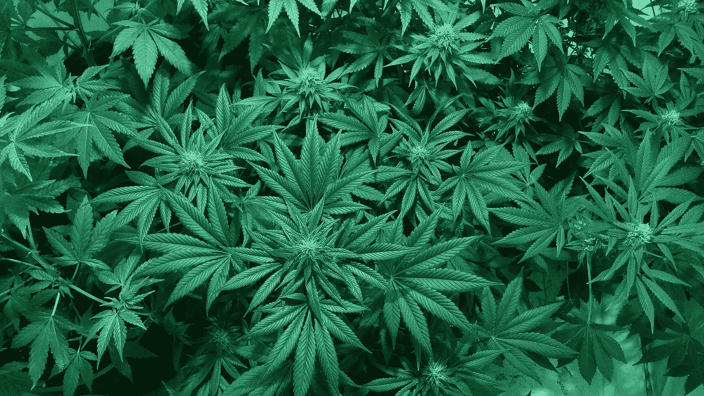

# 水培园艺:大麻种植创业的未来

> 原文：<https://medium.com/swlh/hydroponic-gardening-cannabis-cultivation-startups-39ac1bae0994>

毫无疑问，大麻产业，尤其是大麻二酚(CBD)部分，正在成为当今最大和最有利可图的市场之一。

据《企业家》报道，由于持续的市场接受度和看涨的营销努力，CBD 在未来四年内将朝着 10 亿美元的市场资本总额迈进。事实上，到 2022 年，CBD 部分预计将增长到 220 亿美元的潜在支出。

这就是为什么越来越多的玩家想要参与其中并不奇怪。尤其是在加拿大，这个 G7 国家中第一个将娱乐性使用大麻合法化的国家，一旦 10 月 17 日大麻合法化，供应商们已经在争相满足市场需求。这包括 CBD 产品或 CBD 油，它被吹捧为具有许多医疗益处，包括控制癫痫发作、治疗失眠、温和的抗抑郁药以及作为慢性疾病的止痛药。

然而，随着 CBD 的普及，人们开始害怕接触低等级的大麻。CBD 可以来源于大麻或大麻植物。大麻衍生的 CBD 油通常比大麻更受欢迎，因为它的四氢大麻酚(THC)含量低，这种化合物与大麻的精神作用有关。这使得大麻制成的 CBD 在美国大部分地区合法。

*Could hydroponics gardening be the solution to low-grade cannabis plants? (*[*Source*](https://pixabay.com/en/marijuana-cannabis-medical-marijuana-1114713/)*)*

# **大麻生长挑战**

由于对 CBD 的需求，一些农场已经决定种植大麻，但并非没有挑战。据[大麻商业时报](http://www.cannabisbusinesstimes.com/article/where-have-all-the-flowers-gone/)报道，自从今年年初加利福尼亚州开放受管制大麻市场以来，高质量 sinsemilla 花的供应已经下降，许多农场地区实际上已经干涸。

加州被认为是最大的大麻生产地之一，尤其是在夏季该地区经历野火时，会遇到这个问题。由于植物生长在室外，秋天收获的花经常被煤烟污染。

另一个问题是目前决定大麻植物是否是高标准的监管程序。除了严格的测试实际上拒绝了希望向 CBD 公司供货的有执照的种植者，许多人实际上没有通过确定生物和化学污染物的测试。

一些种植者因为可能的致病真菌和细菌而失败，而一些没有通过农业化学物质的测试。据大麻专家称，加州农药管理局已经禁止了一些未经批准用于商业大麻植物的农用化学品(例如:农药)。

# **可能的解决方案**

种植大麻的一个非常可能的解决方案是应用水培园艺技术，这是全年种植新鲜农产品的最佳方式之一。根据[园艺知识](https://www.gardeningknowhow.com/special/containers/hydroponic-gardening-indoors.htm)的说法，水培园艺是在包括室内在内的较小空间种植植物的绝佳选择。

这种技术与传统耕作的区别在于，水培园艺不使用土壤，因此根部不需要不断寻找生长所需的必要营养。它们所需的养分被直接提供，以保持植物全年充足。一个适宜居住和成功的水培花园需要的是光线、合适的温度和 ph 值，当然，还有必要的养分和水。

一家公司目前正在使用这种方法种植大麻植物(并取得了令人印象深刻的成功)，这就是[FSD Pharma](http://fsdpharma.com)([CNSX:HUGE](https://finance.yahoo.com/quote/HUGE.CN?p=HUGE.CN&.tsrc=fin-srch)， [OTCMKTS: FSDDF](https://finance.yahoo.com/quote/FSDDF?p=FSDDF&.tsrc=fin-srch) )。FSD Pharma 是一家在加拿大证券交易所上市的公司，经营着最大的大麻种植和加工区之一。

其位于安大略省科伯格的前卡夫食品生产厂位于多伦多附近，地理位置优越，占地面积超过 3，800，000 平方米。制成种植和加工活动。通过这一举措，FSD Pharma 打算针对大麻产业的所有法律方面，包括种植、加工、制造、提取和研发。

FSD Pharma 通过其全资子公司 FV Pharma Inc .持有 ACMPR 许可证，根据《医用大麻获取条例》(ACMPR)种植大麻。该公司经营着最先进的室内水培生产设施，确保为大规模药物级大麻生产提供最高质量的受控环境。

随着加拿大娱乐性大麻合法化的到来，FSD Pharma 将专注于医用大麻，因为随着更多公司预计进入加拿大娱乐性大麻市场，面向医疗用途的高等级大麻材料可能会出现短缺。通过这样做，医用和娱乐用大麻的价格之间可能会有很大的溢价，让潜在的投资者有机会占领一个更具排他性的市场。

FSD Pharma 的水培农场准备全年供应大麻植物的需求。

## 这篇文章发表在 [The Startup](https://medium.com/swlh) 上，这是 Medium 最大的创业刊物，有+ 379，528 人关注。

## 订阅接收[我们的头条](http://growthsupply.com/the-startup-newsletter/)。

