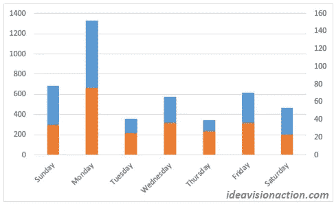
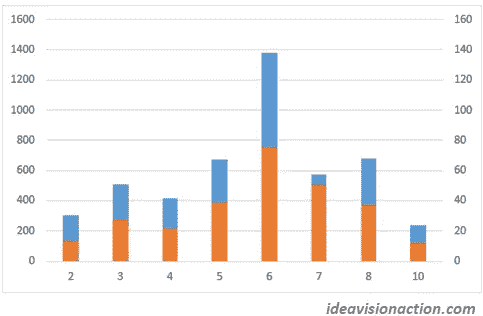
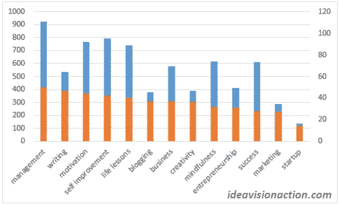

# 我分析了影响我中等状态的七个因素。这是我发现的。

> 原文：<https://medium.com/swlh/i-analyzed-seven-factors-that-affect-my-medium-stats-this-is-what-i-found-f60fb0c4b3b3>

[rawpixel/pixabay](https://pixabay.com/en/office-business-paper-document-3295556/)

Medium 为我们提供了每个帖子的三个统计数据，浏览量、阅读量和粉丝数。除此之外，阅读率似乎没有提供任何额外的信息。

你可以用这三个属性做很多事情。你可以从他们身上学到很多东西。过去十天我一直在分析这些数据。我发表了一系列关于我从他们身上学到的经验的帖子。这是本系列的第十篇文章。

我对观点和粉丝的解读如下。浏览量显示了一篇文章在吸引读者方面有多成功。粉丝数量显示了一篇文章在满足读者方面有多成功。

我把阅读量看作是观点和粉丝之间的桥梁。阅读量值得自己分析。我将来会这么做，我会出版我的课程。这个帖子是关于观点和粉丝的。

为了分析我的统计数据，我用[这个脚本](https://gist.github.com/epintos/4bea8d70c9f52a47170f8cd66ddecfa1)(第三方链接和脚本)下载了它们。请自担风险使用)。

我做了一些额外的手工工作，比如给帖子添加出版物和标签。我写了一个小程序来避免一些手工操作。如果你不会编程，你可以手工做同样的工作，在 Excel 中复制粘贴。

为了给你一个概念，在我进行这个分析的时候，我的中等配置文件中有超过 140 个帖子。

**哪些因素影响中等统计？**

为了优化我的中等属性，我需要知道哪些因素会影响它们。这是我分析的因素列表。如果你认为可能有其他因素影响中等状态，请在评论中告诉我。

*   文章发表的出版物
*   文章的标题(*)
*   帖子长度(*)
*   帖子的受欢迎程度，包括可读性
*   帖子在一周中的哪一天发布(*)
*   帖子的标签(*)
*   帖子的特色图片(*)

与其他文章相比，我发表在创业刊物上的文章获得了 10 倍的浏览量。为了减去该因素的影响，在分析标有(*)的因素时，我只分析了发布在启动出版物中的帖子。

**发表文章发表在**

根据我的统计，在一个主要的媒体出版物上发表的文章，[创业](https://medium.com/swlh)，对我的看法和粉丝产生了最大的改变。它让我的浏览量增加了 10 倍，粉丝增加了 4 倍。

**帖子的标题**

在主流媒体上发表会极大地提升你的观点和粉丝，但为什么就此止步呢？

你仍然可以通过想出强有力的和违反直觉的标题来优化你的属性。文章的标题对观点有很大的影响。我发表了三篇关于写有影响力的标题的文章。

**帖子的受欢迎程度**

我用粉丝与浏览量的比率来衡量帖子的受欢迎程度。使帖子不太受欢迎的因素如下:

*   标题和内容不一致
*   难以置信的说法
*   不受目标受众欢迎的论点
*   可读性低

我解释了每个因素的细节，并在帖子[中给出了几个例子，这是我从我最讨厌的博客帖子](https://ideavisionaction.com/blogging/this-is-what-i-learned-from-my-most-hated-blog-posts/)中了解到的。

我使用[海明威应用](http://www.hemingwayapp.com/)来衡量和提高我的文章的可读性。你可以在本帖的[中看到详细内容和示例截图。](https://ideavisionaction.com/blogging/the-tools-i-use-to-capture-and-organize-ideas-and-to-outline-write-and-edit-blog-posts/)

**帖子精选图片**

信不信由你，我检查了我的前 10 名和后 10 名的图片。我同样喜欢那些照片中的大部分。我觉得他们发挥了作用，但是我在帖子里衡量不出来。

我确信每篇博文都必须在顶部有一张相关的漂亮图片。确保这个在最上面。否则，Medium 不会在预览卡中显示它。我曾经遇到过这种情况。

你可以在 [Pixabay](https://pixabay.com/) 上找到免费图片。确保你通过一个链接给这些摄影师学分。

**一周中的哪一天文章发表于**

这是我遇到的比较有趣的结果之一。周一似乎是发表帖子的黄金时间，但这并不意味着你必须忽略剩余的几天。

周一发布的帖子似乎获得了总浏览量和粉丝数的 30%。没有理由认为周末发布的帖子表现不如其他帖子。

Fig. 1\. Views and Fans vs Day of the Week

我从这些数据中得出两个结论。

*   周一发表我最好的内容。
*   在一周的每一天发布。

**帖子长度**

当我看图 2 时，六分钟长的帖子获得了最多的浏览量和粉丝。然而，当帖子长达 7 分钟时，粉丝与浏览量的比率是最大的。

Fig. 2\. Views and Fans vs Post Length

老实说，我没有对其他因素(如星期几)的这些值进行标准化。也许，我只是在周一发布更长的帖子，因为我在周末有更多的时间来写它们。这是我在未来的工作中必须考虑的事情。

在那之前，我会坚持写六到七分钟长的帖子。

**帖子的标签**

这是一个难以分析的问题。首先，我必须一个接一个地填写标签。然后，我不得不写一个程序来处理这些数字。最后，我意识到我最近的帖子在浏览量和粉丝量方面还没有发挥出全部潜力。

因此，我不能 100%确定这个分析的结果是准确的。我将它们作为未来工作的参考。

Fig. 3\. Views and Fans vs Tags

标签是根据粉丝数量排序的，橙色的列。蓝色列指的是视图的数量。

对创业感兴趣的人似乎不太点击我的帖子，但他们确实比对管理感兴趣的人更喜欢它。

在这个分析中，我只使用了超过十篇文章的标签。还有其他不到十个帖子的标签。我将来会使用其中的一些标签，比如领导力。很好奇他们会有怎样的表现。

这个实验的结果还不清楚。以后我也要做类似的分析。

**我还没有分析的因素**

在这项研究中，有些因素我还没有分析。我目前不知道如何分析它们，比如一个帖子发布时的关注人数。

我对其中的一些没有影响，比如从出版物的编辑那里获得大量的初始掌声。

我不打算尝试其中的一些，比如发布帖子的一致性或通过回复与读者互动。我不会为了衡量影响而忽略读者的评论。

*   接受出版的时间
*   作者的关注者数量
*   从该出版物的编辑那里获得大量的初始掌声
*   通过回复与读者互动
*   发布帖子的一致性，包括标签

**结论**

以下是我做了所有的分析后得到的教训。

*   尽我所能定期在创业刊物上发表文章。
*   想出强而反直觉的标题。
*   目标是大约 6-7 分钟的帖子。
*   注意帖子的可爱程度，包括可读性。
*   在星期一发布我最好的内容，但是在一周的每一天继续发布。
*   注意标签。
*   尝试我不常使用的标签。
*   注意帖子的图片。
*   回复用户评论。
*   坚持每天发表一篇文章，关注表现较好的标签。

在查看这些结果时，请考虑到它们是基于我的帖子和我的受众的。也许你的帖子和你的读者更喜欢 3 分钟的帖子，而不是 6 分钟的帖子。或者他们会点击你关于创业而不是管理的帖子。

因此，请仅将这些结果用作信息。如果可以的话，做你自己的分析，如果你发表了，请让我知道。

**未来工作**

*   规范化统计，如长度与一周中的某一天。
*   分析读取统计数据。
*   每周下载统计数据，每周进行一次分析。
*   试着在分析中找到一个帖子发布时使用关注者数量的方法。

**确认**

我感谢我的策划伙伴[大卫·诺瓦克](https://davidpnowak.com/)给了我查看我中等数据的想法。

**轮到你了**

请让我知道你对这个分析和结论的看法。

*   有没有其他因素会在中等统计中发挥作用？
*   你自己也做过类似的分析吗？
*   如果是，你学到了什么？
*   如果没有，你是否有灵感自己做类似的分析？

***如果你觉得这篇文章很有价值，注册*** [***每周简讯***](https://ideavisionaction.com/email-newsletter/) ***就可以收到我关于创业、企业家精神、领导力和自我提升的文章综述。***

## 这篇文章发表在 [The Startup](https://medium.com/swlh) 上，这是 Medium 最大的创业刊物，有 316，638+人关注。

## 在这里订阅接收[我们的头条新闻](http://growthsupply.com/the-startup-newsletter/)。

