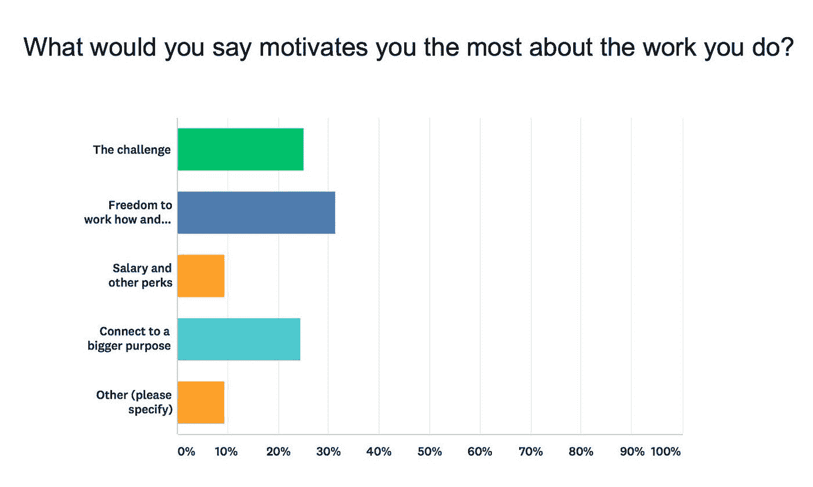

# 我问了数百人如何在工作中保持动力

> 原文：<https://medium.com/swlh/i-asked-hundreds-of-people-how-they-stay-motivated-at-work-a0a51f7636ee>

## 他们是这样说的…

Photo by [Austin Chan](https://unsplash.com/photos/ukzHlkoz1IE?utm_source=unsplash&utm_medium=referral&utm_content=creditCopyText) on [Unsplash](https://unsplash.com/?utm_source=unsplash&utm_medium=referral&utm_content=creditCopyText)

当我们谈论找到一份[有意义的职业](http://blog.rescuetime.com/meaningful-work-guide/)或实现我们的[长期目标](http://blog.rescuetime.com/mental-strategies-long-term-goals/)时，我们通常会想到我们行动的结果，但却忽略了每天真正让我们度过的事情。

动机是一个看似简单的想法，一旦你真正开始探索，它就会变得复杂。有些天，我们醒来时发现它很丰富。其他人，刚起床就想抓住一把沙子。

但是为了达到我们的目标，我们不能被一时兴起的动机所左右。我们需要理解是什么给了我们动力，并确保我们的生活和事业都围绕着它。

虽然有大量关于我们的动机的精彩研究(我们也会谈到)，但有时最好还是去寻找根源。为了帮助我们在新的一年有一个良好的开端，我们调查了数百名[rescue time](https://www.rescuetime.com)用户，了解是什么驱使他们每天都做到最好。

# 激励几乎对每个人来说都是一场斗争

基于我们所做的工作和我们的价值观，我们都有不同程度的动机。但是在对我们的用户进行调查后，很明显很多人对动机有疑问。在 1-10 的范围内，人们将他们做日常工作的动机评为 6 分。有趣的是，只有 3 个人说他们每天都有 100%的动力。

# 我们与金钱和动机有着复杂(且令人困惑)的关系

当你想到激励的时候，你可能会想到奖励。如果你的工作得到了回报，你会想做得更多。然而，我们的调查显示事情没那么简单。

当被问及他们工作的最大动力是什么时，32%的受访者表示，他们的动力是以自己喜欢的方式和地点工作的自由，而 9.5%的人表示是工资和其他福利。

然而，当被直截了当地问及薪水在多大程度上是一个激励因素时，45%的人说它很重要，41%的人说有点重要，3%的人说这是唯一重要的事情。因此，虽然我们愿意认为我们的薪水不能激励我们，但我们不能说它不是一个重要的因素。

# 比起获得奖励，我们更看重克服挑战

当我们回想我们为什么如此努力工作时，动机往往更容易被发现。当我们要求用户思考他们最近完成的目标时，50%的人说克服挑战是最有收获的部分，而另外 32%的人说这是学习新东西。

这样，只有 18%的人认为认可或某种奖励或奖赏最有价值。

从我们的调查中可以清楚地看出，我们并没有很好地理解工作中真正激励我们的是什么。问题是，如果不知道这一点，我们很容易感到[幻灭和压力](http://blog.rescuetime.com/stress/)，甚至可能成为[筋疲力尽](http://blog.rescuetime.com/burnout-syndrome-recovery/)。

因此，以我们的调查结果为起点，让我们深入动机研究的更大范围，了解是什么让我们保持动机，并学会如何识别在我们自己的生活中什么是(或不是)动机。

# 快乐跑步机:为什么你买不到快乐(或动力)

多年来，激励的经典方法是这样的:

1.  如果你因为某事得到奖励，你会有动力去做更多的事
2.  如果你被惩罚了，你会想做得更少

虽然这看起来很有逻辑，但不幸的是，我们并不总是最有逻辑的生物。

研究一直发现我们不仅仅被奖励(或惩罚)所激励。但这是为什么呢？如果我们的行为得到了奖励，我们会想要更多的奖励并继续做下去，对吗？

*“欲望不会停止，”罗伯特·伯顿在 1621 年引用圣奥古斯丁的话写道。如果你曾经经历过一点好运或者某种程度的成功，你就会知道他在说什么。*

你得到了加薪，或者一项明智的投资得到了回报，你感到无比幸福。但是接下来会发生什么呢？很快，这种光芒开始消退。不知不觉中，你又回到了起点。

心理学家称之为[快乐跑步机](https://en.wikipedia.org/wiki/Hedonic_treadmill)——这是一种现象，我们获得的成功越多，我们就越难“奔跑”以跟上它。我们很快适应变化，一件好事带来的动力和快乐只是暂时的:暂时的。

当然，对于小额奖励来说这可能是真的，但是大额奖励呢？

不幸的是，在这种情况下，大小并不重要。研究甚至表明，对于需要耗费脑力的任务，比如写作、编码、设计或概念思考，更高的奖励实际上会降低我们的动力。

奖励增加的动力不仅不会持久，而且奖励本身实际上会导致我们失去动力。(还记得我之前说过我们不是有逻辑的生物吗？)

你不能简单地依靠奖励来保持动力。虽然我们都喜欢自己的工作得到认可，但这些增量不足以维持我们的动力。

# 内在动机:为什么意义比金钱更能让我们保持动力

这并不是说金钱不是动力，因为它是。但只是在一定程度上。

如果你付给某人的工资不足以满足他们的基本需求，那份薪水就会成为一个相当大的动力。但是一旦金钱离开了桌子，我们的需求得到了满足，我们与动机的关系就彻底改变了。

科学也支持这一点。研究一致表明，我们的工作受到内在动机的驱使——我们联系在一起的内在驱动力或价值观。例如，如果你与帮助他人有很深的联系，你可能不会有内在的动力去作为一名投资银行家每周工作 100 小时。相反，你的目标很可能会激励你去做慈善或社会工作。

# 如何识别内在动机

让内在动机如此难以理解的是，它经常与其他人(以及一般的工作)衡量成功的方式不一致。金钱、声望、地位——大多数人认为这些是成长的象征。那么，我们如何发现这些奖励背后的东西，以及真正让我们保持动力的东西呢？

在他的书《驱动 中，作者丹尼尔·平克定义了内在激励因素共有的 3 个基本品质:

**自主**:我们渴望自我指导。当我们有能力选择我们做什么样的工作，或者我们知道我们的环境中有开放的变化和增长，它会增加参与而不是合规。

精通:我们渴望提高技能。当任务是可重复的时候，金钱是一个奇妙的动力。但是一旦涉及到某种程度的概念思维，我们就有动力去做得更好，这很重要。

目的:我们想要做一些有意义且重要的事情。回到开头的对话，“只是为了钱”很少给我们这个意思。这也适用于企业。不仅目标水平低的员工会没有动力，而且那些只关注利润而不重视自己更大目标的企业最终会以糟糕的客户服务和不快乐的员工而告终。

当你把这些因素放在一起，就很容易明白为什么内在动机在工作场所如此强大。

当然，如果我们有能力在工作中做得更好，有自由选择我们追求的东西，并且觉得我们的工作与更大的目标相关联，我们就会感到有动力。

尽管识别这些品质很容易，但很难说它们是否在驱动你。下一次，我将介绍一个快速的自我测试，你可以用它来发现工作中的激励因素，以及如何改变你的工作以适应你的内在激励因素。

# 嗨，我是乔里！

我帮助公司和有趣的人通过巧妙而集中的写作讲述他们的故事。想一起工作吗？在 hello@jorymackay.com 给我发邮件

*本帖原载于* [*改版博客*](http://blog.rescuetime.com/motivation-to-hit-goals/) *。查看更多关于生产力、专注和动力的文章。*

## 这篇文章发表在 [The Startup](https://medium.com/swlh) 上，这是 Medium 最大的创业刊物，拥有 291，182+人关注。

## 在此订阅接收[我们的头条新闻](http://growthsupply.com/the-startup-newsletter/)。

