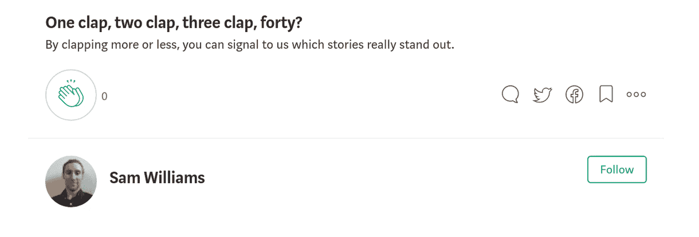

# 我筋疲力尽了——强迫自己一直 100%地工作

> 原文：<https://medium.com/swlh/i-burnt-out-forcing-myself-to-work-at-100-all-the-time-2cf824d515b0>

我已经写了我如何利用早晨做一些事情，比如在 5 个月内使我的工资翻一番，我想继续这种水平的进步。试着逼了一个月之后，我很沮丧，很疲惫，很无聊。

# 我在做什么

我每天早上 6 点起床，目标是在开始一天的工作前完成 1.5 小时的工作。我会坐下来，试着做任何我认为有进步的事情。

# 为什么会失败

失败的原因有很多，但主要有三个:

## 1.我改变了我的惯例

随着新工作的开始，我的日常生活略有改变，但最大的变化发生在我摔坏手机的时候。这意味着我再也不能在吃早餐的时候用 Blinkist 听书了。为了打发时间，我转向 Youtube。

Youtube 有很多令人惊叹的内容，但也有数量惊人的垃圾。不幸的是，这些垃圾通常有一个很棒的标题和一个吸引眼球的缩略图。我最终变得心烦意乱，看了一个又一个无用的视频，浪费了我很多个早晨。

因为我改变了我的常规，我经常忘记做我的每日子弹日志和每周评论。这意味着我对如何利用我的 1.5 小时没有真正的计划，也没有在每周回顾中抓住我浪费的时间。

## 2.我没有方向

当我试图得到我的第一份开发工作时，我有一个非常明确的目标和明确的里程碑。

当我试图让我的工资翻倍时，我有一个非常明确的目标，有明确的里程碑。

目前我没有目标，也没有里程碑。由于没有目标要实现，我没有因为看另一个 Youtube 视频而耽误任何工作。

## 3.我在强迫它

在我设法完成一些工作的日子里，我非常努力地想做得非常好。我已经离开了 Youtube，需要弥补我浪费的时间。

我做事情只是为了让我感觉我在完成某件事，而不是因为我想做或者因为它是有益的。

# 结果呢

这样过了一个月，我又累又沮丧。厌倦了用意志力去完成一些工作，对工作毫无进展感到沮丧。

# 我做了什么来扭转局面

## 我放松了

我认为强迫进步是没有用的，我应该休息一段时间。我仍然在早上 6 点醒来，但是我做了我想做的事情。看几集布鲁克林九九？为什么不呢！在火箭联盟、天际或者任何我喜欢的游戏上进行会话？听起来很有趣！把闹钟调到早上 8 点？有时候。

## 设定新目标

在大约 2 周比较放松的早晨之后，我觉得已经准备好重新开始工作了。这次我知道我必须有一个目标，所以我坐下来，想出了一个新的主要目标。

对我来说，这是为了**完成快速人工智能深度学习课程。我一直对人工智能和深度学习很感兴趣，这是一个开发人员应该具备的技能，我的工作中有一个项目可能会用到它。**

除了我的主要目标之外，我决定让我的文章更加一致，所以我决定每周写一篇文章。这是故意降低的，这样我更容易实现，保持高水平的动力。如果我写得更多，那就更好了！

有一个目标意味着我知道我早上起来要做什么，更重要的是，我想去做。这应该可以帮助我关闭 Youtube 标签，重新开始进步。

## 重启日志记录

这与设定一个新的目标是一致的。我的日记曾经很神奇，它能确保我知道那一周和那一天我在做什么。它帮助我跟踪进度，了解我是如何利用时间的。

它经常捕捉到你在一件事情上花费太多时间的几个星期，同时让你总体上更有条理。

## 我买了一部新手机

这可能看起来很傻，但这意味着我可以再次听 Blinkist，将 Youtube 从我的早晨中剥离，消除了一个巨大的分散注意力的机会。

# 目标

这些改变有望重新点燃我对进步的热情，并减少我用来强迫自己工作的意志力。

我会更好地组织我的生活，并希望在个人和职业上有所成长。

如果你喜欢这篇文章，请点击这个按钮，关注我，获取更多关于技术和生产力的文章。

接下来→ [我如何在 5 个月内工资翻倍并找到一份令人惊叹的工作](https://medium.freecodecamp.org/how-i-doubled-my-salary-in-5-months-and-got-an-amazing-job-1110d1779e0b)

## 这篇文章发表在《T4》杂志《创业》(The Startup)上，这是 Medium 最大的创业刊物，有 314，785 人关注。

## 在这里订阅接收[我们的头条新闻](http://growthsupply.com/the-startup-newsletter/)。

