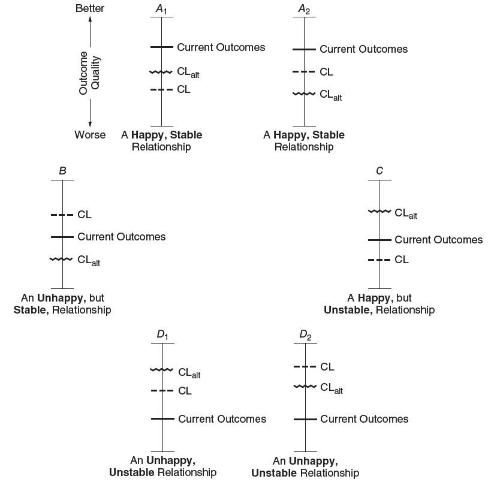

# 我可以告诉你什么时候辞职

> 原文：<https://medium.com/swlh/i-can-tell-you-when-you-will-quit-your-job-1d20b0466fda>

我还可以告诉你什么时候你会和你的伴侣分手，什么时候你会和某人不再是朋友，什么时候你会搬出你的房子，什么时候你会得到一辆新车/手机，等等。

无论哪里有某种关系，我都可以告诉你什么时候结束这段关系。

如果你进一步阅读相互依赖理论，你也能看出这一点。

相互依赖理论背后的数学原理非常简单。它只涉及三个变量——比较水平(CL)、备选方案的比较水平(CL alt)和当前结果。

比较水平是你对工作和关系的期望。这是你认为你应得的。备选方案的比较水平是你在当前工作或环境之外可以得到的。当前的结果是你现在实际得到的，它可以进一步分解为回报和成本，使回报和成本有所不同。

例如，以你的工作为例，如果你认为你应该领导一个 20 人的团队，向首席执行官报告，从事最重要的项目，一年挣 7 位数的股票期权和高额奖金，这就是你的比较水平。如果你知道除了你自己的公司之外的公司提供什么，在那里你可以做你现在做的同类工作，那么这就是备选方案的比较水平。你当前处境的现实构成了当前的结果，你的工资和在一个重要项目上的工作可能是回报，而长时间的工作和令人讨厌的老板或同事可能是成本。

首先是满意度的问题。

正如我常说的，幸福是现实超过期望。

这意味着，即使你目前的结果是积极的(即回报>成本)，你可能仍然不满意，因为你的比较水平(期望)甚至更高。只有当你目前的结果大于你的比较水平时，你才会感到满意。

然后就是依赖的问题。

如果你目前的结果大于其他选择的比较水平，那么你就是依赖型的。这种情况下，你每天都去工作，即使你讨厌自己的工作，也要尽自己的一份力，因为没有更好的选择(顺便说一句，辞职也是一种选择！).如果你目前的结果低于其他选择的比较水平，那么你就是独立的。你可以随时决定退出，走出去，得到更好的东西。在这种情况下，依赖关系被颠倒过来，雇主(或你的伴侣)现在依赖于你。

有了这样的理解，你就可以很容易地发现你可以处于四种关系中(见上方图片)。

当你目前的结果高于你的比较水平和备选方案的比较水平时，你处于一段幸福稳定的关系中。

你的比较水平是高于还是低于备选方案的比较水平并不重要。因为，你正在得到的，比你认为你应得的，或者你在外面能得到的，都要多。

当你目前的结果低于你的比较水平和你的选择的比较水平时，那么你就处在一段不快乐不稳定的关系中。如果你在这里，你很快就会辞职或分手。因为，你得到的比你认为你应得的更糟糕，也比你拥有的选择更糟糕。

当你的 CL >当前结果> CL alt，那么你处于一段不快乐但稳定的关系中。这种情况下，你认为你应该得到更多，但现有的选择比你现在得到的更差。所以你将会被解放出来，投入大量的时间，但是仅仅是为了不被解雇。

当你的 CL alt > current outcomes > CL 时，那么你处于一段快乐但不稳定的关系中。你得到的比你认为你应得的要多，但是你注意到外面有更好的机会，并且可能准备好抓住其中的一个。这是指你很开心，很投入你的工作，但是如果有更好的机会出现，你仍然愿意抓住它。

社交媒体(尤其是脸书和 Instagram)在提升我们的 CL 方面发挥了重要作用。我们经常看到别人像我们一样做我们自己没有做的事情，并开始认为我们也应该这样做。

专业的社交和约会应用程序(尤其是 LinkedIn 和 Tinder)在提升我们的竞争力方面发挥了重要作用。我们经常看到如此多的选择，可能有相当一部分选择比我们目前的情况更好。

但目前结果的现实并没有真正改变。事实上，他们可能会变得更好，但不是以 CL 和 CL alt 变得更好的速度。

如果我把这三个变量都画在一张图上，把时间作为另一个轴，就一点也不奇怪为什么工作和关系不像以前那样长久，越来越多的人最终陷入不快乐和不稳定的关系。

## 在你走之前…

如果你喜欢这个，请支持我的工作。你需要做的就是鼓掌。

[*跟我讨论美好生活的错综复杂。*](http://eepurl.com/cqwJZT)

[*读我的书*](https://www.amazon.com/s/ref=nb_sb_noss?url=search-alias%3Daps&field-keywords=mayantuyacu)

## 这篇文章发表在 [The Startup](https://medium.com/swlh) 上，这是 Medium 最大的创业刊物，有 331，853+人关注。

## 在此订阅接收[我们的头条新闻](http://growthsupply.com/the-startup-newsletter/)。

