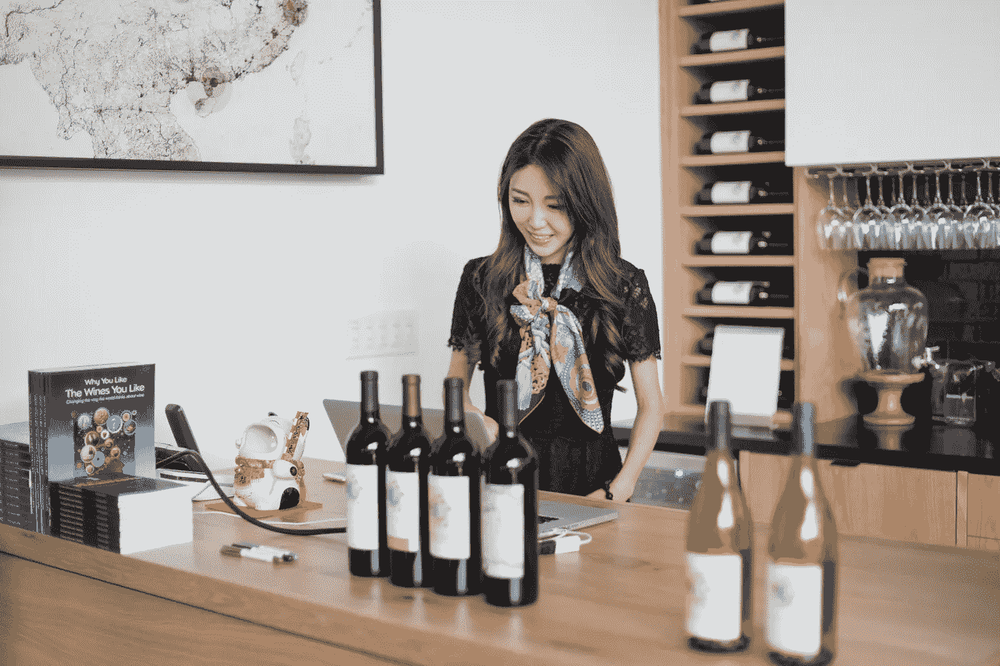

# 伟大葡萄酒公司的创始人兼首席执行官林丹妮说:“我怎么说都不为过，拥有导师有多重要。”

> 原文：<https://medium.com/swlh/i-cannot-say-enough-how-important-it-is-to-have-mentors-with-danni-lin-founder-and-ceo-of-great-7a81d082c340>

> “导师很重要。然而，在不同的领域有不同的导师是很重要的，因为我们不能真正理解一个领域，如果不与有经验的人一起学习和工作…