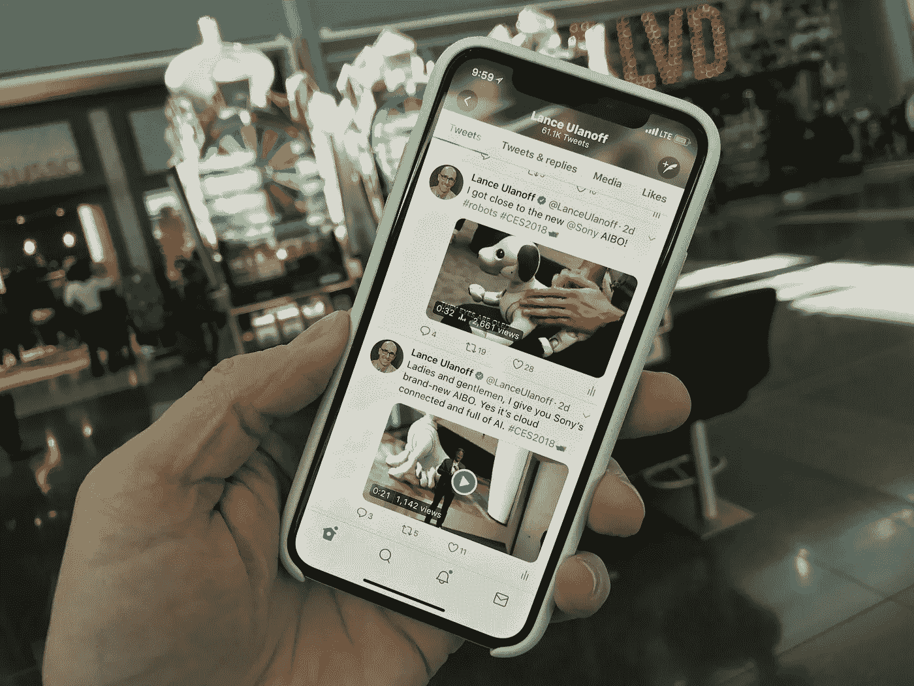

# 我在 CES 上除了我的 iPhone 什么都没有

> 原文：<https://medium.com/swlh/i-covered-ces-with-nothing-but-my-iphone-77e5ab5b3c7a>

我需要的是我口袋里的 iPhone X。

这是一个激进的想法，也是我最初拒绝的想法:我能在没有笔记本电脑、独立相机甚至平板电脑的情况下报道 CES 2018，讲述这个大型消费电子展的故事吗？

我非常不确定我能做到，所以我一直在我的背包里装满了不是一台，而是两台笔记本电脑，一台带 200 毫米镜头的 DLSR，充电电缆，然后拖着它去展厅。简单地说，这个包很重，拿起来不舒服。

最初，我使用我的笔记本电脑一点点，甚至写了[一个帖子](/@LanceUlanoff/ces-2018-lg-rollable-uhd-tv-is-incredible-7ab72d7710db)作为媒介，但是 99%的时间，我使用苹果的 iPhone X

这并没有完全背离我之前在拉斯维加斯报道 CES 会议的方式。过去，我在活动中被公认为是[顶级社交媒体人物](http://www.onalytica.com/blog/posts/ces-2017-top-100-influencers-and-brands/)。然而，我通常会尽可能多地写东西，从新闻发布会、会议和展位跑到新闻发布室和走廊，在那里我会找到随机的椅子和电源插座(如果幸运的话，还有 WiFi)，为 PCMag 和最近的 Mashable 写一两篇文章。

我想我可能会以同样的方式填充 Medium，但我很快意识到，我可以通过手机与社交媒体观众实时分享我的 CES 体验。

苹果的 iPhone X 本身就是一台功能强大的电脑，它有一个相当大但不笨重的 5.8 英寸屏幕。它的 1200 万像素相机能够拍摄出很好的照片，即使在拉斯维加斯会议中心有时很模糊的光线下，它还有内置的 2 倍光学变焦。虽然在旅途中拿出我的笔记本电脑甚至平板电脑来写作或发微博是不现实的，但我可以用手机单手在 Twitter、脸书和 Instagram 上发布故事。此外，iPhone X 被证明是完美的、几乎防水的小玩意，它将被称为 CES 大洪水。

我觉得使用 Twitter 作为我的主要内容交付平台更舒服的一个原因是新的字符数限制。这是我第一次报道每条推文最多 280 个字符的科技贸易展。

我很少担心字符数。然而，这并不是说要使用所有可用的字符。相反，我专注于用少量的文字、图像和视频讲述一个简洁的故事。为了确保最大的可见性，我还确保每条推文都包含#CES2018 标签，并在可能的情况下，包含产品或公司的 Twitter 句柄。

视频的使用无疑有助于这一探索。一个视频，即使只有 20 秒，也能讲述比 280 个角色更多的故事。Twitter 支持长达 2 分 20 秒的视频，但我认为没有人会看超过 1 分 30 秒的视频。我的大多数视频都很短。

几乎从我的第一次 CES 会议开始，我就把尽可能快速有效地分享让我兴奋的东西作为我的目标。我想让人们分享我的兴奋。

当我看到 LG 的 65 英寸 OLED 电视时，我知道我必须马上讲述这个故事。用静态图片发微博是不公平的。所以我用 iPhone 拍视频。

快速改变故事意味着一切都必须在手机上完成，包括视频制作。

多年来，我一直在 iPhone 上用 iMovie 编辑 1080p 视频。iMovie 比人们想象的要快、好用、强大。

对于我的 CES 视频，我确保为上下文添加文本覆盖(因为许多人观看视频时没有声音)。然而，对于 LG 的视频，我想把它提升一个档次。我连接上耳机，在会议大厅找了个安静的角落，用 iMovie 录制了一段旁白。

在我第一次看到 LG 可卷曲显示屏 30 分钟后，我就在 Twitter 和脸书上发布了这条消息。

这成了我每天报道 CES 的模式:大量来自新闻发布会和展厅的短推文，偶尔还有更重要或有趣产品的长视频。

几乎每条 CES 推特都包括照片或短视频。有些视频不到 30 秒，而且一目了然，尤其是附带的推文，我都懒得看文字或音乐了。但对于更有趣或有新闻价值的产品，我会编辑视频，添加文本和一些主题音乐(请苹果公司添加更多主题音乐选项)。

我边走边做，或者坐几分钟，主要依靠一个非常好的 LTE 网络来上传它们。

到了第二天，我减少到只带一台笔记本电脑和我的 DSLR。在他们又一天没有离开我的背包后，我终于把他们留在了我的酒店房间里。

在 CES 的最后一天，我的包里装满了一个 10.5 英寸的。iPad(我没用过)，一个小三脚架，一个 iPhone 插头和充电线，一个电池组。后者无疑是我第二重要的设备。

当我从尤里卡公园创业村潜行近两个小时时，我也将 iPhone 电池耗尽到 50%，一天还没过半。我的口袋大小的 500 mAh 的 Puku 充电器被证明是无价的。到每天结束时，我已经完全排干了 Puku。我还非常小心地管理我的 iPhone X 电池消耗，在一天的早些时候将它置于低功耗模式，并将我的屏幕亮度保持在尽可能低的水平。

没有一篇接一篇地在 CES 上发表 500 字的文章感觉很奇怪，但最终，我认为我向渴望获得最新电子产品消息的观众讲述了更多、尽管更短的故事。

我的观众通过 Twitter、Instagram Stories 和脸书上的几十个社交媒体帖子，而不是英特尔或三星最新发布的十几个具体细节，了解了参加 ces、参加新闻发布会、在地板上走来走去、与人见面和尝试小工具的真实感受。我看到的，摸到的，他们也看到了。

显然，有些事情我错过了，有些地方我没去过，有些细节我不能分享。

不过，最终，我带着深深的满足感离开了。我用自己的方式讲述了 CES 的故事，除了一部 iPhone X 和一大堆咖啡因，什么都没有。

## 这个故事发表在 [The Startup](https://medium.com/swlh) 上，这是 Medium 最大的企业家出版物，拥有 284，454+人。

## 订阅接收[我们的头条新闻](http://growthsupply.com/the-startup-newsletter/)。

