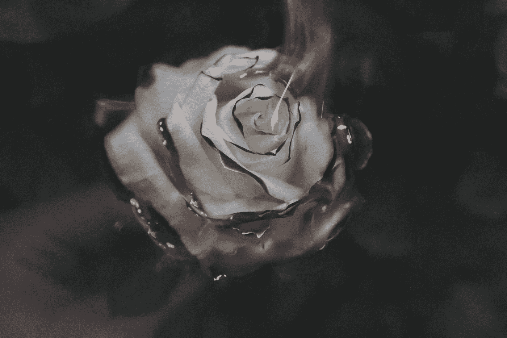

# 我决定把我的生活烧成灰烬，你应该这样做:停止创业

> 原文：<https://medium.com/swlh/i-decided-to-burn-my-life-to-the-ground-and-you-should-to-the-stopping-of-the-startup-a25200e2d3cf>

Photo by [Gianni Zanato](https://unsplash.com/photos/-u7FVi3aBvU?utm_source=unsplash&utm_medium=referral&utm_content=creditCopyText) on [Unsplash](https://unsplash.com/search/photos/fire?utm_source=unsplash&utm_medium=referral&utm_content=creditCopyText)

差不多一年前的今天，我决定将我的生活付之一炬。激进是的，但我决定是时候做些疯狂的事情了，因为唯一真正疯狂的选择是保持现状。至少这样我就有机会像凤凰一样浴火重生。

做出这个决定出乎意料的容易，我觉得我已经一无所有了。当你一无所有时，很容易决定放弃它。只有好处，因为它允许有机会获得一些东西。

此时我正处于一段我们都不开心的感情中。我们都在坚持着早已逝去的日子。躺在曾经让我完整的人身边，不断提醒我失去了什么。

我被称为修理者，从历史上看，我总是能够修理一切。然而，这一次我不能概念化的方式回到我们所说的“我们那种完美”。

在经历了一系列最黑暗的时刻后，我得出了唯一能理解的结论。我们之间的关系已经很糟糕了，我知道重新开始我的职业生活会带来什么样的后果。把我们俩牵扯进来是不公平的。

我做过的最困难的事情之一就是合上我生命中这一章的书，开始写新的一章。我说这是最难的事情之一，因为回过头来看，开始新的一章可能比结束旧的一章更难。在你同时毁灭了过去 15 年所知的一切之后，你如何开始新的篇章？你能开始吗？

我的生意也经历了非常艰难的时期。我和我的团队已经朝着不同的方向前进了一段时间。试图带领我们实现这一愿景的压力和挫败感接近无法忍受。

我正在构思一个能让我们走上成功之路的转变。后来，我的创意总监决定离开，去寻找另一个机会。不久后，我的首席运营官也提前跳船修正航向。

在这之前的几个月里，我想我很清楚我需要做什么。我只是不知道该怎么做。我在八年级的时候开始创业，从一无所有到做大，就这样又回到了一无所有。

他们说得对，人越老，似乎越难做出重大改变。34 岁的时候，我已经在我的事业上投入了超过一半的生命，而它正在脱轨。与此同时，我正凝视着我最长久和最亲密的关系的死亡。我的世界即将结束。

当我停下来想一想，我从来都不是一个放弃的人。然而，我也总是追求我热爱的东西。这是两者发生巨大冲突的时刻。

那时，我的事业和我的想象完全不一样。我曾经对其充满激情的愿景。虽然放弃的想法就像一把匕首穿过心脏，但生活在谎言中并否认我的激情是一种更糟糕的感觉。最终，我实现梦想的动力获胜了。我知道为了给我的梦想扫清道路，我必须毁掉我所知道的生活。

不要误解我，这并不容易。那是我一生中最孤独的一年。也是精神上最吃力的一年，把我推入了从未经历过的抑郁。职业上很尴尬。这是我从来不想发生的一切，但同时，这是我需要发生的一切，为我指明前进的方向。

经过 10 个月令人疲惫的计划，齿轮现在开始启动了。这一次，我在为一个帝国的建立打下基础。用我从失败中获得的所有知识编写流程和计划活动。

对于我周围的人来说，我一直是一块磐石，过去的一年也不例外。我仍然乐观地谈论失败的价值。我是多么感激这些课程等等。即使我们知道某件事是真的，在那些寒冷黑暗的日子里，仍然很难保持你的精神状态。

奇怪的是，正是在这个过程中，我第一次感到孤独和无助。尽管我一生都是残疾人，但我从未体验过无助的感觉。直到我失去了我的团队，我的公司渐行渐远，而我无力挽救它，我才感到失落。

这是盖斯·布洛克斯经常唱的那些未被回应的祈祷之一。我知道一切都是错的。内心深处我讨厌我的生活。为什么我会因为救不回来而难过？谁知道呢，我想我们有时候就是疯了。

在我开始彻底改变后的一两个月，我决定让自己完全沉浸在加里·维纳查克推出的内容中。这并不是说我发现了什么新的东西，但这一定是关于时间和我在生活中的位置的东西，让他的内容直接对我说话。

我被迷住了。我需要知道他推出的所有东西，因为感觉这可能是重新找到我激情的答案。的确是。

事实证明，这正是我所需要的。在接下来的几个月里，有一个反复出现的主题在对话中不断出现。每个人都被我的故事和我继续前进的动力所鼓舞。一个人甚至告诉我，因为我在生活中带着残疾面对了如此多的挑战，所以我被训练成了理想的企业家。我已经形成了我是不可阻挡的心态，正因为如此，我实际上是不可阻挡的。

你看，任何东西从里面和外面看起来都不一样。我沉浸在羞愧中，我挂在自己身上，而事实上我确实有一些值得骄傲的事情，我只是没有注意到它们。

不要误解我，我知道有很多人在谈论我有多失败，但是那些人不重要。我不是说他们不重要，因为他们是消极的，这是我告诉他们滚蛋的方式，我是说他们不重要，因为他们真的不重要。

如果他们看不到我所经历的一切的积极面，那么他们就从来没有尝试过创造辉煌。他们缺乏生活经验，不知道成功究竟意味着什么。成功需要失败，因为找到成功之路的唯一途径就是尝试。老实说，当我们第一次尝试任何事情时，我们总会搞砸的。这是我们学习的方式。

当我坐下来开始计划时，我专注于愿景。我需要把这种感觉带到我脑海的最前端。我不总是需要知道要走的路，只要我能看到目的地。如果我能在脑海中看到目的地，我就能穿越地狱到达那里。

在接下来的几个月里，我开始构思建立个人品牌对我意味着什么，以及它如何能帮助我激励他人。我渴望成为说几句鼓舞人心的话的人，这些话碰巧能帮助别人度过最黑暗的时刻。我把它看做是我回馈或回报的方式。我迫不及待地想开始 vlogging，但在此之前，我需要组建我的梦之队。

在我采访了我的新创意实习生之后，我第一次感受到了生命的气息。毫无疑问，克里斯塔是我从未见过的最有直觉的人，她也描述了我的愿景。在花了几年时间试图让创意人员跟随我的愿景来养猫之后，这种感觉非常美妙。它有助于激发我的热情，引导我走向新的方向。

下一步是找到我的二号人物，我的女友星期五。如果我要东山再起，我需要一个摇滚明星在我身边。失败的美妙之处在于，你可以近距离地看到所有出错的地方。这一次，我把注意力集中在我的缺点上，以找到为了成功我真正需要的人。经过 36 名申请人之后，海莉比我最大的梦想还要适合我。

多年来，我一直说我是 t 恤界的托尼·斯塔克，我所需要的只是我的佩珀·波茨。我终于得到了那个职位，我的新公司也因此快速成长。我找到了一个惊人的合作伙伴，助理，vlogging 联合主演，和最好的朋友。我永远也不会看到这一切的到来，正因为如此，我从来没有计划过，但它发生了。这一切的发生是因为我允许自己抛弃我所知道的一切，去建立我梦想中的生活。

**为了每个坚持生活的人**

你在坚持你热爱的东西吗？还是因为不知道如何去创造自己热爱的生活，所以一直抓着什么不放？深入内心寻找答案。如果事实证明你不爱你的生活，你看不到它变得有意义，那么请放手。

你会感觉自己正坠入深渊，这是一件好事。在万物不存在的地方，你会发现万物的本质。我总是说生命太短暂，不能让它变得不精彩，现在我比以往任何时候都更清楚这是真的。

这就是我“起源故事”的开始。跟随我，奔向伟大的斜坡。

当你创造你梦想中的生活时，无论那是什么，我很乐意有机会跟随你的起源故事。

## 这篇文章发表在 [The Startup](https://medium.com/swlh) 上，这是 Medium 最大的创业刊物，有+ 375，985 人关注。

## 订阅接收[我们的头条](http://growthsupply.com/the-startup-newsletter/)。

