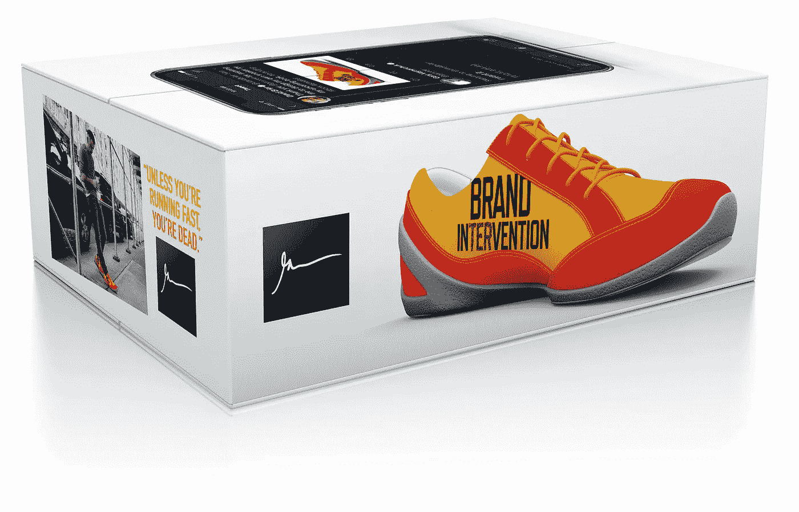
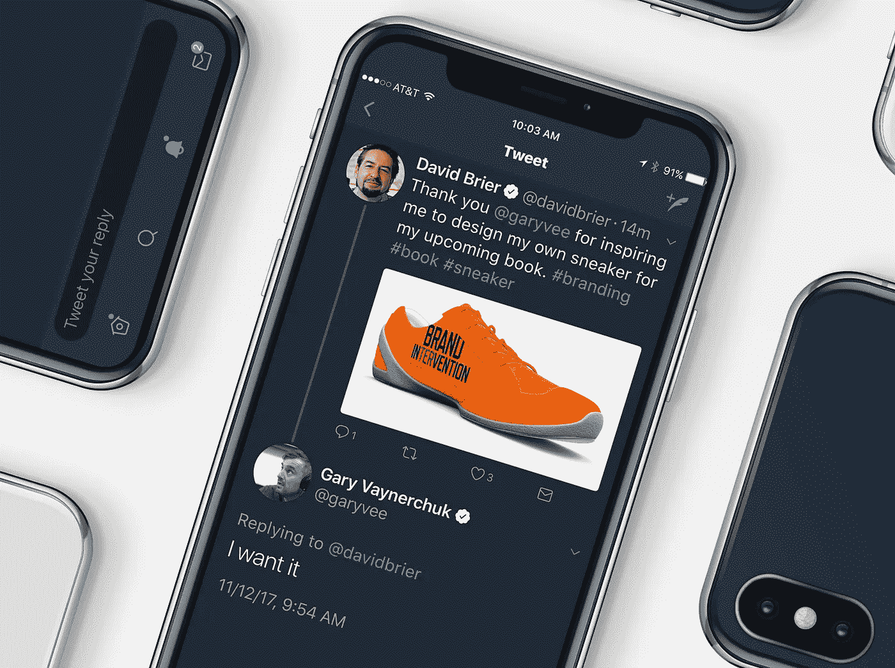
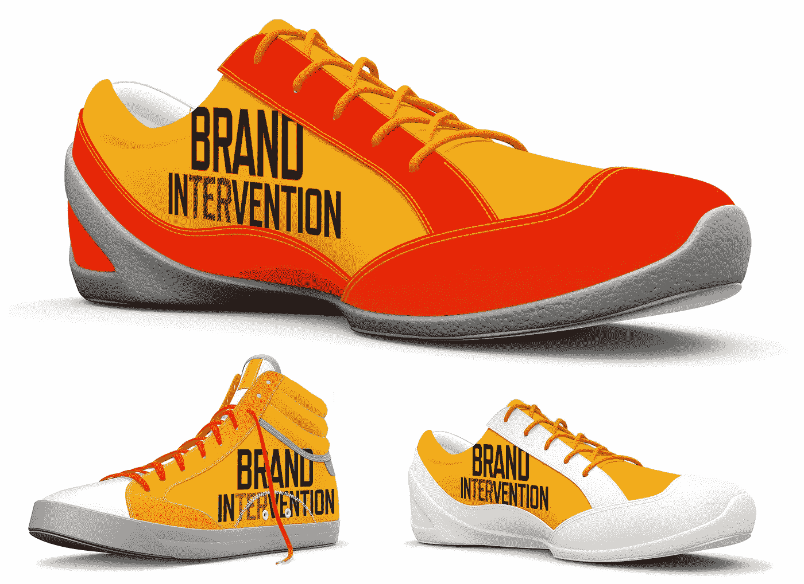
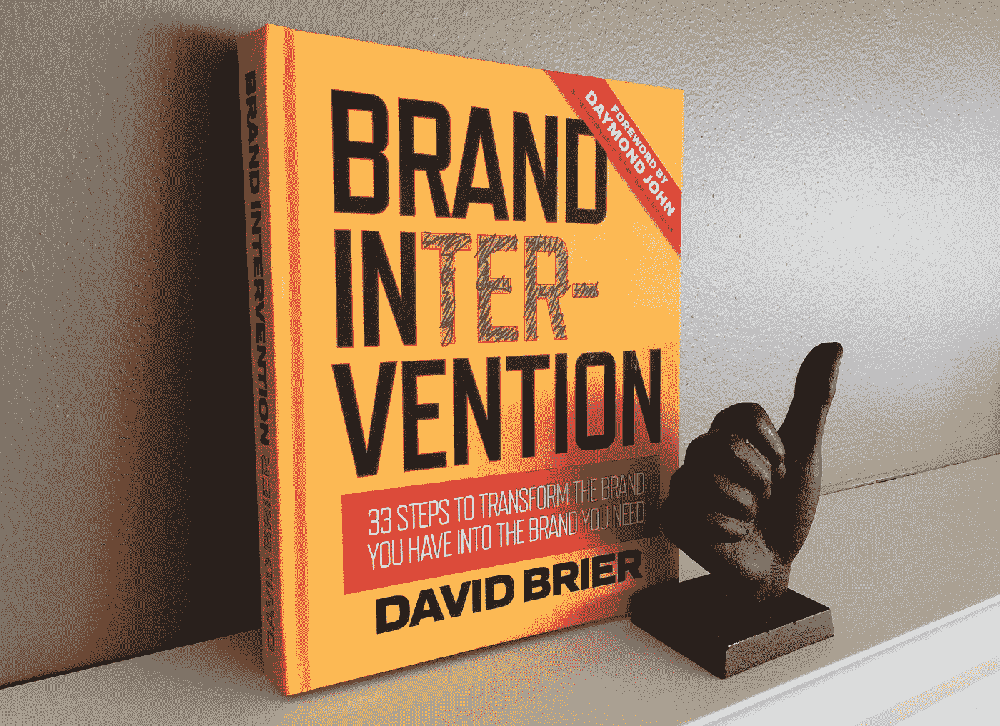
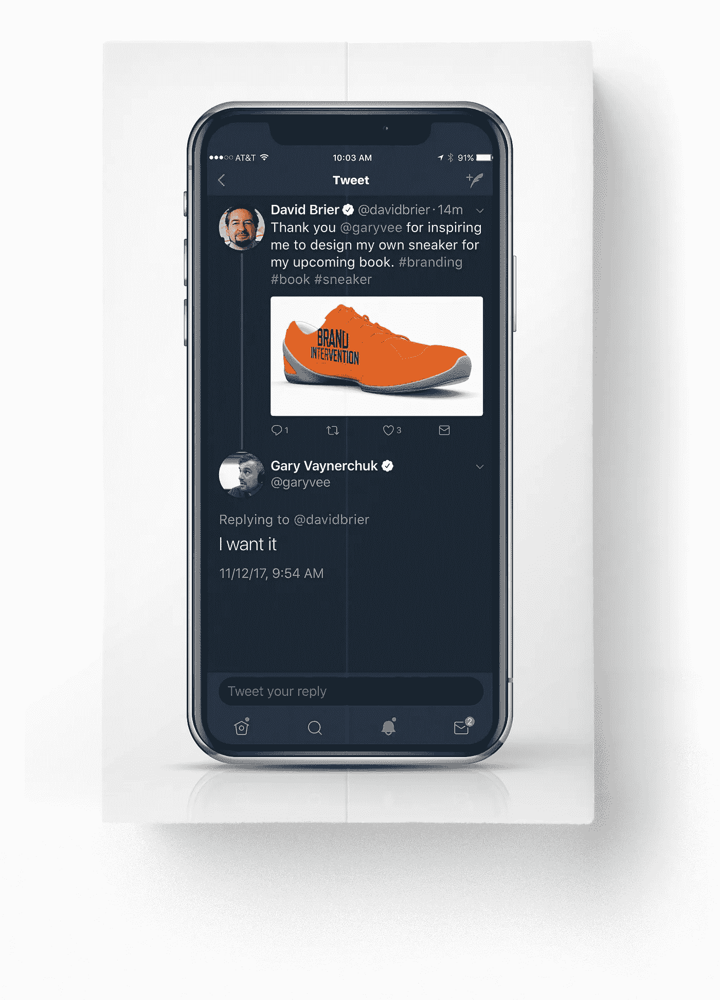
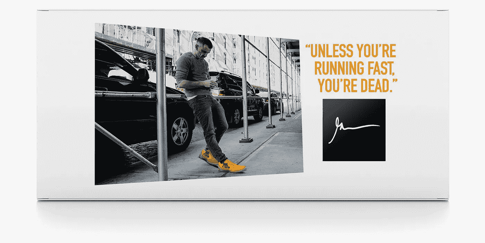
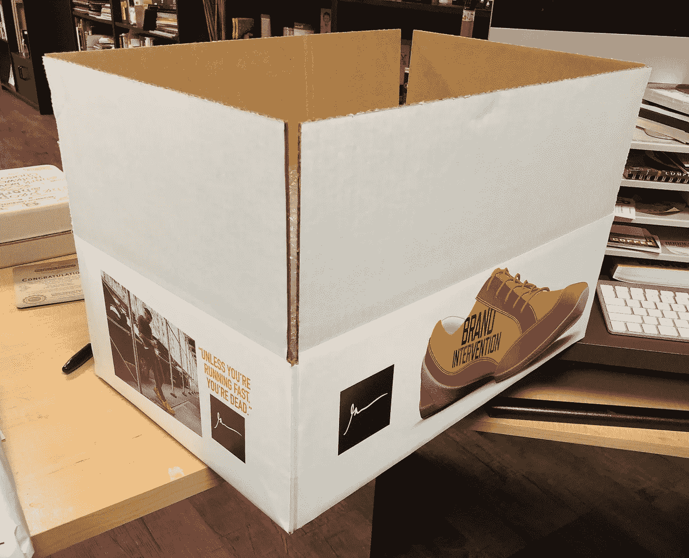
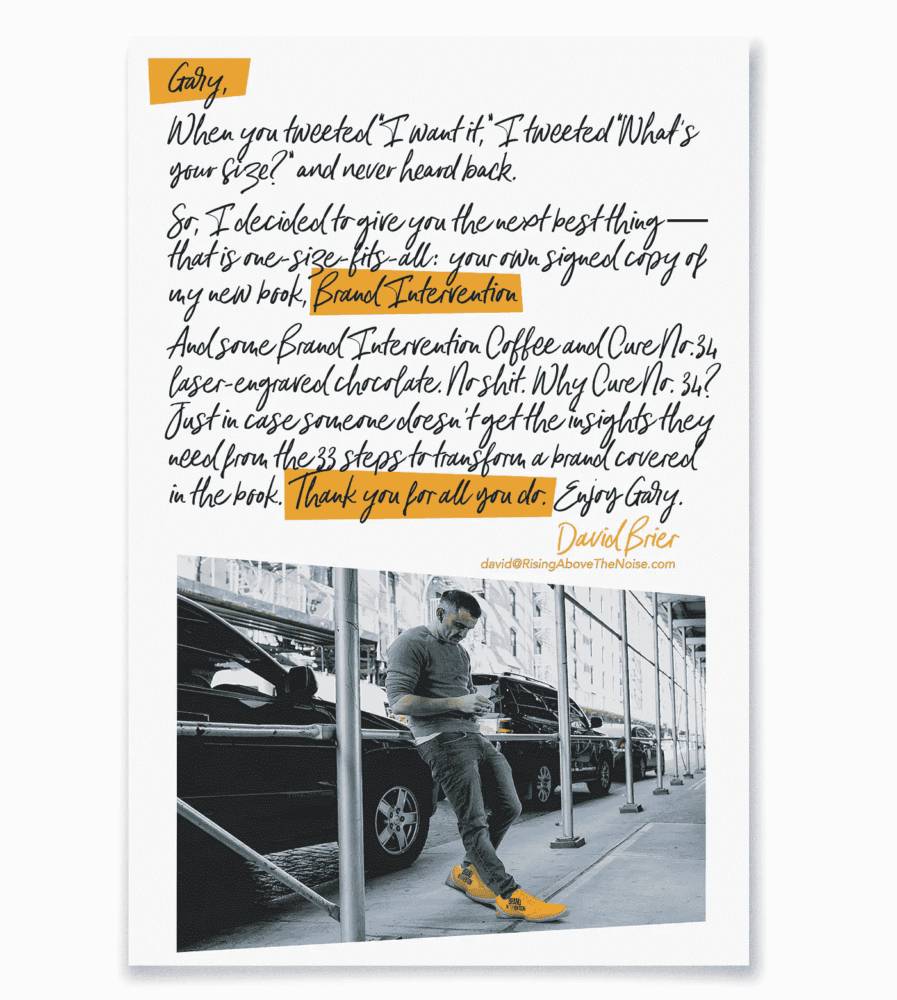
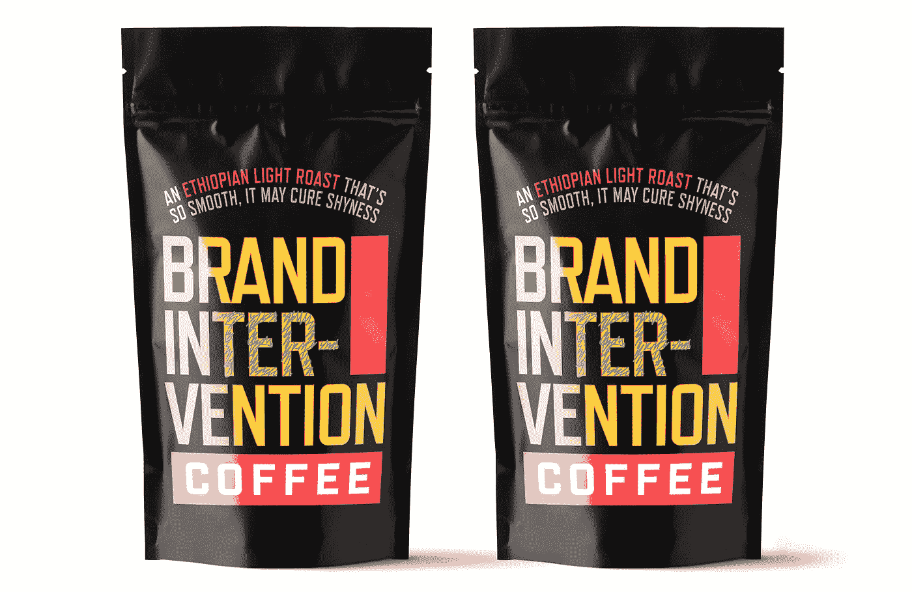
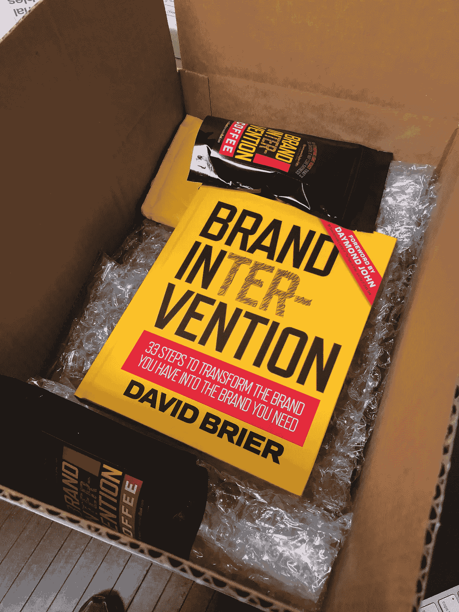

# 我连续两周每天都设计一款加里·维纳查克运动鞋(下面是发生的事情)

> 原文：<https://medium.com/swlh/i-designed-a-gary-vaynerchuk-sneaker-every-day-for-2-weeks-and-heres-what-happened-911523ba68cb>

由 [***欧石南***](http://www.risingabovethenoise.com)

我和 Gary Vee 的关系正式开始于 2017 年 11 月 12 日，Gary 将满 42 岁的前两天，Gary 即将推出他的收藏家物品运动鞋的前两天(与 K-Swiss 合作)。

这是一个可爱的周日早晨，阳光洒在我的肩膀上，我享受着早晨的浓咖啡。

我按下了*发送*。

# 加里·维和到底发生了什么

我坐在家里的沙发上，妻子还在楼上睡觉。

我终于为我的新书完成了运动鞋设计， [*品牌干预:将你拥有的品牌转变为你需要的品牌的 33 个步骤。*](http://a.co/3kunYDb)

很简单，Gary 的新球鞋启发了我，我想，*“该死，如果 Gary 出了一双球鞋，我的书也会有一双。”*

不到 15 分钟后，加里回复了三个字:“我要。”

## 引发这一切的推特:

我惊呆了。

所以我回答说问加里·维他的鞋码。我从未收到回复。

现在，看看这个:*这是一个原型*。

## 以下是我参与的各种设计:

运动鞋的颜色选择是故意摆在你面前的，并且与我为这本书设计的封面一致。

该书封面的早期反馈非常出色，不可能与任何其他书混淆。此外，在亚马逊和在线使用时，它看起来很棒。(除非你一直生活在岩石下，否则你已经见过它了，但以防万一，它就在右边。)

# “除非你跑得很快，否则你死定了”

上面加里·维的话启发了我接下来的步骤。

加里打开门，我正要走进去。

所以，在调查了生产运动鞋原型的成本后，我选择了 b 计划。

B 计划有许多步骤:

1.  *如何给 Gary Vee 弄点东西？我的一位同事和他的妻子在 Gary 办公室的对面居住和工作。完成了。*
2.  *送什么给加里？哦，我有了一个灵感，一个会留下持久印象的东西。完成了。*
3.  如何以一种让人无法忽视的方式包装它？(因为我确信加里总是收到一大堆东西。)好吧，我算出来了。完成了。
4.  现在，为了引起加里的注意。好的，我通过电子邮件和推特滴活动解决了这个问题。完成了。(要查看我的同事们亲手把它送到加里的办公室，请向下滚动。)

## 这里是元素。

## 盒子的顶部提醒加里我们的推特遭遇:

## 盒子的短边(这是完美的加里名言，作为盒子设计的一部分，伴随着一张加里在他的手机上“穿着”我的运动鞋的著名照片。):

## 装运前的箱子:

## 加里打开盒子后会读什么:

## 为了让盒子里的东西(如下所示)有意义，我烘焙了最好的咖啡作为我新书发布会的一部分，还设计了刻有的[巧克力。这是咖啡包的样子:](http://www.risingabovethenoise.com/brand-intervention-exclusive-cure-chocolate-intoxication/)

## 提起求职信，加里会揭开他自己签名的精装版的我的书，两杯品牌干预咖啡，和一块 Cure №34 激光雕刻巧克力:

所以，真正的问题是，加里会邀请我去他在纽约的办公室，一起闲逛，聊聊天，然后*和全世界分享这种忙碌吗？*

加里，你准备好了我也准备好了。

*特别感谢迈克尔和丹尼斯·达芙让这一切成为可能，并确保“老鹰已经着陆”*

*原载于*[*www.risingabovethenoise.com*](http://www.risingabovethenoise.com/gary-vee-sneaker-every-day-heres-what-happened/)

## 这个故事发表在 [The Startup](https://medium.com/swlh) 上，这是 Medium 最大的创业刊物，拥有 295，232+人关注。

## 在此订阅接收[我们的头条新闻](http://growthsupply.com/the-startup-newsletter/)。

