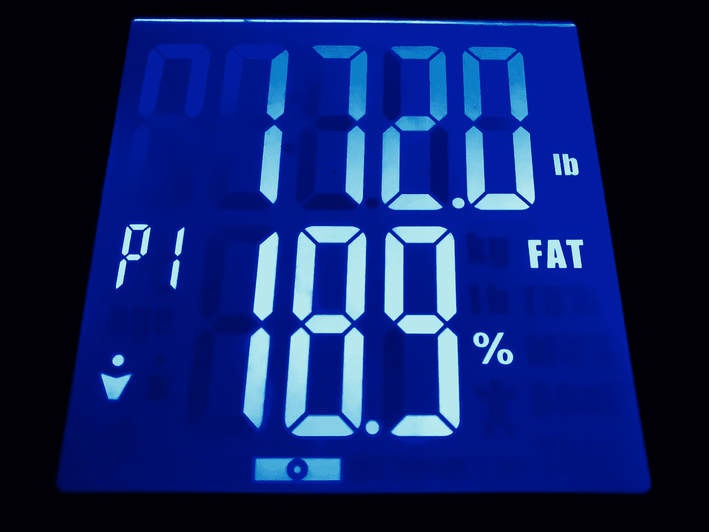

# 我做了一件事。

> 原文：<https://medium.com/swlh/i-did-a-thing-yall-737d6f14b13d>

## 关于自我完善的思考

## 对于像你这样的人来说，在过去的三年里，他一直在服用大量的精神药物，其副作用包括脂质代谢下降，无味的腹胀和广泛的体重增加，以及终身的自身免疫内分泌失调，这需要持续的监测和日常激素替代疗法(HRT)在过去的二十年里，体重管理一直是我进入青春期以来的生活中的祸害。

我有学习障碍，这也表现在儿科进食障碍上。我很幸运有一个溺爱我的父亲，他强迫我在二年级时通过掌握四年级的语言和数学书籍来过度补偿最终被诊断为“弱智”的遥远风险(这是在 90 年代，所以盲目地在你懒得理解的症状上扔 Dx 和 Rx，以及用药丸作为子弹瞄准小孩子的嘴来玩靶心练习，这是非常流行的，仅次于辣妹)，在二年级时，在天才学生游戏和磁铁学校球拍上竞争并获胜，但这是一个完全不同的故事。(反正教育事业多半是骗局。)

## 我被朋友、家人和完全陌生的人无情地嘲笑和残酷地欺负。Fatrooq。婊子奶子。还有……我忘了。多亏了治疗，我想我已经抑制住了剩下的部分。我曾经想过自杀，或者抢劫银行来支付整形手术来修复这个多毛、可怕的词“男性乳房发育症”，这个词挂在我的舌头上，就像愤怒、羞耻和痛苦挂在我多毛、可怕的男性乳房上一样。

总之。今年到目前为止，通过节食、锻炼、补充、冥想、祈祷、睡眠和不懈的自我提高，我减掉了 30 磅脂肪。还有更多工作要做。正如人们所说，“人不经历痛苦就无法重塑自己，因为他既是雕刻家，又是大理石”。我终于逐渐停止了第二个主要的抗抑郁药物治疗周期。我从未如此快乐、健康或饥饿过。

最精彩的部分？自从大学以来，我就没有低于 20%的身体脂肪，那时我每天早上都会跑 10K(大约 6 英里，或绕着我母校的蛋形周长跑两圈，恰当地命名为 Circle Road)，风雨无阻，尤其是在 Stony Brick(没有打字错误)臭名昭著的暴风雪天气，就在黎明祈祷后，这样我就可以根据太阳挑衅性的升起来为自己计时。直到 2012 年 7 月 8 日我搬回家，重新认识了我自己和我父母最严酷的现实世界，我花了五年时间获得了三个学位，做了四份兼职工作，这是我以前生活中最甜蜜、最富有成效、最神奇的时期。之后一切都变得一团糟，但我以前写过。这也不是我故事的结尾。就我而言，直到现在一切都只是序幕。

所以我才分享这个。这对我毫无意义。生活糟透了，然后你就死了。如果你幸运的话，你有一个爱你的母亲。如果你更幸运，你有一个爱你的父亲。如果你幸运得不可思议，你会有一个你这个可悲可叹的可怜虫永远不配拥有的忠诚的妹妹。如果你是上帝的最爱，你会有一到四个祖父母，他们是现实生活中的天使，他们的超轻光束翅膀总是巧妙地隐藏起来。我的天赋不是一个而是两个，所以我是最有价值球员。背靠背，27 个赛季过去了。

我不庆祝这些事情。我最好的时候没有，最差的时候也没有沉沦。反正都是相对的。我们建造这些苦难的结石，希望在压迫奥林匹克中放置黄金。重量只是加上重力后的质量。这是物理。没什么好羞愧的，但也没什么值得大书特书的，除非对那些和你一样处理过这手烂牌的观众有好处。饮食失调。身体形象问题。从来不“酷”。欺负人。自杀意念。焦虑。抑郁症。恐惧。厌恶。外伤。悲伤。

我想我从来没有为自己的生活写过如此诚实、个人化和开放的文字。当然，这是一部分。我为《内心的孩子》写作，他仍然在《光环》中点亮你，或者用斯蒂芬·库里的 3s 点亮球场热身。我可能身材走样了，但我仍能和他们中最好的人一起打球。相信我。(还有，千万不要相信网上看的任何东西。除了这个。我是一名优秀的篮球运动员。比那些为《枪手》【cc】

## [我爱你。即使你没有读完这些，我也爱你。
如果你从中发现了任何好处，我会更加爱你。
如果你还在纠结这些，我最爱你。](https://medium.com/u/d12f1fa3c010# at least mine wentin # Swoosh】写稿的呆子们强多了。我为你写作，亲爱的。

 [1.推荐这个故事。它帮助其他人看到这个故事，让我知道我的作品值得写作、阅读和推荐，让我感到被认可和模糊，因为老实说，谁的冰冷、死亡的心没有被令人眼花缭乱的通知多巴胺立即解冻和复活？喜欢，分享，转发，起泡沫，冲洗，重复。此外，医生说如果我感觉不到模糊，我就会死，因为每当我的 Klout 得分低于 70 时，就会触发一种罕见的社交货币缺乏。现在是 67。不好看。你想让我死吗？！没想到会这样。](https://medium.com/u/d12f1fa3c010# at least mine wentin # Swoosh】写稿的呆子们强多了。我为你写作，亲爱的。

 
> [2.分享这个故事:脸书，推特，LinkedIn，电子邮件等。](https://medium.com/u/d12f1fa3c010# at least mine wentin # Swoosh】写稿的呆子们强多了。我为你写作，亲爱的。

 
> [3.跟我连线:](https://medium.com/u/d12f1fa3c010# at least mine wentin # Swoosh】写稿的呆子们强多了。我为你写作，亲爱的。

 
> 4.[看我写的](/@sfali789)。加入我的邮件列表。通过考虑对我智力劳动的补偿来支持未来的工作。

