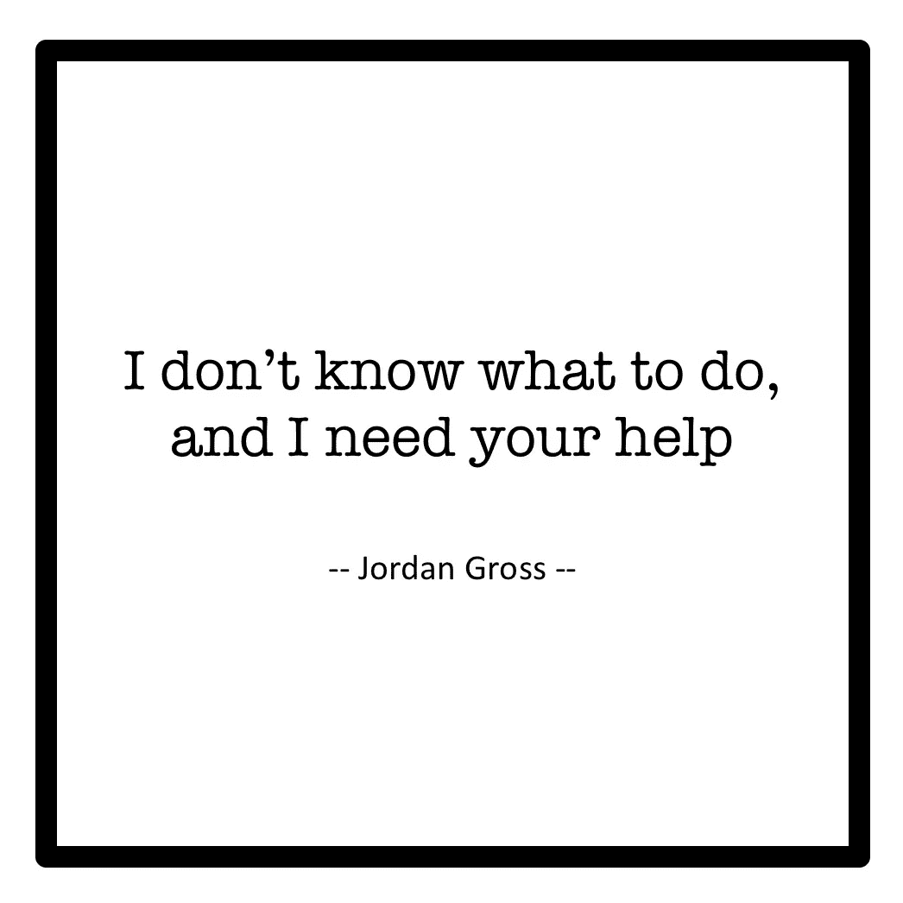

# 我不知道该怎么办，我需要你的帮助

> 原文：<https://medium.com/swlh/i-dont-know-what-to-do-and-i-need-your-help-e71e46d33e69>

Image created by Mackenzie Moore

“不知道”并不是我们作为“专家”应该承认的东西。我们应该有所有的答案，总是知道该说什么，并构建完美的词语组合，以创造出将改变某人生活的句子。但是如果事实并非如此呢？如果解决方案超出了我们的极限怎么办？如果我们认为自己无能为力怎么办？

# 当你不知道的时候，你会怎么做？

我的目标是传播积极乐观的信息。我通过最大限度地减少压力和焦虑来促进心理健康意识，通过一个简单而有效的叫做“舒适”的早晨惯例来专注于改善我们自己。我有幸听到了许多人的意见，收到了一些有见地的问题，最重要的是，通过改变早晨，我彻底改变了人们的生活方式。

我当然受到了挑战，不得不做大量的研究和数小时的思考，来为各种各样的生活疑虑寻找答案。我的每一个回答都是个性化的，针对我被问到的人和问题。我拒绝给出任何千篇一律的回答，复制粘贴，或发送自动消息。对我来说，真正的互动是最重要的。

我的回答很受欢迎，我继续与每个与我联系的人交谈，因为我是一名导游，通过提问和回答、好奇和发现来引导。我能够提供让人们能够采取行动的策略，并且有适合每一种情况的想法。

也就是说，直到现在。

# **黛利拉令人畏惧的困境**

一个女人，让我们称她为黛利拉，联系我关于当她和她的家人有严重的健康问题，有健康问题的历史，没有钱，没有动力去寻找幸福时，她如何能“舒适地”生活。我积极乐观地回应，并立即采取措施改变她的心态和每天的生活方式。黛利拉是如此勇敢、脆弱和诚实，她将自己的生活故事和情感倾注到页面上，而我想做的只是以某种方式为她和她的家庭增加一点价值。黛利拉身上似乎有着极其特殊的东西，但与此同时，我有一种感觉，仅凭我年轻时的旺盛精力不足以化解她目前的困境。

我是对的。

一天后，黛利拉回复了一封更加激烈的信。泛泛而谈变成了具体问题，她透露了更多关于每个家庭成员及其具体疾病的信息，尽管她很感激，但我对她最初询问的回答并没有给她留下深刻印象。当我读到她提到的疾病，身体和精神上的疾病，她经历的奇迹和遭遇的悲剧时，我知道我已经不知所措了。

但是黛利拉对我来说很特别，所以我挖掘，我深入挖掘，我研究，我阅读，我倾听，我写作。但我写的东西似乎都不是“解药”。总有一些本可以反驳的东西，一些不是特别相关的东西，或者一些对黛利拉和她的家人毫无帮助的东西。我上床睡觉，或者至少尝试着去睡觉，完全没有回答。黛利拉那张不知名的脸在我的脑海中盘旋，我绞尽脑汁想找到一张毯子，却无法入睡。

# **认输**

我尽我最大的努力想出一种方法，我可以提供一些支持或希望的迹象，我确实在给黛利拉的回信中提供了一些故事和建议，但最终我决定让她知道我是一个有救恩的人，并做我能想到的唯一真诚、诚实和体贴的事情。

*承认失败。*

“我不是通过学校教育获得多年经验的专家，我不是医生，我不是治疗师，我不是专业人员，我没有执照，我没有资格指导你和你的丈夫和你的儿子度过充满如此严重障碍的生活。我真的希望我可以，但事实上，我只是一个充满想法的年轻人。我是一个人类实验品，在尝试新事物的过程中，我找到了安慰和快乐，这种尝试让我变得更好，并与他人分享。这就是我要对你做的。但是我提倡的所有想法都只是对抗压力和焦虑，促进积极心理健康的方法，而不是克服身体疾病的方法。当涉及到如此严重的身体健康状况时，我不确定我是合适的倾诉对象。不管怎样，下面是我不得不说的几件小事，它们绝对不能补救你的情况，但希望能让你的情况一天比一天好。”

这就是我写给黛利拉的信的开头。我唯一能做的就是在真相和诚实中寻找安慰。我已经做了我能做的一切，但是我没有成功。但这并不是结束。这就是你进来的地方。

# **我的绝对梦想**

我们怎样才能帮助黛利拉？

在研究黛利拉的困境时，我感到遗憾的一件事是，我没有立即向其他人寻求建议。我相信她的隐私，并有一种不必要的自豪感，认为我可以自己让她开心。但这远非事实。

但这就是为什么对你的请求如此重要。这是我的请求，这是我寻求帮助的呼吁，这是我承认我自己需要指导，我对黛利拉做错了，需要别人的支持和投入来带领她和她的家人走过一条尽头有一线光明的隧道。

当你不知道该对某人说什么时，你会怎么做？管子修不好时，管道工做什么？电线无法解开时，电工怎么办？当病人无法确诊时，医生会说什么？

我现在对这些问题的回答是…我不知道。但我最希望的是这能有所改变。我希望你们都能提供建议和适当的方法来解决这些情况。

套用埃里克·托马斯的话，“我想帮助黛利拉和她的家人，就像我想呼吸一样迫切。”我想让你想想你生命中的一个黛利拉，告诉我，告诉别人，告诉黛利拉自己，你是如何应对这些不可预知的挑战的。

我的梦想是让你就如何战胜这些看似毁灭性的生活障碍发表评论和建议。

我绝对的梦想是让你与水管工、电工、医生和专家分享这一页，当我们不知道该做什么或对某人说什么时，他们会提供他们的输入。归根结底，我们将无法帮助各地的黛利拉，除非我们寻求帮助，拥抱我们的脆弱，并一起这样做。

***给这个故事一个分享，一个评论，或者一个赞。我们都需要它。***

## 这篇文章发表在 [The Startup](https://medium.com/swlh) 上，这是 Medium 最大的创业刊物，有 317，629 人关注。

## 订阅接收[我们的头条新闻](http://growthsupply.com/the-startup-newsletter/)。

