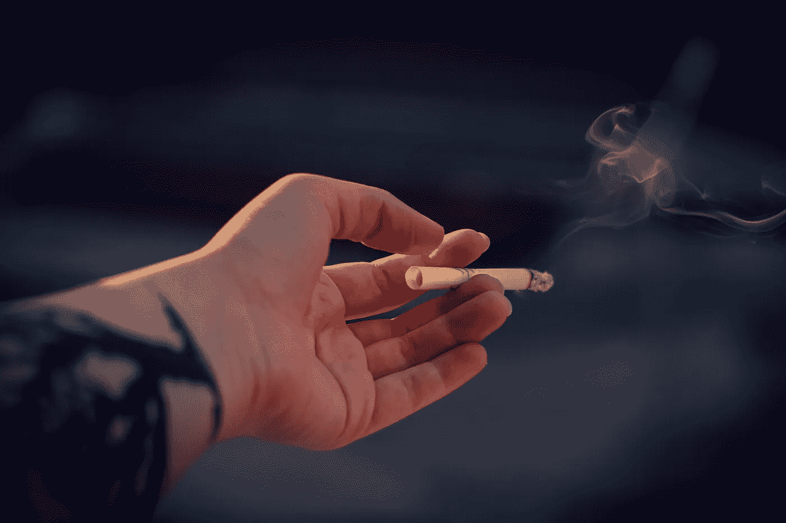

# 我不需要可卡因，我有新闻

> 原文：<https://medium.com/swlh/i-dont-need-crack-i-have-the-news-faf6b1de214e>

# 对新闻的痴迷不是一种无害的消遣。这是从重要的事情上转移注意力

Photo by [Irina Kostenich](https://unsplash.com/photos/Pdty4SxW-2E?utm_source=unsplash&utm_medium=referral&utm_content=creditCopyText)

我的办公室有一台静音的电视，上面有一个新闻播报器，方便地放在浴室入口的上方。我不认为自己是新闻迷，但我不能把目光移开。这是一场正在展开的灾难，我需要仔细观察，直到它离开我的视线。