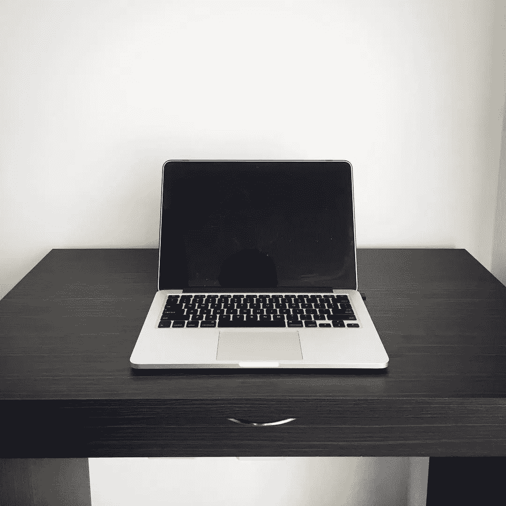
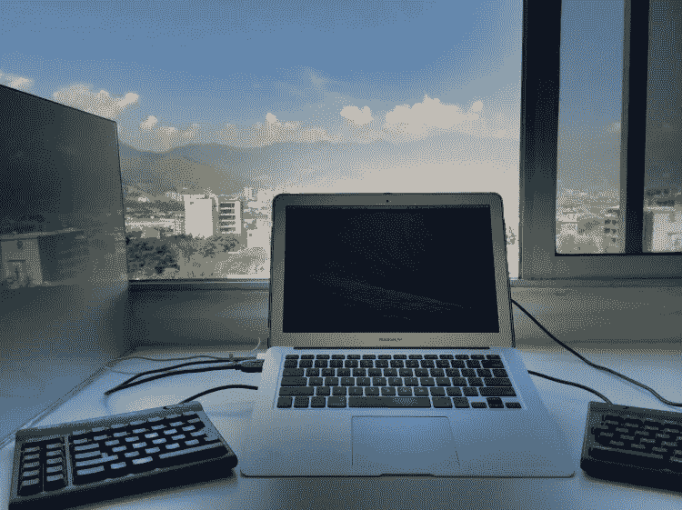

# 我的桌子面对着这面空白的墙，因为#YOLO

> 原文：<https://medium.com/swlh/i-face-a-blank-wall-every-morning-yolo-d9b0214728eb>

Today’s office #YOLO!

## 工作的时候就工作。不工作的时候不要工作。

我的公寓风景很好。我工作的时候尽量不去看它。

我曾经和一个甜美的景色一起工作，就像我有这个景色的时候。

但我不再那样做了。相反，我面对的是一面空白的墙。

我曾经意识到[生产力是关于头脑管理，而不是时间管理](/@kadavy/mind-management-not-time-management-25ebd3a58dc6#.3hzkajqsg)。当我在写[我的书](http://www.amazon.com/Design-Hackers-Reverse-Engineering-Beauty/dp/1119998956?tag=kadavyinc-20)的时候，我花了 12 个小时拼命撞墙，只为了得到 15 分钟的*心流*——写起来很容易。

从那时起，我就密切关注什么样的条件最能让我进入心流状态。

早上第一件事，当我还昏昏沉沉，耳朵里塞着耳塞，面对着一面空白的墙，是我写得最好的时候。我在早上的第一个小时内就能写出一篇 500 字的中型文章。

一天面对一面空白的墙 8 个小时听起来很无聊，对吧？嗯，我也不这么做。我通常每天面对那面墙大约 3-4 个小时。下午，我会去咖啡馆，经常阅读、研究[播客](http://kadavy.net/podcast)嘉宾，或者在笔记本上头脑风暴一次采访的轨迹。我一般不带电脑。

下午，当我的大脑敏锐的时候，在一个熙熙攘攘的咖啡馆里，我耳边的第谷潘多拉车站，是我最擅长进行高层头脑风暴的时候。

我们的目标是在正确的时间、正确的环境、使用正确的工具做正确的工作。

*   能量循环决定了一天中做某些工作的最佳时间。[前额叶皮层受损的人更容易解决洞察力问题](http://kadavy.net/blog/posts/love-your-work-episode-8-creating-aha-moments-with-neuroscientist-dr-john-kounios/)。因此，我昏昏沉沉的早晨最适合创造性工作。
*   **我工作的设定**可以作为让我的大脑进入正确状态的工具。我的纪律在早上是不存在的，所以我有一个严格的例行公事，不被诱惑凝视窗外有助于我工作。
*   我使用的工具帮助我的大脑在正确的水平上集中注意力。在笔记本里，没有诱惑，只有我的想法。在 iPad 上进行研究时，我的大脑很难合理解释它会“就一秒钟”检查脸书我甚至在液晶显示屏很差的键盘上写一些模糊的东西，这样就不会分心。

你只活一次，为什么要稀释它试图同时在两个地方？当我工作时，我为那种工作创造条件。当我不工作的时候，我不工作。我为那些人感到难过——当我去我的大楼的屋顶游泳池时——当我欣赏风景时，他们的脸粘在他们的手机上。

***看看这个*** [***杰森·弗里德***](https://medium.com/u/c030228809f2?source=post_page-----d9b0214728eb--------------------------------)*[***谈论《梅奥诊所无压力生活指南》这本书***](https://www.youtube.com/watch?v=Znfn8-9Qomk&index=10&list=PLfqwGBitI-eU9yViSXCQSTs0UDos1S4lU)***上我的播客*爱你的工作*。(*** [***在 iTunes 上订阅***](https://itunes.apple.com/us/podcast/love-your-work-w-david-kadavy/id1067860103?mt=2)***)****