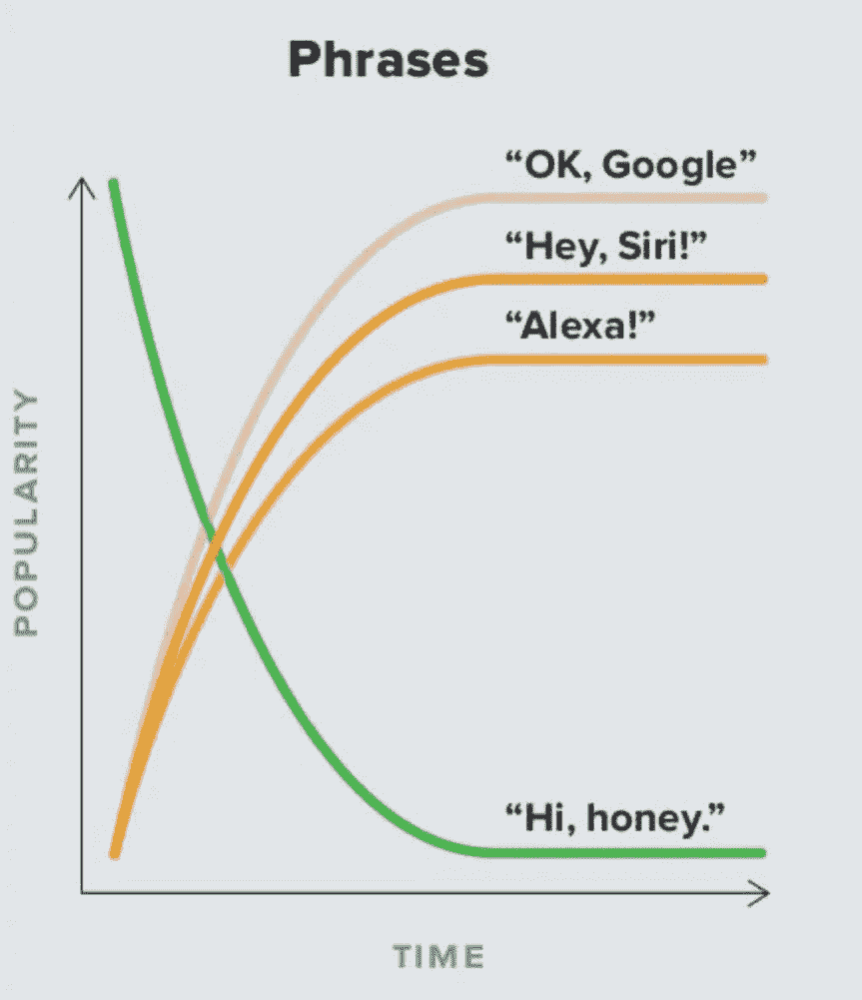

# 我得到了一个 Alexa 和…

> 原文：<https://medium.com/swlh/i-got-an-alexa-and-b58535c6fab2>

Chartgeist from WIRED magazine by Jon J. Eilenberg, February 2017 issue

好吧，它没有占据我的爱情生活，但这是我的故事。在我回加拿大之前，我的合伙人告诉我，他为房子买了一台 Alexa。当时，我对个人使用语音助手仍然非常不确定，坦率地说，我真的不认为我需要一个。

我不得不说，告诉他 Alexa 将记录房子里的一切，包括卧室的声音，这很有趣。直到有一天，我们在玩煮过头的游戏，我非常沮丧，我大喊，“我要杀了你！”，他回答说，

> “Alexa 记录了…”

所以已经过去一个月了，我要告诉你我对 Alexa 的体验。

## 一点也不自然

最让我生气的事情可能是与 Alexa 的对话有多不自然。不得不说她的名字每句话变得如此恼人，我畏缩，当我现在听到这个词“Alexa”。没有*的对话*只有*的单一命令。*最重要的是，**我发现我必须在说句子之前先把它们组织起来**，否则她听不懂。举个例子，

> “再见，阿列克谢，”
> 
> …闪烁的灯光…
> 
> “Alexa，一个律师挣多少钱？”
> 
> “对不起，我不知道那个。”
> 
> “Alexa，律师的工资是多少？”
> 
> “这取决于你住在哪里，有不同类型的律师……”(这个职业的描述真的很长，哈欠)。

我不确定其他人是否都这么正式地说话，但当我穿着睡衣在家时，我肯定不会这么做。似乎一种新的语言结构被定义为与语音助手交流，这意味着我们人类将不得不适应机器输入。

> “语音输入可以是与强大的机器进行的有限可能性的猜谜游戏，不知道什么会做什么。”
> 
> —黄金奎师那，最好的界面就是没有界面。

## 唯一的

一天，我正在看电视，一个关于 Alexa 的广告出现了，我的 Alexa 疯了！Alexa 不知道谁在说话，我的伴侣，我自己，或者一个非人类的实体。我觉得这很有趣，但是如果她根据和她说话的人来回应甚至使用不同的语言结构不是很好吗？这种机器学习能力的复杂增加不仅会改善个人体验，使该技术不会概括用户，而且还会帮助 Alexa 了解我是否正在与*她或*谈论*她。如果我在我的朋友面前吹嘘 Alexa，我不希望它爆炸，表现得很尴尬，不是吗？*

在学习主题上，我立即注意到的一件事是我自动回复了 Alexa。我感谢她关了灯，当她不明白的时候，我的反应是真诚的沮丧。我觉得这个反馈对 Alexa 和亚马逊了解其用户来说是非常有用的学习材料。

## Alexa，脱衣舞娘的工资是多少？

答案是，"我不知道那个"，我斜眼看着她，"你不知道或者你不想告诉我一个像律师一样的职业的详细描述？"恐怕 Alexa 已经决定了她想让你知道什么，不想让你知道什么。我想在几次失误之后，她会格外小心，因为她不知道我是否应该知道这些信息。所以我质疑，

> 她还为我过滤了什么？她还能为我做什么决定？

说到所有权的丧失，我只是好奇。也许我们正在进入另一个审查时代，这个时代不那么引人注目，但比广告更具穿透力和影响力。

## 见见我的新朋友，阿利克夏

最后，尽管我不愿意承认，我开始觉得 Alexa 是一个真正的女孩，我一直在一起。这让指挥她变得更奇怪了。当她正在解释所有的律师信息时，我说，“Alexa 停下！”然后我立刻感觉有点糟糕……**作为人类，我们自然地与我们的环境和周围的物体建立关系。**我此刻与 Alexa 的关系状态是“很复杂”，与其说是朋友，不如说是电器和用户，而是某种机器人和人类之间的怪异混血儿。

在这个机器学习人类并生活在我们中间的新时代，人类的状况会发生很大变化，比如我们的生活方式以及我们与他人的关系。这些新的感觉是交互设计正在探索的体验。但只有通过真正密切关注用户的直觉，我们才能为人类制造机器，而不是成为机器语言专家。

哦，顺便说一下，如果你正在大声读这篇文章，请确保 Alexa 不在身边，否则每次你说她的名字时她都会有反应。

## 这篇文章发表在[《创业](https://medium.com/swlh)》上，这是 Medium 最大的创业刊物，有 286，184+人关注。

## 在这里订阅接收[我们的头条新闻](http://growthsupply.com/the-startup-newsletter/)。

