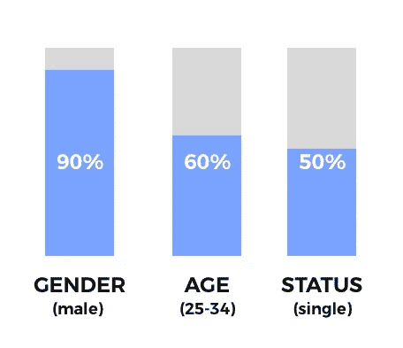

# 我讨厌黑色星期五，停止给我发垃圾邮件。

> 原文：<https://medium.com/swlh/i-hate-black-friday-please-stop-spamming-me-de9e3d141838>

成功公司如何利用人工智能和机器学习突破节日噪音的案例研究。

我讨厌黑色星期五。

这么多噪音，这么多来自互联网上每一家公司的无聊噪音。

面对现实吧，他们会毫不犹豫地给你发邮件。

交易。交易。交易。

九折、八折、七折。

**无处不在**

不聪明的，无知的，无脑的，愚蠢的，索然无味的，乏味的以及其他许多愚蠢的同义词。

几乎不可能过滤掉所有这些噪音和疯狂。

你可能会猜测营销人员精通技术，会根据你的兴趣定制营销活动？

你以前的购物行为，邮件，信息，对吗？

因为现在深度学习人工智能无处不在。

**没有**

大多数公司对此不屑一顾。

作为风险工作室的合伙人，我很幸运在这个行业与许多伟大的创始人/企业一起工作，我看到他们在营销方面一次又一次地犯同样的错误。

这一次不同。

我很幸运地告诉你为什么。

## 简介:大品牌，大需求

我们的投资公司之一 BoxBlvd 因与斯坦·李(漫威漫画的创作者)和卡通网络合作而闻名。

是的，你知道他们的作品，你可能已经看过至少一部最近上映的漫威电影:雷神、蜘蛛侠、复仇者联盟等等。

那么，如果这些大品牌已经赚了几十亿美元，科技创业公司如何帮助它们呢？

总的来说，大品牌最大的困难是理解他们的超级粉丝。

高度参与并热爱品牌的观众实际上会购买他们推出的所有产品..

我们不是在谈论斯坦·李拥有的 70 亿脸书页面。

这些对于喜欢帖子、分享迷因和社交证明来说都很棒。

但这也是它的终点，尤其是在脸书页面缺乏有机流量的情况下。

识别和理解超级粉丝是困难的。

这就是机器学习真正能帮上忙的地方。但是任何人工智能的成功应用都需要数据。

品牌需要初始数据集，包括寻找什么样的受众，他们住在哪里，他们喜欢什么，他们如何说话，什么让他们微笑。

所有这些。

为了解决这个问题，BoxBlvd 想出了制作独家体验的主意，每隔几个月就把它们送到粉丝的门口。

## 成功了。

成千上万的狂热粉丝参与其中，创造了一个真正粉丝的底线。

同样的事情发生在另一个客户身上，推出了一个收藏箱。前所未见的洞察力和最有吸引力的粉丝数据，愿意做任何事情成为独家体验的一部分。

# 缩放超级风扇

BoxBlvd 在提供这些神奇的体验方面非常成功，但主要是推动品牌的营销消防水管，这受到脸书有机接触、Twitter 算法反馈和其他社交媒体渠道的限制，这些渠道实际上不起作用。

因此，他们决定根据现有的收集数据，开展一场真正智能的黑色星期五营销活动。

## 识别受众

他们从分析现有用户开始，最终目标是获得更多这样的观众。

首先，他们必须用公共社交媒体档案中的数据来丰富当前用户的数据。有许多工具可以帮助这一点，包括人工智能驱动的 Hank。

然后，他们在所有公共信息的基础上运行人口统计分类器。

结果令人印象深刻，对每个人都有意义。

因此，他们更深入地投入资源建立了一个亲和力分析模型，该模型将了解这些粉丝关心的是什么。

这一分析对他们喜欢哪些个性(演员)，他们消费什么内容(电影)，他们更喜欢哪些娱乐频道给出了惊人的理解。

然后是真正了解那些人是什么样的性格的时候。

有许多工具可以从社交媒体中分析个性，其中大多数都使用传统的机器学习技术和回归分析。

BoxBlvd 迭代了该领域的现有工作，并将其应用于丰富的数据集。

他们使用五分预测模型来识别性格特征，结果令人震惊。

*   责任心:有责任心，有组织，有毅力。有责任心的人是非常可靠的，他们往往是高成就者、勤奋者和计划者。
*   外向:外向、友好、自信。友好和精力充沛，外向的人从社交场合中汲取灵感。
*   宜人性:合作、乐于助人、有教养。宜人性得分高的人是和平维护者，他们通常乐观且信任他人。
*   神经质:焦虑、缺乏安全感、敏感。神经病患者喜怒无常，紧张，容易经历负面情绪。
*   开放的体验:好奇，聪明，富有想象力。高分者倾向于艺术化，品味高雅，欣赏不同的观点、想法和经历。

(对于那些对实际实现感到好奇的人，我在文章的最后附上了研究论文)

那么，在你赢得了观众的理解之后，下一步是什么呢？你需要获得更多的观众，并试图将现有的观众转化为更多的超级粉丝。

而且 2017 年还可以预测的渠道也就那么几个。

## 电子邮件死了，是吗？

正如 Mailchimp 报告所说的那样，娱乐/电子商务行业的平均邮件打开率约为 15-20%。

这远远高于大多数营销机构向订户发送电子邮件的体验。

这里有一些真实的数据，**不太好**如你所见。

但是，如果你根据个性分析、亲和力机器学习模型和丰富的社交媒体数据的见解，精心制作完美的个性化电子邮件，会怎么样呢？

这就是人工智能的神奇之处。

通过对现有的用户数据集和类似的社交媒体资料进行聚类，BoxBlvd **实现了自动化个性化**。

以下是卷积深度学习模型让他们发现的东西:

*   按人口统计分类(他们是谁)
*   按位置分类(他们居住的地方)
*   按个性分组(如何有效地与他们沟通)
*   按俚语、地点和个性分类(如何与之相关)

此外，了解特定人在一天中的活跃时间也很重要，因为这通常会严重影响打开率。幸运的是，汉克丰富的社交资料已经包含了这一点。

通过使用这些集群和以前的营销电子邮件，自然语言处理模型结合[递归神经网络](https://machinelearningmastery.com/text-generation-lstm-recurrent-neural-networks-python-keras/)生成了**成千上万个独特的电子邮件模板**。

结果:惊人的 **35%的打开率**。

如果你考虑到每个人在 11 月 24 日收到的促销垃圾的数量，这是非常高的比率。

令人印象深刻，完全值得努力。

## 剖析成功的电子邮件模板

那么是什么让这些电子邮件模板如此成功呢？

基本上，什么都有。

从为受众量身定制的邮件主题，到发送邮件者的邮件签名。

每个电子邮件模板都经过处理，以最大限度地激发情感。当然，有些电子邮件没有任何意义，但这是人类编辑它们的地方，让它们听起来更自然。

# **以上邮件包括:**

## **公司代表的个人接触**

毫无疑问，人们会忽略充满图像和大量文本的电子邮件广告，它根本不起作用。你上次关注这些是什么时候？

## 情感短语

## 基于个性和地点的文本俚语变体

是的，神经网络在特定地点的俚语数据集上接受了训练，并生成了那些没人理解的德州短语。

通过使用 word2vec 单词距离和最常见短语的字典来转换电子邮件模板短语。

## 个性调整短语

## 亲缘关系

粉丝喜欢特定的演员、频道等，所以很容易让一部分观众产生共鸣。

# 脸书的广告不起作用

大多数时候社交广告都很贵。尤其是如果营销人员不了解目标定位。

尽管脸书提供了有史以来最先进的瞄准引擎。遗憾的是，没有将它与 BoxBlvd 发现的所有见解结合起来使用。

但是你如何更进一步，实际上个性化与广告的互动呢？以避免反弹的流量和无意义的网站点击。再次，人工智能来拯救。

## 机器人已经死了

脸书信使[对互联网上的大多数人来说，机器人似乎是一种垂死的趋势，在我看到这些结果之前，我也是这样认为的。](https://www.quora.com/Are-messenger-bots-dead)

但是你可以用它们设计出很多聪明的黑客。你的创造力成为限制因素。

BoxBlvd 创建了吸引人的广告帖子，请求在评论部分进行互动，以获得黑色星期五优惠券 25%的折扣代码。

为什么？有什么意义？

显然，除了社会证明和工程参与。

**关注是目标。**

诀窍是:用户在页面帖子下发表评论后，页面可以通过向用户的收件箱发送消息来联系用户。

这是一个直接的沟通渠道，直接进入人的信使，你猜怎么着…

它甚至比电子邮件转换得更好。

神奇的是，你可以设置聊天机器人来理解更复杂的请求，比如“我什么时候能收到盒子？”只要你投入时间和资源来训练你的聊天机器人，你就可以帮助管理客户服务请求。

显然，没有任何人工智能，你仍然可以做到这一点，亚洲某个地方的外包团队可以管理你的页面。但是如果你能从自动化和对话式界面中获益，那还有什么意义呢。

# 有了

我们正处于智能营销浪潮的开端。很少有营销人员真正理解数据驱动方法的力量，这让公司损失了很多钱。

尽管竞争激烈，噪音和注意力缺乏缓慢但肯定地要求在整个营销栈中使用人工智能。

所以，让我们拥抱它，我的营销朋友们。

是的，你。

那些给**发了 67 封看起来一模一样的花哨电子邮件**的人，他们告诉我如何才能让一些我根本不在乎的东西打五折。

谢谢你。

PS:设计师朋友们，请停止做这些横幅，它们对:D 没有帮助

如果你喜欢这篇文章，请与你的营销朋友和企业主分享。期待看到他们明年黑色星期五的活动。

## 提及次数:

[*BoxBlvd*](http://boxblvd.com/) ，为品牌带来超级智能革命的科技创业公司。

[*【斯坦·李盒子】*](https://stanleebox.com/) ，来自斯坦·李的收藏品专属订阅盒，附赠亲笔签名。

[*Hank*](http://hankleads.com) ，由机器学习驱动的线索生成服务，用于查找电子邮件并最大化打开率。

[*从推特*](http://www.demenzemedicinagenerale.net/pdf/2011%20-%20Predicting%20Personality%20from%20Twitter.pdf) *，*詹妮弗·戈尔贝克、克里斯蒂娜·罗伯斯、米琼·埃德蒙森和凯伦·特纳的研究论文*。*

[算法学](http://algr.co/medium)，给我的追随者的特别礼物，访问我的关于如何与人工智能做生意的仅限受邀者的简讯。

## 这篇文章发表在《创业》上，263，100 多人聚集在一起阅读 Medium 关于创业的主要报道。

## 在这里订阅接收[我们的头条新闻](http://growthsupply.com/the-startup-newsletter/)。

