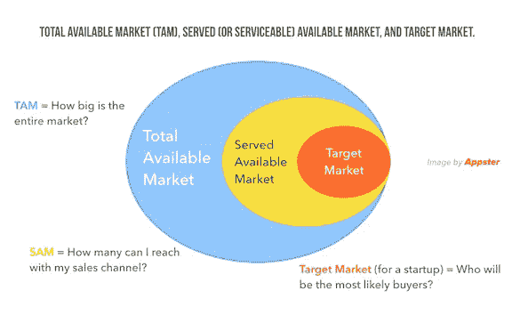
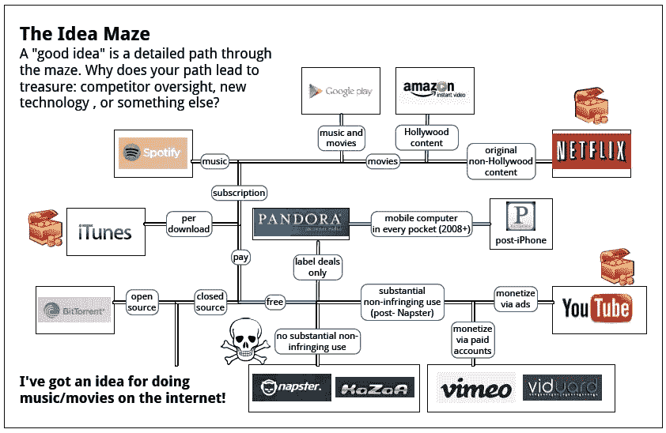
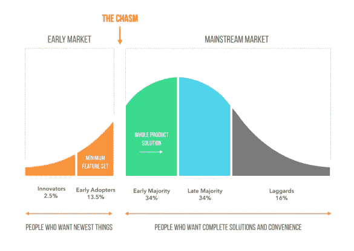
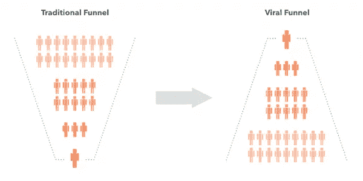
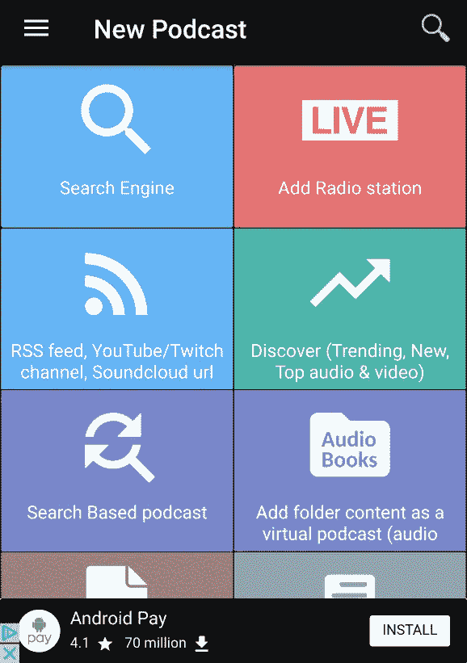
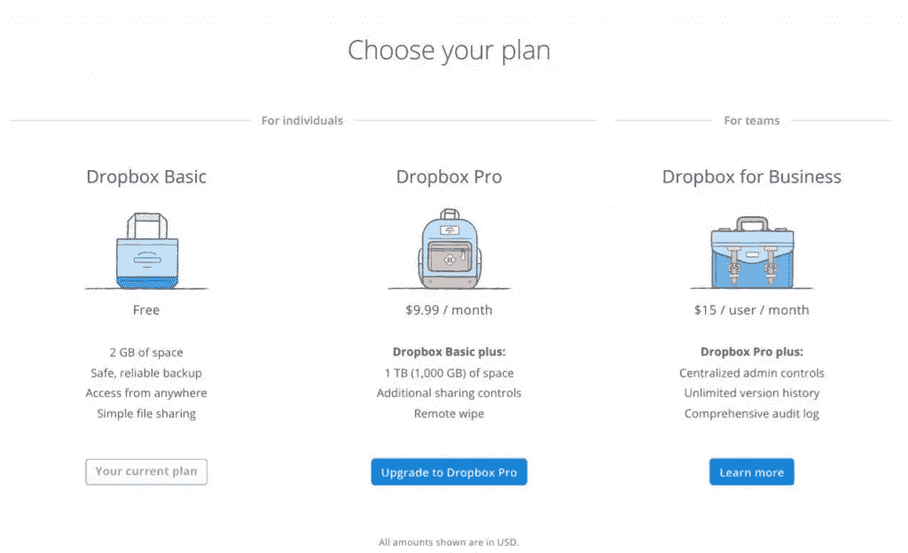

# 我有一个应用程序的想法，现在呢？

> 原文：<https://medium.com/swlh/i-have-an-idea-for-an-app-now-what-5bfe9e95148f>

Originally published on [http://www.appsterhq.com](http://www.appsterhq.com/?utm_source=CP&utm_medium=Medium)/

如今，手机应用比以往任何时候都更受欢迎。

W 目前[共有 500 万个应用程序可以在谷歌的 Play Store 和苹果的 App Store 上下载](https://www.statista.com/statistics/276623/number-of-apps-available-in-leading-app-stores/)，应用程序的数量正在飙升，这一趋势表明[没有放缓的迹象](http://www.business2community.com/infographics/mobile-apps-usage-statistics-trends-infographic-01248837#DhY7LiJ89FAhhCOR.97)。

随着如此多的企业家试图开发下一个真正“颠覆性”的应用程序，很可能你也有一个潜在突破性应用程序的想法。

但是，如何通过从*概念*到*执行*将你的想法变成现实呢？

在当今这个混乱的世界里，你如何围绕你的应用开展业务？

在这篇文章中，我将讨论将你的想法转化为应用产品的基本策略，并分享一些在 Appster 与我们合作的学员的实践案例。

让我们从最明显的一个开始。

# 1.从问题开始

亿万富翁[维诺德·科斯拉](https://youtu.be/K6Jrt6A_Bzw)曾有一句名言:

> “如果没有问题，就没有解决方案，公司就没有存在的理由。没有人会付钱给你去解决一个无关紧要的问题。”

任何成功的产品或服务的本质，包括一个应用程序，都在于它解决特定问题的能力。

如果你想象的应用程序不能以某种方式让人们的生活变得更好，也就是说，如果它不能为世界增加价值，那么就没有人会使用它。

W 无论你是从*增加*某种东西(例如，增加的快乐、兴奋或乐趣)还是从*带走某种东西*(例如，减轻无聊、悲伤或不安全感)的角度来考虑这件事，你的应用程序必须解决人们想要摆脱的特定问题——否则它就会失败，就这样。

一旦你发现了问题，你就需要确定这个问题是否足够重要来支持产品的创造。

你是怎么做到的？通过确认问题是一个“ [**可货币化的客户痛苦**](http://www.appsterhq.com/blog/early-stage-entrepreneurs-launch-profitable-startup) ”。

我以前曾以如下方式描述过这个概念:

> *“成功地建立问题/解决方案的契合需要发现并彻底理解客户的痛处，这种痛处如此重要，以至于足够多的人不仅认识到它的存在，而且愿意为其解决方案支付高价。*
> 
> *在 1-5 的痛苦等级中，* ***可货币化的痛苦*** *为 4 或 5，即 it* ***需要立即解决。***

*(货币化客户痛苦的一个例子是需要以完全分散的方式即时购买/销售商品和发送/接收资金，这是当今加密货币的基础)。*

*您如何验证可货币化的客户难题？*

*为了测试您的疼痛假设，您必须:*

*   *找到一个客户样本；*
*   *亲自或在线调查他们；*
*   *评估结果；和*
*   *做更多的测试来完善你对客户需求的理解。*

*[正如我之前提到的](http://www.appsterhq.com/blog/avoid-pitfalls-premature-scaling)，从你的受访者那里获得有效的洞察力需要获得非常诚实的答案:*

> **“与其急切地向你的参与者推销具体的想法，并试图向他们推销你的特定疼痛假说，不如问一些开放式的问题，让回答者自由、公开地发言。**
> 
> *确保你不会明确地告诉你的参与者你正在构思一个商业想法，从而避免误导你的听众，这一点也很重要。”*

*因此，你应该提出这样的问题:*

1.  *X 即问题最难的方面是什么？*
2.  *再讲讲 X，上一次 X 发生了什么？*
3.  *为什么那次经历如此成问题或不愉快？*
4.  *您目前使用什么解决方案来解决 *X* 的问题？你对他们有什么不满意的地方？它们需要如何改变？*

*利用你能接触到的所有线下和线上资源——现有的电子邮件列表、在线留言板、社交网络和微型网站、Reddit、Linkedin、Quora、Meetup.com、行业会议、当地咖啡店等。—寻找潜在的未来客户，收集您需要的详细反馈。*

*一旦你积累了足够多的反馈，可以自信地断言你已经发现了一个需要*解决的问题，是时候验证你的产品想法了。**

*在这种情况下，你的产品创意当然就是你预想的应用。*

*你对困扰你未来潜在客户的问题了解得越多，你就越能清楚地理解你的应用应该做什么以及为什么要做。*

*我的联合创始人 Mark McDonald [最近](http://www.appsterhq.com/blog/test-product-idea-real-world-feedback)回顾了一些关键的产品创意验证策略，你应该在开发应用时使用，包括:*

1.  ***20 美元的星巴克测试**(即，给路人买一杯咖啡，以换取对你客观提出的想法的诚实反馈)；*
2.  ***“敲门式”方法**(例如，使用在线调查、投票和互联网论坛上的个性化信息来收集反馈)；*
3.  ***创建一个测试广告活动并衡量结果**(例如，建立一个便宜而有效的登陆页面，展示独特的价值主张，并允许访问者注册(甚至预购)你未来的应用)；*
4.  ***参加聚会和面对面的活动**收集对你的想法的回应，并向你所在行业的其他人寻求帮助/建议；和*
5.  ***利用你的社交和职业网络，让共同的熟人把你介绍给你所在市场的重要领导者，从而赢得与成功企业家面对面的机会**。*

*这些努力的目的是通过收集“真实世界”中人们的见解，帮助您确保您的应用程序想法处于正确的轨道上。*

# *2.研究市场*

**

*此时，你已经找到了一个切实的客户问题，并且通过与人面对面的交流，验证了你的应用理念。*

*将你的应用从单纯的想法转变为可购买的下载的下一步是彻底研究你计划运营的市场。*

*市场特征——规模、有无需求、金融机会的性质等。—最终决定一个应用的成功(或失败)，正如我在之前[指出的:](http://www.appsterhq.com/blog/build-successful-mobile-app-startup)*

> **“问题的重要性(即价值)取决于其所属市场的规模和增长。为了取得成功，一款应用需要在一个有巨大消费者需求的大市场中解决一个大问题。**

*评估你的应用程序是否有足够大的市场需求需要区分*总可用市场*(TAM)*可用市场* (SAM)和*目标市场* (TM):*

**

*为了回答这个众所周知的问题，“如果我建造了它，他们会来吗？”您需要收集以下方面的数据:*

1.  *你的特定利基所在的整个市场的规模；*
2.  *你期望通过你的营销努力能够接触到的人数；和*
3.  *最有可能购买你的产品的人数。*

*随着你从 TAM 发展到 TM，这些数字必然会变小。*

*除了确定你的理想客户的精确特征(例如，通过开发[用户档案](https://www.techopedia.com/definition/16137/user-profile))，你需要确保你的 TM 足够大，以支持你的应用程序的开发、营销、销售和持续改进。*

*你应该如何开始对你的市场进行广泛的研究？*

*考虑查阅权威市场研究机构的出版物，如 [Forrester](https://www.forrester.com/marketing/about/about-us.html) 、 [Gartner](https://www.gartner.com/marketing/about) 、 [IBISWorld](https://www.ibisworld.com/) 、 [Ovum](https://ovum.informa.com/) 以及 [SEC](http://www.sec.gov/edgar.shtml) 的备案文件。*

*F 最后，计算市场动态的最后一个关键方面涉及通过创建 [Balaji Srinivasan](https://spark-public.s3.amazonaws.com/startup/lecture_slides/lecture5-market-wireframing-design.pdf) 所称的“理念迷宫”来研究你的竞争对手，也就是说，鸟瞰你的产品将在其中营销和销售的整个景观。*

*为你的市场构建一个想法迷宫是至关重要的，因为:*

1.  *它帮助你更好地了解与你在同一领域工作的竞争对手的数量和类型，从而让你对竞争格局有更透彻的把握；*
2.  *它可以通过可视化其他公司没有运营(或运营不佳)的“机会”来规划机会和发现新的可能性；和*
3.  *规划如何在迷宫中导航，最终是你如何成功地将你的想法货币化并建立你的企业。*

*一个想法迷宫的例子:*

**

*对你打算解决的问题、你计划打造的具体产品、你未来客户的独特需求以及你所在市场的具体情况有了充分的了解，现在是时候寻找一位联合创始人了(如果你还没有的话)。*

# *3.寻找联合创始人*

**

*我们这里的 Appster 通常会建议创业者尝试与至少一位其他联合创始人合作开发一款应用。*

*虽然成功的单独创始人确实存在(埃隆·马斯克和马克·扎克伯格是两个明显的例子)，但许多高增长的初创公司实际上是由两三个联合创始人组成的团队的产物。*

*我是从个人经历来说的:我和我的联合创始人马克·麦克唐纳最初是在十几岁的时候一起创建 Appster 的。*

*除其他原因外，你应该认真考虑寻找至少一位其他联合创始人并与之合作，因为:*

1.  *万一你打算在某个时候筹集资金，许多风险投资家和创业孵化器都希望创业公司由多个创造者驱动；和*
2.  *与和一个或多个联合创始人合作相比，完全靠自己开发一个应用程序几乎肯定会带来更大的压力、更多的时间、更多的情感、智力和财务负担。*

*寻找一位才华横溢、勤奋敬业的联合创始人来帮助你开发应用可能并不容易，但有几个在线社区值得参考，包括 [Founder2Be](https://www.founder2be.com/) 、 [FounderDating](http://founderdating.com/) 、[meetup.com](https://www.meetup.com/)和 [Startup Weekend](http://startupweekend.org/) 。*

*除了探索 LinkedIn 等网站和相关的脸书团体，你还应该尝试利用你的职业关系网。*

*至于你可以用来与你的联合创始人建立健康、稳固的职业关系的具体策略，这里有我们推荐的 [5 种方法](https://www.appsterhq.com/blog/introduction-to-startup-equity/):*

1.  ***通过集体确定哪些任务将属于哪个联合创始人，尽早定义角色职责**；*
2.  ***创建并签署一份** [**创始人协议**](https://www.entrepreneur.com/article/236044) 以正式确立职责、股权归属和授予以及知识产权转让；*
3.  ***就时间承诺**达成一致，即就每个人的贡献大小、时间和地点制定明确的预期；*
4.  *决定退出计划，而不是留下关于每个成员最终想用这个应用程序或更广泛的公司做什么的未回答的关键问题；和*
5.  *同意“我们失败了，现在怎么办？”计划，也就是说，尽早决定 a)你和你的联合创始人怎样才能得出企业已经失败的结论，以及 b)需要采取什么应对措施。*

*如果你目前正在与一个或多个其他联合创始人建立关系，那么考虑试用 Appster 的免费[联合创始人协议生成器](http://www.appsterhq.com/startuptools/co-founder-agreement/create)来帮助你创建创始人协议的基础*

*最后，一定要看看这篇文章[这里](http://www.appsterhq.com/blog/strategies-building-start-team)，其中我描述了建立一个出色的创业团队的 7 个基本策略。*

*找到一个或多个可靠的联合创始人后，现在是时候(最终)建立你的 MVP 了。*

# *4.构建并测试您的 MVP*

**

*简而言之，你的“最小可行产品”(MVP)是你的应用程序的一个精简的、仅包含基本要素的工作版本，你向有限的公众发布，试图从“野外”的实际用户那里收集实际的、真实的反馈。*

*[帮助推广 MVP 概念的 Eric Ries](http://www.startuplessonslearned.com/2009/08/minimum-viable-product-guide.html) 将 MVP 定义为“一个新产品的版本，它允许你用最少的努力收集关于你的客户的最大量的有效信息。”*

*Techopedia 列出了 MVP 的三个关键特征:*

1.  *它提供了足够的价值，人们愿意在它推出后使用它和/或购买它；*
2.  *它展示了足够的未来利益来留住早期采用者；和*
3.  *它提供了一个反馈循环，有助于指导正在进行的开发。*

*Appster 首席数字制作人施巧灵·萨洛宁坚持认为，MVP 给了早期用户他们需要的东西，而不是他们可能想要的东西:*

> **“创建和启动你的 MVP 移动应用有点像艺术形式。这一切都是为了在你完全确定用户可能最终想要的每一个特性之前，在给用户提供他们需要的东西之间找到一个合适的平衡点。**
> 
> **这基本上就是你早上喝的没有拿铁的咖啡，也就是说，它含有消费者渴望的咖啡因，但缺少能带来额外快乐的花式鲜奶油和巧克力屑。**
> 
> **你的 MVP 包含了你的应用程序的所有核心特性，即高价值的必备特性，而不是潜在的有价值的好特性。”**

*实际上，MVP 是什么样的？*

*施巧灵提供了一个假设的音乐流媒体应用程序的例子，这个例子很有启发性:*

> **“这款应用程序的关键和本质是什么？用户可以将他们的个人音乐上传到一个平台，其他用户可以从中发现新的音乐和艺术家。为了让这款应用对你的初次用户有足够的吸引力，你可能会让他们选择保存一些他们最喜欢的歌曲/艺术家，以便以后收听。但仅此而已。那就是你的 MVP。”**

*建立你的 MVP 并致力于将它交到你的 [alpha 和 beta 测试人员](https://www.techopedia.com/7/32121/software/software-testing/what-is-the-difference-between-alpha-testing-and-beta-testing)的手中，很快迫使你去问和回答一些重要的问题，比如:*

*   *我的 app 的本质是什么？最重要的是，是什么让人们想要使用它？*
*   *哪些是必备功能，哪些是最好的功能？*
*   *我必须在 1.0 版中包含哪些特性？我能把哪个留到以后？*

*正如[团队](https://crew.co/how-to-build-an-online-business/app-development-timeline/)的人指出的，“你构建的功能越多，你的产品就越复杂，构建你的应用程序就需要越长的时间。”*

*关键是你要保持专注于开发和发布你的 MVP，这样你就可以尽快从实际用户那里收集非中介的反馈。*

*你在最初开发过程中添加的每一个额外的“铃声和哨声”都会自动延长你的应用程序最终到达真实用户手中的时间长度。*

*你能准确确定你的应用程序在“实验室之外”会如何运行的唯一方法是给终端用户机会，让他们以他们认为合适的方式使用它。*

*你的内部(alpha)测试人员将*而不是*发现代码中的每一个 bug，不管给他们多少测试时间，所以让外部(beta)测试人员有机会尽早使用你的应用程序是至关重要的。*

*在这一点上，[施巧灵警告创始人](http://www.appsterhq.com/blog/mvp-app)要高度警惕，如果他们的团队开始提出类似“如果我们让用户能够“我们为什么不加？”或者“需要多长时间才能改变？”：*

> *当这种情况发生时，你就有麻烦了！为什么？因为这正是企业家不必要的分心，并最终偏离将其 MVP 推向市场和收集消费者真实反馈的道路。你必须自律，为未来版本的应用程序搁置这些开发/更改。”*

*让我们通过查看与启动应用程序相关的最终动态来结束本文。*

# *5.营销、指标和财务*

**

*就营销而言，你必须考虑杰弗里·摩尔在《跨越鸿沟 一书中的基本观点。*

*M oore 认为，创业公司必须专注于成功地主导早期采用者市场——修复漏洞，回应客户的担忧，赢得用户的心，并稳步建立品牌声誉——然后才有可能希望“跨越鸿沟”,在主流市场寻求成功:*

**

*在评论这个话题时，[我最近指出了](http://www.appsterhq.com/blog/3-crucial-features-high-growth-startups):*

> **“成功的公司知道何时跨越从早期采用者到主流人群的鸿沟。**
> 
> **要成为真正的颠覆性应用，新应用必须首先主导早期用户市场。早期采用者对新奇事物持开放态度，如果出现产品缺陷也相对宽容。**
> 
> **一旦产品在早期采用者中获得成功，其背后的公司就可以通过成功锁定主流用户来利用这种急需的验证。**
> 
> **当主流消费者知道他们不是被强加一些潜在不可靠的小玩意的“试验品”时，他们可能会更容易接受一种产品。”**

*主流消费者想要的是安全性、可靠性和品牌认知度，而早期采用者热衷于使用新技术，因为它新颖且前沿。*

***无论是测试你的 MVP 还是在公开发布后推广你的应用，向最有可能使用它的人推销你的应用都是至关重要的**。*

*十有八九，是早期用户会乐意试用你的应用，并鼓励他们的朋友使用它，而不是典型的中年足球妈妈或老年祖父母。*

*说到推广你的应用，我们已经整理了一篇关于 8 种成功策略的文章[来为你的应用吸引正面的公关。](http://www.appsterhq.com/blog/public-relations-for-bootstrapped-startups)*

*你应该知道的营销的另一个关键方面是，在当今以技术为中心的世界中，需要利用“[病毒循环](http://www.appsterhq.com/blog/startup-growth-viral-loops)”。*

*传统营销的日子已经一去不复返了，在传统营销中，企业支付大量的资金来为他们的产品(网站、应用等)吸引流量。)努力将一小部分流量转化为活跃的付费客户。*

*今天，病毒式营销漏斗是新的标准:不是大量的潜在客户转化为少量的实际客户，而是一些实际客户帮助带来更多的客户。*

*有了病毒式营销，每个新用户带来一个或多个新用户，然后新用户自己带来一个或多个新用户，以此类推:*

**

*病毒营销和病毒循环植根于激励性实践，鼓励你的应用程序用户向他人推荐/分享它。*

*为了创造病毒循环，有效地将你的用户转化为大使，也就是说，转化为为你的应用招募其他人的人，你必须为你的用户提供一些*价值*的东西。*

*这必须是能让他们愿意带他们的朋友、家人和/或同事来看你的产品的切实和直接的东西。*

*优步的双向推荐代码系统是一个明显的例子，根据该系统，当同样获得 20 美元骑行积分的人 B 使用人 A 的唯一推荐代码注册优步时，人 A 获得 20 美元的免费骑行积分。*

*事实上，优步的推荐系统在 T2 非常成功，大约 50%的新优步客户都是通过推荐来的。*

*那么，你会用什么*来激励你的用户，帮助你扩大用户群和你的应用程序的受欢迎程度呢？**

*任何希望将他们的下一个大应用的想法带到 Google 的 Play Store 和/或 Apple 的 App Store 上的人也必须拥有对许多定义性指标的坚实掌握，这些指标必须在发布期间尤其是发布后进行分析。*

*这里列出了任何以应用为中心的初创公司都希望确保准确和经常测量的关键指标(以及一组指向 Appster 文章的相应链接),而不是深入细节:*

***每用户平均收入**([ARPU](http://www.appsterhq.com/blog/track-5-mobile-app-marketing-metrics))；*

***盈亏平衡点** ( [来源](http://www.appsterhq.com/blog/4-financial-metrics-startups-measure))；*

***每次安装成本**([CPI](http://www.appsterhq.com/blog/track-5-mobile-app-marketing-metrics))；*

***每忠实用户成本**([CPLU](http://www.appsterhq.com/blog/track-5-mobile-app-marketing-metrics))；*

***客户获取成本**([CACs](http://www.appsterhq.com/blog/3-crucial-features-high-growth-startups))；*

***客户终身价值**()；*

***净推介值**([NPS](http://www.appsterhq.com/blog/track-5-mobile-app-marketing-metrics))；*

***用户参与度** ( [来源](http://www.appsterhq.com/blog/track-5-mobile-app-marketing-metrics))；和*

***用户留存**(来源: [1](http://www.appsterhq.com/blog/track-5-mobile-app-marketing-metrics) 、 [2](http://www.appsterhq.com/blog/how-to-boost-app-user-retention-rates) )。*

*最后，为了理解你的应用程序如何产生收入，你对货币化和各种其他财务现实有一个清晰的理解是至关重要的，这不仅是“保持运转”的必要条件，也是为你的用户不断改进和完善你的应用程序的必要条件。*

*一方面，有一堆标准的财务概念和指标是你必须知道的，以便作为一家企业生存下去，例如**烧钱率**、**现金流**、**增长**对**利润**、**跑道**和**零兑现日期**(参见我们最近的出版物: [1](http://www.appsterhq.com/blog/4-financial-metrics-startups-measure) 、 [2](http://www.appsterhq.com/blog/startup-burn-rate-guide) 、【T34*

*另一方面，更重要的是，你可以使用许多应用程序盈利策略(在许多情况下，结合使用)来从应用程序的下载和/或使用中获得收入。*

*我最近写了一篇全面的[文章](http://www.appsterhq.com/blog/app-monetization-models)，详细介绍了应用程序创建者可用的 9 种不同的盈利方法，包括:*

*   ***广告**，例如，在您的应用程序本身或您公司的网站上显示第三方广告；*
*   ***联盟营销**，即“通过推广他人(或公司)的产品来赚取佣金的过程”([来源](https://www.smartpassiveincome.com/affiliate-marketing-strategies/)，例如[播客迷](https://play.google.com/store/apps/details?id=com.bambuna.podcastaddict&hl=en)在其屏幕下方托管广告(在这种情况下，是 Android Pay 的广告):*

**

*   ***出售数据**，如 2014 年 FourSquare 向微软出售其位置数据([来源](https://www.forbes.com/sites/kellyclay/2014/02/05/microsoft-invests-15-million-into-foursquare-licenses-location-data/#1fa9fc729467))；*
*   ***免费增值**，即向用户提供产品/服务的基本、功能和完全免费的版本，同时通过向用户提供更高级、功能更丰富的付费版本来吸引用户成为付费客户，例如 [Dropbox 的](https://www.dropbox.com/help/billing/cost)免费版本与付费版本:*

**

*   ***软件即服务(SaaS)** / **订阅**，即定期(通常按月或按年)向用户收取使用你的服务的费用，例如 [Shopify 的](https://www.shopify.com/pricing)分层订阅。*

***//***

***如果你喜欢阅读这篇文章，那么一定要看看我们关于** [**创建一个你的客户会喜欢的令人上瘾的应用**](http://lp.appsterhq.com/how-to-make-an-addictive-app-new) **和** [**构建一个应用**](http://lp.appsterhq.com/how-much-does-an-app-cost-il) **的专家白皮书！***

**原载于*[*www.appsterhq.com*](https://www.appsterhq.com/blog/app-idea-next-steps-execution/)*。**

*//*

*感谢阅读！*

# *如果你喜欢这篇文章，请随意点击下面的按钮👏去帮助别人找到它！*

****

# *对应用程序有想法吗？[说吧](http://www.appsterhq.com/?utm_source=CP&utm_medium=Medium)。*

*在过去的几年里，我们已经帮助建立了超过 12 个数百万美元的创业公司。[了解我们如何帮助您](http://www.appsterhq.com/?utm_source=CP&utm_medium=Medium)。*

**