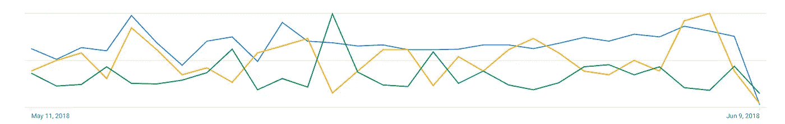

# 我刚刚关掉了谷歌广告词

> 原文：<https://medium.com/swlh/i-just-turned-off-adwords-4601d6ea7aca>

在过去的几个月里，我们每个月花费几千美元来测试 [Paperform](https://paperform.co/?utm_source=medium&utm_medium=email&utm_campaign=adwords-article&utm_content=intro) 的 AdWords 策略。最大的活动是以低于 4 美元/试用的价格产生新的试用用户，鉴于我们从试用用户到付费用户的历史稳定转换率，这应该会转化为一台赚钱的机器。

只有一个问题:AdWords *的试用用户没有转化为付费用户*。实际上，在过去的 3 个月里，我们从 AdWords 试用用户那里收到的唯一付费转换是搜索术语“纸质表格”。这些人不是已经在找我们的可能性有多大？

我必须承认，当我第一次仔细检查 AdWords 线索的转换统计时，我认为我们的跟踪一定有问题。我真的希望 AdWords 成为我们一个可行的、持续的线索来源。但是在查看了 Google Analytics、MixPanel 和 Intercom 之后，我不得不承认 AdWords 对我们不起作用😢。

现在，我不是说 PPC 不能为我们工作，只是作为一个年轻的 SaaS 自举业务，它可能不值得我们有限的时间和资本来使它工作。

*那现在怎么办？*

一旦我花了一天时间去理解，我意识到这并不全是坏消息。在同一时期，纸质表单每月增长 10–15%。因此，尽管有 AdWords，但 Paperform 一直在增长，而不是因为它。在我调查这些数据之前，我们假设过去几个月的大部分增长可以归因于广告支出，毕竟，我们从广告中获得了更多的试用用户。现在我们知道事实并非如此，销售来自其他地方。

那现在怎么办？现在，我们回到我们所知道的有助于业务发展的方法上来。内容、合作伙伴关系、推荐对我们的业务增长是一项不可思议的投资。我们回顾过去，但我们也展望未来。这是一个有趣的困境。经历持续不断的增长，却发现增长并不是来自你想象的地方。

对于如何在 2018 年发展 SaaS 业务，你有什么想法吗？那我们可能只是在找你。

 [## Paperform 正在招聘一名增长型营销主管

### Paperform 是一家位于悉尼的 SaaS 企业，提供工具帮助人们和企业轻松创建美丽的…

paperform.co](https://paperform.co/blog/paperform-is-hiring-growth-marketing/) 

我是 Dean，Paperform 的联合创始人。我们帮助您制作值得骄傲的表格。

## 这篇文章发表在《初创企业》杂志上，这是 Medium 最大的创业刊物，有 333，253 人关注。

## 订阅接收[我们的头条](http://growthsupply.com/the-startup-newsletter/)。

