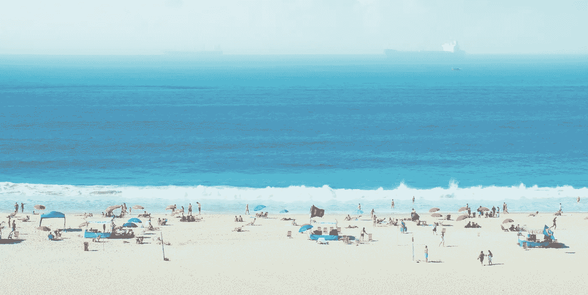
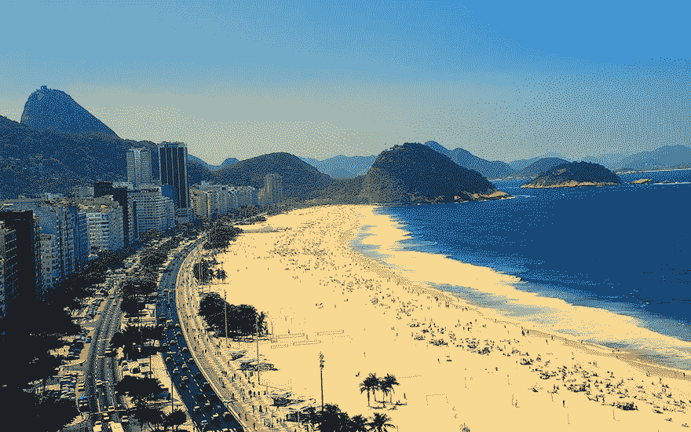
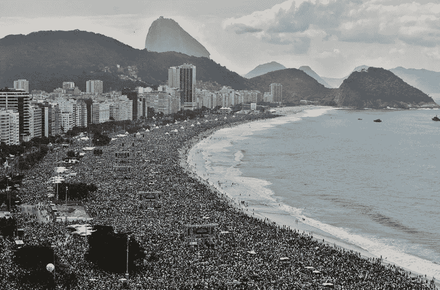
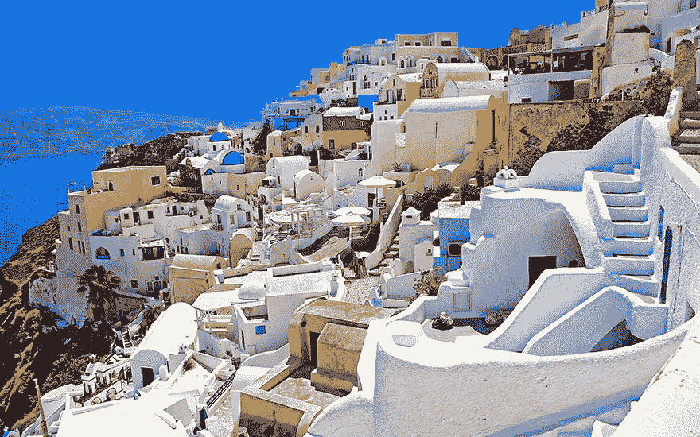
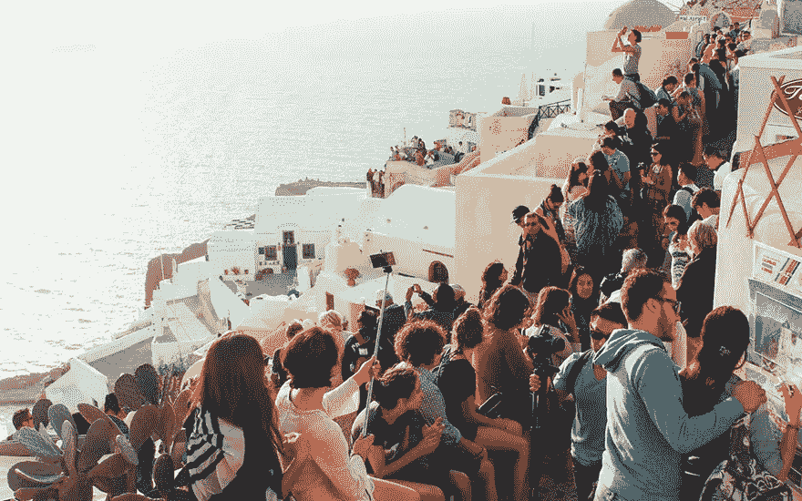
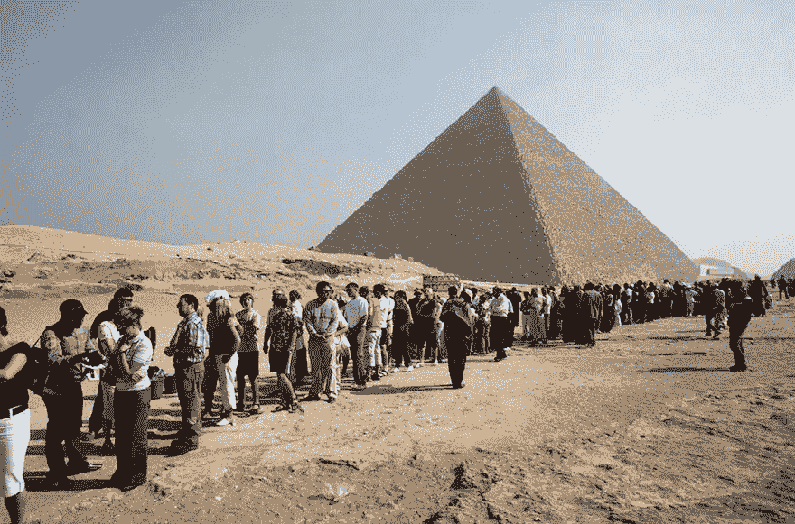

# 我没有活在梦里

> 原文：<https://medium.com/swlh/i-m-not-living-the-dream-58e1426b8792>

我是个流浪者。现在已经两年多了。我在新西兰的冰川上徒步旅行过，在雅典卫城下欣赏过歌剧，在玻利维亚与十几岁的锌矿工人交谈过，在泰国与老虎幼崽玩耍过，在阿根廷做过一些非常见不得人的外汇交易。

我没有活在梦里。

Photo credit: Alexandre Perotto

在与一位想要这种生活方式的朋友交谈后，我决定写下这篇文章。她想卖掉她所有的东西，无限期地环游世界。她不是第一个带着这种计划来找我的朋友。我不能确定，但我偷偷怀疑她在脑海中描绘了一个恒星 Insta 饲料和史诗般的故事告诉她回来。她会得到那些东西，但如果说这就是她能得到的全部，那就太虚伪了。

我想告诉她关于站在澳大利亚海岸的帆船船头的故事。我一整天都在怀特黑文海滩闲逛，在圣灵群岛之间浮潜。然而，当我眺望大海时，我感到…空虚。在一艘挤满人的船上，我感到孤独。我觉得这又是一次日落，的确令人惊叹，但客观上并不比科纳、陶岛、萨马拉或圣托里尼岛海岸的日落更好。我觉得对疯狂美丽的风景麻木了，这吓得我魂不附体。

你可能认为我听起来像一个有资格的混蛋。你可能认为我没有权利发牢骚(一会儿会有更多)。"*他怎么敢一边抱怨一边吹嘘他的飞机设置呢？*

老实说，我同意你的观点。我的生活中有一些令人惊奇的事情。与世界上绝大多数的人相比，我不应该抱怨。但是每当我讲述我遇到了谁，我去了哪里的故事时，我都觉得必须加上“…但是事情并不完美。”

Rio De Janeiro: Expectation vs Reality

事实是，这种生活方式真他妈累人。在 2015 年的大部分时间里，我在同一张床上睡的最长时间是 3 周。这是一次有趣的经历，但我不想再经历一次。虽然我在旅途中结交了一些终生的新朋友，但绝大多数朋友都是转瞬即逝的。我们见面，交换故事，然后在 72 小时内离开。实际上，我们不太可能再见面了。

我不在的时候，我的老朋友也变了。我错过了庆祝、同情和回忆的美好时光。脸书已经成为生日、毕业和乔迁之喜的窗口；如此接近却又如此遥远。我很想亲自去那里，制造内部笑话和新的记忆，但我已经用这些换来了护照印章和文化冲击。如果有的话，我很幸运，我没有错过真正重要的东西——婚姻、出生和死亡。

在过去两年多的时间里，我有过不可思议的经历，但没有人能一直与我分享。我越来越擅长与完全陌生的人分享私密细节，但我越来越不擅长真正感受与人之间的联系。我有过奇迹和辉煌的时刻，其间夹杂着深深的孤独。

Santorini: Expectation vs Reality

然而到了最后，我觉得我没有权利抱怨。我怎么敢把这些壮丽的日落和山顶景色视为理所当然？当我拥有 1%的人拥有的 1%的经历时，我怎么敢抱怨孤独呢？所以我咬紧牙关，露出微笑，掩饰不好的部分(顺便说一句，这绝对是**错误的**方法)。

甚至在我写这篇文章的时候，我还在犹豫要不要发表。我真的真的真的*真的*害怕听起来像一个有资格的冲洗。我觉得有必要为这些机会道歉或表达我的感激之情。因为我很感激。感谢我的便携技能，感谢我(相对)没有债务的事实，感谢我不是女性/同性恋/跨性别/任何会在世界许多地方导致危险和迫害的事情。

我没有活在梦里。

所以就当这是我在说话。我想讲述我的故事，但如果故事是用捏造的瞬间和过滤过的照片讲述的，那它就不真实了。我不会在不坦诚面对低谷的情况下宣扬高潮。因为让我们面对它，美化这种生活方式是走捷径。将一张又一张专辑上传到社交媒体很容易。很容易拍一段北极光的视频，或者在马丘比丘前自拍。谈论早上 5 点起床去做导游，或者你有多么想念你的朋友和家人，这很难。即使对自己也很难承认，一个世界旅行者的生活方式是不完美的。

Giza: Expectation vs Reality

如果你和我一样，一个流浪者，觉得他们应该花更多的时间欣赏高潮，而不是沉溺于低谷，那么我鼓励你说点什么。我鼓励你找个人聊聊，因为相信我，我知道当你不停地在路上时，建立一个支持网络有多难。每隔几天就制定新计划和结交新朋友会对身体和精神造成伤害。没有可以信赖或依靠的人，很容易产生焦虑、孤独，甚至抑郁。

我甚至会鼓励你——喘着气——暂停旅行。回家住几个月，不管在哪里。看望老朋友，结交新朋友，而不需要继续流浪(我知道我打算这样做，因为我累了)。至少，[给我发邮件](http://tinyletter.com/charlierguo)或者[在 Twitter 上给我发消息](https://twitter.com/charlierguo)。大家聊聊吧。

感谢莫莉·麦克莱恩、鲁尼·戈斯瓦米和罗伯·科尔阅读本文初稿。

*如果你喜欢看这篇文章，请点击下方的“心脏”图标，以便更多人能够看到。你可以通过我的创业书籍找到更多关于我写的* [*、通过我的邮件列表*](http://unscalablebook.com) *找到的*和【Twitter】*上的*。**