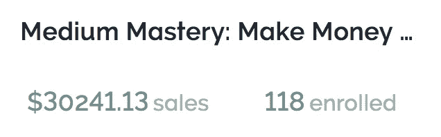

# 去年，我赚了第一笔 3 万美元——以下是我学到的 10 件事

> 原文：<https://medium.com/swlh/i-made-my-first-30-000-last-year-heres-10-things-i-learned-a8c9574ddc6b>

“man sitting on concrete brick with opened laptop on his lap” by [Avi Richards](https://unsplash.com/@avirichards?utm_source=medium&utm_medium=referral) on [Unsplash](https://unsplash.com?utm_source=medium&utm_medium=referral)

去年的这个时候，我创建了我的第一个在线课程。我被吓得屁滚尿流，不知道会发生什么，对他们也没有任何经验。

> 我以前从未买过。

一年后，我坐在这里(谢天谢地)，至今已经赚了 3 万美元。我学到了很多东西，教过 100 多个学生，现在我想告诉你一些我学到的商业经验..

准备好了吗？

振作起来..

# 2-3%的人会讨厌你的产品/服务

> 有人会向你购买。你会说“耶！另一个非常喜欢我的人从我这里买走了！”

你会自我感觉良好，因为那个人不仅仅是在读你的书或和你聊天——他们已经从你这里购买了东西。

把他们的钱委托给你。

事情进展顺利！你对他们感觉良好。然后…

> 一周后，他们会发邮件给你要求退款，因为他们认为你的产品很糟糕。

它发生了。

谁知道他们是否真的试过那该死的东西，但它发生了。这就像你队里的人在 5 分钟内换了球衣。

它发生了——它不常发生——但它发生了。这没关系。这只是生意。

# 让仇恨者说去吧

> 没有提升就是不好的提升。

# 多给两分钟

**我爱客服**。我喜欢超越自我。我认为，我的课程取得一定成功的原因是我喜欢称之为“多给两分钟”的哲学

这方面的例子包括:

1.  在回答学生问题时多写一段..不只是一句话的回应。
2.  评论学生的文章——不仅仅是鼓掌。
3.  用画外音录制你的屏幕，向学生展示你的意思，而不是简单地写一封无聊的电子邮件。

> 你可以称之为“多走一英里”，但我选择称之为“多给两分钟”给时间紧张的人的简单实用的建议。当别人只想要一块巧克力饼干时，你不需要给他们烤蛋糕..但是你可以给他们两块巧克力饼干。

这是一个奇怪的类比，但不要表现得好像你不明白。😉

# 帮助你的客户设定合理的期望值

> 作为专家或产品制造商，我们了解自己的定位。我们知道会发生什么。但大多数时候我们的客户并不知道。

我是一名博客专家，很多时候，当我的学生在 8 周内没有看到 3000 篇文章时，他们会感到不安。

> 他们感到不安不是他们的错，是我没有告诉他们这是一个不合理的期望。如果你能帮助你的客户预先设定合理的期望值，你就能在以后为他们省去很多麻烦。

消除他们的恐惧。转移他们的焦虑。告诉他们一定程度的失败是完全正常的，帮助他们不要摧毁自己的动力。

这是一个很小的调整，实现起来几乎不需要时间——但是它非常强大。

# 不要搬起石头砸自己的脚

在你给 5000 人发电子邮件说你最终会放弃在媒体上写作之前，想一想。关于。它。首先。

> 不要搬起石头砸自己的脚。如果你认为一条推文、一封电子邮件、一篇博客文章或一段视频有风险或误导性……哪怕只有一丁点儿..

不要发表。

# 品味每一次购物

不要把客户看成电子表格上的数字。不要期望每个月赚 X 美元，然后归结为电子邮件订阅和网上研讨会注册，等等。

> 要明白每个从你这里买东西的人都是一个人。细细品味。这就是你被卷进来的原因。这是一件美好的事情。你很幸运没有整天坐在隔间里做你不想做的事情。

那个从你这里买东西的人正在帮助你远离情感和身体上的混乱。

# 不要低估口碑

对我来说，口碑比用 100 条内容炸一个人更有力量。

当你真正理解了这一点..它改变了你的整个营销方式。

# 不，这不全是钱的问题

找到你的人性。如果有人想要退款，即使已经过了退款保证期。

> 免费赠送东西。
> 
> 发放折扣。
> 
> 取消付款计划中的付款。

讽刺的是，这些慷慨的故事是你的敌人永远找不到的。相信我，这会让你自己做生意变得有意义和有趣 1000 倍。

# 不要固步自封

有些人不进步是因为他们懒惰。其他人没有改进是因为他们不知道他们需要改进。

> 不要坐在那里，把手指放在拇指上，认为一切都很好。你可能会受到一些重大事件的冲击，突然之间，你的整个商业模式可能会分崩离析。

寻找多样化的方法，总是，并试图不断提高你目前提供的。

# 让它成为你认为它应该成为的样子

我创建了一个在线课程，但从未上过课。我没有规则可循。我只是把东西放在那里，用一种我觉得直观的方式组织起来。

> 我真的觉得我以前从没看过在线课程，这真的很好。

它激发了真正的创造力。

> 我看到很多人都缺乏这一点。不是创造力..而是当他们可以跟随别人的脚步时，真正走向另一个方向的信心。

这对我至关重要。

我希望你今天学到了新东西。

> 想在媒体上赚点外快吗？本周我将主持一些免费培训，名为“**如何在 Medium 上每月额外挣 900 美元**”[在此获得免费座位](https://events.genndi.com/register/169105139238473045/da2e6c5a01)！

## 这篇文章发表在[《创业](https://medium.com/swlh)》上，这是 Medium 最大的创业刊物，有+ 377，643 人关注。

## 在这里订阅接收[我们的头条新闻](http://growthsupply.com/the-startup-newsletter/)。

