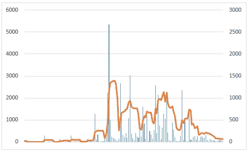

# 我用这个方法将我的博客文章浏览量乘以 10

> 原文：<https://medium.com/swlh/i-multiplied-my-blog-post-views-by-10-with-this-method-690e885b2a57>

[Felix_Broennimann/pixabay](https://pixabay.com/en/laptop-notebook-work-keyboard-2443052/)

2017 年 11 月重新开始写博客。从那以后，我每天发表一篇文章。这一次，我把每个帖子都导入到了 Medium。Medium 拥有庞大的读者、作者和出版物群体。他们也给他们的作者提供一些统计数据。

如果你的中型账户中有足够多的帖子，你会在你的统计数据中看到某些趋势。我已经写了一篇关于我从媒体统计 中学到的 8 条博客经验的帖子。其中一个教训尤为突出。

让我的文章发表在主流媒体刊物**上，让我的博文浏览量有了巨大的变化。这就是为什么我写了这篇文章 [**作为一个博客作者，你唯一需要的增加你的读者的技巧**](https://ideavisionaction.com/entrepreneurship/the-only-tip-you-need-to-grow-your-audience-as-a-blogger/) 。**

**在那篇文章中，我认为仅仅为了增加你的读者而评论别人的文章不是一个好建议。然而，我仍然收到了关于这种做法如何比在主流媒体上发表更好的评论。**

**为了解决这个问题，我发表了一篇名为 [**的文章，是评论媒体增加你的博客**](https://ideavisionaction.com/blogging/is-commenting-on-medium-a-reliable-strategy-to-grow-the-audience-of-your-blog/) 的受众的可靠策略吗？**

**在今天的帖子里，我会提供证明。我将展示你自己出版和被大出版社出版之间的数字差异。**

****在主流媒体上发表会有什么影响？****

****

**Table 1\. My Post Stats for Each Publication**

**现在，让我们看一下表 1。在第一列中，您可以看到出版物。我在七家媒体发表过文章。“没有发表”指的是我作为独立作家发表的帖子。这些帖子没有在任何出版物上发表。**

**第二列是指每份出版物有多少追随者。在第三列中，您会看到我在每个出版物中发布了多少帖子。在第四列和第五列中，您可以分别看到每篇帖子的平均浏览量和每篇帖子的平均粉丝数。**

**当我看着上面的平均浏览量和粉丝数，差别就像白天和黑夜。作为独立作者，我平均每篇帖子有 10 个浏览量和 1 个粉丝。我的创业出版物帖子平均每篇有 640 次浏览量和 37 名粉丝。相差 64 倍和 37 倍。**

**你可能会认为那些独立的帖子可能来自我在 Medium 上没有多少追随者的时代。为了反驳这种观点，我采用了最近 30 天的统计数据。**

****

**Table 2\. My Stats from a Recent 30 Day Period**

**这些统计数据来自最近连续 30 天。在此期间，我以独立作者的身份发表了 5 篇文章，在 Startup 刊物上发表了 25 篇文章。我的创业出版物帖子平均获得了 10 倍多的浏览量和 4 倍多的粉丝。**

**我有没有把自己卖给大出版社？**

**信不信由你，我收到了那句话。也许，你也是这么想的。让我来减轻你的忧虑。你不需要把自己推销给大的出版物。**

> **你需要尽可能成为最好的博客写手。这就是在主流媒体上发表的全部内容。**

**我很难想象有哪个博客作者会反对成为他们最好的版本。**

****

**Table 3\. Before Startup**

**在表 3 中，您可以看到我的帖子在发布到 Startup Publication 之前的性能。**

> **我花了 55 篇博文才在创业刊物上发表。迄今为止，其中 17 篇帖子的浏览量为 0，12 篇只有 1，7 篇只有 2。其中九个帖子的浏览量在 3 到 9 次之间。我说的是观点，不是粉丝。**

**我不得不经历那段我的帖子很少甚至没有被浏览的时期。我每天坚持写作和出版。我尽最大努力提高我的 [**博客**](https://ideavisionaction.com/tag/blogging/) 技能。然后，我被创业刊物录取了，你可以看到下图中的峰值。**

****

**Fig. 1\. The Views of Individual Posts and their Moving Averages**

**蓝色栏指的是个人帖子的浏览量。橙色线指的是单个帖子观点的 7 天移动平均线。左边的轴属于单个的柱子，右边的轴属于移动平均线。**

**上面的图表让我有点担心。如你所见，我的浏览量在下降。这意味着我需要弄清楚里面发生了什么。**

**上面的平均线让我想起了另一篇文章，叫做 [**这就是你的期望如何破坏你的成功**](https://ideavisionaction.com/personal-development/this-is-how-your-expectations-sabotage-your-success/) 。在那篇文章中，我认为我们期望线性增长。事实上，在长时间的平台期后，增长会出现峰值。如下图所示。**

****

**Fig. 2\. Linear Growth vs Quantum Leaps**

**不要让那些长时间的干旱打击你**

**当你经历一段很少甚至没有浏览的干旱期时，你不会失去任何东西。你 [**提高你的技术**](https://ideavisionaction.com/personal-development/how-to-succeed-in-your-craft-in-the-age-of-technology/) 每发表一篇文章。你学到了一些东西。你进步了。最终，你可以回到那些帖子，用你学到的所有经验重写它们。**

**也许一个帖子的内容是好的，但是 [**你没有很好地格式化以供在线消费**](https://ideavisionaction.com/blogging/this-is-what-i-learned-from-my-most-hated-blog-posts/) 。可能你没有 [**想出一个相关的，强标题**](https://ideavisionaction.com/blogging/a-three-step-exercise-to-come-up-with-popular-blog-post-titles/) 。可能你没有用图。可能你用的图没什么意思。现在，用你学到的所有经验重写这篇文章。**

**一切都归结于此。**

**你需要在你的博客或媒体档案中有一个高质量的帖子组合。否则，再多的推广也无法帮助你增加博客的受众。**

**为了建立这样的投资组合，你需要写高质量的博客文章。如果你写了高质量的博文，你可以在大刊物上发表。这会增加你的观众。那么，除了尽力写出最好的帖子，为什么还要把时间投入到其他事情上呢？**

****努力向上****

**试图在主流媒体上发表文章可能会让你不知所措。你可能想知道如何达到那个水平。这里有一些提示可以帮助你做到这一点。**

*   **列出你最喜欢的媒体出版物。**
*   **找到并阅读他们的提交指南。有时候，这些是隐藏的。这样的话，谷歌一下。**
*   **写尽可能多的帖子，注意投稿指南。**
*   **尽可能多读自己喜欢的刊物上的帖子，了解那些刊物关注的是什么。**
*   **如果你进不了大的刊物，那就试着进小一点的。你可以在 Smedian.com 的**上找到你所关注的刊物。****

****正如您在表 1 中看到的，在较小的出版物上发表文章也为我提供了额外的观点和粉丝。如果一个出版物有 100 个不关注你的粉丝，那么你的帖子可能会有 100 个额外的浏览量。****

******结论******

****通过在主要出版物上发表，我的帖子浏览量增加了 10 倍，粉丝增加了 4 倍。你不需要推销自己来让你的文章发表在大的出版物上。你所要做的就是提高你的技术，尽你所能写出最好的博文。****

****在主流媒体上发表可能是一个漫长的旅程。在那段时间里，你的帖子可能很少会被关注。坚持这个孵化过程。将你的文章提交到较小的出版物，以获得一些额外的曝光率。****

****在大刊物上发表并不是故事的结尾。我的帖子的浏览量最近似乎有所下降，尽管它们发表在创业刊物上。****

****我必须找出原因并应对这个挑战。我会写下我从那次挑战中学到的教训。如果你想从我的挑战中学习，注册我的 [**电子邮件简讯**](https://ideavisionaction.com/email-newsletter/) 。****

*******如果你觉得这篇文章很有价值，注册*** [***每周简讯***](https://ideavisionaction.com/email-newsletter/) ***就能收到我关于创业、企业家精神、领导力和自我提升的文章综述。*******

********

## ****这个故事发表在 [The Startup](https://medium.com/swlh) 上，这是 Medium 最大的创业刊物，拥有 316，638+人关注。****

## ****在这里订阅接收[我们的头条新闻](http://growthsupply.com/the-startup-newsletter/)。****

********