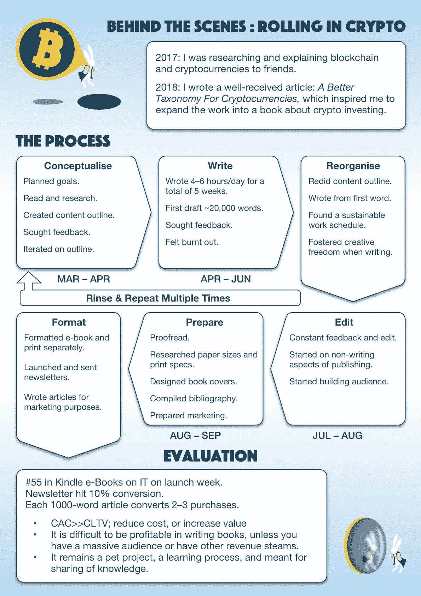
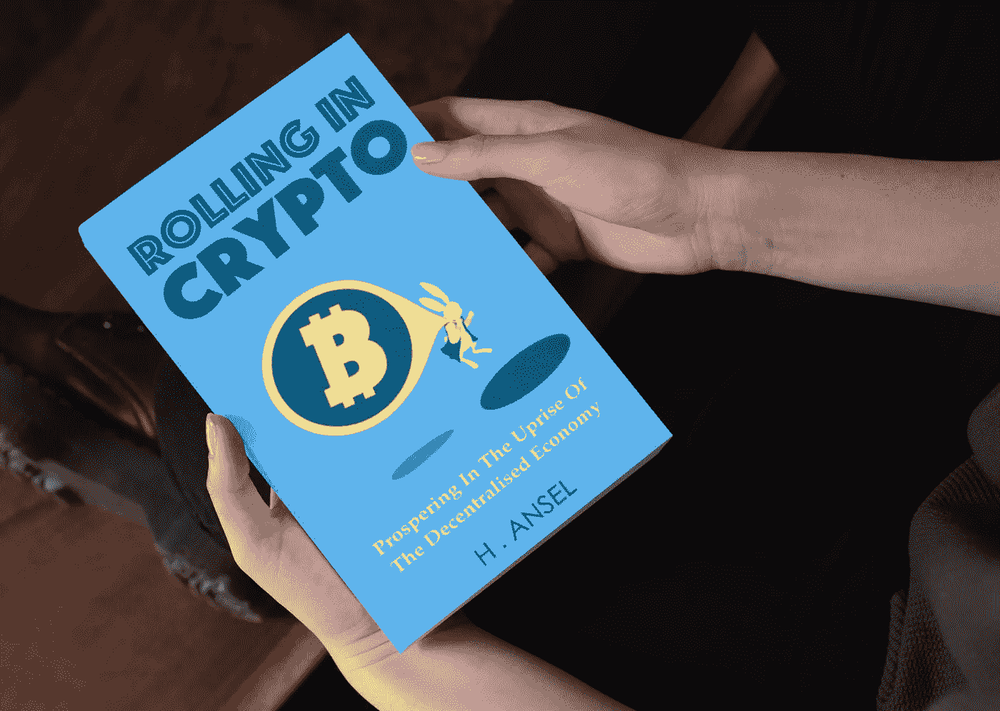

# 我在亚马逊上出版了我的书，现在呢？

> 原文：<https://medium.com/swlh/i-published-my-book-on-amazon-now-what-448a99f7aa59>

## 自助出书的经验教训

我今年最大的一个项目是写作和自助出版一本非虚构的书，《T2》《T3》。我进去时不知道会发生什么，我想我出来时比以前更穷了，尽管有了一些实践经验和一些收获。

这篇文章旨在作为总结文档，也许其他人可以从我的错误中吸取教训。

A summary of the entire process of writing, editing, designing, marketing, and launching the book.

## 写作:制定一个可持续的常规。

当我在写我的初稿时，我已经计划好了整个内容结构，我只是埋头苦干，每天写 4 到 8 个小时，直到整个大纲充满了单词。这有点像软件开发中的[瀑布法](https://activecollab.com/blog/project-management/waterfall-project-management-methodology)。

结果是一篇技术性很强的文章，包含了一个 20，000 字的废话，非常难读，我的第一个读者立即指出了这一点。在初稿结束时，我也感受到了每天强迫自己写作的压力。

我扔掉了大部分内容，从第一个单词开始重写，这次有两处改动。第一个变化是**以自上而下的方式写一个粗略的目标和大纲**，而不是写一些内容来适应一个“完整的”大纲。每当我有可操作的输入或灵感时，我就不断地重新审视和改进内容大纲。

第二是我**开发了一个写**的程序。每天，我都会安排 3 到 4 个小时坐下来写作、阅读和写笔记，构思或计划这本书的其他方面。没有硬性规定，有足够的创作自由空间。

以前我关注的是快速完成内容。相比之下，这是一个更加迭代和健康的工作时间表。我并不太关注完成，而是一个逐渐产生好的、有成效的工作的过程。

如果我喜欢，我会在晚上再花 2 到 3 个小时写作。我变得更有效率，更重要的是，我的文字变得更具可读性。

## 编辑:提前找到你的编辑方式。

我本可以做得更好的一件事是有一个合适的编辑，他会更客观地浏览我的作品。相反，我自己做了编辑工作，两个朋友从百忙之中抽出几个小时来阅读和评论，不断给我反馈。

我确实试图将编辑工作外包给一个以校对为生的朋友。尽管我们最初达成了协议，但他无法交付，因为他忙于工作，而且，我不是付费客户。

我想绿草如茵的观点是提前寻找正确的专业方法，但我不知道这是否一定是解决问题的方法。有人知道如何根据预算编辑一本书吗？

## 营销:简讯的转化率最好。

极早开始营销至关重要。这意味着尽早获得读者，计划活动，以便这本书在发布周能卖出数百本，并跃居榜首。

虽然我没能登顶(只在电子书上排到了#55)，但我已经了解到，简讯营销有最好的转化率。相比于内容营销文章，或者写冷冰冰的电子邮件，或者给朋友和熟人发信息，我通过简讯获得了大约 10%的转化率。

这并不奇怪，因为我已经通过时事通讯与我的读者接触，并为他们提供了某种价值。我的书很有可能会为他们提供更相关的内容，从而带来更高的转化率。我想这也是因为你已经在简讯营销中击中了正确的目标受众。

## 盈利能力:降低成本，或增加价值。

写书生意很难盈利。如果不考虑机会成本和潜在收入，我仍然很难从卖书中赚钱。这归结为图书业务的客户获取成本(CAC)和客户终身价值(CLTV)。

假设我从每本书的销售中获得 5 美元，减去给亚马逊和其他分销商的版税，这就是我从每个客户那里获得的 CLTV，除非我开始向他们出售其他课程、更多书籍或附属计划。

对于我写的每一篇内容营销文章，我可以创造大约 3 本书的销量。这意味着大约 5 到 6 个小时的写作时间是 15 美元，也就是每小时 3 美元。因此，你可以看到，如果你还没有读者，写内容营销文章并不是推销一本书的最佳方式。

如果你已经有 100，000 个追随者，你可以向他们推销，那就不一样了。这就是为什么一些在线文章建议，只有当你有相当多的追随者时，才写一本书。

或者，你可以寻找更便宜的方法来获得你的客户，那就是**减少你的 CAC** 。比如你用搜索引擎营销或者其他付费营销方式，如果达到一个人需要 0.10 美元，那么 100 美元就可以达到 1000 人。如果你的转换率是 2%，那就意味着 20 个付费客户和 100 美元的收入。

只要你在这个场景下的转化率在 2%以上，就成了一个可行的营销渠道。对我来说，问题是付费营销渠道对加密不太友好，而我的书是一本加密投资书。

另一种方法是**增加 CLTV** ，向你现有的客户出售附属产品、商品或课程，这样除了你从他们那里赚到的 5 美元，他们会付给你更多的钱。

Image adapted from [Thought Catalog, Unsplash](https://unsplash.com/photos/wAKwqCC6EQg).

# 最终反射

总而言之，我想说自助出版的经历给了我很多教训。我确信，如果我做了别的事情，我也会有其他外卖，所以这不一定是一个好的或坏的经历。

虽然我开始不知道会发生什么，或者如何在出版的某些方面工作，但最终的解决方案就这样到位了。例如，我不知道我的书的封面会是什么样子，或者我想过要有一个暗示爱丽丝梦游仙境的中心主题；灵感来了，就这样发生了。

我想要一本电子书和一本纸质书，并认为仅仅是 PDF 格式就足够了。事实证明，电子书的格式完全不同于印刷书籍，而印刷书籍的格式要求我考虑页面大小、页边距和印刷类型。我挣扎着，但最终还是挺过来了。

你的自助出版之旅是有代价的，不仅仅是金钱上的，还有时间上的机会成本。唉，如果你能负担得起这些费用，是什么阻止你向前迈出这一步呢？

因此，除了分享我的经验和给你一些简单的商业建议，我会说，*“如果你能负担得起，就迈出这一步，祝你好运。”*

这些天来，我仍然在尝试各种营销渠道和减少 CAC，但这都是为了出版。我的每周文章现在集中在看密码市场。

我以前的文章与本书的写作经历有关:

 [## 写一本书《精益创业之路》

### 第一集:理念与初步研究

medium.com](/swlh/writing-a-book-the-lean-startup-way-5d65135295dc)  [## 如何像开发产品一样写书

### 第 2 集:写冲刺和用户研究

medium.com](/swlh/how-to-write-a-book-like-you-would-develop-a-product-84d996198a36)  [## 为什么自助出版就像独自经营一家初创公司

### 第三集:承担太多而不寻求帮助

medium.com](/swlh/why-self-publishing-is-like-running-a-startup-all-by-yourself-b92f1ca5bc83) 

## 这篇文章发表在[《创业](https://medium.com/swlh)》上，这是 Medium 最大的创业刊物，有+399，714 人关注。

## 在这里订阅接收[我们的头条新闻](http://growthsupply.com/the-startup-newsletter/)。

