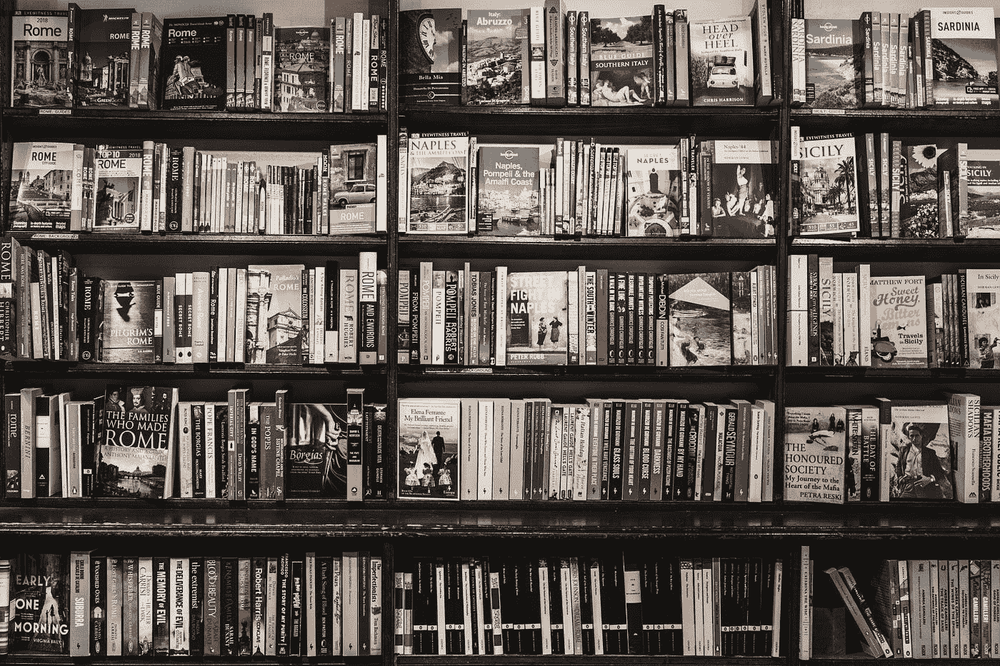
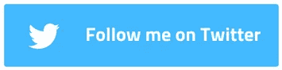

# 我一年读 180 本书..这是我学到的..

> 原文：<https://medium.com/swlh/i-read-180-books-a-year-this-is-what-i-learnt-fc948f8308ac>



Photo by [Ugur Akdemir](https://unsplash.com/@ugur?utm_source=medium&utm_medium=referral) on [Unsplash](https://unsplash.com?utm_source=medium&utm_medium=referral)

我想知道沃伦·巴菲特是如何如此成功和博学的，在一篇文章中，巴菲特说

> “每天像这样读 500 页。知识就是这样运作的。它就像复利一样累积起来。你们所有人都可以做到，但我保证你们中没有多少人会……”

2017 年 1 月，我读了巴菲特的名言，我答应自己要读。我打算一遍又一遍地读，直到在一段时间内每天读完 500 页。

老实说，我没有一天读 500 页，但是，但是我一年读了 180 多本书。这个开始阅读的决定是我一生中最重要也是最棒的决定之一。

书籍给了我自由思考的自由。书籍给了我跳出框框思考的勇气，让我不再固守陈旧的传统观念。书籍给了我心目中的英雄和榜样，也给了我生活的意义...

一年读 180 本书对我来说不是一件不可能的工作…我真的相信任何人都可以做到..

所需要的只是一些简单的数学，一些正确的工具和一些一致性。

# 永不放弃

当普通的汤姆、迪克或哈利听到“每天阅读 500 页”的建议时，他的第一反应是——“不……那不可能！”

在评论之后，一般人会接着编造几个蹩脚的借口来证明他/她的信念，而根本不做任何深入的思考。这些可能包括“我很忙”，“我不够聪明”，或者“书不适合我”。

但是，如果我们在给出上述蹩脚的借口之前做一些基本的数学。我做到了，我成功地一年读了 180 本书。

巴菲特说得对——任何人都可以做到，但大多数人不会。

# 让我们做一些简单的数学计算..

我问自己的第一个问题是——一年读 180 本书需要多长时间？

我看了一些统计数据如下:

*   普通人每分钟阅读 250-350 个单词
*   一本典型的非小说类书籍平均有 48000 个单词。

现在，让我们做一些快速计算…

```
180 books * 48,000 words / book = 8640000 words8640000 words / 350 word per minutes(Speed of Reading) = 24685 minutes24685 minutes / 60 = 411 hours 
```

所以，读 180 本书，我需要 411 个小时…

我想 411 小时似乎很长…但事实并非如此。一年有 365 天，让我们进一步延伸计算。

```
411 Hours / 365 days = 67 Mins a Days...
```

我认为，一天 24 小时中的 67 分钟没什么大不了的…

还是不相信..好了，我们再深入挖掘一下……

# 统计数字

所以，你不相信你能在一天 24 小时中提供 67 分钟的时间…让我们试着从硬币的另一面获得更多的视角…

以下是普通人一年花在社交媒体和电视上的时间:

> [社交媒体上 705 小时](https://www.entrepreneur.com/slideshow/306136)&[电视上 2737.5 小时](https://www.theatlantic.com/technology/archive/2018/05/when-did-tv-watching-peak/561464/)

哇..干得好的...也就是说，一年有 3442 个小时花在非生产性活动上。如果这些时间用来阅读，你一年可以读 1600 多本书，即使你花一半的时间在书上，你一年也可以读 800 本书…想想吧…

简单的事实是我们忽视了…但是我问自己*为什么以及如何才能忽视自我发展*…如果你能够忽视自我发展，那就意味着你很满意或者基本上你已经停止了成长。我听到有人说我没有足够的钱买书，我认为这是在互联网时代的废话，在这个时代大多数书都是免费的..

所有这些理论都被忽视了，因为全世界所有绝望的人都会抛弃这个理论，甚至会关闭这篇文章，离开去访问社交媒体或看电视..

但是，嘿…等等..给我一个机会向你展示上述理论的实现..我知道这很难，但并非不可能。

# 执行

我们知道阅读对自我发展很重要。我们都知道我们应该尽可能多地做这件事。但是我们没有。我知道的主要原因是*没有执行*。

我在这方面并不完美，但以下是我用来实现阅读习惯的一些小技巧

## I .设计环境并使其发挥作用

如果你想阅读，确保

1.  你排除了环境中所有的干扰
2.  你让书籍尽可能容易获取。

我大部分时间每天工作 18-19 个小时。这并不妨碍我读书。我把我的书放在我的 Kindle 上，放在我的手机上&甚至是纸质的。如果我不想读书，我会听有声读物..但是我永远不会为不读书或不进步找借口..

我随身携带有声读物、pdf、Kindle 和硬拷贝的每一点资源，这样我就可以在任何地方阅读。做一个多面手，而不是专家。

如果你的目标是阅读更多，你就不能具体说明你在哪里阅读或者使用什么媒介。我看纸质书，我在手机上看 pdf。我听有声读物…

但是我对自己说——不要找借口..

## 二。部署习惯

如果毅力不与毅力相混合，它就没有任何用处。它总会在你最需要的时候失败。所以，与其依靠意志力，不如试着培养习惯。我将在下一篇文章中介绍一种叫做**神经可塑性**的技术。我学会了这个技巧，它对我控制自己的生活有很大的帮助。

我还会推荐阅读《超人靠习惯》 [*这本书，了解习惯科学。*](https://www.amazon.in/Superhuman-Habit-Becoming-Possible-Yourself-ebook/dp/B00NGC8I9E)

养成良好的习惯需要很多天，神经可塑性对我帮助很大。我将在下一篇文章中分享我对**神经可塑性的见解。神经可塑性可以永远改变你的生活。**

将问题分解成小陈述，然后不带任何情绪偏见地合乎逻辑地解决它们是成功的关键。想一想 — *在你开始写这篇文章之前，你可能从未想过一年内阅读 180-200 本书是可能的，但现在我猜你知道每天花 67 分钟就能让你做到。太简单了。*

如果你处在一个渴望阅读但不能开始或继续的位置，我认为这是一个很好的时机，你开始用我们上面讨论的方式思考。

> 最后——闭上眼睛，说——**我会的……我能..**

祝你好运..

如果你喜欢我的文章，请点击👏帮助我保持写文章的动力。请在 [**媒体**](/@iamadl) 等社交媒体上关注我:

[](https://www.instagram.com/cool_adl/)[](https://twitter.com/I_AM_ADL)[](https://www.youtube.com/channel/UCRkxhh51YKqpn2gaUI3MXjg)

如果您有任何问题，请在下面的评论中或在 [**Twitter**](https://twitter.com/I_AM_ADL) 上告诉我。

订阅[我的 YouTube 频道](https://goo.gl/u72j6u)获取更多科技视频。

[](https://medium.com/swlh)

## 这篇文章发表在 [The Startup](https://medium.com/swlh) 上，这是 Medium 最大的创业刊物，拥有+366，291 名读者。

## 在这里订阅接收[我们的头条新闻](http://growthsupply.com/the-startup-newsletter/)。

[](https://medium.com/swlh)