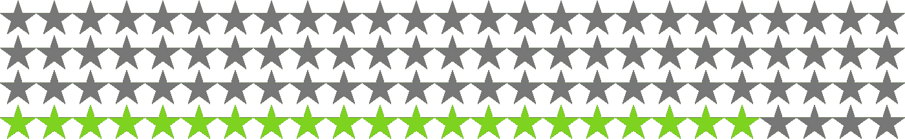
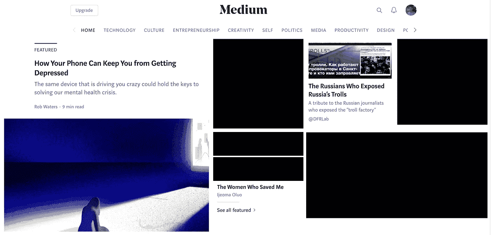
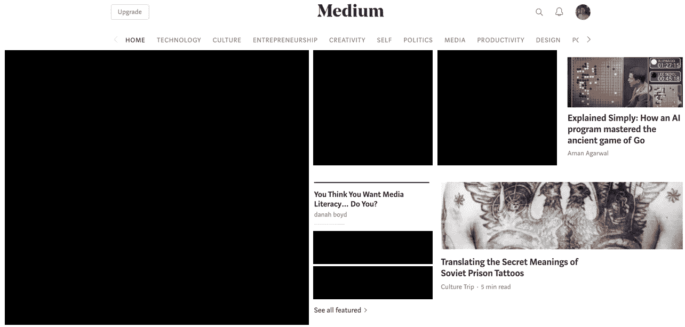
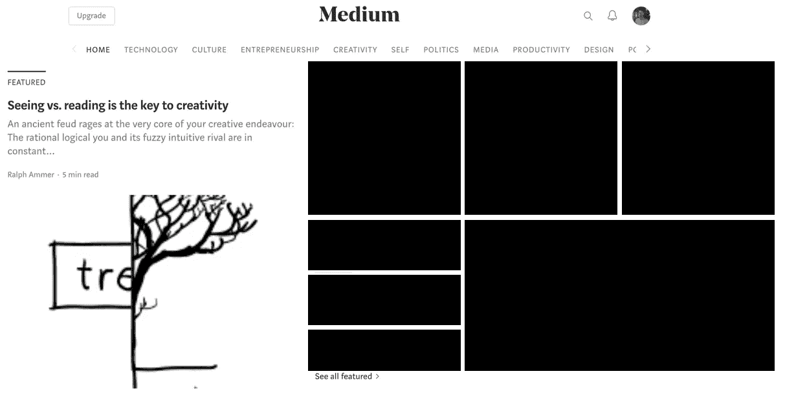
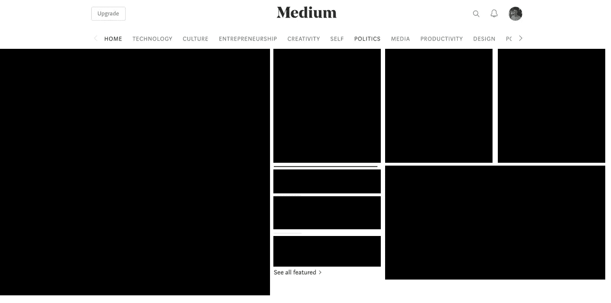

# Medium 的会员专属内容正在温柔地杀死我

> 原文：<https://medium.com/swlh/i-redacted-the-medium-stories-i-cant-afford-609fa5368076>

## 看在上帝的份上，不要这样对我

78% behind a paywall, surfaced for our viewing pleasure.

> 温柔地杀死我:当你被迫忍受一些非常不愉快的事情，但逃避这些事情会更糟糕时的感觉。

我点击了很多会员专用的文章。很多。

我想知道为什么我在 Medium 上遇到这么多死胡同，仅仅是因为我不是付费会员。

我明白了，你想提升会员资格。它会帮助你支付账单，成长，做更多更好的事情。

但是我决定做一个简单的，为期三天的测试，看看当我着陆时，什么样的介质会出现在我面前。你知道，只是看看是我，还是你。

绝对是你，灵媒。

这里是过去四天的三个截屏，所有仅限会员的故事都被涂黑了。

## 2018 年 3 月 12 日

8 篇可读文章中的 3 篇

## 2018 年 3 月 13 日

8 篇可读文章中的 3 篇

## 2018 年 3 月 14 日

8 篇可读文章中的 1 篇

## 压轴戏！

## 2018 年 3 月 15 日

请敲鼓。8 篇可读文章中的 0 篇

Medium is definitely trolling me.

对于那些在家追踪报道的人来说，媒体*为我提供的 32 个故事中有 25 个是我无法阅读的故事，因为我不是会员。*

超过 78%是不可读的。在任何给定的一天，我有 0-37.5%的文章是可读的。

> *任何一个内容平台如何向它的读者展现出很多东西？)关于公司的战略、重点、方向。*

那么这说明了什么是媒介呢？或者更好的是，[中](https://medium.com/u/504c7870fdb6?source=post_page-----609fa5368076--------------------------------)对此怎么看？

作为一个狂热的媒体读者，这让我很沮丧。作为一名作家，这让我不再写会员专用的内容。作为一名 UX 设计师，这让我很不爽。

## 想法？请在下方留言评论。

## 如果你感兴趣的话，我们也可以成为朋友。

# 感谢阅读。

## 这个故事发表在 [The Startup](https://medium.com/swlh) 上，这是 Medium 最大的企业家出版物，拥有 306，072+人。

## 在此订阅接收[我们的头条新闻](http://growthsupply.com/the-startup-newsletter/)。

