# 我重新设计了美国邮政包裹递送单。

> 原文：<https://medium.com/swlh/i-redesigned-the-usps-package-delivery-slip-fd43d8607753>

## 目前的设计令人困惑，重复和难以接近。

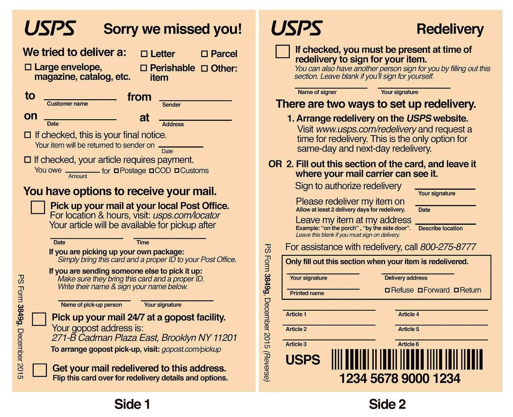

My design.

遗憾的是，我错过了美国邮政递送我的 rad 新帕蒂·史密斯海报。两周前我在奥克兰的时候买的，当时我觉得把它运回布鲁克林的家比塞在行李箱里更安全。

我一直在想是什么花了这么长时间，然后在周五，我的邮递员给我留下了那张无处不在的黄色双面卡片，让我知道我想念他。

看起来我可以在邮局拿到它，但是离圣诞节还有一周——包裹递送的高峰期——我不可能进行一次不必要的旅行，和一大群最后一刻送礼物的人一起排队等候。

就这样重新交付了。

**我花了将近 10 分钟的时间来来回回地翻动卡片，试图弄清楚如何重新交付它。我觉得这个表格有一些严重的问题。**

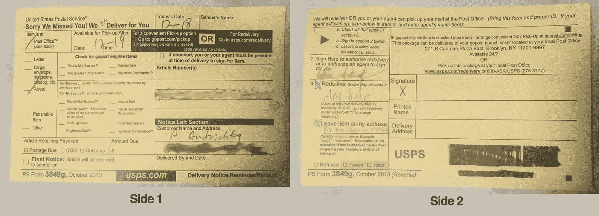

The original

## **出现的问题**

*   前者的信息层次和关注点分离不佳。
*   弥补这一点是重复的，结果浪费了空间。即使不重复，也是低效利用空间。
*   它使用的词汇和字体大小可能是邮局服务的许多美国居民无法理解的。
*   以上所有这些都使得表单非常混乱。
*   挺难看的。

我开始想到成千上万的人也可能在这个假期沮丧地琢磨这张卡片，我想知道我是否能做得更好。彼得·斯马特(Peter Smart)关于重新设计机票(T9)和公民登机(Citizen Onboard)关于食品券申请(T11)的评论(使其更容易获得)的深思熟虑的提议给了我灵感，我决定尝试一下。

所以十分钟的困惑变成了一个花了周六大部分时间的设计项目。(郑重声明，在经历了一周的假日聚会后，花几个小时思考一份政府表格正是我所需要的，这令人惊讶……)

# 该表格有一个主要目标:让你的邮件给你。

## 我首先列出了服务于该目标的表单的不同目标。然后，我试图把每个目标变成一个清晰的、有特色的部分。

我将**阐明这些目标中的每一个**，**解释为什么我认为表格没有有效地实现这些目标**，并且**展示我如何试图解决这些问题**。

## 首先，关于我的设计有几点注意事项:

*   我决定在我的设计中使用垂直布局，以避免困扰原始设计的混乱和不均匀的列。我有网络 UX 的背景，我倾向于垂直阅读体验。
*   我用了同样大小的卡片，因为我想象邮局的房间里堆满了这种 3.5 英寸乘 5.5 英寸的卡片。此外，我想看看我是否能利用空间作为一个约束。
*   我选择了 Helvetica，因为美国人有很多阅读它的经验。
*   我从来没有做过这样的事！
*   **郑重声明，我的表格绝对不是 USPS 的官方表格。**

好的，向前…

## **1。您的包裹的 5 Ws:递送和物品详情**

当你看到这张纸条在你的邮箱里，你会想知道……**为什么**这张纸条会在我的邮箱里？要回答这个问题，你需要快速了解其他 4w:**这个包是给谁的**？**是什么**？**送到哪里**？**什么时候**交付的？

答案散布在这一页的正面。

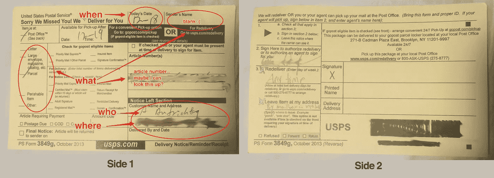

Who, What, Where, When, Whoaaa

我决定把所有这些部分放在顶部，因为你想先了解这些信息。我把它们放在一个 Mad-Libs 风格的人类可读的句子中，使它更具可读性。这也是邮递员需要填写的主要部分，所以将所有的文字放在一个地方也能使她的工作更快。

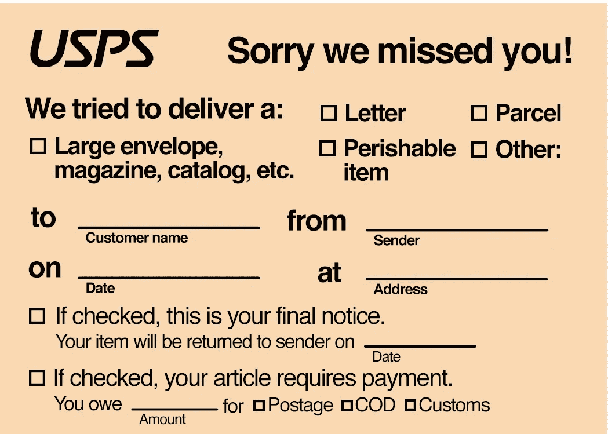

我将文章编号移到了后面，因为您可能需要它来设置重新交付，但是当您试图了解该包时，它本身没有任何意义。

我还将您的最终通知和付款要求部分放在了顶部，而不是底部。如果你即将丢失你的包裹，或者如果你真的要交付现金才能收到包裹，我想引起你的注意。

## 2.您获取包裹的选择

一旦你知道你的包裹是什么，你想知道你能做什么来得到它。取回包裹的 3 个选项(重新递送、邮局、gopost)被多次列出，尽管在某些地方只有 2 个选项。我有资格获得所有这些选项吗？还不完全清楚。

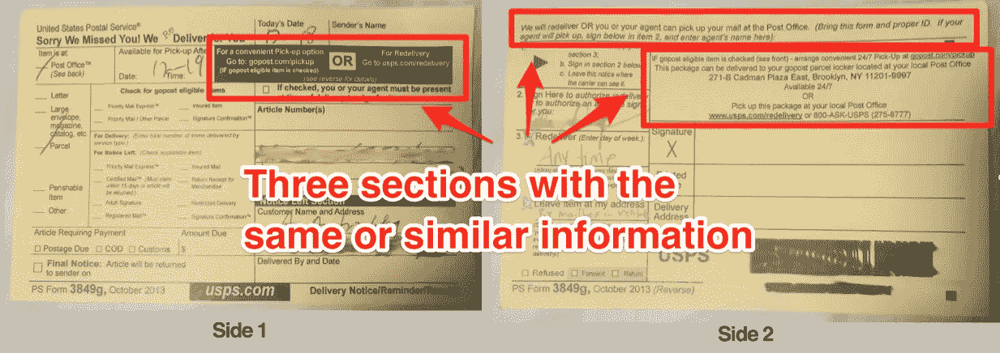

我给了 options 部分一个标题，并重构了表单以清晰地呈现三个选项。如果选项框被选中，则您可以使用它。(比如你没有 gopost 可用，就不会勾选)。

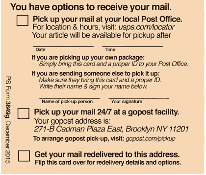

## 3.一旦你选择了一个选项，你需要采取什么步骤来得到你的包裹

要决定哪一个选项最适合你，你会想知道如果你选择那个选项会涉及到什么。

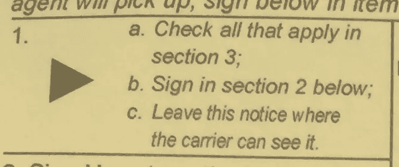

You’re supposed to start in section 3 and then move back to 2\. This is just cute.

这是 USPS 表格真正崩溃的地方。你需要做的分散在卡片上。尽管他们为前一步列出了一式三份的选项，但他们决定提高效率，并重复使用一个代理和签名部分进行两种不同的选择:重新交付签名和派其他人帮你取包裹。

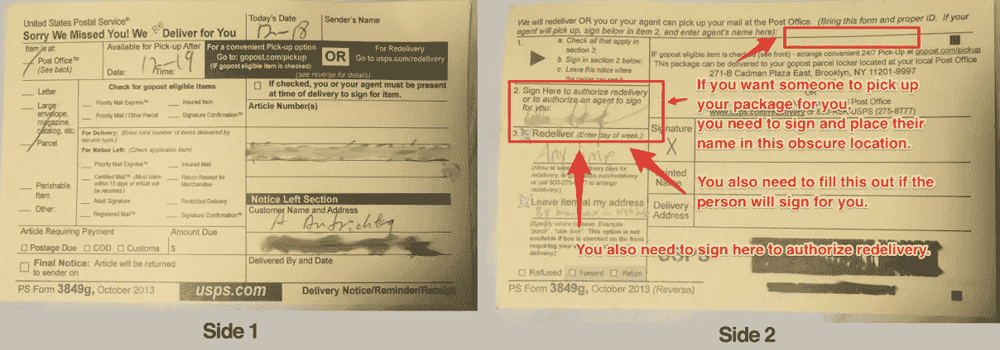

当我处理网站表单用户体验时，我会确保有条件可用的选项不会出现，直到你满足了那个条件。在一张纸上很难做到这一点。但是强烈的视觉层次可以帮助你知道什么该注意，什么该忽略。

我把“你需要做什么”的信息放在了选项中，这样你就可以清楚地看到每个选项中包含了什么，并且可以忽略你不想要的选项的说明。实际上，我决定复制签名部分，这样它将与您的选择明确关联，而不是像 USPS 一样复制选择。

重新交付似乎是最复杂的，所以我把它放在它自己的一边。一旦你选择了那个选项，你实际上还有两个选项，我想为一个额外的层次结构层留出空间。此外，这是唯一一面，你可能会留一张便条给你的邮递员，所以你应该留哪一面是可见的就很清楚了。

我将“您需要签名”的信息放在最相关的重新交付部分。我还在这里添加了联系信息，因为这似乎是最令人困惑的部分。

我的肯定是更多的文字，但我认为这是值得的交易清晰的指示。不过，我希望看到不那么重文本的建议。

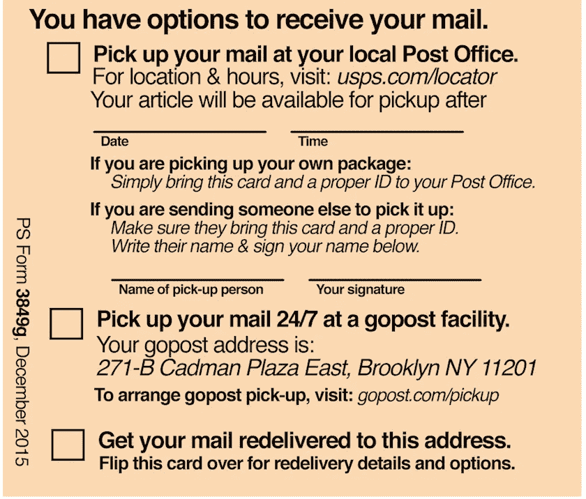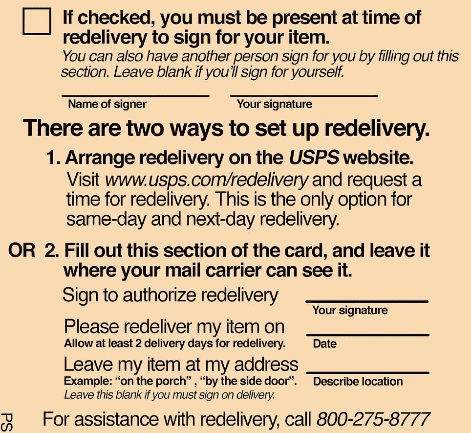

## 4.收据确认

当你需要签收你的包裹时，美国邮政总局也用这个表格作为收据。但是在他们的设计中，当你可能需要授权重新交付时，在大签名框中签名似乎很有诱惑力。

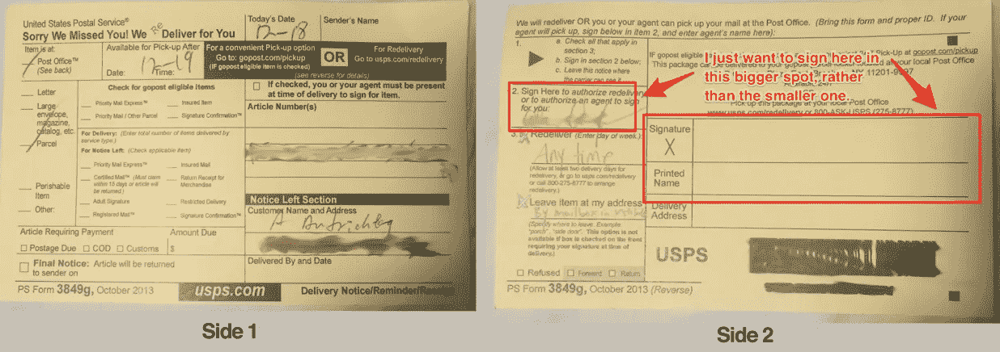

我明确指出，只有当你的包裹被投递时，你才应该在那个箱子里签名。我还猜测，这些复选框可能会在交付时被选中，或者至少是由您的邮递员而不是您来选中。

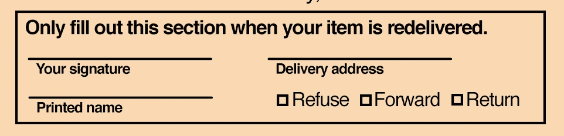

## 5.官僚主义的东西

USPS 使用这些表格来保存记录。我保持条形码大致相同的大小，因为我想扫描仪很难改变。我把表单的名字做得小了很多，放在了边上，因为邮局里任何一个记录表单的人都会知道这是什么表单，客户也不需要关注它。

我还把商品编号移到了条形码部分，因为这些可能只有在有人向你要的时候才会用到，然后他们会告诉你在哪里可以找到。

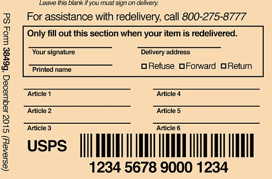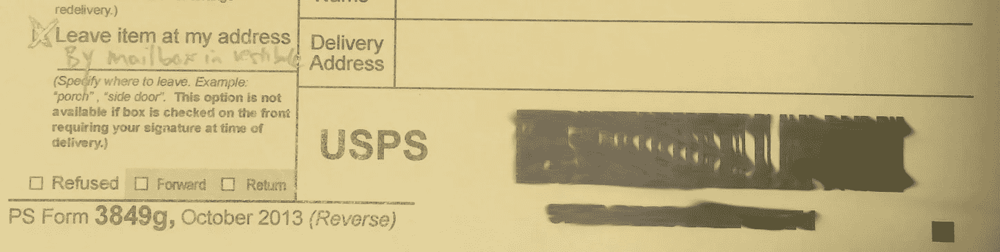

## 6.最后，可访问性和可读性

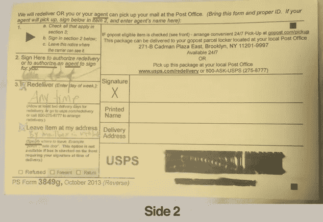

美国邮政投递到美国的所有地址。许多人会说英语以外的语言，或者如果他们会说英语，可能会对本表格中使用的以下词语的定义感到不舒服:**代理人、授权、指定**。

如果你想让别人帮你照看包裹，理解这些词尤其重要——如果你在邮局与人沟通有困难，这可能会更有吸引力。**我把这几个字改成了“派人来接”和“让另一个人帮你签收”**

另外，字体太小了！不知何故，在数字时代,“阅读小字”这个表达总是被用作隐喻。我知道它是从哪里来的。它应该大得多，以便视力不好的人能够明白该做什么。**我把字体放大了。**

我以前从未设计过政府表格。我很想知道你的想法，你将如何改进它，以及谁设计了最初的形式。你可以在推特上找到我: [@alizauf](http://twitter.com/alizauf)

唉，这种幻想邮件形式也不能帮我拿到帕蒂·史密斯海报。因此，我谦恭地将 **USPS 3849g，2013 年 10 月**提交给我的邮政工作人员，然后等待。

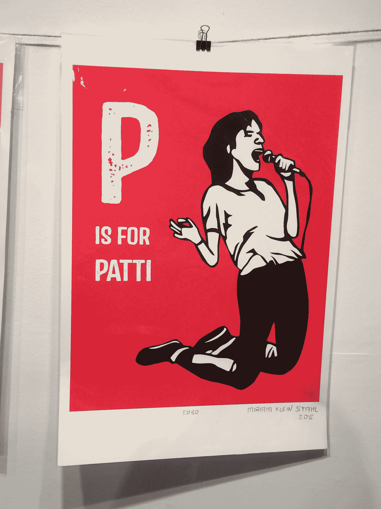

I wish this were in my house now. Hopefully I filled out the card correctly!