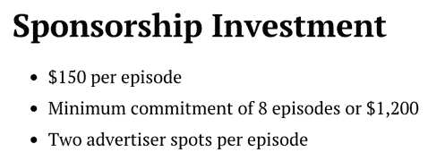
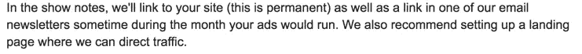
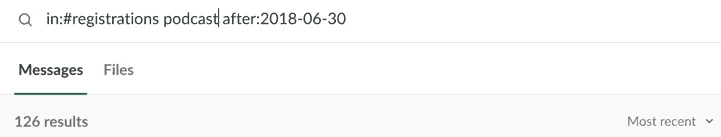

# 我们在播客广告上花了 51，975 美元:这是我们学到的一切

> 原文：<https://medium.com/swlh/i-spent-51-975-on-podcast-advertising-and-now-i-know-something-e3be38cb4b6c>

我记得有一天 Ahrefs 的 CMO[蒂姆](https://ahrefs.com/tim)告诉我，我“现在负责播客的赞助”

我说:“牛逼！！!"

我一生中从未听过播客。

很自然，我剩下的时间都花在了与谷歌的亲密接触上。以下是我那天所学内容的概述:

*   播客具有很强的针对性。从[真实犯罪案例报道](https://www.apmreports.org/in-the-dark/season-two)到[讨论吸血鬼猎人巴菲](https://www.bufferingthevampireslayer.com/)，每一个可以想象的领域都有一个专门的、高质量的播客。这也意味着我们可以接触到任何我们想接触的观众。
*   播客听众是有史以来最投入、最忠诚的听众之一。媒体的本质意味着播客主持人每次直接对着我们的耳朵说话超过 30 分钟，许多听众与内容和节目主持人建立了很强的亲和力。有道理！
*   传统的成功衡量标准是每期节目的浏览量和下载量。显然，数字越高越好。

我还了解到播客赞助中有三大类广告:

1.  **预演:** ~节目开始时的 15-30 秒广告。
2.  **中间插播:** ~节目中间 1 分钟广告。
3.  **后卷**:节目结束时大约 15-30 秒的广告。

一般来说，中间卷最贵，其次是前卷和后卷。

酷，我想，这听起来很简单。

你现在知道故事是怎么发展的了:我完全错了。

在半年的时间里，我试错了所有谷歌不会告诉你的事情。

好消息是什么？我要和你分享我们学到的一切。

让我们从头开始，好吗？

# 第一次尝试:花费 14200 美元

虽然我个人在 2018 年之前从未听过播客，但 44%的美国人却不是这样的。

有一个庞大的、蓬勃发展的播客听众社区，他们狂热地追随他们喜爱的主持人，讨论最新剧集的要点，并相互推荐节目。现在许多人甚至靠播客过得很好！

注意到这一切，Tim 在一年前决定关注这个频道。

我们第一次体验播客广告:Tim 花费了大约 14k 美元来推广五个不同播客的特别优惠，通过为每个节目创建特定的登录页面来跟踪流量和线索。

结果如下:

**预算:**
**14200 美元播客赞助:** 5
[黑掉企业家](http://hacktheentrepreneur.com/)乔恩·纳斯托
[PNR 用这个老营销](http://contentmarketinginstitute.com/pnr-with-this-old-marketing-podcast/)由乔·普利兹和罗伯特·罗斯
[【疯狂营销】](https://www.thesaleslion.com/mad-marketing-podcast/)&[【The hub cast】](https://www.thesaleslion.com/hubcast-podcast/)由马库斯·谢里登&乔治·汤姆斯
[【100 美元 MBA 秀】](http://100mba.net/show/)由

用蒂姆自己的话说，结论是:

> 指望通过在 30 分钟的播客中进行 30 秒的预滚动来“冷广告”像 Ahrefs 这样的复杂产品来获得可观的投资回报是非常愚蠢的。

这可能是一个提及 Ahrefs 做什么的好时机。

我们是行业领先的 SEO 工具集。我们帮助您从搜索引擎获得更多的网站流量，并增加销售额。我们也因我们的博客而闻名，在撰写本文的时候，我们的博客每月有接近 175，000 的流量。

*a screenshot of our organic traffic growth via* [*Ahrefs’ Site Explorer*](https://ahrefs.com/site-explorer)

蒂姆的第一个想法是，我们再也不会赞助播客了(这并不奇怪；每次试用注册花费了我们将近 13000 美元！)

但是他注意到了一些事情。在参加会议和与人交流时，许多人告诉他，他们在播客中听说过 Ahrefs。

有时现有用户会提到他们很高兴在他们最喜欢的节目中听到我们的消息；有时一个随机的人(甚至不是营销人员)会从一个旧的播客中想起我们。即使他们当时没有改变信仰，他们也认为 Ahrefs 很酷——这种品牌认知度一直留在他们的脑海里。

这时候一切都明白了。

我们完全错了——播客广告不是一个产生潜在客户的工具，而是一个获得曝光率和品牌知名度的工具。

[Image Credit](https://wallpapersite.com/images/pages/pic_h/1717.jpg)

我希望剩下的都成为历史。

# 第二次尝试:花费 37775 美元

有了蒂姆的发现，我开始对播客广告如何融入我们的营销策略有了新的理解。

这些是我学到的教训。

## 早点进去，因为“大”播客总是爆满。

许多播客并没有明确声明他们接受网站上的赞助，所以你必须手动检查。

通常，顶级播客对赞助是开放的，并公开播放这一点。许多网站甚至有专门的页面和“推销”，比如《着火的企业家》中的这一篇。

只有一个问题:这些播客非常非常受欢迎。

以至于当我在 2018 年 4 月中旬开始联系他们时，他们中的许多人已经被预订满了(有些人甚至预订了一整年！。)

注意:这实际上是一件好事，因为这意味着这些播客关心其内容的质量。没有人想听充斥着广告的播客。你也不想赞助一个和其他四个赞助商挤在一起的播客。

回到正题。

在得到一些积极的回应后，我发现…

## 定价完全是随意的。

一些播客的定价结构是完全透明的，并在他们的网站上公布。

不幸的是，大多数都不是。你必须联系每个播客，询问他们的当前价格。

那么，播客赞助要多少钱？

我希望我能给你一个比“看情况”更具体的答案，但我真的不能。节目设定价格(这有时是可以商量的，尤其是如果你打算长期赞助的话)。

这可以从每集 300 美元到…嗯，你自己看吧。

这是 Ahrefs 今年最终赞助的播客的完整列表，以及它花了我们多少钱。

*If you’re looking to sponsor these podcasts, their rates may change from the time of publishing.

一些播客提供待签署的合同，而另一些只是发送发票。如果你对没有合同感到不安，你可以申请一份合同。

## 传统上，广告位置变化不大。

还记得谷歌告诉我们的预卷、中卷和尾卷吗？

这通常是正确的，尽管它们并不总是可用的(或者被贴上标签)。)与您选择的播客取得联系，您将立即发现每个节目的价格。

这里有一个例子:

不管他们是否称之为中盘，这个提议就是中盘。

## 另一方面，广告本身千差万别。

大多数播客会要求你提供一个广告“脚本”。

你需要为节目主持人准备一些要点或段落来朗读。

这是我写的一个真实的例子:

即使在写这篇文章的时候，我发现像这样的“广告阅读”是相当不真实的——你可以看到我试图让播客主持人在上面添加他们自己的观点，并与 Ahrefs 分享他们自己的经验。

不管一个播客主持人有多好，对你的品牌的真正热情是很难伪装的。所以我认为自己很幸运，因为我很早就在喝咖啡的时候遇到了来自 T2 市场部的约翰。

当我联系他时，他是这样提议的:

这让我大吃一惊:他能为我们做到这一点？！

[Image Credit](https://wallpapersite.com/tv-series/sansa-stark-jon-snow-game-of-thrones-10144.html)

播客主持人比任何人都了解他们的观众。让他们用他们自然的声音来宣传我们，以一种完全有机的、不需要照本宣科的方式，绝对是最好的方式。

我立刻就加入了，这被证明是一个非常棒的决定。

# 播客赞助非常耗时。

在这一点上，你可能已经知道了，赞助一个播客涉及到很多的来回。

一个播客建立得越久，它的流程就越僵化，你花在讨论事情和解决细节上的时间就越长。

对一些挫折和大量失去的时间做好准备。这不是任何人的错；有时候事情就是不顺心。

我提到这一点只是为了防止有人看到这篇文章，认为播客广告是另一种“低挂水果”类型的营销活动，并认为你需要做的只是扔一些钱进去，然后坐以待毙。

号码

# 从广告支出中获得最大收益

由于我们决定取消转换跟踪，我不得不在如何处理我们的广告上有点创意。

这是我们如何充分利用预算的精彩片段。

## 有机的，不是照本宣科的，提及

这意味着，我们给播客主持人一个免费的 Ahrefs 帐户，带他们浏览我们的工具(如果他们已经熟悉我们，这是理想的)，并让他们完全控制我们的所有提及和他们在节目中的位置。

点击进入，听听[照本宣科的赞助提及](https://ahrefs.com/blog/wp-content/uploads/2018/11/seobits-scripted-podcast-mention.mp3)和[非照本宣科的赞助提及](https://ahrefs.com/blog/wp-content/uploads/2018/11/marketing-over-coffee-big-data-unscripted.mp3)的区别。

并不是说照本宣科的广告不好，必然如此。在上面链接的视频中，丽贝卡按照我提供的剧本做了一件非常棒的宣传工作。她热情、权威，甚至还补充了自己的一些观点。

但是，当播客主持人完全熟悉我们的工具，然后被给予自由，以他们希望的方式推广我们时，内容的深度和说服力的差异是非常明显的。

顺便说一下，这不仅仅是在他们自己的节目中有更高质量的提及。

证据: [Moneylab](https://www.moneylab.co/) 的 Matt Giovanisci 参加了其他节目，如 [Niche Pursuits](https://www.nichepursuits.com/podcast-135-matt-giovanisci/) 和 [The Fizzle Show](https://fizzle.co/show) (第 285 集)，也对我们赞不绝口。之后我们有了一些新的注册。(你是最棒的，马特！)

点击收听我们迄今为止赞助的节目中我最喜欢的几个“广告”:

*   这是 Moneylab 的人的长篇介绍。
*   [营销人员在喝咖啡时又一次提到了](https://ahrefs.com/blog/wp-content/uploads/2018/11/marketing-over-coffee-podcast-advertising-mention.mp3)。

## 赠品+社交媒体参与

似乎目前的行业标准是让广告商建立一个独特的促销代码和特定的登录页面，以便进行跟踪，并给人们一个很好的转换激励。

由于 Ahrefs 从不开展任何促销或折扣活动，我们也不把播客视为直接的潜在客户生成渠道，所以我们想出了另一种方法来增加播客的提及率。

我们所做的是用 tweet-to-enter 机制运行 Ahrefs 帐户赠品。

这对每个参与者来说都是双赢的:播客主持人获得了一个巨大的奖励，以提高观众的参与度和一些额外的社交分享。我们获得了对我们的信息的额外关注，以及衡量广告是否与该节目的观众产生良好共鸣的方法。

当然，听众喜欢有机会赢得他们在节目中听说的工具的订阅。

最近，我喜欢让人们在推特上发布@ahrefs 和@podcast，并说服我们为什么他们应该赢得这个客户。它会生成这样的条目:

人们显然对赢得一个账户感到兴奋，并确切知道他们会用它来做什么——与 [Moneylab](https://www.moneylab.co/) 合作无疑是一个胜利。

这也很好地结合到…

## 证明书

约翰和克里斯在[边喝咖啡边营销](http://www.marketingovercoffee.com/)时，我们做了一件非常酷的事情:我们设法让一个帐户赠品的获胜者回到节目中给我们一份证明！

没有比这更真实的了。[听一听，看看](https://ahrefs.com/blog/wp-content/uploads/2018/11/moc-testimonial.mp3)。

虽然这很难经常实现，但这是一个很好的例子，说明你可以用播客媒体做很酷的事情。

## 与外语市场合作

在我们播客创业的早期，来自 La Maquina del SEO 的安德烈斯·克劳斯特(Andres Kloster)要求我们赞助他的播客——这完全是用西班牙语进行的。

这种伙伴关系最终取得了巨大的成功。

Ahrefs 团队中没有人会说西班牙语，也不熟悉市场，所以 Andres 和他的团队为我们做了所有的基础工作。

他们寻找并采访来自西班牙的 SEO，否则我们永远无法与他们建立联系([纳齐尔·图尔拉多](https://twitter.com/natzir9)、[鲁本·阿朗索](https://twitter.com/rubenalonsoes)、[大卫·阿亚拉](https://twitter.com/soywebmaster)、[何塞·马尔克斯](https://twitter.com/JoseMarquezSEO)和[胡安·冈萨雷斯·比利亚](https://twitter.com/seostratega)，等等)。

他们还用西班牙语为我们制作内容并分发给他们的观众，这给了我们很多曝光率。

看看这些 2018 年 9 月赠品的甜蜜订婚数字吧:

Twitter 上的#lamaquinadelseo 标签也非常活跃，Ahrefs 在那里有很多特色。

我最近甚至注意到，西班牙语使用者在听了 Andres 的播客后，开始向他询问有关 Ahrefs 工具的问题。

在我看来干得好！

## 衡量成功

这并不完全是真的，我们已经停止了所有跟踪我们的播客赞助工作。

当您注册我们的付费试用时，我们有一个必填字段，询问您是从哪里听说我们的。我会密切关注此事。

从 2018 年 7 月到 10 月，我们已经看到了 126 个来自“播客”的付费试用注册

一些需要注意的事项:

1.  我们 37，775 美元的支出包括我们赞助的尚未播出的节目；
2.  有时人们引用播客节目本身甚至主持人的名字，所以实际数字更高；
3.  Ahrefs 经常在非赞助播客中被有机提及，因此并非所有这些都是由于赞助提及；
4.  我们过去是免费试用，而不是现在的付费试用，这意味着在过去注册更容易。

是的，这些数字不是最准确的。但这足以让我们对什么可行，什么不可行有一个好的感觉。

当人们说这样的话时，你知道赞助是有效的:

或者他们用这样的[视频进入我们的赠品](https://twitter.com/Y_Existo/status/1055685268588687360)(这家伙赢得了订阅。)

像下载量和浏览量这样的统计数据很花哨，但它们最终并不重要(这些数字不是很容易被利用吗？)

我的主要观点是:投资回报率并不总是可衡量的。如果你找对了地方，你很可能会看到另一种魔法在起作用。

# 选择赞助播客的最后提示

要决定的主要事情是你想赞助一个“更大”还是“更小”的播客。两者各有利弊(当然，如果你的预算允许，两者都可以尝试。)

更大的播客受益于现有的大量观众和丰富的经验——它们真的可以让你的名字传播给数量可观的听众。他们也倾向于有更广泛的话题，非常专业，并且非常保证你将得到的质量，从及时的交流到实际的演出制作。

在这些节目中，人们可能不会立即成为顾客，但他们很可能会记下来，并在未来转变。

缺点？它们往往很贵，而且可能有点僵硬。由于他们有一个专门的团队和流程(你经常甚至根本没有机会与主持人本人联系)，所以没有灵活性的空间——你要围绕他们的格式工作。这是你接触他们观众的唯一途径。

[Image Credit](https://wallpapersite.com/images/pages/pic_h/8408.jpg)

我的建议是:不要害怕尝试“更小”的播客。

他们可能没有令人印象深刻的影响力或下载统计数据给你看，但他们通常更实惠，更有激情，更愿意与你合作，最重要的是，通常与他们的观众有着超强的个人联系。

此外，尽可能早地寻找热情和激情的迹象。

播客主持人对你的产品有多兴奋将直接转化为他们的观众对你有多兴奋。

这是你想看到的:

因为这转化成了这样的提及:

另一件事:“较小的”播客往往更积极主动，致力于让双方的合作关系发挥作用，而“较大的”播客则有一整年都在等待赞助的品牌。他们不会特意去迁就你。

这是一种你会从更成熟的播客中收到的电子邮件:

这是一个“小”的。

所以:根据你的预算和资源，找一个适合你的播客。

如果你有很多钱，但没有太多时间，你可能会希望与一个已经建立的播客合作，它会为你处理所有的工作。

另一方面，如果你有一百万个有创意的想法，并且想灵活地进行实验，那就找一个小一点的。

# 那是一个包裹

总而言之:与成熟的播客合作感觉更像是“付费播放”。或者坦率地说，有点像谷歌广告词的声音版本。

另一方面，与较小的播客合作是一种不同的体验，感觉更接近影响者营销。

请记住，使用播客有无数种方式，从给主持人一个具体的信息来推广，到允许他们完全控制，并完全让他们成为品牌大使。不要认为自己只能“运行一些预先写好的广告”

我希望这篇文章能揭开播客赞助经历的神秘面纱！

> 感谢您的阅读！如果你喜欢这篇文章，我希望你能点击拍手按钮👏

—