# Techstars 计划的 100 天，来自一位合伙人

> 原文：<https://medium.com/swlh/i-spent-my-college-sophomore-summer-at-a-techstars-program-e75cb3ab14c8>

## 关于支持创业者、科技领域的人际网络，以及处于初创企业加速器的感觉。

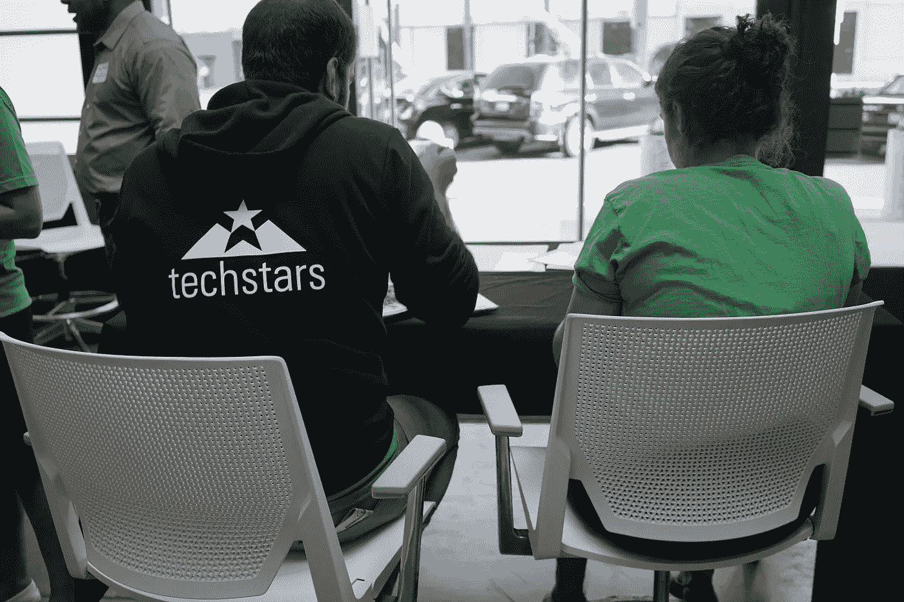

在加州大学洛杉矶分校(UCLA)读大二后的那个夏天，当我的许多老朋友消失在令人垂涎的咨询和金融实习中时，我在帮助企业家成功的全球网络 [Techstars](https://www.techstars.com/) — *担任助理，在一些突破性的早期公司工作。*

我是 Techstars 医疗保健项目加速器团队中最年轻的员工，与洛杉矶 Cedars-Sinai 医疗系统合作。在令人难以置信的 13 周里，我帮助支持了 9 家创新型创业公司扩大规模、开发产品、开发市场、向投资者推介，同时还有一个令人难以置信的支持性项目团队——以及 Techstars 网络中的许多许多导师。

加速器项目和社区遍布 150 多个国家，拥有 10，000 多名导师和 300，000 多名校友，在过去几年中，成为“Techstars 公司”对一家初创公司来说已经变得非常重要。但是，当你在全球直播演示日的节目中，创始人背后的团结，兴奋和归属感，每一次，都有比这些数字可能告诉你的更大的东西。我不认为你是一个创始人或导师或投资者，或者像我一样是一个项目方的人有什么关系。这很特别。有一段时间，我不知道那是什么。

该计划于 2018 年 10 月结束几周后，一位投资者朋友开玩笑地说，参加 Techstars 活动是一种精神体验。他完全正确。

# 你必须在那里才能得到它。

但是如果你不是，这里有一些我的项目的照片——Class 4，由 Techstars 驱动的 Cedars-Sinai 加速器。恭喜各位！

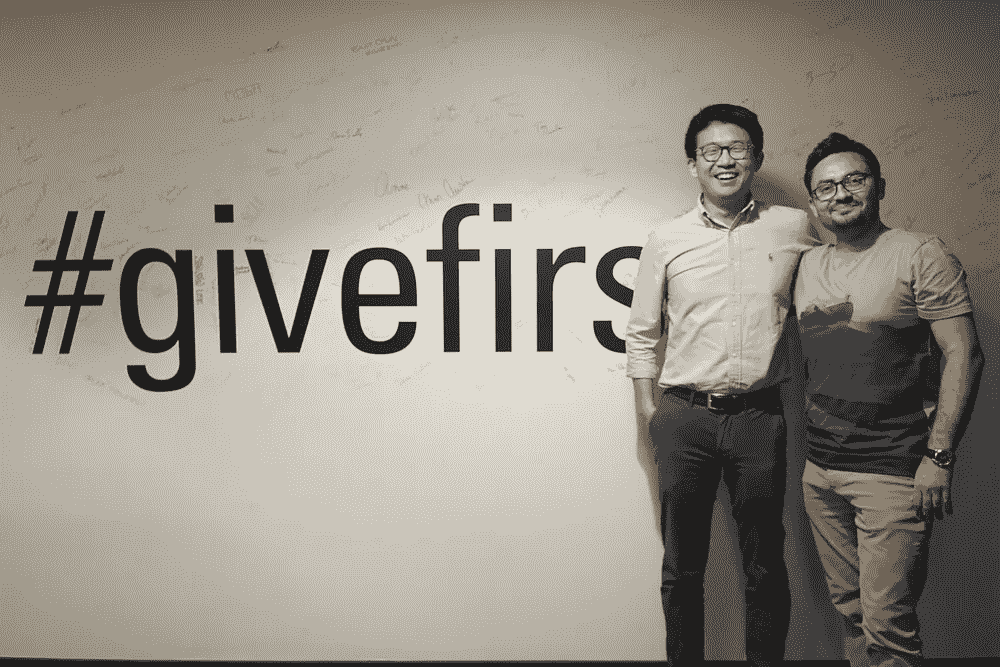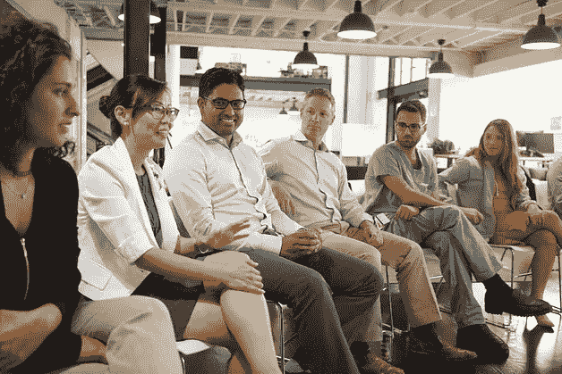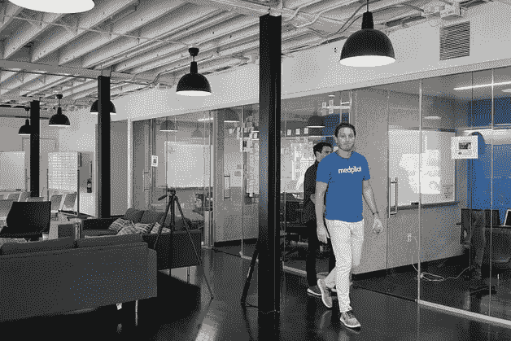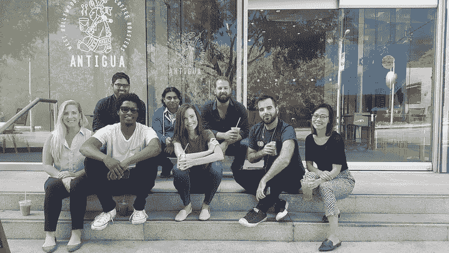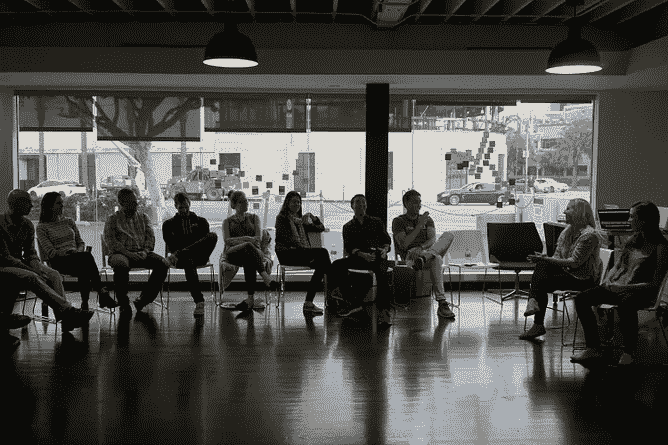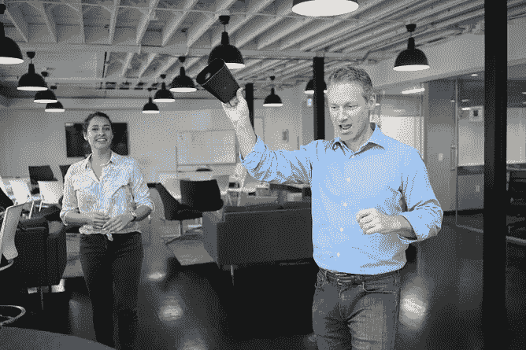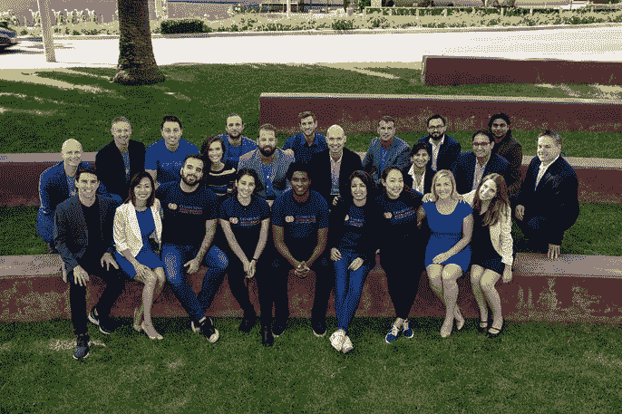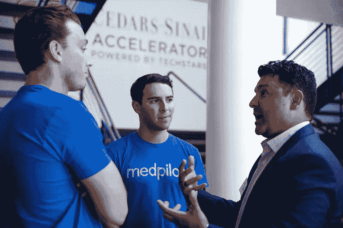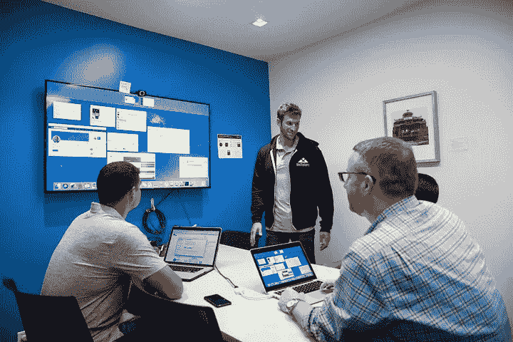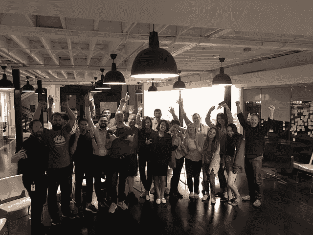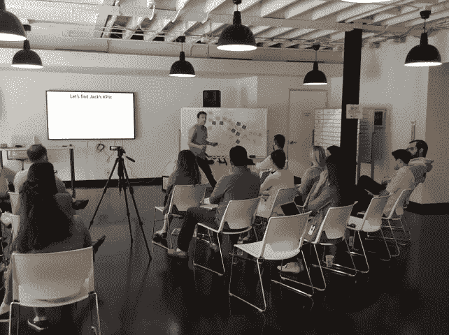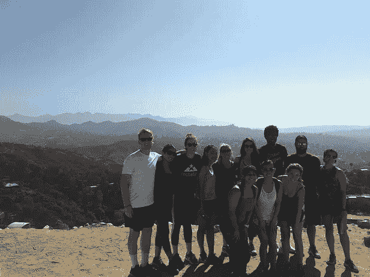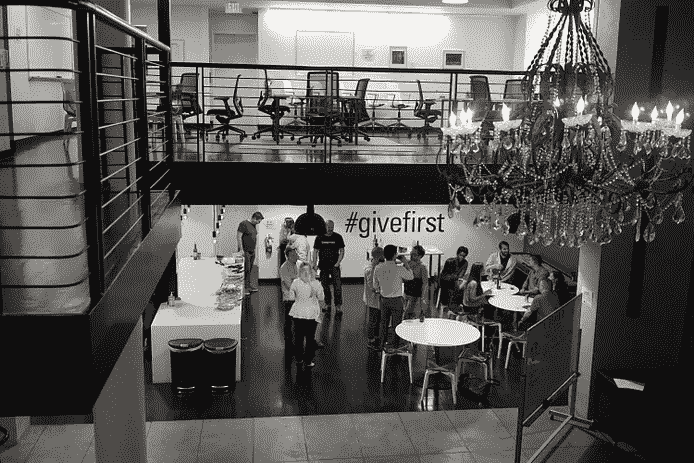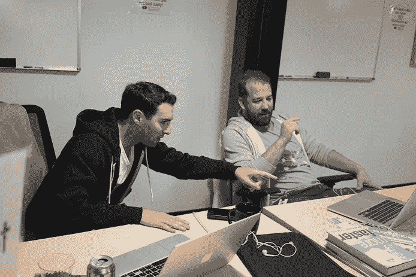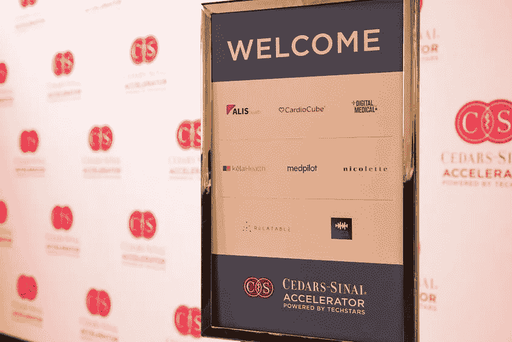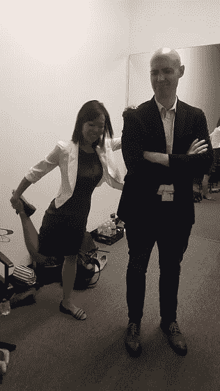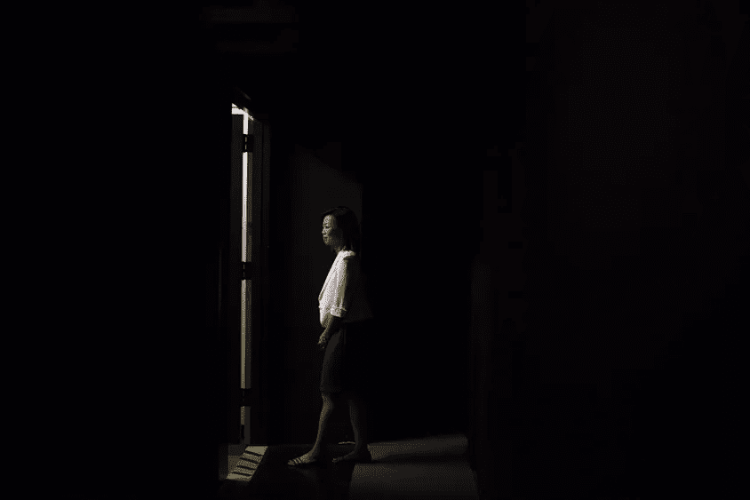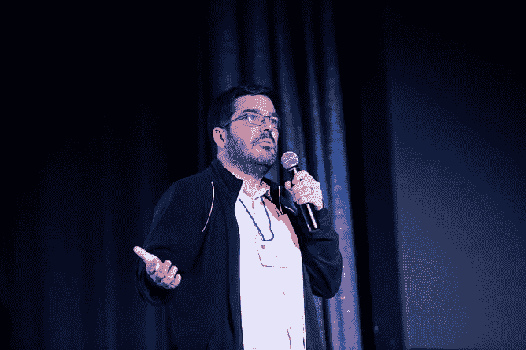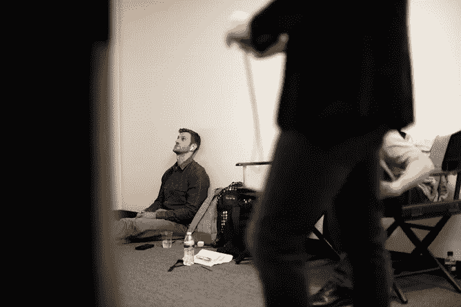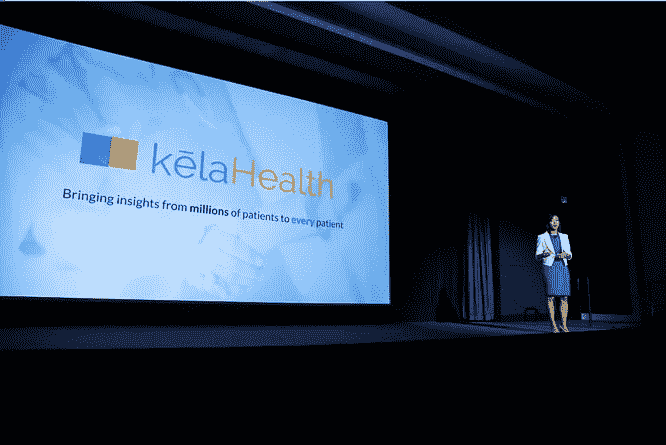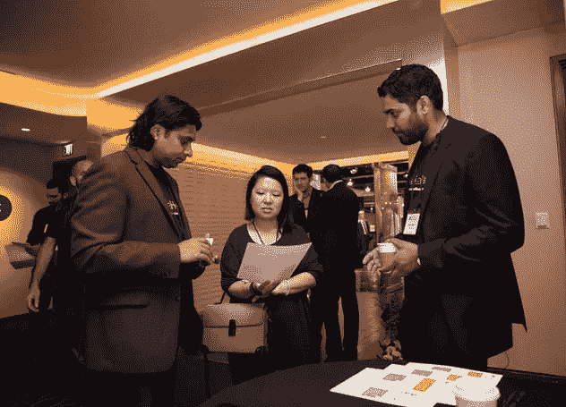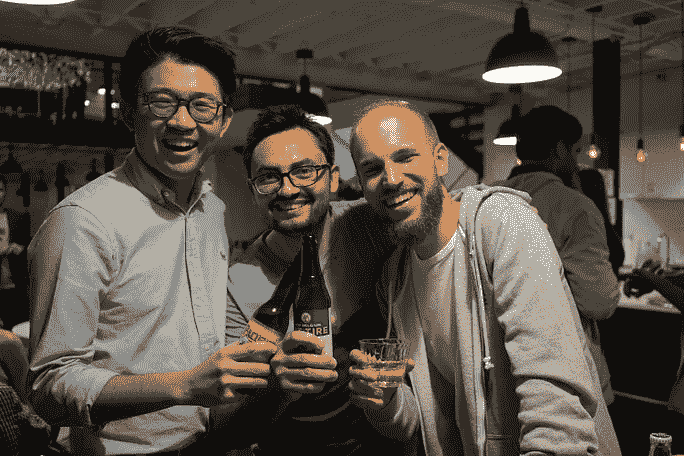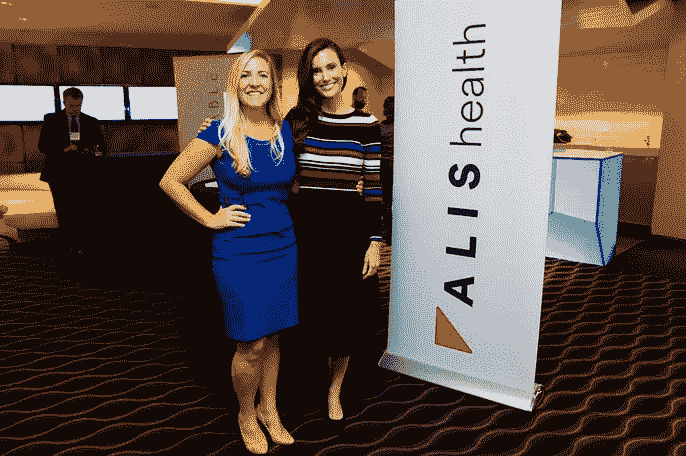

# 成为 Techstars 的一员对我意味着什么

作为一个大型但私密的加速器项目的中心，我对 Techstars 网络的庞大规模感到惊讶，并看到公司处理医疗保健领域独特的早期和垂直问题。经过三个月紧张而神奇的经历，以下是我的收获。

## #givefirst 实际上是什么样子

Techstars 有一个朴实无华的口号来装饰其共同工作空间的墙壁——# give first。

因此，毫不夸张地说，每个 Techstars 计划的开始都是为期两周的我们称之为“导师疯狂”的活动——整天都与导师会面，其中许多人将继续成为每个团队的关键导师，直到他们完成计划并走向世界。这让创始人面临压力测试，他们对自己的业务了解多少，他们有多少信念，以及他们打算如何在拥挤的数字健康市场中度过难关——这是一个拆除薄弱环节，用更好的环节来建设它们的时候。来自资深行业专家、保险和医院高管以及曾经成功过的前创始人的导师们的帮助，真是天赐良机。

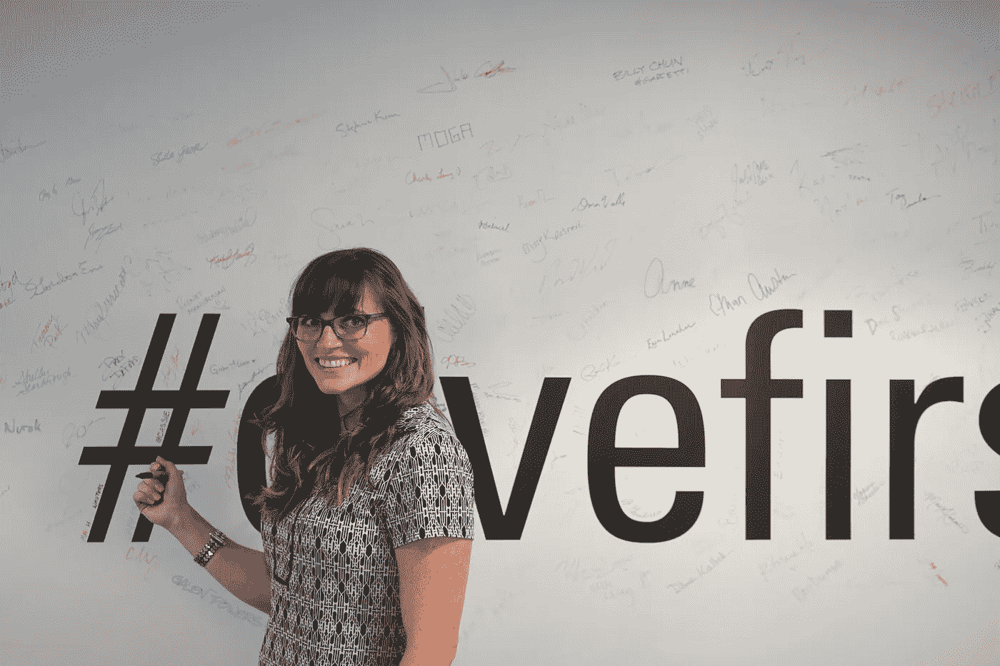

Mentors signed our #givefirst wall after meeting with companies — we’re 300+ signatures strong!

这很匆忙，令人不知所措，而且从一些最有经验的导师那里听到对你的业务的早期反馈意见不一，这绝对令人沮丧。也是潜在客户。专注于产品的差异化。实际上，不，用内容推送。在做产品之前，花更多的时间建立客户渠道。等等，这主意糟透了。你为什么不在这里和这里多观察一下你的特征呢？臭名昭著的是——你为什么不干脆放弃你迄今为止所做的一切，直接面向消费者！！！！！(一些团队决定这样做，这样会更好)

所有这些都令人筋疲力尽，但最终令人愉快且富有成效的怪异魔力来自于成百上千的人从全国各地飞到这里。只是为了见你。只是对你的生意感到兴奋。我不知道，但人们同时在场，无论发生什么都支持你，这本身就是巨大的证明。

所以在这一切之后——我曾经认为独自站在一个每个人都告诉你的伟大想法旁边是一个伟大的想法，这就是验证的样子，但事实并非如此。验证就是让人们袖手旁观你，当他们不相信你想法的某些方面时，诚实地告诉你——但他们还是会留下来，因为他们相信**你**会在围绕你的企业的那些错综复杂的问题中找到你的路。这也是 Techstars 教给我的——对我周围的人要有意识，做一个不只是给出昂贵的意见并继续前进的人。真的*在那里*，经历*一切*。

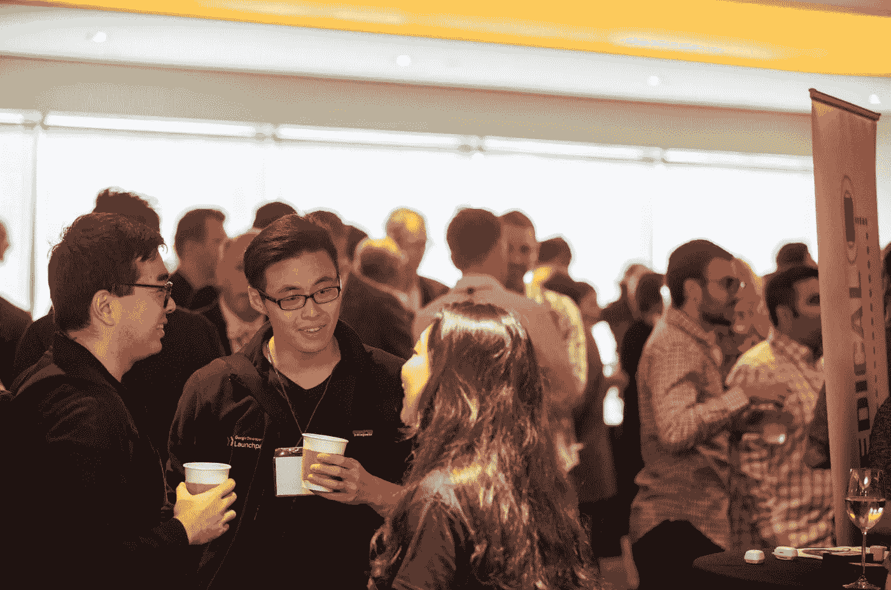

Here’s me talking to some investors about companies on Demo Day

人际交往很难，作为一名学生，我一直觉得我经历的方式并不应该是这样的——在招聘会上排着长队，翻着跟斗穿过燃烧的铁圈，进入与忙碌的陌生人电话交谈的“询问”部分。还有所有的。的。卑微。吹牛。你要做的就是给别人留下足够深刻的印象，让他向你推荐下一个。

在这个项目中，我不知道有多少次我不经意地与高管们交谈，他们问我，而不是反过来——“你有什么故事？你的下一步是什么？我能给你接通我在 X 的同事吗？他们会对你现在正在寻找的东西非常有帮助。”最疯狂的是，我从来不需要*请求*任何人帮我联系其他人。他们只是想减轻我的压力，并主动提供帮助。像这样的人的存在让我深感谦卑，Techstars 设法建立了一个充满他们的社区。

当然，要成为一名创始人，你必须善于寻求帮助，而你*将*不得不不知羞耻地多次寻求帮助；但当有客户要争取，有投资者要跟进时，我明白了，身处一个重要人物真诚地与你联系、首先关心你、甚至在你提出要求之前就准确预测你需要什么的环境中，你的肩上会卸下一个巨大的负担。真是太神奇了。因此，难怪像#givefirst 这样的心态会产生这样的创始人，他们一次又一次地回来与新的 Techstars 创始人进行这样的对话，甚至是在多年之后。我很自豪能正式成为这个社区的一员。

因此，我们以前见过投资者宣传他们的网络是对创始人的增值，但 Techstars 在全球层面上提供这种服务，但仍然感觉像一家人。有点俗气，但同样准确。

## 真正的创始人之旅是什么样子的

我知道，这位摇滚巨星式的天才创始人在荣耀的照耀下出去筹集资金，并通过一些偶然事件和上帝赋予的直觉做出重大产品决策的故事有点扯淡，但很难知道在创始人的故事中有什么没有说出来。叙事比以往任何时候都重要，我们激烈地控制着它。

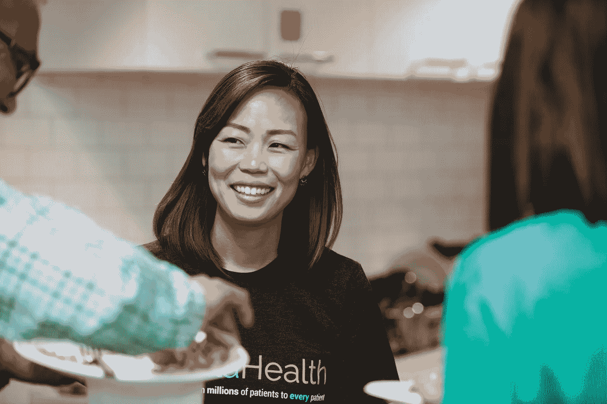

This is Bora, Founder & CEO of kelaHealth. Her software is transforming the way surgeons risk-stratify patients before going into surgery, bringing “insights from millions of patients… to every patient.”

我现在从与这些公司的合作中知道的不仅仅是成为一名伟大的创始人需要什么，还有支持创始人需要什么。也许这就是全部了。你的团队和支持圈意味着一切。

作为一家医疗保健加速器，我合作过的许多创始人都有临床背景，我相信这一点吸引了非常特殊类型的人聚集在这里。这些人不是一无所有的年轻人，他们是内科医生、外科医生，他们直接影响了其他人的生活，并已经做出了改变——尽管如此，他们也看到了他们的病人在疾病治疗方面存在的大问题。他们放弃了舒适和受尊重的职业来改变这种情况，通常是为了得不到充分服务的人——比如 NICU 的新生儿父母，他们感到完全无能为力，病人不知道他们同意接受什么样的高风险治疗，数百万妇女因为专注于家庭和职业而被排除在关于自身健康的对话之外。这样一来，成为一名创始人*就是成为一名有远见的人*。**但我认为，因为目标总是如此无私，拒绝更伤人，每一个错位的激励更令人沮丧。**看过所有这些之后，我*真正*钦佩创始人的是他们的情感力量，他们给予彼此的支持，以及他们如何在沮丧的时候照顾他们的团队。

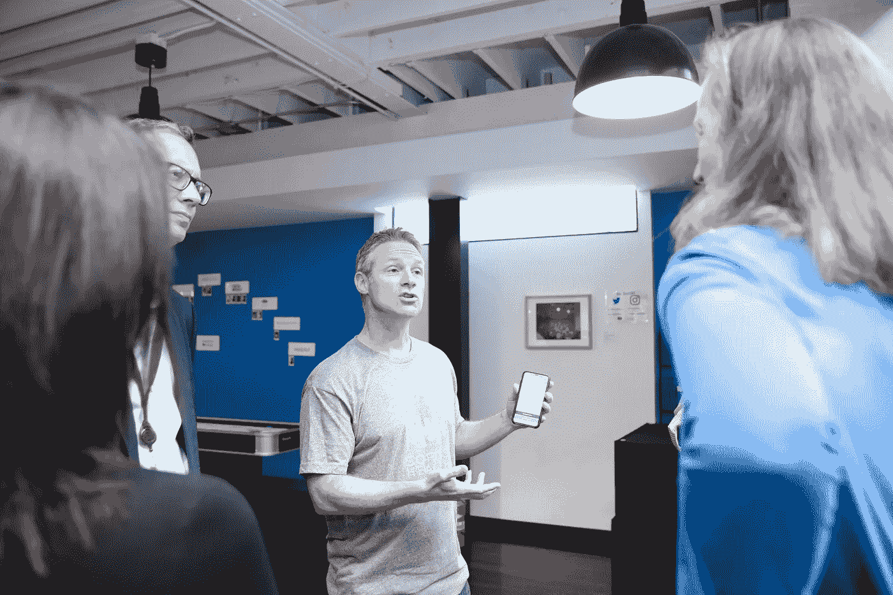

This is Patrick, Co-Founder & CEO of Sopris Health. The team is building an AI-driven clinical documentation tool to save hours of valuable physician time, and just closed a huge $3.2M in funding!

我看到一些创始人熟练地管理着跨越时区的大型分布式团队，而另一些人则在不得不解雇关键团队成员或雇佣不太合适的新成员的情况下苦苦挣扎。我看着他们离开全国各地的家人和朋友，甚至漂洋过海，来参加这个为期三个月的项目。在这一切中，是什么造就了一个伟大的团队？也许只要想想这件真实发生的事情:

演示日是我们项目的高潮，在演示日的两周前，当每个人都在忙着准备推介和产品演示时……一位联合创始人兼首席执行官家里发生了可怕的紧急情况。他一直在练习和练习不是他的第一语言的音高，并为了这个项目搬到这里，而他的团队成员留在国外，但现在突然不得不离开。他的联合创始人在得知这个消息后的四个小时内(T7)登上了从波兰到这里的飞机。他降落在洛杉矶，接管了一切，熬夜记下了一个他从未见过的推销词，并在年取代了他的联合创始人的位置。a .单身。日。

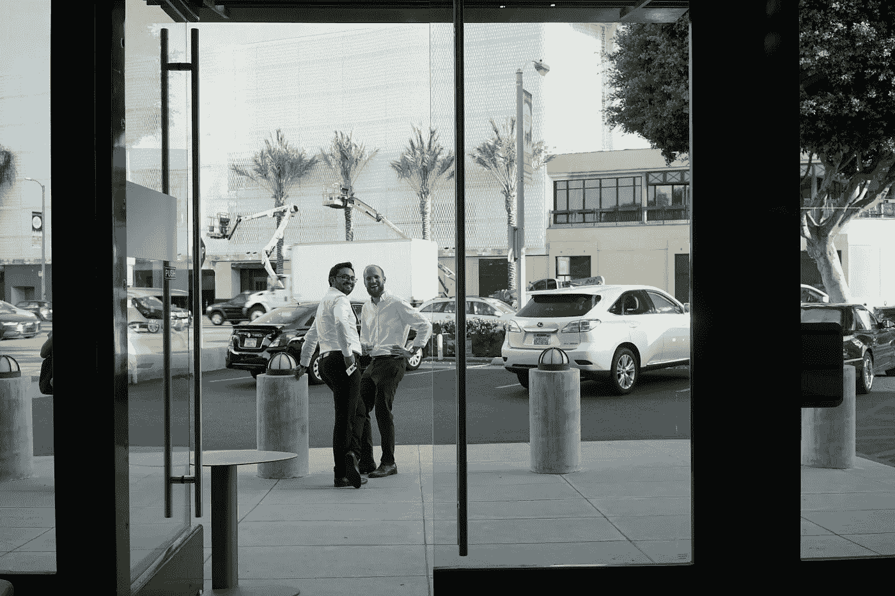

Oskar and Tom are co-founders of CardioCube, and they came all the way here form Poland to tackle chronic heart disease management with a voice-based AI. They’re also respected physician scientists.

伟大的团队是在困难的时候出现的，当你早到的时候，困难随时都会发生。现在我知道很多很多这样的伟大团队，以及他们是如何工作的。

## 伟大的人在其他人身上看到了什么

加入这个项目，从第一天开始，我就意识到与其他人相比，我在职业生涯(以及生活中)是多么初级，我对我能说什么和能做什么有很多保留。人们一再告诉我，初创公司需要早失败、快失败，但我真的很关心这些公司——我能做些什么来帮助他们度过这个形成期？

答案比我想象的要慷慨。从煮咖啡到设计产品功能，我几乎什么都做。

我觉得人们对创业谈得不够多的一点是，当你处于早期时，一切都被放大了。如果你有一个糟糕的团队成员，这比你更大的伤害要大得多。一个范围不好的特性可能会让你失去一些重要的客户，并且永远不会回来，尤其是在企业销售环境中。为什么任何一个创始人都应该让我*加入他们的团队，或者让我拥有对接下来发生的事情有如此大影响的项目？这种压力，尤其是当我和其他有着多年行业经验的同事一起工作时，迫使我尝试以前从未做过的事情来帮助企业发展。*

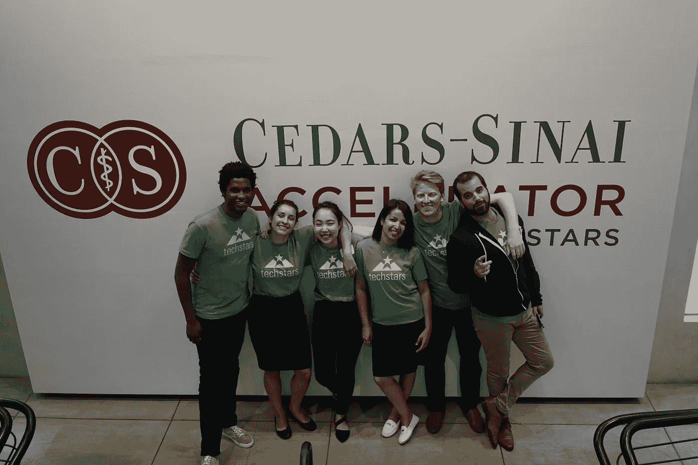

Me (third from left) and my Associate class — our backgrounds as diverse as we were in everything else

在这里，在伟大的创始人身边，我最欣赏的是人们不在乎你的年龄——他们在乎你有多好，你有多愿意成长，以及你像他们一样关心他们的产品。这正是我来的目的。事实上，作为一名具有良好 UX 感觉的资深作家，我很快发现，我在帮助公司围绕其产品构建令人信服的叙述、在多个交付(即 B2B2C)中协调产品中利益相关方的利益冲突，以及无论如何为最终用户提供周到的产品体验方面很有价值。

最后，并不是每一天都充满魅力，但我可以帮助团队绘制路线图、建立数据模型、构建投资者平台、设计网站、提出营销策略、绘制仪表板线框、与客户交谈、筹集资金，以及…这之间的一切。我花了很长时间坐在餐桌前思考第二天的事情，但这些问题让我真正地保持清醒，让我关心人们，并有意地思考技术的未来。在一天结束时，我带走的真正重要的东西，以及我写给今年夏天与我合作过的每一位创始人和团队的公开信，是这样的:

> 在所有人都回家后，在沙发上度过漫长的夜晚后，所有的深夜电话和通宵熬夜与你一起起草书面材料，因为你的联合创始人失踪了，合同泡汤了，你对你的企业拯救医院成千上万生命的愿景被关闭了，因为没有人以你的方式看待它，没有人愿意为此付出代价，有时你不得不忍受它，有时你又扭转它。但是我在那里，我看到了这一切，最重要的是——你坚持下去的毅力和信念，我感到非常幸运，你让我陪你度过了这些艰难的时光。

我非常感谢了不起的创始人给予我的耐心和信任，并激励我为将改变世界的公司做出有意义的贡献。就这样，我的夏天结束了。

现在，离毕业还有两年时间，我希望与更多优秀的团队合作，打造有影响力的产品。如果你知道一个好的，让我知道！

如果你想谈论创业公司、产品，或者只是电影之类的东西，请打电话到 sollee921@ucla.edu 找我。

感谢阅读！

表示“各种类型的土壤”:histosol ｜ vertisol

## 这篇文章发表在 [The Startup](https://medium.com/swlh) 上，这是 Medium 最大的创业刊物，拥有+398，714 名读者。

## 订阅接收[我们的头条](http://growthsupply.com/the-startup-newsletter/)。

