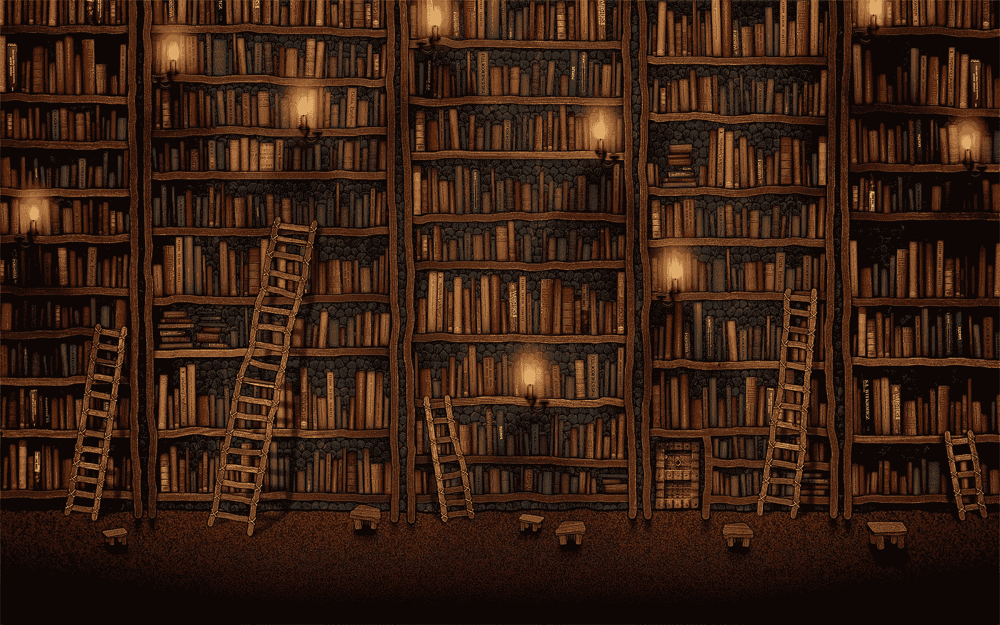
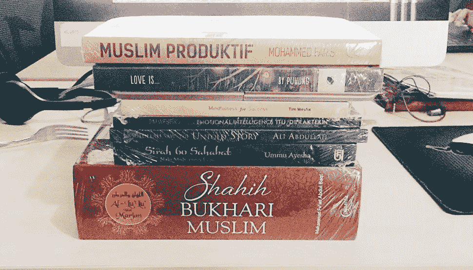
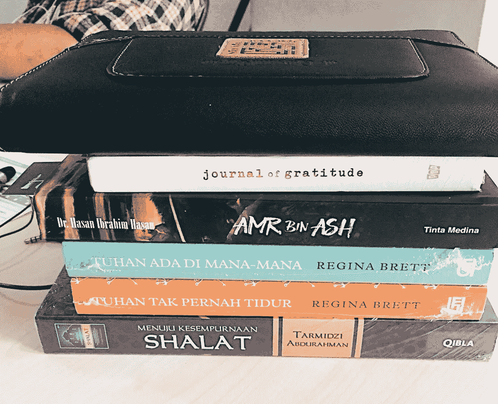
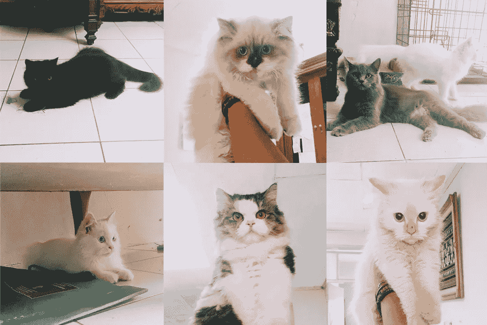

# 我用我的 Instagram 换了书！

> 原文：<https://medium.com/swlh/i-traded-my-instagram-for-books-b85c38b25174>

## 这无疑是值得做的

我决定停止使用社交媒体已经两个月了，在这里阅读原因:[https://medium . com/@ muhammadrizkinasution/im-off-from-social-media-af 266 a5 a 645 e](/@muhammadrizkinasution/im-off-from-social-media-af266a5a645e)。现在发生了什么？我把它们交易了…

为了书。

说真的，一开始这么做真他妈的令人沮丧。多年来，我的手指、我的眼睛、我的晨间习惯都被训练成拿起手机，尽快打开社交媒体。现在没有了，facebook，twitter，instagram，所有的一切。我每天早上醒来打开手机，搜索我所有的社交媒体都去了哪里？重新考虑重新安装它们？太多次了。

这很难。

但这只持续了第一周。我会慢慢适应新的环境。不用再为抢那些有毒媒体而自我战，也不用再因为我不能查看网络世界发生了什么而焦虑。然后我开始寻找另一个输入，我知道消费社交媒体是一个输入，但它对我来说是不好的输入，所以我为我的生活质量寻找一个更好的输入。我问自己，我一直在努力做什么，但从来没有真正完成。我回答了我自己。

读书。

尤其是书籍。我不喜欢在线阅读，比如 epub，ebook，emagazine，它只会持续几天，然后我就会厌倦，因为我需要与我想读的东西有身体接触。然后我在网上买了 20 本书，那些书是我两年前就想看却一直没机会看的书。

到目前为止，我已经完成了一个，还有 19 个。我的目标？每个月至少做一次。我开始缓慢，但稳定。我需要的是一致性，而不是被火一烧就化为灰烬。

效果？非常喜欢。它改变了我起床的习惯，睡觉的习惯，空闲时间的习惯，以及我作为千禧一代的整个习惯，他们最初沉迷于电子玻璃，后来变得如此崇拜纸张。我花 30 分钟读自我塑造的书，午饭后花 30 分钟读媒体，睡觉前花 30 分钟读伊斯兰传记。在周末？我读了一整天的书，同时和我的猫一起玩耍。

my kingdom of fur

> 阅读一切，小说，历史，科学，小说，一切。问题不在于你想读什么，而在于你想读多少。只是阅读。

我希望这能引发你做同样的事情，至少减少对社交媒体的依赖，因为我的朋友，他们是为你输入你的时间、你的大脑、你的生活的 ***坏假装*** 。

干杯。

## 这篇文章发表在 [The Startup](https://medium.com/swlh) 上，这是 Medium 最大的创业刊物，有 282，454+人关注。

## 订阅接收[我们的头条新闻](http://growthsupply.com/the-startup-newsletter/)。

