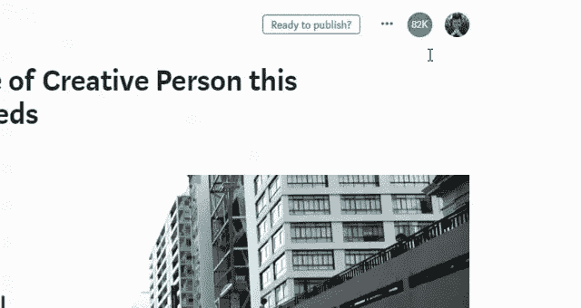

# 我曾经很出名

> 原文：<https://medium.com/swlh/i-used-to-be-famous-on-medium-bbdbeab96e73>

(一个警示性的故事。)

很长一段时间，我都没有把它们抹掉。

80，000 份通知意味着什么。每个人都给了我可信度和社会证明。它提供了满足感。

每次我登录 Medium 时，我都会看着这个数字，然后想

> “哦，太好了。我还是个人物。”