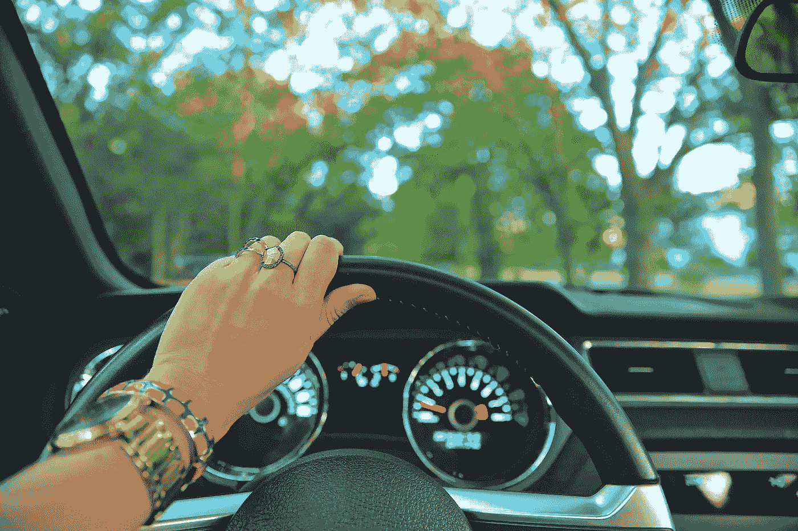

# 我想要全部，我昨天就想要

> 原文：<https://medium.com/swlh/i-want-it-all-and-i-want-it-yesterday-2ea22a639f48>

Photo by [Daniela Cuevas](https://unsplash.com/photos/gFVGAXmRwf4?utm_source=unsplash&utm_medium=referral&utm_content=creditCopyText) on [Unsplash](https://unsplash.com/search/photos/bling?utm_source=unsplash&utm_medium=referral&utm_content=creditCopyText)

名车、钻戒、昂贵的手表、旅行、一台新电脑、一个丰厚的银行账户、一部新手机……我想要这一切，我昨天就想要。

# 一个即时满足和态度的社会，而不是感恩

Photo by [Jared Rice](https://unsplash.com/photos/NTyBbu66_SI?utm_source=unsplash&utm_medium=referral&utm_content=creditCopyText) on [Unsplash](https://unsplash.com/search/photos/gratitude?utm_source=unsplash&utm_medium=referral&utm_content=creditCopyText)

我们都经历过，当我们想要的时候，想要我们想要的东西。但是瞬间(看到我做了什么吗？)我们的一生都是这样度过的，当我们把自己变回无法控制自己的三岁小孩时，就是我们放弃控制自己和自己生活的时候。我们停止生活，开始生存。

态度胜过感激。我的朋友们，这不是生活的方式。这是一条通向焦虑、抑郁和严重健康问题的笔直而狭窄的道路。

我知道，我经历过。

我对生活的态度绝对糟糕。我一直很焦虑。我很沮丧。它影响了我的健康，以至于我有广场恐惧症。我没有离开我的房子。我不能开车超过几英里，即使我做到了，因为我的焦虑是如此严重，我担心我会陷入困境。如果要过桥，那是不可能的。

我把自己弄残了，以至于我还不如不存在。我失去了朋友，我推开了家人，我失去了自己。

我的一个兄弟给了我一本书，实际上(打个比方)我被踢了屁股。他告诉我，除了你自己，没有人能帮助你。你必须努力。这里有一个工具，使用它。

我照做了。我学会了感恩，从生活中去除消极，接受积极，放慢脚步，花时间反思，在小事中寻找快乐，不生气，不焦虑，不沮丧。我学会了停止期待一切都在此刻发生。

我意识到，虽然我们没有世界上所有的时间，但我们应该珍惜我们所拥有的时间，并让它变得有价值。并且要感激眼前的，已经拥有的，不要那么快去积累更多，更多，更多。

不要担心别人都有什么。自由地付出，不求回报。它会改变你的生活。

如果你对我关于这个话题和其他话题的更多内容感兴趣，欢迎关注我[这里](https://mindfulmoments408906938.wordpress.com)并订阅。

如果你喜欢这个，你可能也会喜欢这个:

 [## 真相会让你自由，但首先会激怒你

### “真理不搜寻任何人。它等待着被发现。”――苏西·卡西姆，起来向太阳致敬:苏西的作品……

medium.com](/@ccuthbertauthor/the-truth-shall-set-you-free-but-first-it-will-piss-you-off-a1000b28f4ef)  [## 我主要是和平、爱和光，还有一点点去努力

### 老实说，我今天过得很糟糕。我是，完全诚实的。至少我试着去做。

medium.com](/@ccuthbertauthor/im-mostly-peace-love-and-light-and-a-little-go-eff-yourself-12fe907bd1c8) 

善待自己，你将是你唯一的自己。

❤

## 这个故事发表在 [The Startup](https://medium.com/swlh) 上，这是 Medium 最大的创业刊物，有 287，184+人关注。

## 订阅接收[我们的头条新闻](http://growthsupply.com/the-startup-newsletter/)。

