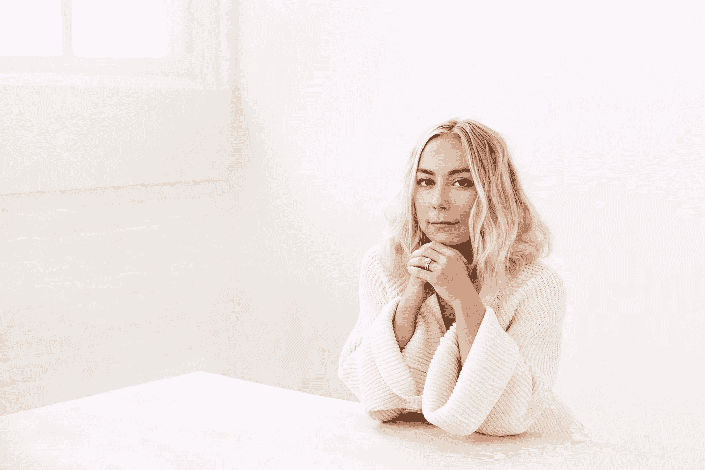
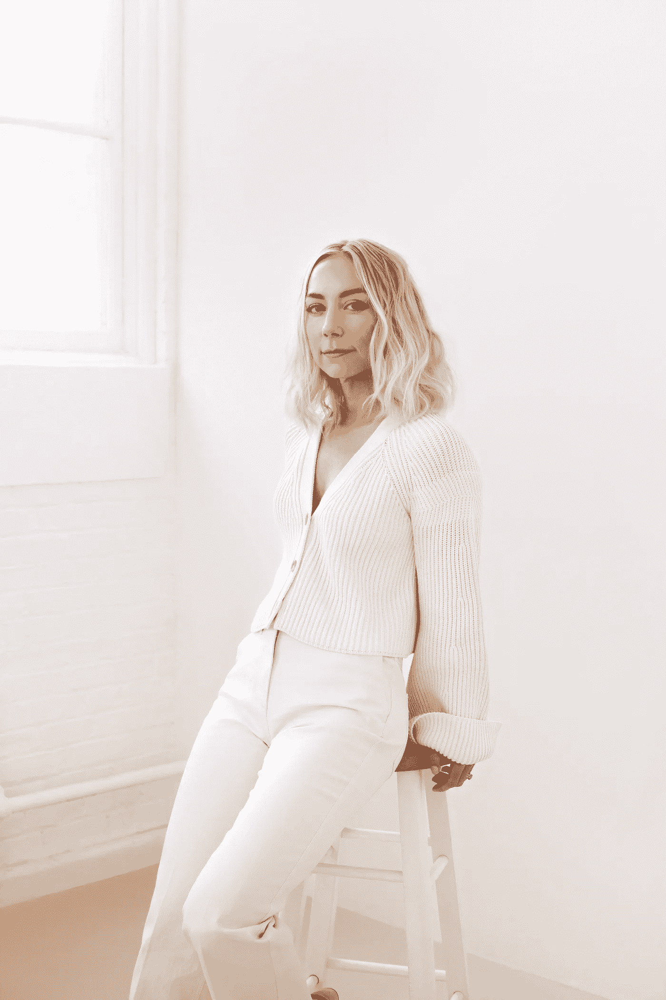

# “我想发起一场人与人之间的运动”,由 Mowellens 的首席执行官艾米·邓肯发起

> 原文：<https://medium.com/swlh/i-want-to-start-a-human-to-human-movement-with-amy-duncan-ceo-of-mowellens-fd76aa2b7d3c>

> 我见过很多人，他们只有在遇到挑战时才会改变自己的生活。这种经历创造了这种转变。他们的生活天翻地覆，重新开始。我也是其中之一，一个患脑癌的丈夫改变了我的看法。但是为什么一定要这样呢？我们一直等到坏事发生，才真正意识到我们的目的。我想发起一场人对人的运动。在那里，我们带来故事、经历和灵感，以改变思维方式，消除判断，并重新连接我们的大脑，以唤醒这种生活。一旦我们开始把每天经过的每个人都视为自己人，我们就会把这个世界视为一个相互联系的呼吸形式。我们将觉醒于富足、接纳和更新的能量。这不仅会给生活带来好的一面，还会制造停顿，让人们开始感受而不是反应。我相信如果我们像这样生活，世界会变得更好。

> 我有幸采访了冉冉升起的新星和企业家， [Amy Duncan](http://www.instagram.com/livingduncan) ，一家意识健康公司 [Mowellens](http://www.mowellens.com) 的创始人兼首席执行官。Amy 平衡了作为护理者的生活，开创了自己的事业，并保持了自己的自我护理养生法。她从许多角度体验了医疗保健行业，医疗设备，生物技术和临床实验室，并在 2012 年她丈夫被诊断患有胶质母细胞瘤脑瘤后，在他们结婚一年后，作为她的世界系列冠军丈夫的护理员。她现在把她在所有健康方面的职业和商业知识带入了健康产业。

**非常感谢你加入我们！你能告诉我们是什么让你走上这条职业道路的吗？**

我生长在一个非常传统的中西部家庭。我的父母已经结婚 38 年了，三个姐妹都已经结婚并有了孩子。我是个叛逆的孩子，总是为自己打鼓。“传统”职业道路的清单很长…我的父亲是工程师，母亲是一所天主教学校的校长，姐姐是工程师、会计、人力资源。最初我想成为一名药剂师，这是一个令人愉快的选择。但是，当这条路改变了，我想成为一名企业家和销售人员的愿望…我父母看着我，好像我有三只眼睛。当这种创业动力转变为健康和保健公司的启动时，你可以想象我从他们那里得到的能量反弹。

创办 Mowellens 公司的过程相当自然，是我迄今为止生活、事业和研究的高潮。我一直想工作，有一种无法停止的动力，从我 16 岁那天起就一直有一份工作。我担任过的每一个职位，甚至在图腾柱的瓶子里，我都努力从战略的角度来看待这个行业，弄清楚它是如何运作的，它是如何赚钱的，它是如何适应这个生态系统的。我做了四年的药剂技术员，大学毕业后获得了商业和营销学士学位，辅修了化学。对我来说，这一直是科学和营销的平衡。我有能力提炼出非常复杂的主题，并使它们变得简单，一些普通社区可以理解的东西。

2007 年，我遇见了我现在的丈夫克里斯·邓肯。当时他是圣路易斯红雀队的职业棒球运动员。大学毕业后，当他打棒球时，我和他一起到处旅行。我们称之为“爱的夏天”巡回赛，走遍了几乎每一个大联盟的体育场，为他欢呼，当他踏上垒板时，看到 60，000 名球迷起立迎接他。这让我为他感到骄傲。回想起来，我发现在那段时间里我可能不是最好的女朋友。在 24 岁的时候，大多数女性都处于探索模式，学习她们是谁，她们想成为谁，以及她们将如何到达那里。克里斯刚刚在 2006 年赢得了一场世界大赛，他很满足，而我却恰恰相反。我心中的野心越来越大，我觉得自己像一只被关在笼子里的动物。这种感觉是短暂的，因为他的身体开始恶化，一次又一次的手术结束了他的职业生涯。2010 年，我发现自己回到了圣路易斯，找到了第一份销售复印机和打印机的工作。该是我努力的时候了…我已经准备好了。

我接受了理光的一份工作，基本年薪为 27，000 美元。第一年，我赚了 62000 美元，证明了我可以销售。在位居榜首两年后，医疗保健行业的招聘人员开始打电话来。向医疗设备转型不是一个简单的飞跃。经过三个月严格的面试过程，他们通过了我，但四个月后又被叫回来，要求重新开始面试。我记得我飞往丹佛参加面试，地点是一家酒店的大堂，有一位销售副总裁。当他在大厅遇见我时，我站起来和他握手。我用最严厉、最坚定的语气说:“我理解你对聘用我担任这个职位的担心，因为这将是我在医疗保健领域的第一次。我相信我有能力成功。我这次会面的目的是让你们毫无疑问地离开这张桌子，知道我是这份工作的合适人选。”他看着桌子对面说:“这份工作是你的了。这就是我所需要听到的。”正是这种心态和适时介入的能力推动了我的职业生涯向前发展。我们每个人都有这种能力，但是我们是否能在适当的时候挖掘我们的潜力是决定我们旅程成败的关键。在适当的时候它会发生，但是它发生的有多快取决于这些执行的时刻。

在销售生理病人监护、床边监护仪和遥测设备的过程中，我深入到了医疗保健行业。学习医疗保健使我能够向每个利益相关者定位产品，从基于价值的报销和 HCAHPS 到侵入式压力和 O2 sat 以警告疲劳。

就在一切都步入正轨的时候，我的世界被连根拔起。我丈夫开始癫痫小发作，伴有麻木和语言障碍。起初我们并不能 100%确定它们是什么，但在谷歌上快速搜索后，我们知道我们必须排除什么，脑瘤。其他一切都会好的。但不幸的是，排除这一诊断将被证明是一个更大的挑战，因为他的母亲在一年前被诊断出患有脑瘤，胶质母细胞瘤。我们知道我们要面对的是什么，这并不容易。

经过七个小时的清醒开颅手术，重新学习走路和说话，放疗，以及一年的化疗，事情开始看起来有点正常了。核磁共振检查每四周进行一次，在此期间我们过着最好的生活。克里斯回到 ESPN 101 电台工作，我也回去工作了。我们花了一年的时间进行核磁共振成像检查，以此来摆脱寒冷的冬天。当我的公司推出一项促销活动时，我们搬到了加利福尼亚。

遗传学一直吸引着我，克里斯和他的母亲都被诊断患有胶质母细胞瘤脑瘤。我们对它们的外显子进行了测序，进行了遗传性癌症种系突变检测，并进行肿瘤分析，结果发现…嗯不多。但不管怎样，这个研究领域在召唤我，我选择了一个不多的。但不管怎样，这个研究领域在召唤我，我在一个专门研究药物遗传学的遗传学实验室找到了一份销售和市场总监的工作。首席运营官辞职后，我进入角色，在遗传性癌症检测、携带者筛查、非侵入性产前检测和毒理学方面推出了四个新的产品线。遗传学对我来说是非常个人化的，我能够再一次把一些非常复杂的东西变得大众容易理解。

2016 年夏天，实验室开始探索大麻测试，我开始尽职调查，探索测试“干净”大麻所需的方法和设备。2016 年，测试法规刚刚开始，了解到市场上没有经过测试的产品，我内心产生了不安。我知道如果产品没有经过测试，我的家人使用它是不安全的，我不想让任何人使用它。它真的点燃了我内心的某些东西。事实上，对于一个初来乍到的人来说，在大麻市场上导航是相当具有挑战性的。你去药房吗？你在亚马逊上购物吗？什么是大麻 vs 麻油 vs 火麻仁油 vs 大麻提取物 vs CBD vs 大麻？许多信息相互重叠，被误解了。所以我在相当深的科学层次上涉猎了这种植物，并且对它的潜力非常感兴趣。

然后最糟糕的事情又发生了……2016 年 10 月，我丈夫的脑瘤复发了。当我们在核磁共振成像上看到再生时，它带来了比第一次更多的恐惧、愤怒、困惑和悲伤。当癌症复发时，它真的会让你质疑你的生活。我记得有很多天…真的是很多年…我比丈夫早起床，在太阳升起前离开家，天黑后回家。我身体不好，没见过克里斯，这是我改变的机会。我离开了我在实验室的位置，决定看看我这些年来一直在长的翅膀是否能飞起来。

说克里斯感到震惊是轻描淡写。我记得他的原话，“你在做什么？”我一直是个不做重大决定的人。我不会纠结于此，也不会写出利弊，我只是等到需要做出决定的时候。在这方面，我很有灵性，我等待这种直觉真正告诉我那是你需要做的。这是人生大计划中的一个重大决定，但对我来说并不沉重。我想，我在职业生涯中走到了这一步，我将来可以在任何我想去的地方取得成功，所以我们走吧。还有什么比赌自己更好的呢？那不是别人的钱。我把职业收入加倍。这样感觉很好。

我看到了一个像我这样的人的机会，我有医疗保健和生物技术的背景，我作为一名护理人员的经验，并且是一名健康和健康领域的普通女性，通过提供纯净、清洁和有目的的产品来铺平道路并建立与社区的信任。所以我汇集了我所有的经验，与一些最伟大的研究人员和种植者、香水炼金术师、食品和配方科学家以及设计专家合作…莫沃伦斯出生了。

**可以分享一下你开公司以来，发生在你身上最有趣的故事吗？**

和我丈夫一起生活，带着意识和同理心生活，真的让我看到了在建立公司的过程中发生的一些小事。每天我抬头仰望，心怀感激。每天似乎都会有一些偶然的遭遇推动公司前进。无论你称之为显化、观想、奔忙还是处于流动中…..这就是我的生活方式，它让我的生活，每一天，都变得有趣和愉快。

当我处于健康行业的早期阶段，消费来自各种社交媒体影响者的内容时，我收集了一份女性和健康媒体的名单，我希望我的产品能送到他们手中。我真的不知道影响者营销的世界是如何运作的，但我读到过，听过研讨会，当然也听说过它成功地推出了一个品牌。在我们推出后，由于品牌的使命、故事和设计，我在名单上收集的有影响力的人和媒体开始有机地与我联系，甚至在没有我们鼓励或参与的情况下订购产品。我看到一些我钦佩的人，因为他们的内容和与他们社区的联系，现在有兴趣分享我的公司，就像我多年来看到他们分享其他人一样。从珍妮特·奥格登( [@ShuttheKaleUp](http://www.instagram.com/shutthekaleup) )、Chinae Alexander([@ chinealexander](http://www.instagram.com/chinaealexander))、乔安娜和格雷丝·朴( [@exercisewithextrafries](http://www.instagram.com/exercisewithextrafries) )、到《美国周刊》( [12 个 CBD 热门产品](https://www.usmagazine.com/stylish/pictures/12-cbd-beauty-products-supplements-rubs/))、Chalkboard Mag ( [8 个令人惊艳的 CBD 产品](http://thechalkboardmag.com/use-cbd-8-amazing-products-head-toe-bliss))。我们开始受到关注，我意识到将愿景写在纸上是激活富足和吸引力的第一步。

另一个有趣的体验发生在最近，周末我和朋友在海边充电。我喜欢工作和建造东西的过程，所以对我来说，旅行只是在我感觉被召唤去某个地方的时候。我问我的朋友这个问题，“如果你现在可以去某个地方度假，你会去哪里？”答案自由流动，渴望探索…..希腊，马德里…我的回答是“马尔代夫”清澈的海水和无阻碍的天空让我感到敬畏。那周的周四，克里斯(我丈夫)半夜醒来，头痛欲裂，无法入睡。我翻过身来滚动我的提要，在晚上 11 点 01 分(1 表示对齐)，我收到了马尔代夫一家豪华度假村的行政总厨发来的信息，询问在他们的烹饪项目和水疗中使用我们的产品。

有意识的意识和感激已经改变了我的生活，并继续改变着每天进出我生活的经历和人。我的意图不是用这种技能(我确实认为这是一种技能)带来物质或身体上的收益，而是实现自由的整体生活意图。

你能分享一个你刚开始工作时犯的最好笑的错误的故事吗？你能告诉我们你从中吸取了什么教训吗？

这很有趣，因为我总是喜欢回顾我的旅程，看看过程和执行是如何最终体现为有形的东西。实现一个想法是非常值得的。当我回顾公司成立的最初阶段时，我发布了一份配方科学家的职位描述，那家公司甚至还不存在。我的背景允许我在这个领域坚持自己的立场，但我采访了一些人，以了解我需要什么来让一个产品变得有生命力，我认为我需要让一些人加入进来。我发现一些非常有才华的化学家，当我们转向医疗领域时，他们最终会加入公司。但是这么早迈出这一步绝对是一个可笑的错误。不过，我甚至不认为这是个错误。关键是要经常执行和迭代，这样错误只是垫脚石，而不是失败。这个过早面试的过程就是我最终了解我们需要去哪里的原因，我最终选择了外包而不是入职。

**你认为是什么让你的公司脱颖而出？可以分享一个故事吗？**

作为一个有意识的健康和保健公司，它是核心价值观和社区的结合，使 Mowellens，Mowellens。与人们和他们的家庭的联系，产品将流向妈妈、爸爸、兄弟姐妹、祖母、阿姨…家里的每个人。我们有能力成为通向纯净、清洁产品的桥梁，这些产品在人们的生活中具有普遍性和多功能性。真的很特别。当然，人们喜欢品牌设计，但当他们听到我们的使命、我们为良好的贡献而成长，以及我的背景时，这给我们生产的产品以及我们为什么做这些事情增加了一层可信度。

我们真的致力于生产纯净、清洁的产品，为了坚持这一点，我们做出了合乎道德、有时代价高昂的决定。有时，这种承诺会使我们延期交货，导致生产延迟，并影响我们的底线。但从长远来看，这是我们不具备的核心价值，也是我们拥有如此忠诚的追随者的原因。

**你会向你所在行业的同事推荐哪些建议来帮助他们茁壮成长，而不是“筋疲力尽”？**

自我照顾、自我意识和联系是我生活中防止精疲力竭的基本要素。作为一个女人，自我保健意味着努力改善我的外表，让我散发出女性的能量。我的皮肤、头发、指甲、放松的沐浴、冥想、锻炼…它们都有助于我的身心健康和整体健康。这些事情在我的生活中是不可协商的，如果我不关注它们，我的生意就会失败，因为我的生活会感受到负面影响。自我意识允许我暂停，向内调谐，检查我现在需要什么。联系给我的生活带来了乐趣和视角。我的朋友圈太神奇了！他们了解我，他们是我的平等者，我的映像。他们和我一样热爱生活，他们都热爱这个过程。

没有人能够在前进的道路上获得成功。有没有一个特别让你感激的人帮助你走到了今天？可以分享一个故事吗？

我的丈夫一直支持我和我的抱负，没有他，我不会像现在这样对待我的生活——无论是个人生活还是事业。我们在一起 11 年，结婚将近 8 年。他看到我发展成为今天的我，这可能是一个挑战，因为这些年来我的观点和声音也变得越来越强。他在我身边教会了我很多平衡和生活的经验，我把这些经验带到了商业中。我的一些伴侣告诉我，我是多么善良和有耐心，这都归功于我的丈夫。看着某人处于人生的巅峰，赢得世界职业棒球大赛，然后与癌症等疾病作斗争，在我的人生和创业旅程中，这一切离我如此之近，给我管理公司的日子带来了独特的元素。生命如此珍贵，当生命危在旦夕时，你会对其他事情有不同的评价，做出不同的决定。与莫沃伦斯有关的每一个人，每一个雇员，承包商，供应商，你能想到的…有着相同的核心价值观。如果他们不同意，我就不和他们做生意。我们的关系和他的力量加强了我生活中的原则，使我能够成为我一直梦想成为的女人。

**你是如何用你的成功为世界带来益处的？**

从 Mowellens 成立之初，公司和我个人对社会责任的关注就是重中之重。我们消费了如此多的产品，但我们不一定知道它们来自哪里，成分来自哪里，谁在花费时间和精力制造它们，以及环境影响是否是一个考虑因素。诚然，在一家公司的早期阶段，这是一个具有挑战性的焦点，因为保持活力和解决问题是吸引你的因素。与我们的合作伙伴建立联系，了解他们的故事、使命和价值观，让我们能够将这些振动传递给 Mowellens。这可能是通过一个家庭拥有的供应商，一个小农场主，一个环保的瓶子制造商或印刷过程，甚至下降到组织的员工谁使文化的特殊性。

教育是变革的载体，我们成立了 Grown for Good，不仅是为了以情感的方式产生影响，也是为了激励我们的社区分享、改变和团结起来，成为自己健康的倡导者。我们向 Grown for Good 基金捐赠每一笔购买的 1 美元，然后重新与社区接触，投票决定我们将它们分配到哪里，是一个事件、原因还是诊断。脑癌显然是我的软肋，但总体健康、植物营养、表观遗传学和自我保健都在我的书里。我们的社区也有他们的激情，这给了我们一个在多个层面上联系的机会，以多种方式为世界带来美好。

**你有最喜欢的“人生课语录”吗？你能分享一个与你生活相关的故事吗？**

我最喜欢的名言是“如果你知道你不会失败，你会尝试做什么？”作为一名 INFJ 人，我冒着进入分析瘫痪区的风险。进步是我的动力。这句话在我耳边响起，在我的书桌上凝视着我，让我不断前进。这让我得以在创业中检验自己的翅膀，当我想要改变生活或改变生意时，这听起来很真实。当我在 2016 年离开实验室时，我的家人担心我的下一步是什么。他们认为我放弃财务稳定的东西是疯了。但是每天我都为了钱去工作。当你真的相信你能完成一些伟大的事情，并且你对那看起来像什么有一个愿景，没有理由你不应该大胆尝试，不要害怕失败。失败到底是什么？如果你愿意，你随时可以站起来。

**你的“我希望在创办公司前有人告诉我的 5 件事”是什么，为什么？请为每个人分享一个故事或例子。**

差异化。区分。区分。

适应性强，准备好快速做出改变。

坚持不懈地追求。

随着行业的发展，继续自学。

关注你的精神和身体健康

你是一个很有影响力的人。如果你能发起一场运动，为最多的人带来最多的好处，那会是什么？你永远不知道你的想法会引发什么。:-)

我见过很多人，他们只有在遇到挑战时才会改变自己的生活。这种经历创造了这种转变。他们的生活天翻地覆，重新开始。我也是其中之一，一个患脑癌的丈夫改变了我的看法。但是为什么一定要这样呢？我们一直等到坏事发生，才真正意识到我们的目的。我想发起一场人对人的运动。在那里，我们带来故事、经历和灵感，以改变思维方式，消除判断，并重新连接我们的大脑，以唤醒这种生活。一旦我们开始把每天经过的每个人都视为自己人，我们就会把这个世界视为一个相互联系的呼吸形式。我们将觉醒于富足、接纳和更新的能量。这不仅会给生活带来好的一面，还会制造停顿，让人们开始感受而不是反应。我相信如果我们像这样生活，世界会变得更好。

**我们的读者如何在社交媒体上关注你？**

我们希望《茁壮成长》的读者在社交媒体 [**@mowellens**](http://www.instagram.com/mowellens) 上关注 Mowellens，我们的网站是[**mowellens.com**](http://www.mowellens.com)。我可以在社交媒体上被关注[**@ living Duncan**](http://www.instagram.com/livingduncan)。

这非常鼓舞人心。非常感谢你加入我们！

## 这篇文章发表在 [The Startup](https://medium.com/swlh) 上，这是 Medium 最大的创业刊物，拥有+365，763 名读者。

## 在这里订阅接收[我们的头条新闻](http://growthsupply.com/the-startup-newsletter/)。

